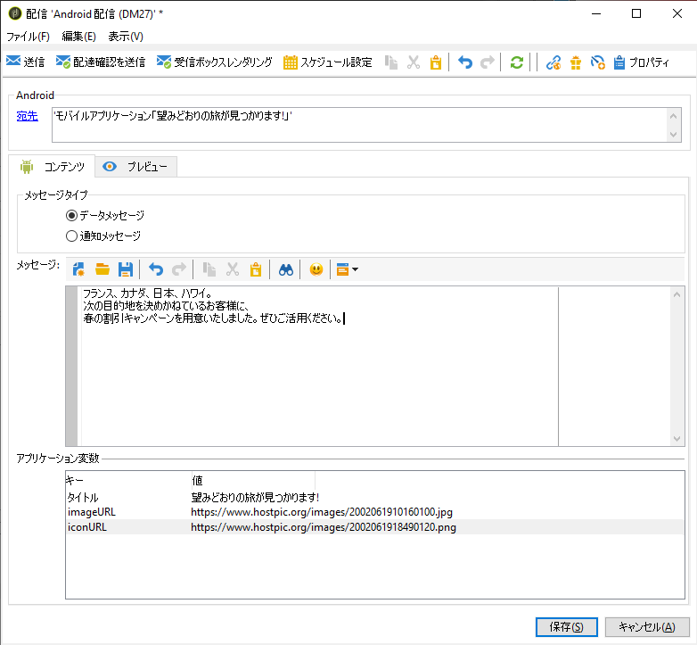

# Adobe Campaign でモバイルアプリケーションを設定する {#configuring-the-mobile-application-in-adobe-campaign}

以下は、オンラインホリデーパッケージを販売する会社を想定した設定例です。そのモバイルアプリケーション（Neotrips）は、Android 用 Neotrips と iOS 用 Neotrips の 2 つのバージョンを顧客に提供しています。モバイルアプリケーションを Adobe Campaign で設定するには、次の手順に従います。

* Neotrips モバイルアプリケーション用に、**[!UICONTROL モバイルアプリケーション]**&#x200B;タイプの情報サービスを作成します。
* このサービスに、iOS バージョンと Android バージョンのアプリケーションを追加します。
* iOS と Android の両方用に配信を作成します。

>[!NOTE]
>
>サービスの「**[!UICONTROL 購読]**」タブに移動して、サービスの購読者（モバイルデバイスにアプリケーションをインストールして、通知の受信に同意したすべてのユーザー）のリストを表示します。

## iOS でのモバイルアプリケーションの設定 {#configuring-the-mobile-application-ios}

>[!CAUTION]
>
>Adobe Campaign SDK に統合する前に、アプリケーションにプッシュアクションを設定する必要があります。
>
>該当しない場合は、[このページ](https://developer.apple.com/library/archive/documentation/NetworkingInternet/Conceptual/RemoteNotificationsPG/)を参照してください。

### 手順 1：パッケージのインストール {#installing-package-ios}

1. Adobe Campaign クライアントコンソールの&#x200B;**[!UICONTROL ツール／高度なツール／パッケージをインポート...]**&#x200B;からパッケージ読み込みウィザードにアクセスします。

   

1. 「**[!UICONTROL 標準パッケージをインストール]**」を選択します。

1. 表示されるリストで、「**[!UICONTROL モバイルアプリチャネル]**」をチェックします。

   

1. 「**[!UICONTROL 次へ]**」、「**[!UICONTROL 開始]**」の順にクリックして、パッケージのインストールを開始します。

   パッケージがインストールされると、進行状況バーに **100%** と表示され、インストールログに、「**[!UICONTROL パッケージが正常にインストールされました]**」と表示されます。

   

1. インストールウィンドウを&#x200B;**[!UICONTROL 閉じます]**。

### 手順 2：iOS の外部アカウントの設定 {#configuring-external-account-ios}

iOS の場合、2 種類のコネクタを使用できます。

* iOS バイナリコネクタ：旧式のバイナリ APNS サーバーで通知を送信します。
* iOS HTTP2 コネクタ：HTTP/2 APNS に通知を送信します。

使用するコネクタを選択するには、次の手順に従います。

1. **[!UICONTROL 管理／プラットフォーム／外部アカウント]**&#x200B;に移動します。
1. **[!UICONTROL iOS ルーティング]**&#x200B;外部アカウントを選択します。
1. 「**[!UICONTROL コネクタ]**」タブで、「**[!UICONTROL コネクタのアクセス URL]**」フィールドに入力します。

   iOS HTTP2 の場合：http://localhost:8080/nms/jsp/iosHTTP2.jsp

   

   >[!NOTE]
   >
   > または、https://localhost:8080/nms/jsp/ios.jsp に設定することもできますが、コネクタのバージョン 2 を使用することをお勧めします。

1. 「**[!UICONTROL 保存]**」をクリックします。

これで、iOS コネクタが設定されました。サービスの作成を開始できます。

### 手順 3：iOS サービスの設定 {#configuring-ios-service}

1. **[!UICONTROL プロファイルとターゲット／サービスと購読]**&#x200B;ノードに移動して、「**[!UICONTROL 新規]**」をクリックします。

   

1. 「**[!UICONTROL ラベル]**」と「**[!UICONTROL 内部名]**」を定義します。
1. 「**[!UICONTROL タイプ]**」フィールドに移動して「**[!UICONTROL モバイルアプリケーション]**」を選択します。

   >[!NOTE]
   >
   >デフォルトの「**[!UICONTROL 購読者のアプリケーション（nms:appSubscriptionRcp）]**」ターゲットマッピングが受信者のテーブルにリンクされています。異なるターゲットマッピングを使用する場合は、新しいターゲットマッピングを作成し、サービスの「**[!UICONTROL ターゲットマッピング]**」フィールドに入力する必要があります。ターゲットマッピングの作成について詳しくは、[設定ガイド](../../configuration/using/about-custom-recipient-table.md)を参照してください。

   

1. 次に、「**[!UICONTROL 追加]**」ボタンをクリックして、アプリケーションタイプを選択します。

   

1. 次のウィンドウが表示されます。「**[!UICONTROL iOS アプリケーションを作成]**」を選択し、**[!UICONTROL ラベル]**&#x200B;の入力を開始します。

   

1. オプションとして、必要に応じ、**[!UICONTROL アプリケーション変数]**&#x200B;を使用してプッシュメッセージのコンテンツを強化できます。これらは完全にカスタマイズ可能で、モバイルデバイスに送信されるメッセージペイロードの一部です。次の例では、**mediaURl** および **mediaExt** を追加し、リッチなプッシュ通知を作成してさらに通知内に表示する画像をアプリケーションに提供します。

   

1. 「**[!UICONTROL 購読パラメーター]**」タブを使用すると、**[!UICONTROL 購読者のアプリケーション（nms:appsubscriptionRcp）]**&#x200B;スキーマの拡張によりマッピングを定義できます。

   >[!NOTE]
   >
   >アプリケーションの開発バージョン（サンドボックス）と本番バージョンに同じ証明書を使用しないでください。

1. 「**[!UICONTROL サウンド]**」タブでは、再生するサウンドを指定できます。「**[!UICONTROL 追加]**」をクリックし、「**[!UICONTROL 内部名]**」フィールドに、アプリケーションに埋め込まれたファイル名またはシステムサウンドの名前を入力します。

1. 「**[!UICONTROL 次へ]**」をクリックし、開発アプリケーションの設定をおこないます。

1. Adobe Campaign と、アプリケーションコード（SDK 経由）で同じ「**[!UICONTROL 統合キー]**」が定義されていることを確認します。詳しくは、[Campaign SDK をモバイルアプリケーションに統合する](../../delivery/using/integrating-campaign-sdk-into-the-mobile-application.md)を参照してください。この統合キーは、各アプリケーションに対して固有で、モバイルアプリケーションを Adobe Campaign プラットフォームにリンクできます。

   >[!NOTE]
   >
   > **[!UICONTROL 統合キー]**&#x200B;は、文字列値を使用して完全にカスタマイズできますが、SDK で指定されたものと完全に同じにする必要があります。

1. 「**[!UICONTROL アプリケーションアイコン]**」フィールドからあらかじめ用意されているアイコンの 1 つを選択して、サービス内のモバイルアプリケーションをパーソナライズします。

1. 「**[!UICONTROL 証明書を入力...]**」リンクをクリックして認証の証明書を選択し、モバイルアプリケーションデベロッパーによって提供されたパスワードを入力します。「**[!UICONTROL 接続をテスト]**」をクリックすると、接続が成功したことを確認できます。

   >[!NOTE]
   >
   >Apple では、同じモバイルアプリケーションの開発バージョンと本番バージョンに異なる証明書が必要です。Adobe Campaign では 2 つの異なるアプリケーションを設定する必要があります。

   

1. 「**[!UICONTROL 次へ]**」をクリックして本番アプリケーションの設定をおこない、上記と同じ手順に従います。

   

1. 「**[!UICONTROL 完了]**」をクリックします。これで、Campaign Classic で iOS アプリケーションを使用する準備が整いました。

### 手順 4：iOS のリッチ通知の作成 {#creating-ios-delivery}

iOS 10 以降では、リッチ通知を生成することができます。Adobe Campaign では、変数を使用して通知を送信し、デバイスでリッチ通知を表示できます。

次に、新しい配信を作成し、作成したモバイルアプリケーションにリンクする必要があります。

1. **[!UICONTROL キャンペーン管理]**／**[!UICONTROL 配信]**&#x200B;に移動します。

1. 「**[!UICONTROL 新規]**」をクリックします。

   

1. 「**[!UICONTROL 配信テンプレート]**」ドロップダウンで「**[!UICONTROL iOS 配信（ios）]**」を選択します。配信に&#x200B;**[!UICONTROL ラベル]**&#x200B;を追加します。

1. 「**[!UICONTROL 宛先]**」をクリックして、ターゲットにする母集団を定義します。デフォルトでは、**[!UICONTROL 購読者のアプリケーション]**&#x200B;ターゲットマッピングが適用されます。「**[!UICONTROL 追加]**」をクリックして、前の手順で作成したサービスを選択します。

   

1. **[!UICONTROL ターゲットのタイプ]**&#x200B;ウィンドウで、「**[!UICONTROL iOS モバイルアプリケーション (iPhone、iPad) の購読者]**」を選択し、「**[!UICONTROL 次へ]**」をクリックします。

1. 「**[!UICONTROL サービス]**」ドロップダウンで、前の手順で作成したサービスを選択し、ターゲットするアプリケーションを選択して「**[!UICONTROL 完了]**」をクリックします。**[!UICONTROL アプリケーション変数]**&#x200B;は、設定手順で追加された内容に応じて自動的に追加されます。

   

1. リッチ通知を編集します。

   

1. 通知を編集ウィンドウの「**[!UICONTROL 可変コンテンツ]**」ボックスをオンにして、モバイルアプリケーションがメディアコンテンツをダウンロードできるようにします。

1. 「**[!UICONTROL 保存]**」をクリックし、配信を送信します。

プッシュ通知が購読者のモバイル iOS デバイスで受信されると、画像と Web ページが表示されます。

## Android でのモバイルアプリケーションの設定 {#configuring-the-mobile-application-android}

### 手順 1：パッケージのインストール {#installing-package-android}

1. Adobe Campaign クライアントコンソールの&#x200B;**[!UICONTROL ツール／高度なツール／パッケージをインポート...]**&#x200B;からパッケージ読み込みウィザードにアクセスします。

   

1. 「**[!UICONTROL 標準パッケージをインストール]**」を選択します。

1. 表示されるリストで、「**[!UICONTROL モバイルアプリチャネル]**」をチェックします。

   

1. 「**[!UICONTROL 次へ]**」、「**[!UICONTROL 開始]**」の順にクリックして、パッケージのインストールを開始します。

   パッケージがインストールされると、進行状況バーに **100%** と表示され、インストールログに、「**[!UICONTROL パッケージが正常にインストールされました]**」と表示されます。

   

1. インストールウィンドウを&#x200B;**[!UICONTROL 閉じます]**。

### 手順 2：Android の外部アカウントの設定 {#configuring-external-account-android}

Android の場合、2 種類のコネクタを使用できます。

* V1 コネクタでは、MTA の子 1 つにつき 1 つのコネクタを使用できます。
* V2 コネクタでは、スループット向上のために FCM サーバーへの同時接続が可能です。

使用するコネクタを選択するには、次の手順に従います。

1. **[!UICONTROL 管理／プラットフォーム／外部アカウント]**&#x200B;に移動します。
1. **[!UICONTROL Android ルーティング]**&#x200B;外部アカウントを選択します。
1. 「**[!UICONTROL コネクタ]**」タブで、「**[!UICONTROL コネクタで使用された JavaScript]**」フィールドに次のように入力します。

   Android V2 の場合：https://localhost:8080/nms/jsp/androidPushConnectorV2.js

   >[!NOTE]
   >
   > または、https://localhost:8080/nms/jsp/androidPushConnector.js に設定することもできますが、コネクタのバージョン 2 を使用することをお勧めします。

   

1. Android V2 では、アドビサーバー設定ファイル（serverConf.xml）で次の追加パラメーターを使用できます。

   * **maxGCMConnectPerChild**：それぞれの子サーバーで開始できる、FCM に対する並列 HTTP リクエストの最大数（デフォルト値は 8）。

### 手順 3：Android サービスの設定 {#configuring-android-service}

1. **[!UICONTROL プロファイルとターゲット／サービスと購読]**&#x200B;ノードに移動して、「**[!UICONTROL 新規]**」をクリックします。

   

1. 「**[!UICONTROL ラベル]**」と「**[!UICONTROL 内部名]**」を定義します。
1. 「**[!UICONTROL タイプ]**」フィールドに移動して「**[!UICONTROL モバイルアプリケーション]**」を選択します。

   >[!NOTE]
   >
   >デフォルトの「**[!UICONTROL 購読者のアプリケーション（nms:appSubscriptionRcp）]**」ターゲットマッピングが受信者のテーブルにリンクされています。異なるターゲットマッピングを使用する場合は、新しいターゲットマッピングを作成し、サービスの「**[!UICONTROL ターゲットマッピング]**」フィールドに入力する必要があります。ターゲットマッピングの作成について詳しくは、[設定ガイド](../../configuration/using/about-custom-recipient-table.md)を参照してください。

   

1. 次に、「**[!UICONTROL 追加]**」ボタンをクリックして、アプリケーションタイプを選択します。

   

1. 「**[!UICONTROL Android アプリケーションを作成]**」を選択します。

   

1. **[!UICONTROL ラベル]**&#x200B;を入力します。

1. Adobe Campaign と、アプリケーションコード（SDK 経由）で同じ「**[!UICONTROL 統合キー]**」が定義されていることを確認します。詳しくは、[Campaign SDK をモバイルアプリケーションに統合する](../../delivery/using/integrating-campaign-sdk-into-the-mobile-application.md)を参照してください。

   >[!NOTE]
   >
   > **[!UICONTROL 統合キー]**&#x200B;は、文字列値を使用して完全にカスタマイズできますが、SDK で指定されたものと完全に同じにする必要があります。

1. 「**[!UICONTROL アプリケーションアイコン]**」フィールドからあらかじめ用意されているアイコンの 1 つを選択して、サービス内のモバイルアプリケーションをパーソナライズします。

1. アプリケーションの接続設定を入力し、モバイルアプリケーションのデベロッパーによって提供されたプロジェクトキーを入力します。

1. オプションとして、必要に応じ、**[!UICONTROL アプリケーション変数]**&#x200B;を使用してプッシュメッセージのコンテンツを強化できます。これらは完全にカスタマイズ可能で、モバイルデバイスに送信されるメッセージペイロードの一部です。

   次の例では、**title**、**imageURL** および **iconURL** を追加し、リッチなプッシュ通知を作成してさらに通知内に表示する画像、タイトル、アイコンをアプリケーションに提供します。

   

1. 「**[!UICONTROL 完了]**」、「**[!UICONTROL 保存]**」の順にクリックします。これで、Campaign Classic で Android アプリケーションを使用する準備が整いました。

デフォルトでは、Adobe Campaign は&#x200B;**[!UICONTROL 購読者のアプリケーション（nms:appSubscriptionRcp）]**&#x200B;テーブルの「**[!UICONTROL ユーザー ID]**」（@userKey）フィールドにキーを保存します。このキーによって購読情報を受信者にリンクできます。追加データ（複雑な紐付けキーなど）を収集するには、次の設定を適用する必要があります。

1. 「**[!UICONTROL 購読者のアプリケーション（nms:appsubscriptionRcp）]**」スキーマの拡張を作成し、新しいフィールドを定義します。
1. 「**[!UICONTROL 購読パラメーター]**」タブでマッピングを定義します。
   >[!CAUTION]
   >
   >「**[!UICONTROL 購読パラメーター]**」タブの設定名が、モバイルアプリケーションコードの設定名と同じであることを確認します。[Campaign SDK をモバイルアプリケーションに統合する](../../delivery/using/integrating-campaign-sdk-into-the-mobile-application.md)の節を参照してください。

### 手順 4：Android のリッチ通知の作成 {#creating-android-delivery}

次に、新しい配信を作成し、作成したモバイルアプリケーションにリンクする必要があります。

1. **[!UICONTROL キャンペーン管理]**／**[!UICONTROL 配信]**&#x200B;に移動します。

1. 「**[!UICONTROL 新規]**」をクリックします。

   

1. 「**[!UICONTROL 配信テンプレート]**」ドロップダウンで「**[!UICONTROL Android 配信（android）]**」を選択します。配信に&#x200B;**[!UICONTROL ラベル]**&#x200B;を追加します。

1. 「**[!UICONTROL 宛先]**」をクリックして、ターゲットにする母集団を定義します。デフォルトでは、**[!UICONTROL 購読者のアプリケーション]**&#x200B;ターゲットマッピングが適用されます。「**[!UICONTROL 追加]**」をクリックして、前の手順で作成したサービスを選択します。

   

1. **[!UICONTROL ターゲットのタイプ]**&#x200B;ウィンドウで、「Android モバイルアプリケーションの購読者」を選択し、「**[!UICONTROL 次へ]**」をクリックします。

1. 「**[!UICONTROL サービス]**」ドロップダウンで、以前に作成したサービスとアプリケーションを選択して「**[!UICONTROL 完了]**」をクリックします。**[!UICONTROL アプリケーション変数]**&#x200B;は、設定手順で追加された内容に応じて自動的に追加されます。

   

1. リッチ通知を編集します。

   

1. 「**[!UICONTROL 保存]**」をクリックし、配信を送信します。

プッシュ通知が購読者のモバイル Android デバイスで受信されると、画像と Web ページが表示されます。

