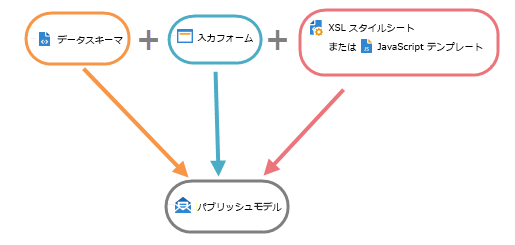

# コンテンツマネージャーのリソースと原則{#content-manager-resources-and-principles}

パブリッシュテンプレートを定義する必要があります。このテンプレートには、コンテンツごとの変換テンプレートが含まれます。

コンテンツブロックは、データストレージ用の XML ドキュメント内で構造化します。編集インターフェイスを使用して、Adobe Campaign のクライアントコンソールまたは Web ブラウザーからコンテンツを入力します。コンテンツは、XML フローのキャプチャまたはデータベースに集計されたデータから自動的に入力することもできます。

XML ドキュメントと XSL スタイルシートまたは JavaScript テンプレートのスタイルシートを組み合わせると、様々なフォーマット（HTML、テキスト）のパブリッシュテンプレートモデルが自動的に生成されます。

コンテンツの設定には次のリソースが必要です。

* データスキーマ：XML コンテンツ構造を記述したもの。詳しくは、[データスキーマ](../../delivery/using/data-schemas.md)を参照してください。
* データ入力フォーム：データ入力画面の構造。詳しくは、[入力フォーム](../../delivery/using/input-forms.md)を参照してください。
* 画像：データ入力フォームで使用する画像。詳しくは、[画像の管理](../../delivery/using/formatting.md#image-management)を参照してください。
* スタイルシート：XSLT 言語を使用した出力ドキュメントの書式設定。詳しくは、[フォーマット設定](../../delivery/using/formatting.md)を参照してください。
* JavaScript テンプレート：JavaScript 言語を使用した出力ドキュメントの書式設定。詳しくは、[パブリッシュテンプレート](../../delivery/using/publication-templates.md)を参照してください。
* JavaScript コード：データ集計用の JavaScript コード。詳しくは、[集約](../../delivery/using/publication-templates.md#aggregator)を参照してください。
* パブリッシュテンプレート：パブリッシュテンプレートの定義。詳しくは、[パブリッシュテンプレート](../../delivery/using/publication-templates.md)を参照してください。
* コンテンツ：作成してパブリッシュするコンテンツインスタンス。詳しくは、[コンテンツテンプレートの使用](../../delivery/using/using-a-content-template.md)を参照してください。
