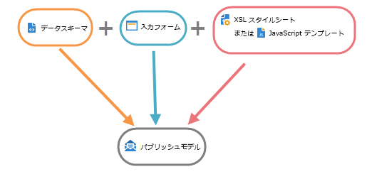

# コンテンツマネージャーのリソースと原則{#content-manager-resources-and-principles}

パブリッシュテンプレートを定義する必要があります。このテンプレートには、コンテンツごとの変換テンプレートが含まれます。

コンテンツブロックは、データストレージ用の XML ドキュメント内で構造化します。 編集インターフェイスを使用して、Adobe Campaign のクライアントコンソールまたは Web ブラウザーからコンテンツを入力します。 コンテンツは、XML フローのキャプチャまたはデータベースに集計されたデータから自動的に入力することもできます。

XML ドキュメントと XSL スタイルシートまたは JavaScript テンプレートのスタイルシートを組み合わせると、様々なフォーマット（HTML、テキスト）のパブリッシュテンプレートモデルが自動的に生成されます。

コンテンツの設定には次のリソースが必要です。

* データスキーマ：XML コンテンツ構造を記述したもの。 詳しくは、[データスキーマ](data-schemas.md)を参照してください。
* データ入力フォーム：データ入力画面の構造。 詳しくは、[入力フォーム](input-forms.md)を参照してください。
* 画像：データ入力フォームで使用する画像。 詳しくは、[画像の管理](formatting.md#image-management)を参照してください。
* スタイルシート：XSLT 言語を使用した出力ドキュメントの書式設定。 詳しくは、[フォーマット設定](formatting.md)を参照してください。
* JavaScript テンプレート：JavaScript 言語を使用した出力ドキュメントの書式設定。 詳しくは、[パブリッシュテンプレート](publication-templates.md)を参照してください。
* JavaScript コード：データ集計用の JavaScript コード。 詳しくは、[集約](publication-templates.md#aggregator)を参照してください。
* パブリッシュテンプレート：パブリッシュテンプレートの定義。 詳しくは、[パブリッシュテンプレート](publication-templates.md)を参照してください。
* コンテンツ：作成してパブリッシュするコンテンツインスタンス。 詳しくは、[コンテンツテンプレートの使用](using-a-content-template.md)を参照してください。
