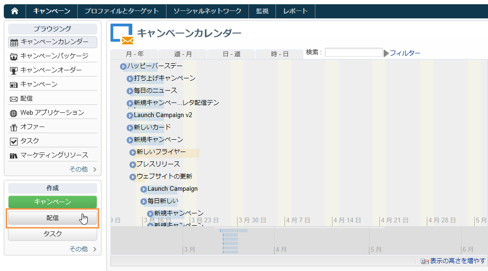
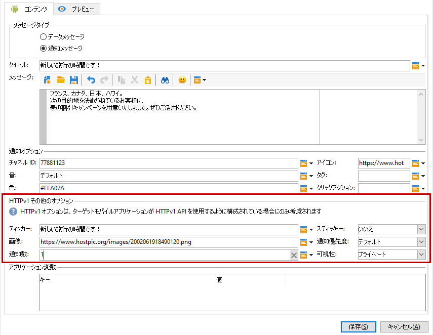

# Android 用通知の作成{#create-notificaations-android}

Adobe Campaign を使用して、Android デバイスにプッシュ通知を送信します。配信の作成に関するグローバルな概念については、[この節](steps-about-delivery-creation-steps.md)で説明しています。

新しい配信を作成して開始します。

Firebase Cloud Messaging では、次の 2 種類のメッセージの中から選択できます。

* **[!UICONTROL データメッセージ]**は、クライアントアプリで処理されます。
    メッセージは、デバイスへの Android 通知を生成して表示するモバイルアプリケーションに直接送信されます。データメッセージには、カスタムアプリケーション変数のみが含まれます。

* **[!UICONTROL 通知メッセージ]**は、FCM SDK によって自動的に処理されます。
     FCM は、クライアントアプリに代わって、ユーザーのデバイスにメッセージを自動的に表示します。通知メッセージには、事前に定義された一連のパラメーターとオプションが含まれていますが、カスタムアプリケーション変数を使用してさらにパーソナライズすることもできます。

Firebase Cloud Messaging のメッセージタイプについて詳しくは、[FCM ドキュメント](https://firebase.google.com/docs/cloud-messaging/concept-options#notifications_and_data_messages)を参照してください。

## データメッセージの作成 {#creating-data-message}

1. **[!UICONTROL キャンペーン管理]**／**[!UICONTROL 配信]**&#x200B;に移動します。

1. 「**[!UICONTROL 新規]**」をクリックします。

   

1. 「**[!UICONTROL 配信テンプレート]**」ドロップダウンで「**[!UICONTROL Android 配信（android）]**」を選択します。配信に&#x200B;**[!UICONTROL ラベル]**&#x200B;を追加します。

1. 「**[!UICONTROL 宛先]**」をクリックして、ターゲットにする母集団を定義します。デフォルトでは、**[!UICONTROL 購読者のアプリケーション]**&#x200B;ターゲットマッピングが適用されます。「**[!UICONTROL 追加]**」をクリックしてサービスを選択します。

   

1. **[!UICONTROL ターゲットのタイプ]******&#x200B;ウィンドウで、「Android モバイルアプリケーションの購読者」を選択し、「**[!UICONTROL 次へ]**」をクリックします。

1. 「**[!UICONTROL サービス]**」ドロップダウンで、以前に作成したサービスとアプリケーションを選択して「**[!UICONTROL 完了]**」をクリックします。**[!UICONTROL アプリケーション変数]**&#x200B;は、設定手順で追加された内容に応じて自動的に追加されます。

   

1. 「**[!UICONTROL メッセージタイプ]**」で「**[!UICONTROL データメッセージ]**」を選択します。

1. リッチ通知を編集します。

   

1. 必要に応じて、以前設定した&#x200B;**[!UICONTROL アプリケーション変数]**&#x200B;に情報を追加できます。**[!UICONTROL アプリケーション変数]**&#x200B;は、Android サービスで設定する必要があり、モバイルデバイスに送信されるメッセージペイロードの一部です。

1. 「**[!UICONTROL 保存]**」をクリックし、配信を送信します。

プッシュ通知が購読者のモバイル Android デバイスで受信されると、画像と web ページが表示されます。

## 通知メッセージの作成 {#creating-notification-message}

>[!NOTE]
>
>通知メッセージのその他のオプションは、HTTP v1 API 設定でのみ使用できます。詳しくは、[この節](configuring-the-mobile-application-android.md#android-service-httpv1)を参照してください。

 [Android プッシュ通知の作成方法をビデオで説明します](https://experienceleague.adobe.com/docs/campaign-classic-learn/getting-started-with-push-notifications-for-android/configuring-and-sending-push-notifications.html?lang=ja#additional-resources)

1. **[!UICONTROL キャンペーン管理]**／**[!UICONTROL 配信]**&#x200B;に移動します。

1. 「**[!UICONTROL 新規]**」をクリックします。

   

1. 「**[!UICONTROL 配信テンプレート]**」ドロップダウンで「**[!UICONTROL Android 配信（android）]**」を選択します。配信に&#x200B;**[!UICONTROL ラベル]**&#x200B;を追加します。

1. 「**[!UICONTROL 宛先]**」をクリックして、ターゲットにする母集団を定義します。デフォルトでは、**[!UICONTROL 購読者のアプリケーション]**&#x200B;ターゲットマッピングが適用されます。「**[!UICONTROL 追加]**」をクリックしてサービスを選択します。

   

1. **[!UICONTROL ターゲットのタイプ]******&#x200B;ウィンドウで、「Android モバイルアプリケーションの購読者」を選択し、「**[!UICONTROL 次へ]**」をクリックします。

1. 「**[!UICONTROL サービス]**」ドロップダウンで、以前に作成したサービスとアプリケーションを選択して「**[!UICONTROL 完了]**」をクリックします。

   

1. 「**[!UICONTROL メッセージタイプ]**」で「**[!UICONTROL 通知メッセージ]**」を選択します。

1. タイトルを追加し、メッセージを編集します。「**[!UICONTROL 通知オプション]**」を使用して、プッシュ通知をパーソナライズします。

   * **[!UICONTROL チャネル ID]**：通知のチャネル ID を設定します。このチャネル ID を持つ通知を受信するには、このチャネル ID を持つチャネルをアプリで事前に作成しておく必要があります。
   * **[!UICONTROL サウンド]**：デバイスが通知を受け取るときに再生するサウンドを設定します。
   * **[!UICONTROL 色]**：通知アイコンの色を設定します。
   * **[!UICONTROL アイコン]**：プロファイルのデバイスに表示される通知アイコンを設定します。
   * **[!UICONTROL タグ]**：通知ドロワー内の既存の通知を置き換えるために使用する識別子を設定します。
   * **[!UICONTROL クリックアクション]**：通知のユーザークリックに関連付けられたアクションを設定します。

   **[!UICONTROL 通知オプション]**&#x200B;とこれらのフィールドに入力する方法について詳しくは、[FCM のドキュメント](https://firebase.google.com/docs/reference/fcm/rest/v1/projects.messages#androidnotification)を参照してください。

   

1. アプリケーションが HTTP v1 API プロトコルを使用して設定されている場合は、以下の **[!UICONTROL HTTPV1 その他のオプション]**&#x200B;を使用して、プッシュ通知をさらにパーソナライズできます。

   * **[!UICONTROL ティッカー]**：通知のティッカーテキストを設定します。Android 5.0 Lollipop に設定されたデバイスでのみ使用できます。
   * **[!UICONTROL 画像]**：通知に表示する画像の URL を設定します。
   * **[!UICONTROL 通知数]**：アプリケーションアイコンに直接表示する新しい未読情報の数を設定します。
   * **[!UICONTROL スティッキー]**：true または false に設定します。false に設定した場合、ユーザーがクリックすると通知が自動的に閉じます。true に設定した場合、ユーザーがクリックしても通知は表示されます。
   * **[!UICONTROL 通知優先度]**：通知の優先度レベルを、デフォルト、最小、低、高のいずれかに設定します。詳しくは、[FCM のドキュメント](https://firebase.google.com/docs/reference/fcm/rest/v1/projects.messages#NotificationPriority)を参照してください。
   * **[!UICONTROL 表示]**：通知の表示レベルをパブリック、プライベート、秘密のいずれかに設定します。詳しくは、[FCM のドキュメント](https://firebase.google.com/docs/reference/fcm/rest/v1/projects.messages#visibility)を参照してください。

   **[!UICONTROL HTTPV1 その他のオプション]**&#x200B;とこれらのフィールドを設定する方法について詳しくは、[FCM ドキュメント](https://firebase.google.com/docs/reference/fcm/rest/v1/projects.messages#androidnotification)を参照してください。

   

1. 必要に応じて、以前設定した&#x200B;**[!UICONTROL アプリケーション変数]**&#x200B;に情報を追加できます。**[!UICONTROL アプリケーション変数]**&#x200B;は、Android サービスで設定する必要があり、モバイルデバイスに送信されるメッセージペイロードの一部です。

1. 「**[!UICONTROL 保存]**」をクリックし、配信を送信します。

プッシュ通知が購読者のモバイル Android デバイスで受信されると、画像と web ページが表示されます。
