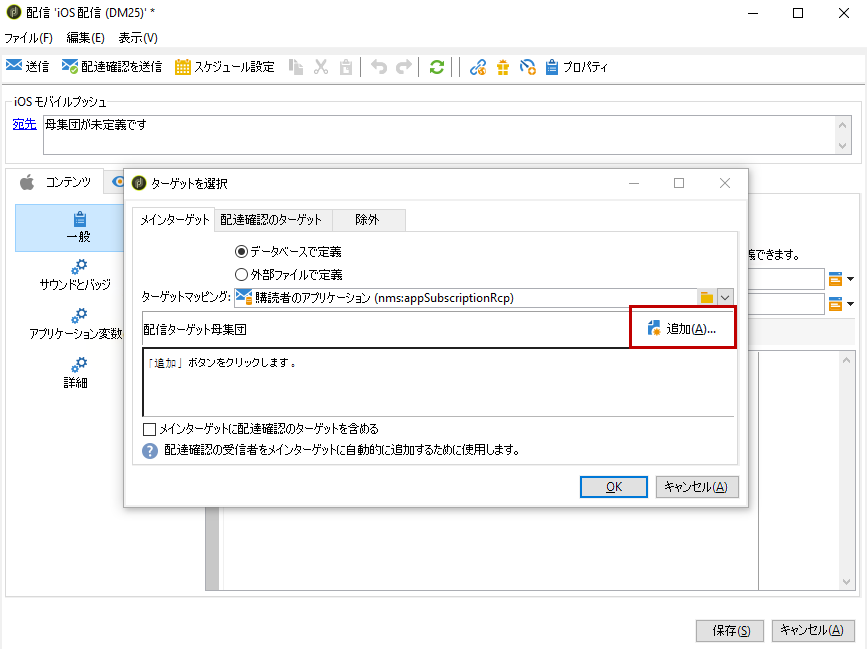

# iOS 用通知の作成{#create-notifications-ios}

ここでは、iOS 用通知の配信に固有の要素について説明します。配信の作成に関するグローバルな概念については、[この節](steps-about-delivery-creation-steps.md)で説明しています。

新しい配信を作成して開始します。

iOS デバイス用のプッシュ通知を作成するには、次の手順に従います。

1. 「**[!UICONTROL iOS 配信]**」配信テンプレートを選択します。

   

1. 通知のターゲットを定義するには、**[!UICONTROL 宛先]**&#x200B;リンク／**[!UICONTROL 追加]**&#x200B;をクリックします。

   

   >[!NOTE]
   >
   >配信のターゲット母集団を選択する際の詳細なプロセスについては、[この節](steps-defining-the-target-population.md)を参照してください。
   >
   >パーソナライゼーションフィールドの使用について詳しくは、[この節](about-personalization.md)を参照してください。
   >
   >シードリストの追加について詳しくは、[シードアドレスについて](about-seed-addresses.md)を参照してください。

1. 「**[!UICONTROL iOS モバイルアプリケーション (iPhone、iPad) の購読者]**」を選択してモバイルアプリケーション（この場合は Neotrips）に関連するサービスを選択し、アプリケーションの iOS バージョンを選択します。

   

1. **[!UICONTROL アラート]**、**[!UICONTROL バッジ]**、**[!UICONTROL アラートおよびバッジ]**&#x200B;または&#x200B;**[!UICONTROL サイレントプッシュ]**&#x200B;から通知の種類を選択します。

   

   >[!NOTE]
   >
   >**サイレントプッシュ**&#x200B;モードを使用すると、モバイルアプリケーションに「サイレント」通知を送信できます。 ユーザーは、通知が到着したことを知らされません。通知は、アプリケーションに直接転送されます。

1. 「**[!UICONTROL タイトル]**」フィールドで、通知に表示するタイトルのラベルを入力します。このタイトルは、通知センターから使用可能な通知のリストにのみ表示されます。このフィールドを使用して、iOS 通知ペイロードの **title** パラメーターの値を定義できます。

1. HTTP/2 コネクタを使用する場合、サブタイトル（iOS 通知ペイロードの **subtitle** パラメーター）を追加できます。[この節](configuring-the-mobile-application.md)を参照してください。

1. 選択した通知のタイプに基づいて「**[!UICONTROL メッセージ]**」と「**[!UICONTROL バッジの値]**」を入力します。

   

   >[!NOTE]
   >
   >「**[!UICONTROL バッジ]**」と「**[!UICONTROL アラートおよびバッジ]**」タイプの通知では、バッジの値（モバイルアプリケーションのロゴの上にある数字）を変更できます。バッジを更新するには、値として 0 を入力します。フィールドが空の場合、バッジの値は変更されません。

1. **[!UICONTROL 顔文字を挿入]**&#x200B;アイコンをクリックして、プッシュ通知に顔文字を挿入します。顔文字のリストをカスタマイズするには、[この節](customizing-emoticon-list.md)を参照してください。

1. 「**[!UICONTROL アクションボタン]**」を使用すると、アラート通知に表示されるアクションボタンのラベルを定義できます（ペイロードの **action_loc_key** フィールド）。iOS アプリケーションでローカライズ可能文字列を管理する場合は（**Localizable.strings**）、対応するキーをこのフィールドに入力します。アプリケーションでローカライズ可能テキストを管理しない場合は、アクションボタンに表示するラベルを入力します。ローカライズ可能文字列について詳しくは、[Apple のドキュメント](https://developer.apple.com/library/archive/documentation/NetworkingInternet/Conceptual/RemoteNotificationsPG/CreatingtheNotificationPayload.html#//apple_ref/doc/uid/TP40008194-CH10-SW1)を参照してください。
1. 「**[!UICONTROL サウンドを再生]**」フィールドで、通知を受信したときにモバイル端末で再生されるサウンドを選択します。

   >[!NOTE]
   >
   >サウンドは、アプリケーションに含まれている必要があり、サービスが作成されたときに定義される必要があります。[この節](configuring-the-mobile-application.md#configuring-external-account-ios)を参照してください。

1. 「**[!UICONTROL アプリケーション変数]**」フィールドで、それぞれの変数の値を入力します。アプリケーション変数によって、通知の動作を定義できます。例えば、ユーザーが通知を有効化したときに特定のアプリケーション画面が表示されるように設定できます。

   >[!NOTE]
   >
   >アプリケーション変数は、モバイルアプリケーションのコードで定義され、サービスの作成中に入力される必要があります。詳細については、[この節](configuring-the-mobile-application.md)を参照してください。

1. 通知を設定したら、「**[!UICONTROL プレビュー]**」タブをクリックして通知をプレビューします。

   

   >[!NOTE]
   >
   >通知スタイル（バナーまたはアラート）は、Adobe Campaign では定義しません。スタイルは、iOS 設定でユーザーが選択した設定によって異なります。ただし、Adobe Campaign では、それぞれの通知スタイルをプレビューできます。右下の矢印をクリックすると、スタイルを切り替えることができます。
   >
   >プレビューでは iOS 10 と同様に表示されます。

配達確認や最終配信を送信するには、E メール配信と同じプロセスを使用します。

メッセージを送信した後は、配信を監視およびトラッキングできます。詳しくは、以下の節を参照してください。

* [プッシュ通知の強制隔離](understanding-quarantine-management.md#push-notification-quarantines)
* [配信の監視](about-delivery-monitoring.md)
* [配信エラーについて](understanding-delivery-failures.md)

## iOS 用のリッチ通知の作成 {#creating-ios-delivery}

iOS 10 以降では、リッチ通知を生成することができます。Adobe Campaign では、変数を使用して通知を送信し、デバイスでリッチ通知を表示できます。

次に、新しい配信を作成し、作成したモバイルアプリケーションにリンクする必要があります。

1. **[!UICONTROL キャンペーン管理]**／**[!UICONTROL 配信]**&#x200B;に移動します。

1. 「**[!UICONTROL 新規]**」をクリックします。

   

1. 「**[!UICONTROL 配信テンプレート]**」ドロップダウンで「**[!UICONTROL iOS 配信（ios）]**」を選択します。配信に&#x200B;**[!UICONTROL ラベル]**&#x200B;を追加します。

1. 「**[!UICONTROL 宛先]**」をクリックして、ターゲットにする母集団を定義します。デフォルトでは、**[!UICONTROL 購読者のアプリケーション]**&#x200B;ターゲットマッピングが適用されます。「**[!UICONTROL 追加]**」をクリックして、前の手順で作成したサービスを選択します。

   

1. **[!UICONTROL ターゲットのタイプ]**&#x200B;ウィンドウで、「**[!UICONTROL iOS モバイルアプリケーション (iPhone、iPad) の購読者]**」を選択し、「**[!UICONTROL 次へ]**」をクリックします。

1. 「**[!UICONTROL サービス]**」ドロップダウンで、前の手順で作成したサービスを選択し、ターゲットするアプリケーションを選択して「**[!UICONTROL 完了]**」をクリックします。**[!UICONTROL アプリケーション変数]**&#x200B;は、設定手順で追加された内容に応じて自動的に追加されます。

   

1. リッチ通知を編集します。

   

1. 通知を編集ウィンドウの「**[!UICONTROL 可変コンテンツ]**」ボックスをオンにして、モバイルアプリケーションがメディアコンテンツをダウンロードできるようにします。

1. 「**[!UICONTROL 保存]**」をクリックし、配信を送信します。

プッシュ通知が購読者のモバイル iOS デバイスで受信されると、画像と web ページが表示されます。

