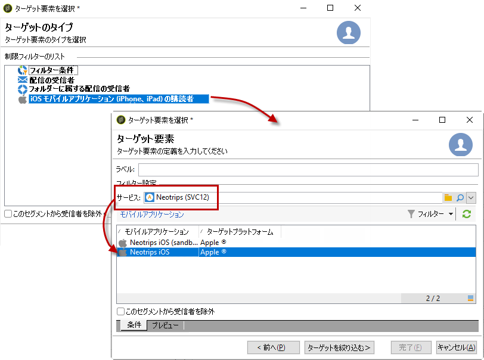
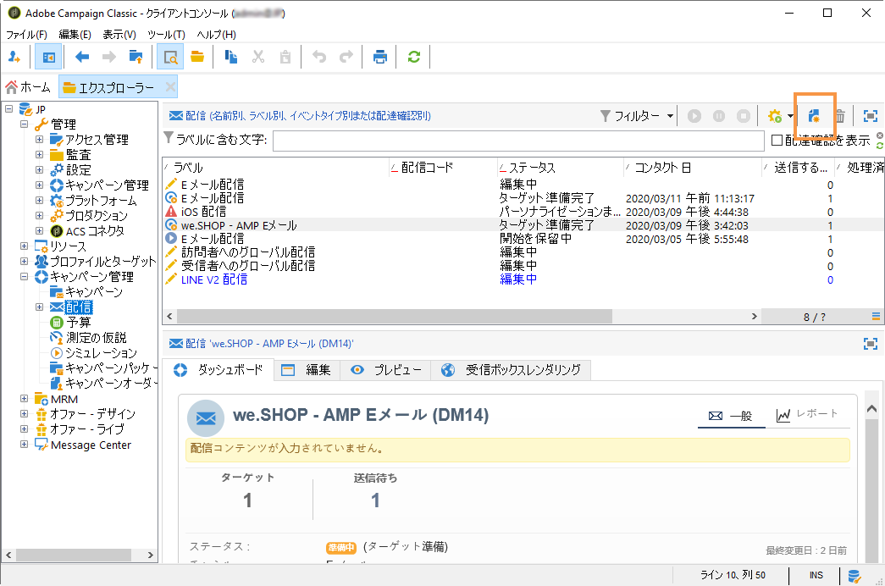
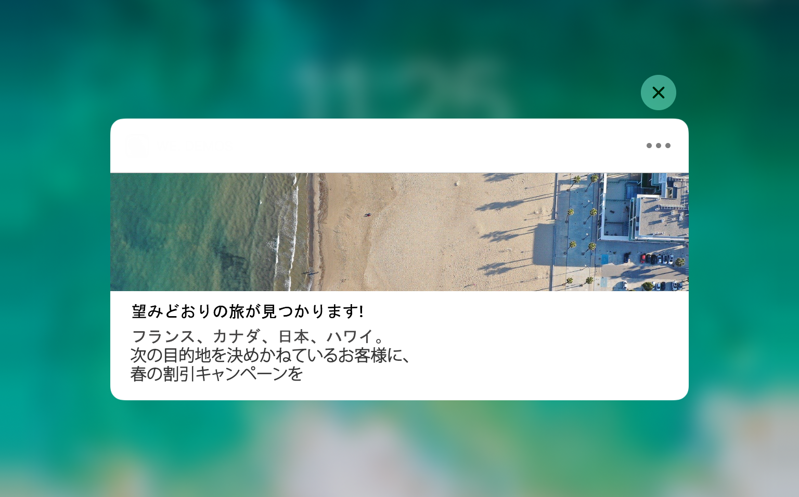

# iOS 用通知の作成{#create-notifications-ios}

ここでは、iOS 用通知の配信に固有の要素について説明します。配信の作成に関するグローバルな概念については、[この節](steps-about-delivery-creation-steps.md)で説明しています。

新しい配信を作成して開始します。

iOS デバイス用のプッシュ通知を作成するには、次の手順に従います。

1. 「**[!UICONTROL iOS 配信]**」配信テンプレートを選択します。

   

1. 通知のターゲットを定義するには、**[!UICONTROL 宛先]**&#x200B;リンク／**[!UICONTROL 追加]**&#x200B;をクリックします。

   

   >[!NOTE]
   >
   >配信のターゲット母集団を選択する際の詳細なプロセスについては、[この節](steps-defining-the-target-population.md)を参照してください。
   >
   >パーソナライゼーションフィールドの使用について詳しくは、[この節](about-personalization.md)を参照してください。
   >
   >シードリストの追加について詳しくは、[シードアドレスについて](about-seed-addresses.md)を参照してください。

1. 「**[!UICONTROL iOS モバイルアプリケーション (iPhone、iPad) の購読者]**」を選択してモバイルアプリケーション（この場合は Neotrips）に関連するサービスを選択し、アプリケーションの iOS バージョンを選択します。

   

1. **[!UICONTROL 一般的な通知（アラート、サウンド、バッジ）]**&#x200B;または&#x200B;**[!UICONTROL サイレント通知]**&#x200B;から&#x200B;**[!UICONTROL 通知タイプ]**&#x200B;を選択します。

   

   >[!NOTE]
   >
   >**サイレントプッシュ**&#x200B;モードを使用すると、モバイルアプリケーションに「サイレント」通知を送信できます。ユーザーは、通知が到着したことを知らされません。通知は、アプリケーションに直接転送されます。

1. 「**[!UICONTROL タイトル]**」フィールドで、通知センターから使用可能な通知のリストに表示するタイトルのラベルを入力します。

   このフィールドを使用して、iOS 通知ペイロードの **title** パラメーターの値を定義できます。

1. **[!UICONTROL 字幕]**（iOS 通知ペイロードの subtitle パラメーターの値）を追加することができます。[この節](configuring-the-mobile-application.md)を参照してください。

1. メッセージのコンテンツをウィザードの「**[!UICONTROL メッセージコンテンツ]**」セクションに入力します。パーソナライゼーションフィールドの使用については、[パーソナライゼーションについて](about-personalization.md)の節を参照してください。

   

1. 「**[!UICONTROL 顔文字を挿入]**」アイコンをクリックすると、プッシュ通知に顔文字を挿入できます。顔文字のリストをカスタマイズするには、[この節](customizing-emoticon-list.md)を参照してください。

1. 「**[!UICONTROL サウンドとバッジ]**」タブでは、次のオプションを編集できます。

   * **[!UICONTROL クリーンバッジ]**：このオプションを有効にして、バッジ値を更新します。

   * **[!UICONTROL 値]**：新しい未読情報の数をアプリケーションアイコンに直接表示する際に使用する数値を設定します。

   * **[!UICONTROL 重大なアラートモード]**：ユーザーの電話がフォーカスモードに設定されている場合や、iPhone がミュートになっている場合でも、通知にサウンドを追加するには、このオプションを有効にします。

   * **[!UICONTROL 名前]**：通知を受信したときにモバイル端末で再生されるサウンドを選択します。

   * **[!UICONTROL 音量]**：サウンドのボリューム（0～100）。
   >[!NOTE]
   >
   >サウンドは、アプリケーションに組み込まれている必要があり、サービスの作成時に定義される必要があります。[この節](configuring-the-mobile-application.md#configuring-external-account-ios)を参照してください。

   

1. 「**[!UICONTROL アプリケーション変数]**」タブから、**[!UICONTROL アプリケーション変数]**&#x200B;が自動的に追加されます。これによって、通知の動作を定義できます。例えば、ユーザーが通知を有効化したときに特定のアプリケーション画面が表示されるように設定できます。

   詳しくは、[この節](configuring-the-mobile-application.md)を参照してください。

1. 「**[!UICONTROL 詳細]**」タブでは、次の一般的なオプションを編集できます。

   * **[!UICONTROL 可変コンテンツ]**：モバイルアプリケーションがメディアコンテンツをダウンロードできるようにするには、このオプションを有効にします。

   * **[!UICONTROL スレッド ID]**：関連する通知をグループ化するために使用される識別子。

   * **[!UICONTROL カテゴリ]**：アクションボタンを表示するカテゴリ ID の名前。これらの通知により、ユーザーは、アプリケーションを開いたりアプリケーション内を移動したりせずに、通知に応じて様々なタスクをより迅速に実行できます。

   

1. 時間依存通知の場合、次のオプションを指定できます。

   * **[!UICONTROL ターゲットコンテンツ ID]**：通知が開かれたときに転送するアプリケーションウィンドウをターゲティングするために使用される識別子。

   * **[!UICONTROL ローンチ画像]**：表示する起動画像ファイルの名前。ユーザーがアプリケーションのローンチを選択した場合は、アプリケーションのローンチ画面ではなく、選択した画像が表示されます。

   * **[!UICONTROL 割り込みレベル]**：

      * **[!UICONTROL アクティブ]**：デフォルトでは、通知が直ちに表示され、画面が点灯し、サウンドを再生できます。通知はフォーカスモードを妨げません。

      * **[!UICONTROL パッシブ]**：画面を点灯させたり、サウンドを再生したりせずに、システムは通知リストに通知を追加します。通知はフォーカスモードを妨げません。

      * **[!UICONTROL 時間依存]**：システムにより通知がすぐに表示され、画面が点灯し、サウンドを再生でき、フォーカスモードで通知することができます。このレベルでは、Apple からの特別な権限は必要ありません。

      * **[!UICONTROL 重大]**：システムにより通知が直ちに表示され、画面が点灯し、ミュートスイッチまたはフォーカスモードがバイパスされます。このレベルには、Apple からの特別な権限が必要です。
   * **[!UICONTROL 関連性スコア]**：関連性スコアを 0 から 100 に設定します。通知の概要で通知を並べ替える場合にシステムが使用します。

   

1. 通知を設定したら、「**[!UICONTROL プレビュー]**」タブをクリックして通知をプレビューします。

   

   >[!NOTE]
   >
   >通知スタイル（バナーまたはアラート）は、Adobe Campaign では定義しません。スタイルは、iOS 設定でユーザーが選択した設定によって異なります。ただし、Adobe Campaign では、それぞれの通知スタイルをプレビューできます。右下の矢印をクリックすると、スタイルを切り替えることができます。
   >
   >プレビューでは iOS 10 と同様に表示されます。

配達確認や最終配信を送信するには、メール配信と同じプロセスを使用します。[詳細情報](steps-validating-the-delivery.md)

メッセージを送信した後は、配信を監視およびトラッキングできます。詳しくは、以下の節を参照してください。

* [プッシュ通知の強制隔離](understanding-quarantine-management.md#push-notification-quarantines)
* [配信の監視](about-delivery-monitoring.md)
* [配信エラーについて](understanding-delivery-failures.md)

## iOS 用のリッチ通知の作成 {#creating-ios-delivery}

iOS 10 以降では、リッチ通知を生成することができます。Adobe Campaign では、変数を使用して通知を送信し、デバイスでリッチ通知を表示できます。

次に、新しい配信を作成し、作成したモバイルアプリケーションにリンクする必要があります。

1. **[!UICONTROL キャンペーン管理]**／**[!UICONTROL 配信]**&#x200B;に移動します。

1. 「**[!UICONTROL 新規]**」をクリックします。

   

1. 「**[!UICONTROL 配信テンプレート]**」ドロップダウンで「**[!UICONTROL iOS 配信（ios）]**」を選択します。配信に&#x200B;**[!UICONTROL ラベル]**&#x200B;を追加します。

1. 「**[!UICONTROL 宛先]**」をクリックして、ターゲットにする母集団を定義します。デフォルトでは、**[!UICONTROL 購読者のアプリケーション]**&#x200B;ターゲットマッピングが適用されます。「**[!UICONTROL 追加]**」をクリックして、前の手順で作成したサービスを選択します。

   

1. **[!UICONTROL ターゲットのタイプ]**&#x200B;ウィンドウで、「**[!UICONTROL iOS モバイルアプリケーション (iPhone、iPad) の購読者]**」を選択し、「**[!UICONTROL 次へ]**」をクリックします。

1. 「**[!UICONTROL サービス]**」ドロップダウンで、前の手順で作成したサービスを選択し、ターゲットアプリケーションを選択して「**[!UICONTROL 完了]**」をクリックします。

   

1. リッチ通知を編集します。

   

1. 設定手順で追加した内容に応じて、「**[!UICONTROL アプリケーション変数]**」タブから&#x200B;**[!UICONTROL アプリケーション変数]**&#x200B;が自動的に追加されます。

   >[!NOTE]
   >
   >アプリケーション変数は、モバイルアプリケーションのコードで定義され、サービスの作成時に入力される必要があります。詳細については、[この節](configuring-the-mobile-application.md)を参照してください。

   

1. 「**[!UICONTROL 詳細]**」タブで、「**[!UICONTROL 可変コンテンツ]**」チェックボックスをオンにして、モバイルアプリケーションでメディアコンテンツをダウンロードできるようにします。

1. 「**[!UICONTROL 保存]**」をクリックし、配信を送信します。

プッシュ通知が購読者のモバイル iOS デバイスで受信されると、画像と web ページが表示されます。

