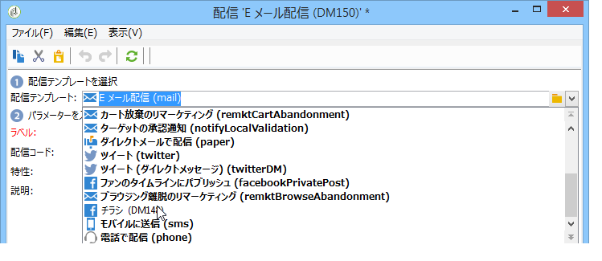
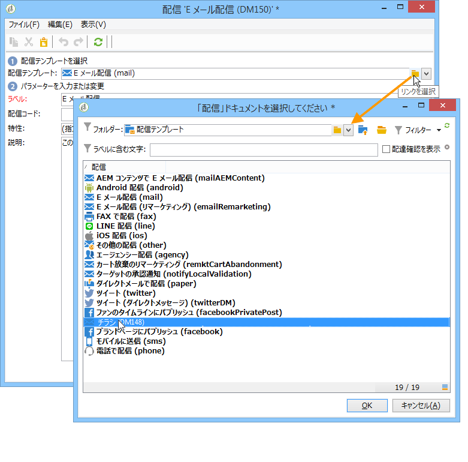
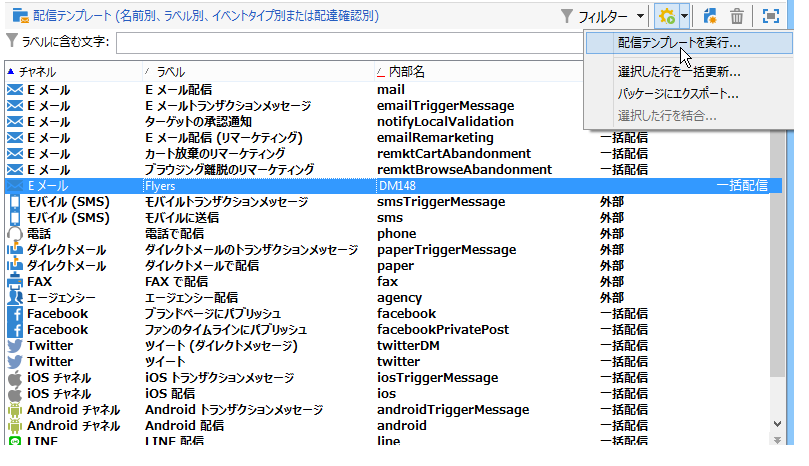

# テンプレートからの配信の作成{#creating-a-delivery-from-a-template}

## テンプレートと配信のリンク {#linking-the-template-to-a-delivery}

既存のテンプレートをベースにして配信を作成するには、利用可能な配信テンプレートのリストからテンプレートを選択します。

または、フィールドの右にある「**[!UICONTROL リンクを選択]**」フォルダーをクリックし、ツリーを参照します。

目的のディレクトリを「**[!UICONTROL フォルダー]**」フィールドから選択するか、**[!UICONTROL サブレベルを表示]**&#x200B;アイコンをクリックして現在のディレクトリのサブツリーに含まれるディレクトリのコンテンツを表示します。

使用する配信テンプレートを選択し、「**[!UICONTROL OK]**」をクリックします。

## テンプレートの実行 {#executing-the-template}

最初に配信を作成することなく、テンプレートリストから直接テンプレートの実行を開始できます。 そのためには、実行するテンプレートを選択して右クリックし、 **[!UICONTROL アクション／配信テンプレートを実行]**&#x200B;を選択します。

また、**[!UICONTROL ファイル／アクションメニューで「配信テンプレートを実行」]**&#x200B;を選択することもできます。

配信パラメーターを入力し、「**[!UICONTROL 送信]**」をクリックします。

このアクションにより、テンプレートに関連付けられたフォルダー内に配信が生成されます。 配信の名前は、ベースにした配信テンプレートの名前と同じになります。

>[!NOTE]
>
>配信の設定について詳しくは、[メールコンテンツの定義](defining-the-email-content.md)を参照してください。
