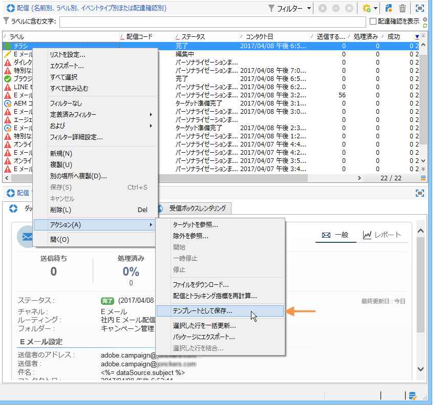
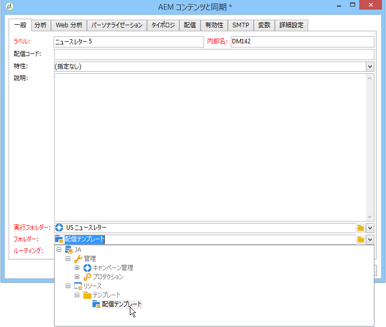
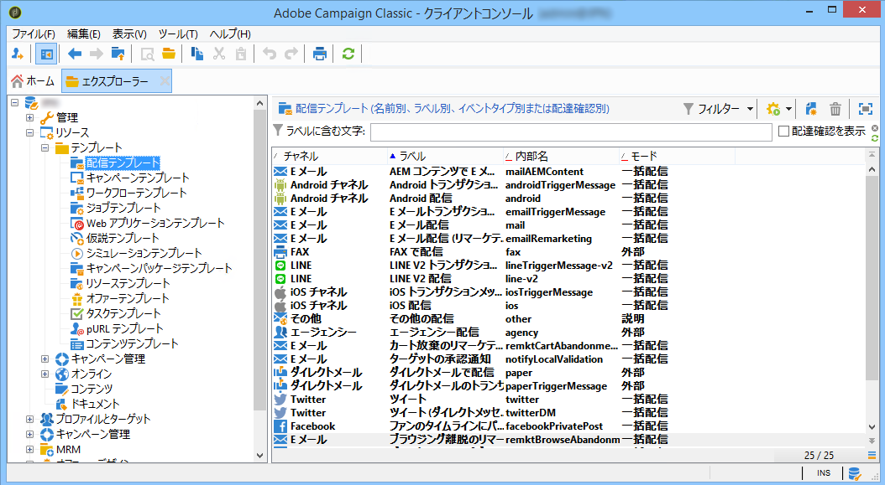
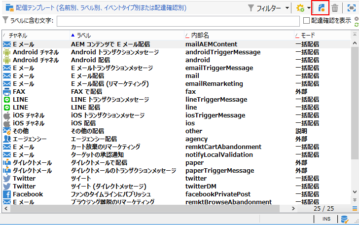
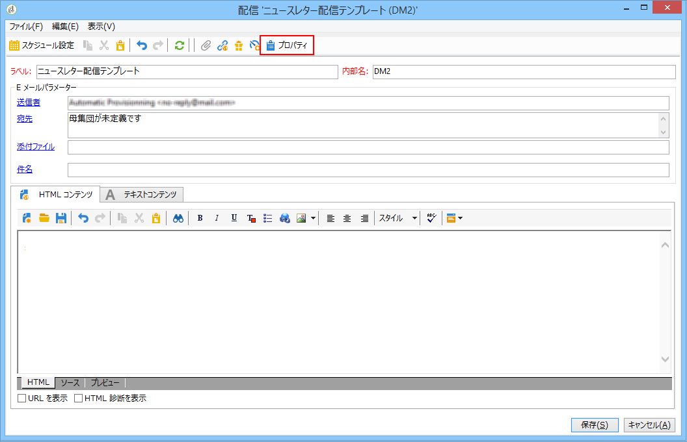
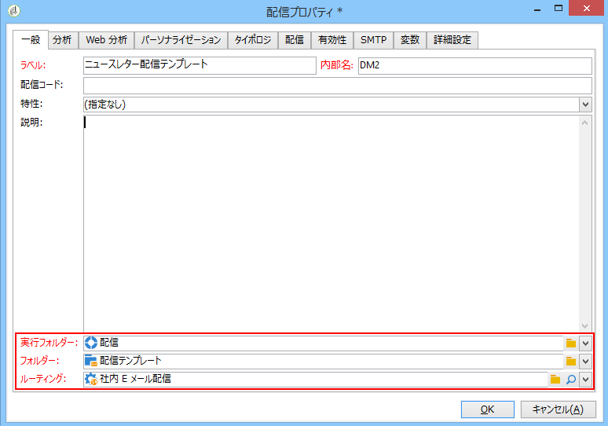
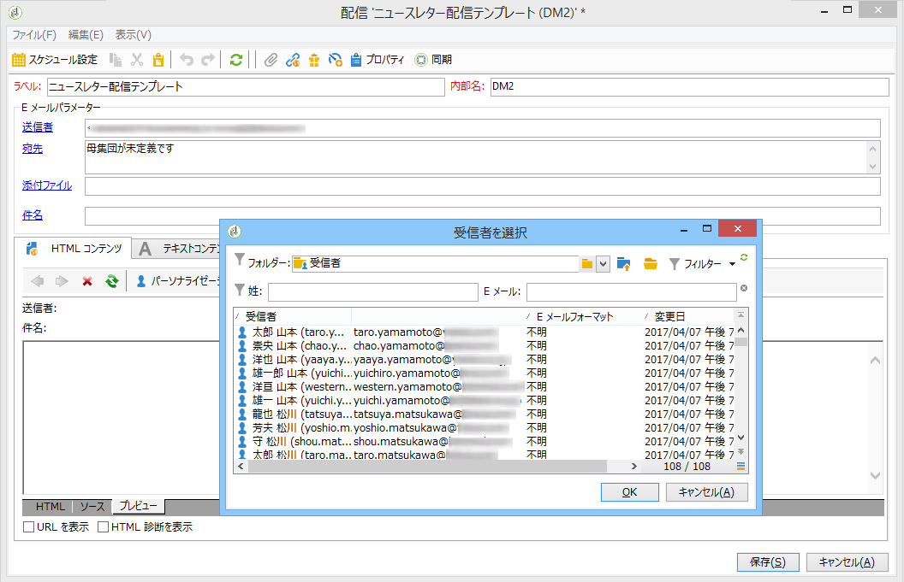

# 配信テンプレートの作成{#creating-a-delivery-template}

 [ビデオでこの機能を確認する](#delivery-template-video)

## テンプレートへの既存の配信の変換 {#converting-an-existing-delivery-to-a-template}

配信をテンプレートに変換すると、新しい繰り返し配信アクションの作成に使用できます。配信をテンプレートに変換するには、ツリーの&#x200B;**[!UICONTROL キャンペーン管理]**&#x200B;ノードからアクセスできる配信リストで、配信を選択し、

右クリックして&#x200B;**[!UICONTROL アクション／テンプレートとして保存]**&#x200B;を選択します。

これにより、選択した配信から配信テンプレートが作成されます。テンプレートの保存先フォルダーを「**[!UICONTROL フォルダー]**」フィールドで指定し、そのテンプレートに基づいて作成される配信の保存先フォルダーを「**[!UICONTROL 実行フォルダー]**」フィールドで指定する必要があります。

設定モードについて詳しくは、[テンプレートと配信とのリンク](../../delivery/using/creating-a-delivery-from-a-template.md#linking-the-template-to-a-delivery)を参照してください。

## 新しいテンプレートの作成 {#creating-a-new-template}

配信テンプレートを設定するには、次の手順に従います。

1. Campaign エクスプローラーを開きます。
1. **リソース**&#x200B;フォルダーで、「**テンプレート**」、「**配信テンプレート**」の順に選択します。

   

1. ツールバーで「**新規**」をクリックして、新しい配信テンプレートを作成します。

   

1. フォルダーの&#x200B;**ラベル**&#x200B;と&#x200B;**内部名**&#x200B;を修正します。
1. テンプレートを保存してから再度開きます。
1. 「**プロパティ**」ボタンをクリックしてから、必要に応じて値を修正します。

   

1. 「**一般**」タブで、**実行フォルダー**、**フォルダー**、**ルーティング**&#x200B;の各ドロップダウンメニューで選択された場所を確定または変更します。

   

1. 「**E メールパラメーター**」カテゴリに E メールの件名とターゲット母集団を入力します。
1. **HTML コンテンツ**&#x200B;を追加してテンプレートをパーソナライズします。ミラーページのリンクと購読解除リンクを追加することもできます。
1. 「**プレビュー**」タブを選択します。**パーソナライゼーションをテスト**&#x200B;ドロップダウンメニューで&#x200B;**受信者**&#x200B;を選択し、選択したプロファイルとしてテンプレートをプレビューします。

   

1. 「**保存**」をクリックします。これで、テンプレートを配信で使用できるようになります。

>[!NOTE]
>
>設定エラーを防ぐために、新しいテンプレートを作成するのではなく、ネイティブテンプレートをコピーしてプロパティを変更することをお勧めします。

## チュートリアル動画 {#delivery-template-video}

### 配信テンプレートの設定方法

次のビデオでは、アドホック配信用のテンプレートを設定する方法について説明します。

>[!VIDEO](https://video.tv.adobe.com/v/24066?quality=12)

### 配信テンプレートのプロパティの設定方法

次のビデオでは、配信テンプレートのプロパティを設定する方法と各プロパティの詳細について説明します。

>[!VIDEO](https://video.tv.adobe.com/v/24067?quality=12)

### アドホック配信テンプレートのデプロイ方法

このビデオでは、アドホック E メール配信テンプレートを導入する方法と、E メール配信と配信ワークフローの違いについて説明します。

>[!VIDEO](https://video.tv.adobe.com/v/24065?quality=12)

その他のCampaign Classicハウツービデオは [こちら](https://experienceleague.adobe.com/docs/campaign-classic-learn/tutorials/overview.html)。