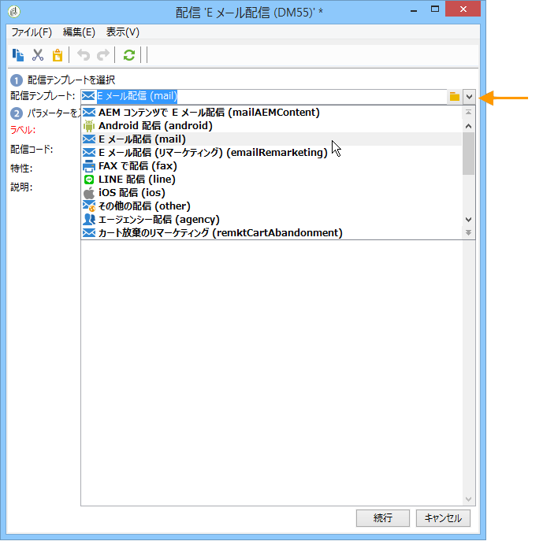

# メール配信の作成{#creating-an-email-delivery}

新しいメール配信を作成するには、次の手順に従います。

>[!NOTE]
>
>配信の作成に関するグローバルな概念について詳しくは、[Campaign v8 ドキュメント](https://experienceleague.adobe.com/docs/campaign/campaign-v8/send/create-message.html?lang=ja){target="_blank"}を参照してください。

1. 新しい配信を作成します（例えば、配信ダッシュボードから）。
1. **メール配信（メール）**&#x200B;配信テンプレートまたは自分で作成した任意のメール配信テンプレートを選択します。 配信テンプレートについて詳しくは、[この節](about-templates.md)を参照してください。

   

1. ラベル、コードおよび説明を設定して配信を識別します。 詳しくは、[Campaign v8 ドキュメント](https://experienceleague.adobe.com/docs/campaign/campaign-v8/send/create-message.html?lang=ja#create-the-delivery){target="_blank"}のこの節を参照してください。
1. 「**続行**」をクリックすると、入力した情報が確定され、メッセージ設定ウィンドウが表示されます。
