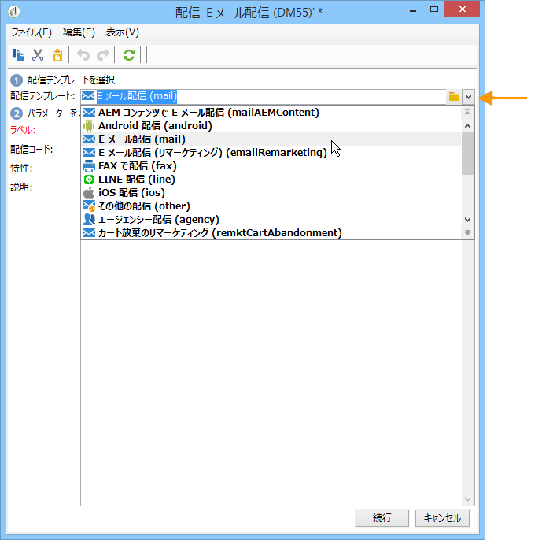

# E メール配信の作成{#creating-an-email-delivery}

新しい E メール配信を作成するには、次の手順に従います。

>[!NOTE]
>
>配信の作成に関するグローバルな概念については、[この節](steps-about-delivery-creation-steps.md)で説明しています。

1. 新しい配信を作成します（例えば、配信ダッシュボードから）。
1. **E メール配信（メール）**&#x200B;配信テンプレートまたは自分で作成した任意の E メール配信テンプレートを選択します。配信テンプレートについて詳しくは、[この節](about-templates.md)を参照してください。

   

1. ラベル、コードおよび説明を設定して配信を識別します。詳しくは、[この節](steps-create-and-identify-the-delivery.md#identifying-the-delivery)を参照してください。
1. 「**続行**」をクリックすると、入力した情報が確定され、メッセージ設定ウィンドウが表示されます。
