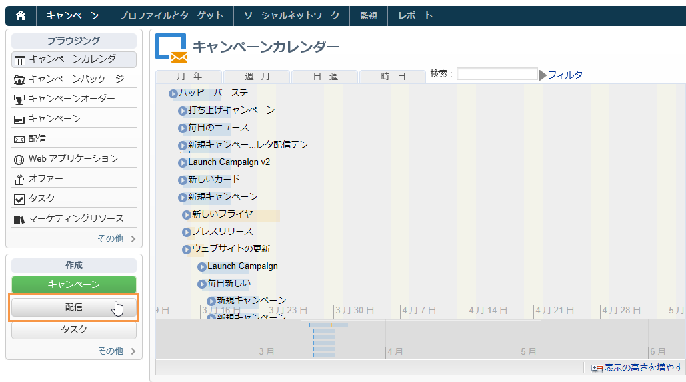
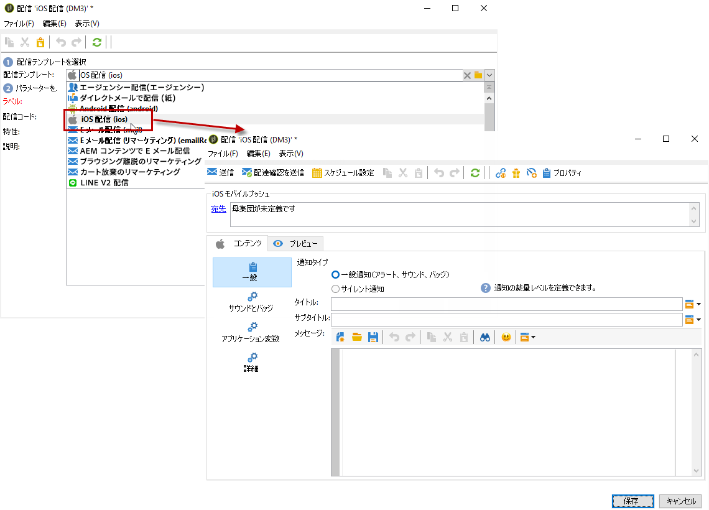
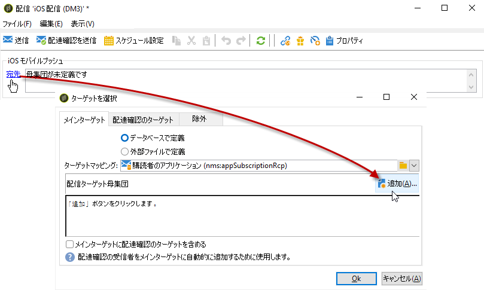
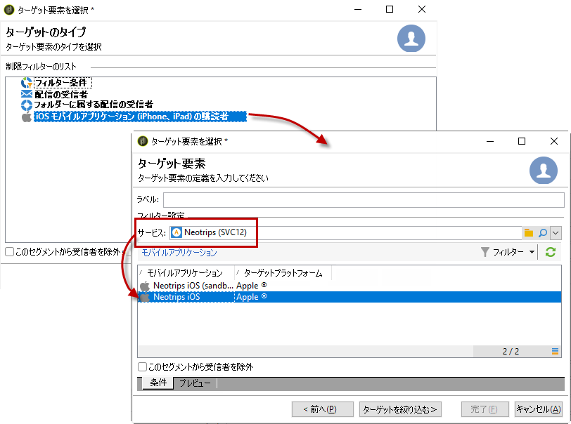
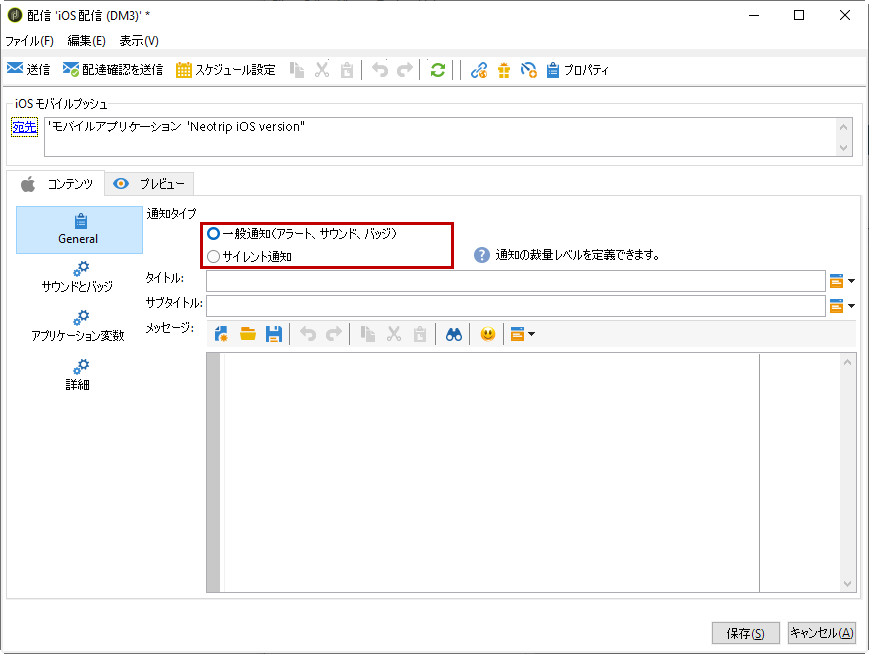
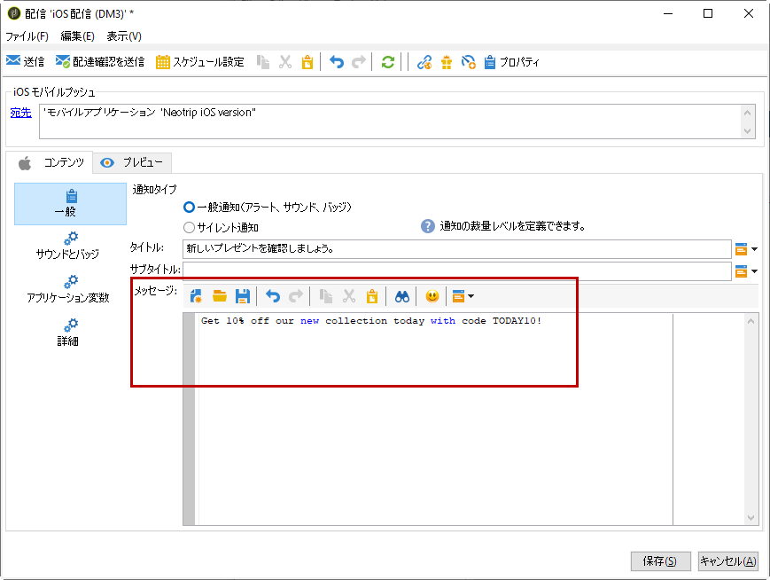
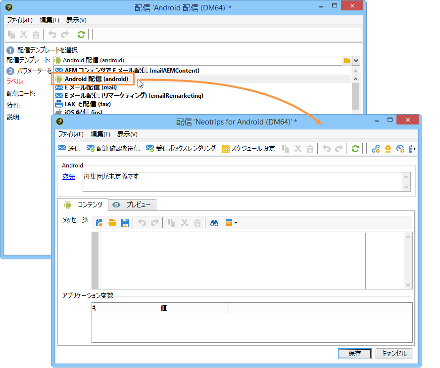
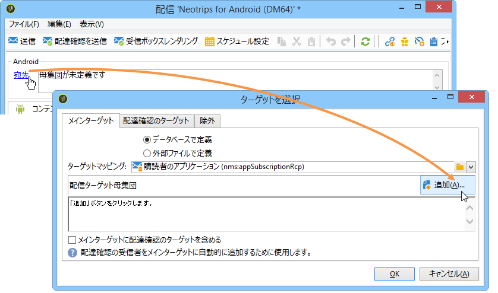
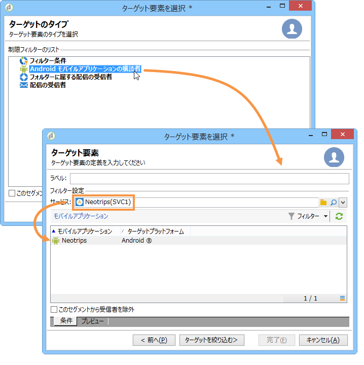
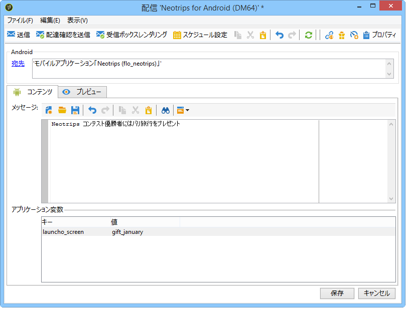

# 通知の作成{#creating-notifications}

ここでは、iOS および Android の通知の配信に固有な設定について説明します。配信の作成に関するグローバルな概念については、[この節](../../delivery/using/steps-about-delivery-creation-steps.md)で説明しています。

新しい配信を作成して開始します。

## iOS で通知を送信する {#sending-notifications-on-ios}

1. 配信テンプレー **[!UICONTROL Deliver on iOS]** トを選択します。

   

1. To define the target of the notification, click the **[!UICONTROL To]** link, then click **[!UICONTROL Add]**.

   

   >[!NOTE]
   >
   >配信のターゲット母集団を選択する際の詳細なプロセスについては、[この節](../../delivery/using/steps-defining-the-target-population.md)を参照してください。
   >
   >For more on the use of personalization fields, refer to [About personalization](../../delivery/using/about-personalization.md).
   >
   >For more on the inclusion of a seed list, refer to [About seed addresses](../../delivery/using/about-seed-addresses.md).

1. を選択 **[!UICONTROL Subscribers of an iOS mobile application (iPhone, iPad)]**&#x200B;し、モバイルアプリケーションに関連するサービス（この場合はNeotrips）を選択してから、アプリケーションのiOSバージョンを選択します。

   

1. 通知の種類を選択します。ま **[!UICONTROL Alert]**&#x200B;たは **[!UICONTROL Badge]**&#x200B;のいず **[!UICONTROL Alert and badge]** れか **[!UICONTROL Silent Push]**。

   

   >[!NOTE]
   >
   >「**サイレントプッシュ**」モードは、iOS 7 以降で利用できます。このモードでは、モバイルアプリケーションに「無音の」通知を送信します。ユーザーは、通知が到着したことを知らされません。通知は、アプリケーションに直接転送されます。

1. In the **[!UICONTROL Title]** field, enter the label of the title that you want to appear on the notification. このタイトルは、通知センターから使用可能な通知のリストにのみ表示されます。このフィールドを使用して、iOS 通知ペイロードの **title** パラメーターの値を定義できます。
1. HTTP/2 コネクタを使用する場合、サブタイトル（iOS 通知ペイロードの **subtitle** パラメーター）を追加できます。詳しくは、「Adobe Campaignのモ [バイルアプリケーションの設定](../../delivery/using/configuring-the-mobile-application.md) 」を参照してください。
1. 次に、選択した通 **[!UICONTROL Message]** 知タイプに **[!UICONTROL Value of the badge]** 基づいて、とを入力します。

   

   >[!NOTE]
   >
   >通知のコンテンツに絵文字を追加することができます。そのためには、絵文字のリストがある Web サイト（[例](https://www.utf8-chartable.de/unicode-utf8-table.pl?start=9728)）で絵文字をコピーし、コンテンツエディターに直接貼り付けます。Windows 7 では、一部の絵文字がエディターで正しく表示されない（四角形で表示される）ことがありますが、最終的な通知では正しく送信されます。絵文字を表示できるかどうかは、デバイスの OS によって異なります。配信を送信する前に、配信が正しく表示されることを示す証拠を送信することをお勧めします。

   >[!NOTE]
   >
   >**[!UICONTROL Badge]** 「通知 **[!UICONTROL Alert and badge]** 」と入力すると、バッジの値（モバイルアプリケーションロゴの上の番号）を変更できます。 バッジを更新するには、値として 0 を入力します。フィールドが空の場合、バッジの値は変更されません。

1. The **[!UICONTROL Action button]** allows you to define a label for the action button appearing on the alert notifications (**action_loc_key** field of the payload). iOS アプリケーションでローカライズ可能文字列を管理する場合は（**Localizable.strings**）、対応するキーをこのフィールドに入力します。アプリケーションでローカライズ可能テキストを管理しない場合は、アクションボタンに表示するラベルを入力します。ローカライズ可能文字列について詳しくは、[Apple のドキュメント](https://developer.apple.com/library/content/documentation/NetworkingInternet/Conceptual/RemoteNotificationsPG/CreatingtheNotificationPayload.md#//apple_ref/doc/uid/TP40008194-CH10-SW1)を参照してください。
1. In the **[!UICONTROL Play a sound]** field, select the sound to be played by the mobile terminal when the notification is received.

   >[!NOTE]
   >
   >サウンドは、アプリケーションに含まれている必要があり、サービスが作成されたときに定義される必要があります。「iOS外部アカ [ウントの設定」を参照してください](../../delivery/using/configuring-the-mobile-application.md#configuring-external-account-ios)。

1. In the **[!UICONTROL Application variables]** field, enter the value of each variable. アプリケーション変数によって、通知の動作を定義できます。例えば、ユーザーが通知を有効化したときに特定のアプリケーション画面が表示されるように設定できます。

   >[!NOTE]
   >
   >アプリケーション変数は、モバイルアプリケーションのコードで定義され、サービスの作成中に入力される必要があります。詳しくは、次を参照してください。Adobe Campaign [でのモバイルアプリの設定](../../delivery/using/configuring-the-mobile-application.md)。

1. Once the notification is configured, click the **[!UICONTROL Preview]** tab to preview the notification.

   

   >[!NOTE]
   >
   >通知スタイル（バナーまたはアラート）は、Adobe Campaign では定義しません。スタイルは、iOS 設定でユーザーが選択した設定によって異なります。ただし、Adobe Campaign では、それぞれの通知スタイルをプレビューできます。右下の矢印をクリックすると、スタイルを切り替えることができます。
   >
   >プレビューでは iOS 10 と同様に表示されます。

配達確認や最終配信を送信するには、E メール配信と同じプロセスを使用します。

メッセージを送信した後は、配信を監視およびトラッキングできます。詳しくは、以下の節を参照してください。

* [プッシュ通知の強制隔離](../../delivery/using/understanding-quarantine-management.md#push-notification-quarantines)
* [配信の監視](../../delivery/using/monitoring-a-delivery.md)
* [配信エラーの理解](../../delivery/using/understanding-delivery-failures.md)

## Android で通知を送信する {#sending-notifications-on-android}

1. 配信テンプレートを選択して **[!UICONTROL Deliver on Android (android)]** 開始します。

   

1. To define the target of the notification, click the **[!UICONTROL To]** link, then click **[!UICONTROL Add]**.

   

1. Select **[!UICONTROL Subscribers of an Android mobile application]**, choose the service relevant to your mobile application (Neotrips, in this case), then select the Android version of the application.

   

1. 次に通知の内容を入力します。

   

   >[!NOTE]
   >
   >通知のコンテンツに絵文字を追加することができます。そのためには、絵文字のリストがある Web サイト（[例](https://www.utf8-chartable.de/unicode-utf8-table.pl?start=9728)）で絵文字をコピーし、コンテンツエディターに直接貼り付けます。Windows 7 では、一部の絵文字がエディターで正しく表示されない（四角形で表示される）ことがありますが、最終的な E メールでは正しく送信されます。絵文字を表示できるかどうかは、デバイスの OS によって異なります。配信を送信する前に、配信が正しく表示されることを示す証拠を送信することをお勧めします。

1. In the **[!UICONTROL Application variables]** field, enter the value of each variable. アプリケーション変数によって、通知の動作を定義できます。例えば、ユーザーが通知を有効化したときに特定のアプリケーション画面が表示されるように設定できます。

   >[!NOTE]
   >
   >アプリケーション変数は、モバイルアプリケーションのコードで定義され、サービスの作成中に入力される必要があります。詳しくは、次を参照してください。Adobe Campaign [でのモバイルアプリの設定](../../delivery/using/configuring-the-mobile-application.md)。

1. Once the notification is configured, click the **[!UICONTROL Preview]** tab to preview the notification.

   

配達確認や最終配信を送信するには、E メール配信と同じプロセスを使用します。

配信を検証および送信する際の詳細なプロセスについては、以下の節を参照してください。

* [配信の検証](../../delivery/using/steps-validating-the-delivery.md)
* [配信の送信](../../delivery/using/steps-sending-the-delivery.md)

メッセージを送信した後は、配信を監視およびトラッキングできます。詳しくは、以下の節を参照してください。

* [プッシュ通知の強制隔離](../../delivery/using/understanding-quarantine-management.md#push-notification-quarantines)
* [配信の監視](../../delivery/using/monitoring-a-delivery.md)
* [配信エラーの理解](../../delivery/using/understanding-delivery-failures.md)
