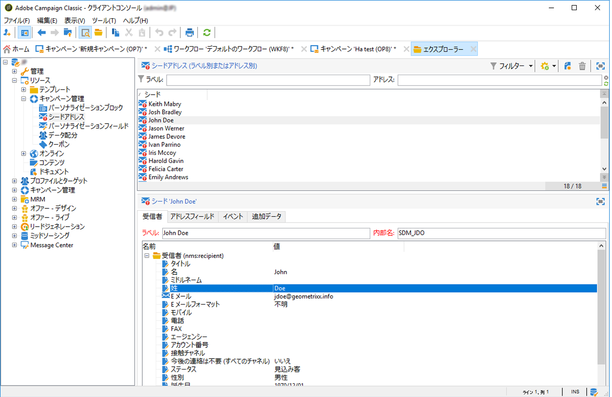
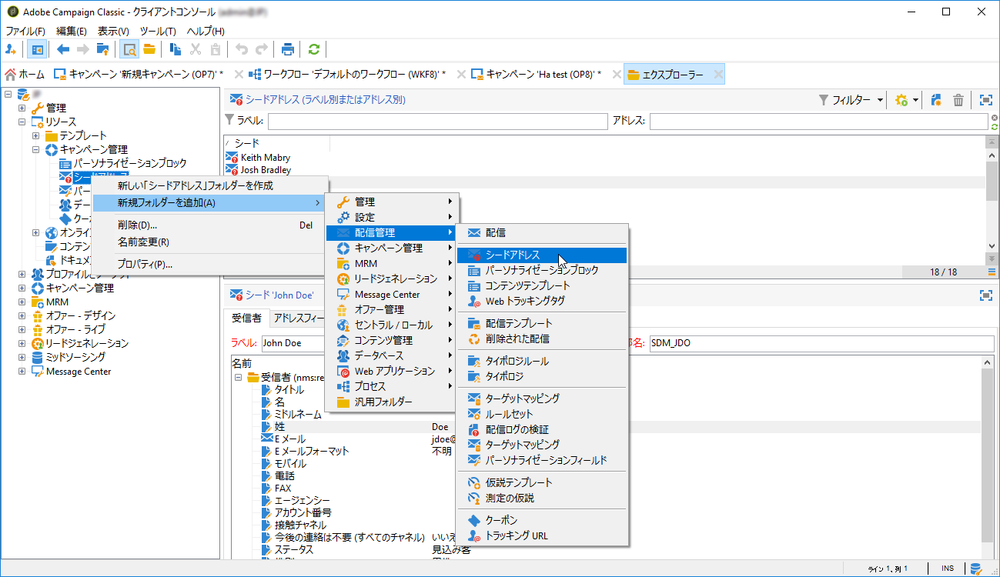
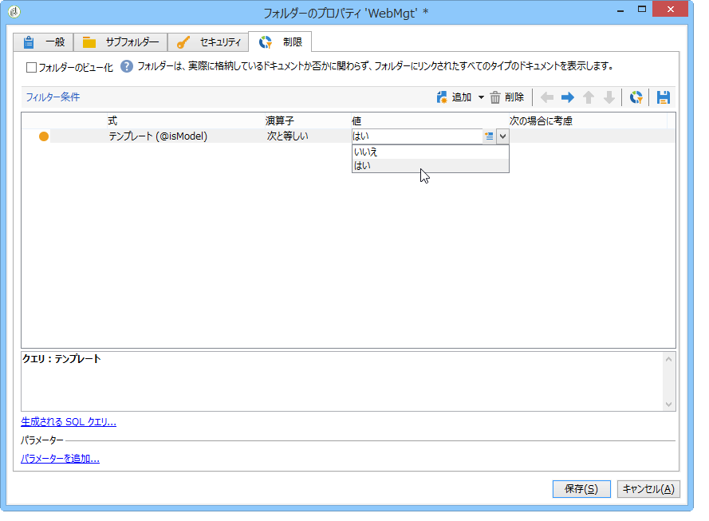

# シードアドレスの作成{#creating-seed-addresses}

Seed addresses are not managed via standard profiles and targets, but in a dedicated node of the Adobe Campaign hierarchy **[!UICONTROL Resources > Campaign management > Seed addresses]**.

このノードには、シードアドレスを整理するためのサブフォルダーを作成できます。To do this, right-click the **[!UICONTROL Seed addresses]** node and select **[!UICONTROL Create a new 'Seed addresses' folder]**. サブフォルダーに名前を付け、**[!UICONTROL Enter]** キーを押して確定します。これで、作成したサブフォルダー内にシードアドレスを作成したり、別の場所からシードアドレスをコピーしたりできるようになります。For more on this, refer to [Defining addresses](#defining-addresses).

Adobe Campaign では、シードアドレスのテンプレートも作成可能です。配信やキャンペーンにシードアドレスのテンプレートをインポートし、その配信やキャンペーンの具体的なニーズに応じて変更を加えることができます。詳しくは、シードア [ドレステンプレートの作成を参照してくださ](#creating-seed-address-templates)い。

## アドレスの定義 {#defining-addresses}

シードアドレスを作成するには、以下の手順に従います。

1. Click the **[!UICONTROL New]** button above the list of seed addresses.
1. Enter the data linked to the address in the matching fields from the **[!UICONTROL Recipient]** tab. 使用可能なフィールドは、姓、名、E メールなど、配信受信者のプロファイル（nms:recipient テーブル）の標準的なフィールドに対応します。

   >[!NOTE]
   >
   >アドレスのラベルには、定義した姓と名が自動的に入力されます。
   >
   >シードアドレスを作成する際、各タブのすべてのフィールドに情報を入力する必要はありません。入力されていないパーソナライゼーション要素は、配信時にランダムに入力されます。

   

1. In the **[!UICONTROL Seed fields]** tab, enter the values that will be inserted in the delivery logs during the analysis phase (in the **[!UICONTROL nms:broadLog]** table).
1. In the **[!UICONTROL Additional data]** tab, enter the personalization data used for the deliveries created in the Datamanagement workflows and which you want to assign a specific value to.

## シードアドレステンプレートの作成 {#creating-seed-address-templates}

インポートされ、配信ごとに変更可能なアドレステンプレートを作成するためのプロセスは、新しいシードアドレスを定義する場合のプロセスと同様です。唯一の違いは、シードアドレステンプレートのアドレスを「テンプレート」タイプのフォルダーに格納する必要があることです。

テンプレートフォルダーを定義するには、次の手順に従います。

1. Create a new **[!UICONTROL Seed addresses]** type folder, right-click the folder then select **[!UICONTROL Properties...]**.

   

1. タブをクリック **[!UICONTROL Restriction]** し、次のフィルター条件を追加します。 **@isModel = true**。

   

   これにより、このフォルダーに格納したアドレスをアドレステンプレートとして使用できるようになります。You can import them into deliveries or campaigns and adapt them based on the specific needs of the concerned deliveries and campaigns (see [Adding seed addresses](../../delivery/using/adding-seed-addresses.md)).
