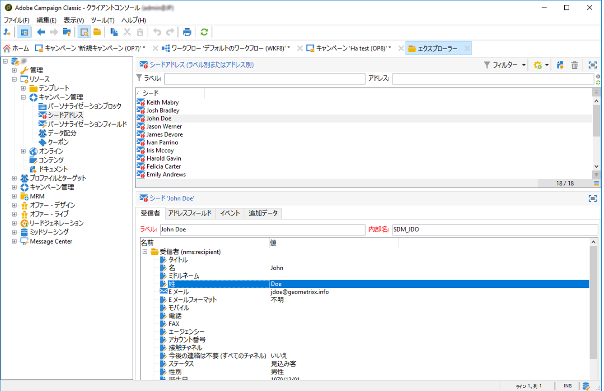
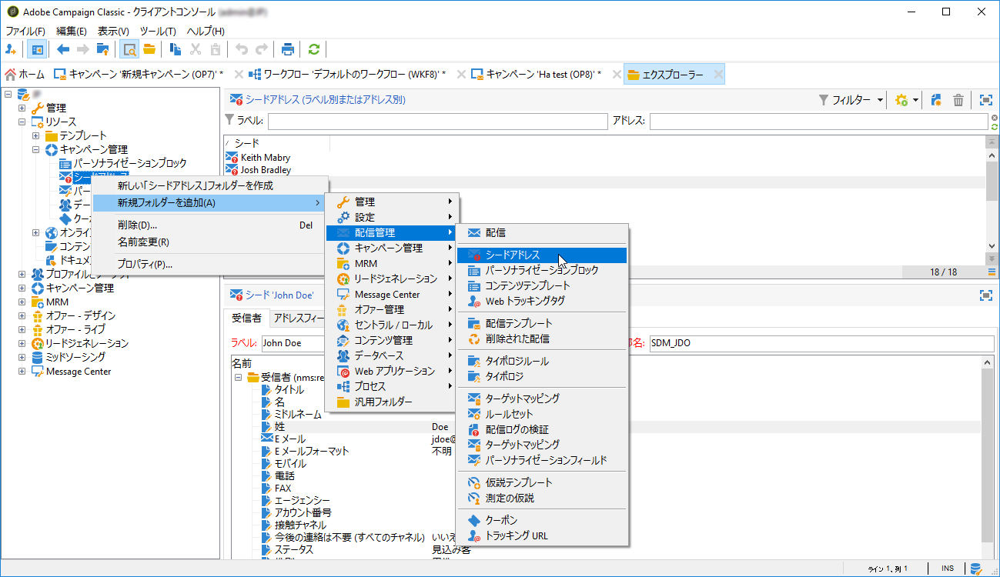
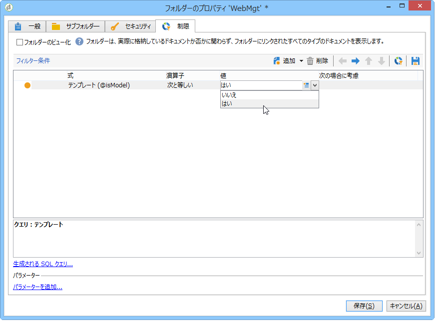

# シードアドレスの作成{#creating-seed-addresses}

シードアドレスの管理には、標準的なプロファイルやターゲットではなく、Adobe Campaign 階層構造の&#x200B;**[!UICONTROL リソース／キャンペーン管理／シードアドレス]**&#x200B;でアクセスできる専用ノードを使用します。

このノードには、シードアドレスを整理するためのサブフォルダーを作成できます。 そのためには、**[!UICONTROL シードアドレス]**&#x200B;ノードを右クリックし、「**[!UICONTROL 新しい「シードアドレス」フォルダーを作成]**」を選択します。 サブフォルダーに名前を付け、**[!UICONTROL Enter]** キーを押して確定します。 これで、作成したサブフォルダー内にシードアドレスを作成したり、別の場所からシードアドレスをコピーしたりできるようになります。 詳しくは、[アドレスの定義](#defining-addresses)を参照してください。

Adobe Campaign では、シードアドレスのテンプレートも作成可能です。配信やキャンペーンにシードアドレスのテンプレートをインポートし、その配信やキャンペーンの具体的なニーズに応じて変更を加えることができます。 [シードアドレステンプレートの作成](#creating-seed-address-templates)を参照してください。

## アドレスの定義 {#defining-addresses}

シードアドレスを作成するには、以下の手順に従います。

1. シードアドレスのリストの上にある「**[!UICONTROL 新規]**」ボタンをクリックします。
1. そのアドレスに関連するデータを、「**[!UICONTROL 受信者]**」タブの該当するフィールドに入力します。 使用可能なフィールドは、姓、名、メールなど、配信受信者のプロファイル（nms:recipient テーブル）の標準的なフィールドに対応します。

   >[!NOTE]
   >
   >アドレスのラベルには、定義した姓と名が自動的に入力されます。
   >
   >シードアドレスを作成する際、各タブのすべてのフィールドに情報を入力する必要はありません。 入力されていないパーソナライゼーション要素は、配信分析時にランダムに入力されます。

   

1. 「**[!UICONTROL アドレスフィールド]**」タブには、分析フェーズで配信ログ（**[!UICONTROL nms:broadLog]** テーブル）に挿入される値を入力します。

1. 「**[!UICONTROL 追加データ]**」タブでは、データ管理ワークフローで作成される配信のためのパーソナライゼーションデータや、特定の値を設定しておく必要があるパーソナライゼーションデータを入力します。

   >[!NOTE]
   >
   >追加のターゲットデータが、「**[!UICONTROL エンリッチメント]**」アクティビティで「@」で始まるエイリアスで定義されていることを確認してください。 そうでない場合、配信アクティビティのシードアドレスで正しく使用できなくなります。

## シードアドレステンプレートの作成 {#creating-seed-address-templates}

インポートされ、配信ごとに変更可能なアドレステンプレートを作成するためのプロセスは、新しいシードアドレスを定義する場合のプロセスと同様です。 唯一の違いは、シードアドレステンプレートのアドレスを「テンプレート」タイプのフォルダーに格納する必要があることです。

テンプレートフォルダーを定義するには、次の手順に従います。

1. 新しい&#x200B;**[!UICONTROL シードアドレス]**&#x200B;タイプのフォルダーを作成します。そのフォルダーを右クリックし、「**[!UICONTROL プロパティ...]**」を選択します。

   

1. 「**[!UICONTROL 制限]**」タブをクリックし、フィルター条件 **@isModel = true** を追加します。

   

   これにより、このフォルダーに格納したアドレスをアドレステンプレートとして使用できるようになります。 これらを配信またはキャンペーンにインポートし、該当する配信およびキャンペーンに特有のニーズに基づいて変更することができます（[シードアドレスの追加](adding-seed-addresses.md)を参照）。
