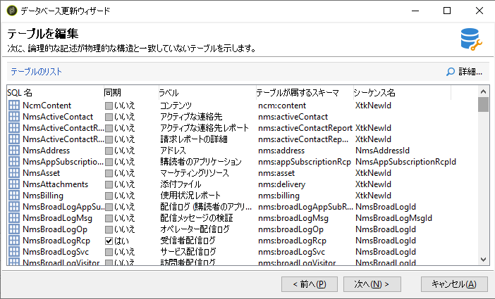
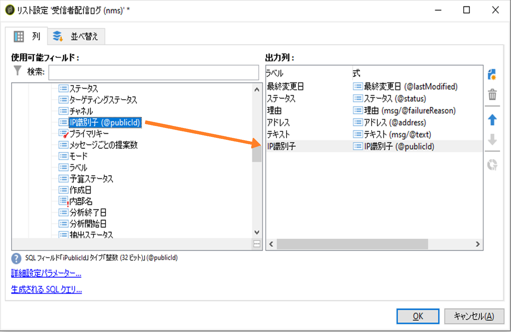

# 詳細：配信ログのカスタマイズ {#customize-delivery-logs}

>[!NOTE]
>
>配信リストへのアクセスと配信ダッシュボードの使用に関する包括的なガイダンスについては、[Campaign v8 ドキュメント &#x200B;](https://experienceleague.adobe.com/en/docs/campaign/campaign-v8/send/monitor/delivery-dashboard) を参照してください。 このコンテンツは、Campaign Classic v7 ユーザーと Campaign v8 ユーザーの両方に適用されます。
>
>このページは、ハイブリッドデプロイメントとオンプレミスデプロイメントの **0&rbrace;Campaign Classic v7 固有の高度なカスタマイズについて説明します。**

Campaign UI での配信の監視については、[Campaign v8 Campaign UI での配信の監視 &#x200B;](https://experienceleague.adobe.com/en/docs/campaign/campaign-v8/send/monitor/delivery-dashboard){target="_blank"} ドキュメントを参照してください。

## 配信ログのカスタマイズ {#use-case}

**Campaign Classic v7 ハイブリッド/オンプレミスデプロイメント** の場合、スキーマを拡張して配信ログをカスタマイズできます。 ここでは、配信ログに送信者の IP アドレスを追加する方法について説明します。

>[!NOTE]
>
>このカスタマイズを行うには、オンプレミスデプロイメントで使用できるスキーマ拡張機能が必要です。 Campaign v8 Managed Cloud Services のユーザーは、カスタム配信ログフィールドについて、Adobe カスタマーケアにお問い合わせください。
>
>この変更は、単一のインスタンスを使用する場合とミッドソーシングインスタンスを使用する場合とでは異なります。変更をおこなう前に、メール送信インスタンスに接続していることを確認します。

### 手順 1：スキーマの拡張

配信ログに **publicID** を追加するには、まずスキーマを拡張する必要があります。次の手順に従って進むことができます。

1. **[!UICONTROL 管理]**／**[!UICONTROL 設定]**／**[!UICONTROL データスキーマ]**／**[!UICONTROL 新規]**&#x200B;で、スキーマ拡張を作成します。

   スキーマ拡張について詳しくは、[このページ](../../configuration/using/extending-a-schema.md)を参照してください。

1. 受信者配信ログ（nms）を拡張し、カスタム名前空間を定義するには、**[!UICONTROL broadLogRcp]** を選択します。この場合、「cus」になります。

   

   >[!NOTE]
   >
   >インスタンスがミッドソーシングの場合は、broadLogMid スキーマを使用する必要があります。

1. 拡張に新しいフィールドを追加します。このサンプルでは、

   ```
   <element img="nms:broadLog.png" label="Recipient delivery logs" labelSingular="Recipient delivery log" name="broadLogRcp"/>
   ```

   以下と置き換えます。

   ```
   <element img="nms:broadLog.png" label="Recipient delivery logs" labelSingular="Recipient delivery log" name="broadLogRcp">
   <attribute desc="Outbound IP identifier" label="IP identifier"
   name="publicId" type="long"/>
   </element>
   ```

   

### 手順 2：データベース構造の更新

変更が完了したら、データベース構造を更新して、論理的な説明と一致させる必要があります。

これをおこなうには、以下の手順に従います。

1. **[!UICONTROL ツール]**／**[!UICONTROL 詳細]**／**[!UICONTROL データベース構造の更新...]**&#x200B;メニューをクリックします。

   

1. **[!UICONTROL テーブルの編集]**&#x200B;ウィンドウで、**[!UICONTROL NmsBroadLogRcp]** テーブル（ミッドソーシング環境の場合は **[!UICONTROL broadLogMid]** テーブル）が次のようにチェックされます。

   

   >[!IMPORTANT]
   >
   >**[!UICONTROL NmsBroadLoGRcp]** テーブル（ミッドソーシング環境の場合は **[!UICONTROL broadLogMid]** テーブル）を除き、他の変更がないことを必ず確認してください。その場合は、他のテーブルのチェックを外します。

1. 「**[!UICONTROL 次へ]**」をクリックして確認します。次の画面が表示されます。

   

1. 「**[!UICONTROL 次へ]**」、「**[!UICONTROL 開始]**」の順にクリックして、データベース構造の更新を開始します。インデックスの作成を開始しています。この手順は、**[!UICONTROL NmsBroadLogRcp]** テーブルの行数に応じて長くなる場合があります。

   

>[!NOTE]
>
>データベースの物理構造の更新が正常に完了したら、変更を反映するために、接続を解除し、再接続する必要があります。

### 手順 3：変更の検証

すべてが正しく動作していることを確認するには、配信ログ画面を更新する必要があります。

これをおこなうには、配信ログにアクセスし、「IP 識別子」列を追加します。



>[!NOTE]
>
>Campaign Classic インターフェイスでリストを設定する方法については、[このページ](../../platform/using/adobe-campaign-workspace.md)を参照してください。

次に、変更後の「**[!UICONTROL 配信]**」タブの内容を示します。


## 関連トピック

* [Campaign UI での配信の監視 &#x200B;](https://experienceleague.adobe.com/en/docs/campaign/campaign-v8/send/monitor/delivery-dashboard){target="_blank"} （Campaign v8 ドキュメント）
* [&#x200B; 配信ステータス &#x200B;](https://experienceleague.adobe.com/en/docs/campaign/campaign-v8/send/monitor/delivery-statuses){target="_blank"} （Campaign v8 ドキュメント）
* [&#x200B; 配信エラーについて &#x200B;](https://experienceleague.adobe.com/en/docs/campaign/campaign-v8/send/monitor/delivery-failures){target="_blank"} （Campaign v8 ドキュメント）
* [&#x200B; 強制隔離の管理 &#x200B;](https://experienceleague.adobe.com/en/docs/campaign/campaign-v8/send/monitor/quarantines){target="_blank"} （Campaign v8 ドキュメント）
* [&#x200B; スキーマの拡張 &#x200B;](../../configuration/using/extending-a-schema.md) （v7 ハイブリッド/オンプレミス）

