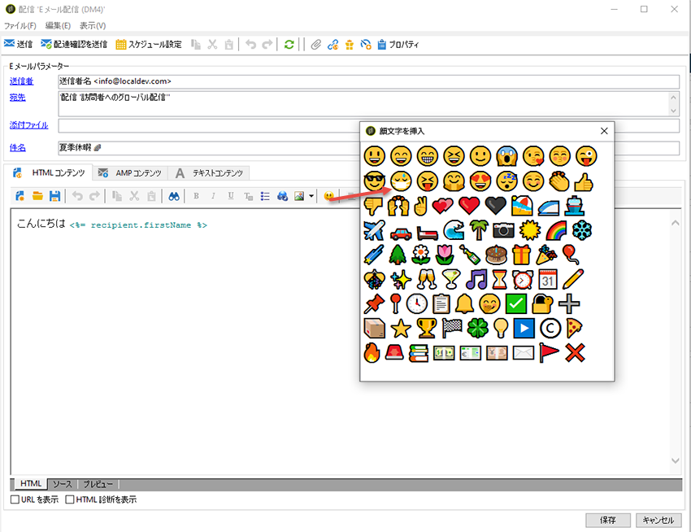

# 絵文字リストのカスタマイズ {#customize-emoticons}

ポップアップに表示される絵文字のリストは、リストに値を表示し、特定のフィールドに対してユーザーが持つ選択肢を制限できる定義済みリストによって支配されます。
顔文字のリスト順序はカスタマイズすることができます。また、リストに他の顔文字を追加することもできます。
顔文字は電子メールで使用でき、プッシュでも詳しくは、この [ページを参照してください](../../delivery/using/defining-the-email-content.md#inserting-emoticons)。

## 新しい顔文字の追加 {#add-new-emoticon}

>[!CAUTION]
>
>顔文字リストは81個を超えるエントリを表示できません。

1. この [ページから追加する新しい顔文字を選択します](https://unicode.org/emoji/charts/full-emoji-list.html)。 ブラウザーやOSなど、様々なプラットフォームと互換性がある必要があります。

1. エクスプ **[!UICONTROL ローラから]**、 **[!UICONTROL 管理]** /プラットフォーム/ **[!UICONTROL 定義済みリストを選択し、]********** 管理/プラットフォーム/リストをクリックして、ボックスの定義済みリストから「」をクリックします。

   >[!NOTE]
   >
   >そのまま使用できる定義済みリストは、Adobe Campaignクラシックコンソールの管理者のみが管理できます。

   

1. 「**[!UICONTROL 追加]**」をクリックします。

1. 次のフィールドに入力します。

   * **[!UICONTROL U+]**: 新しい顔文字のコード。 この [ページには、顔文字のコードのリストが表示されます](https://unicode.org/emoji/charts/full-emoji-list.html)。
互換性の問題を回避するため、ブラウザーおよび各オペレーションシステムでサポートされる顔文字を選択することをお勧めします。

   * **[!UICONTROL ラベル]**: 新しい顔文字のラベル。

   

1. 設定が完了したら、 **[!UICONTROL 「]** OK **[!UICONTROL 」をクリックし、「]** 保存」をクリックします。
新しい絵文字が自動的にストアに配置されます。

1. 配信の[ **[!UICONTROL 挿入絵文字]** ]ウィンドウに表示するには、重複をクリックして、新しく作成した絵文字を選択します。

1. 新しい絵文字を **[!UICONTROL 表示する順序を[]** 表示順]ドロップダウンで選択します。 割り当て済みの表示順序を選択すると、既存の絵文字が自動的にストアに移動されます。

    この例では、表示順番61を選択します。つまり、既にこの順序が設定されているエントリは自動的にストアに移動され、新しいエントリは定義済みリストリストに置き換えられます。

   

1. 新しい絵文字が **[!UICONTROL 挿入絵文字リスト]** (すぐに使用できる定義済みリスト)に追加されました。 表示順はいつでも変更でき **[!UICONTROL ます]** 。また、不要になった場合はストアに移動できます。

1. 変更を考慮に入れるには、Adobe Campaignクラシックから切断してから再接続します。 新しい絵文字が[ **[!UICONTROL 挿入絵文字]** ]ポップアップウィンドウに表示されない場合は、キャッシュをクリアする必要がある場合があります。 詳しくは、[この節](../../platform/using/faq-campaign-config.md#perform-soft-cache-clear)を参照してください。

1. これで、新しい絵文字は、前の手順で設定した61番目の位置にある **[!UICONTROL 配信の絵文字を]** 挿入ポップアップウィンドウに表示されます。 配信での顔文字の使い方の詳細については、この [ページを参照してください](../../delivery/using/defining-the-email-content.md#inserting-emoticons)。

   

1. 次の顔文字が **[!UICONTROL 挿入絵文字]** ポップアップウィンドウに表示される場合は、正しく設定されていないことを意味します。 Emoticon **[!UICONTROL リストで、]** U+ **[!UICONTROL コードまたは]** 表示順が正しいかどうかを確認します ****。

   
