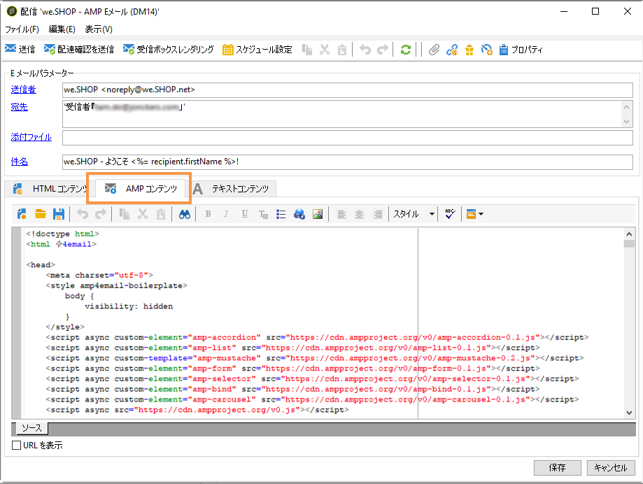
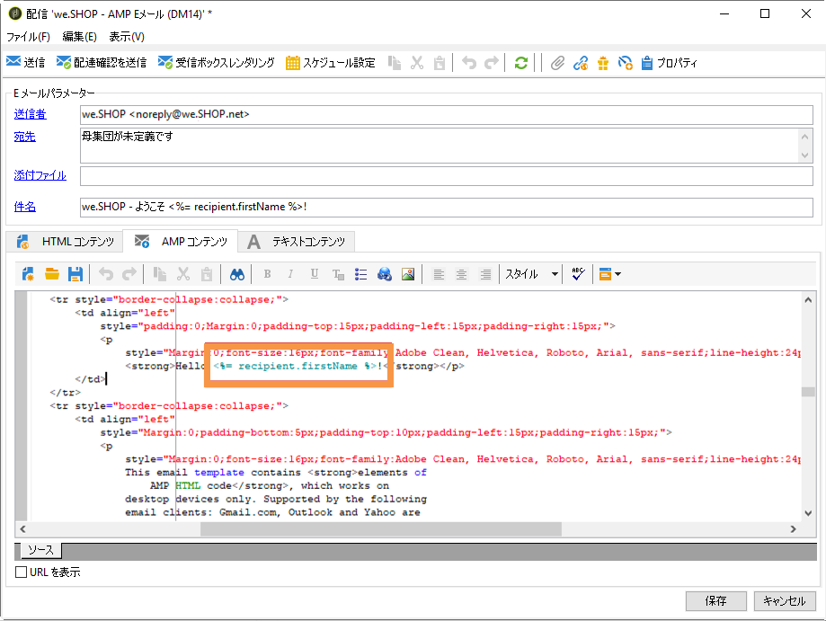
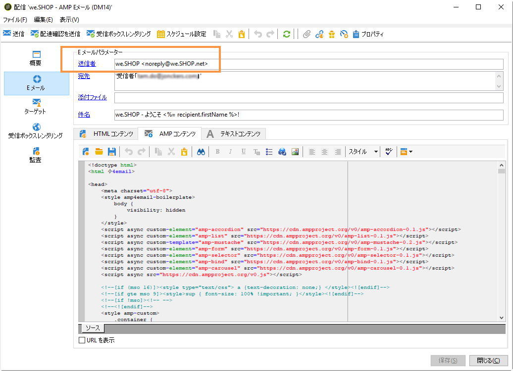

# インタラクティブコンテンツの定義{#defining-interactive-content}

Adobe Campaignでは、特定の条件下で動的な電子メールの送信を可能にする、新しい  Email用インタラクティブAMP形式を試すことができます。

>[!IMPORTANT]
>
>* この機能は、Adobe Campaignのベータ版機能です。
>* 電子メール用AMPは、開発者が動的でインタラクティブな電子メールを作成できる新しいオープンソースフォーマットです。 現在、いくつかの電子メールプロバイダーでサポートされています。Gmail、Outlook、Mail.ru。

現在、次の操作のみ可能です。
* 適切に設定された特定のアドレスにAMP電子メールを配信するテスト。
* 対応するプロバイダーに登録した後、AMP電子メールをGmail、OutlookまたはMail.ruアドレスに配信します。

AMP電子メールのテストと送信について詳しくは、AMP電子メールのターゲ [ット設定を参照してください](#targeting-amp-email)。

この機能は、Adobe Campaignの専用パッケージを通じて使用できます。 このパッケージを使用するには、このパッケージをインストールする必要があります。 完了したら、パッケージを考慮するためにサーバーを再起動します。

ハイブリッドおよびホストアーキテクチャの場合、パッケージは、ミッドソーシングサーバーと実行インスタンスを含むす [べてのサーバーにインストール](../../installation/using/mid-sourcing-server.md) する必要 [があります](../../message-center/using/creating-a-shared-connection.md#execution-instance)。 アカウント担当者にお問い合わせください。

このビデオ [では](https://docs.adobe.com/content/help/en/campaign-learn/campaign-classic-tutorials/sending-messages/email-channel/defining-interactive-email-content-with-amp.html) 、Adobe CampaignでAMPをアクティブ化する方法と使用方法を確認します。

## 電子メール用AMPについて {#about-amp-for-email}

Eメール **用AMPは** 、新しい形式で、メッセージ内にAMPコンポーネントを含め、リッチでアクション可能なコンテンツを使用して電子メールのエクスペリエンスを強化できます。 電子メール内で直接利用できる最新のアプリ機能を使用すると、受信者はメッセージ自体のコンテンツを動的に操作できます。

次に例を示します。
* AMPで書き込まれた電子メールには、画像カルーセルなどのインタラクティブな要素を含めることができます。
* メッセージ内のコンテンツは最新の状態に保たれます。
* 受信者は、受信トレイを離れることなく、フォームに返信するなどの操作を実行できます。

電子メール用AMPは、既存の電子メールと互換性があります。 メッセージのAMPバージョンは、HTMLやプレーンテキストに加えて、新しいMIME部分として電子メールに埋め込まれ、すべての電子メールクライアント間での互換性を確保します。

電子メール用AMPの形式、仕様および要件について詳しくは、 [AMP開発者ドキュメントを参照してください](https://amp.dev/documentation/guides-and-tutorials/learn/email-spec/amp-email-format/?format=email)。

## Adobe Campaignで電子メールにAMPを使用するための主要な手順 {#key-steps-to-use-amp}

Adobe CampaignでAMP電子メールを正常にテストして送信するには、次の手順に従います。
1. パッケージをインスト **[!UICONTROL AMP support (Beta)]** ールします。 詳しくは、Campaign標 [準パッケージのインストールを参照してくださ](../../installation/using/installing-campaign-standard-packages.md)い。
1. 電子メールを作成し、Adobe Campaign内でAMPコンテンツを作成します。 詳しくは、 [Adobe CampaignでAMP電子メールコンテンツを作成するを参照してください](#build-amp-email-content)。
1. AMP形式をサポートする電子メールプロバイダーからのすべての配信要件に従っていることを確認します。 電子メー [ル配信の要件については、AMPを参照してください](#amp-for-email-delivery-requirements)。

   >[!NOTE]
   >
   >電子メール用AMPは、テスト用にベータ版機能として使用できます。 現在、この形式のテストをサポートしている電子メールプロバイダーは少数です。

1. ターゲットを定義する場合は、AMP形式を表示できる受信者を選択していることを確認してください。 詳しくは、AMP [電子メールのターゲット設定を参照してくださ](#targeting-amp-email)い。

   >[!NOTE]
   >
   >現在、AMPベータプログラムに参加する電子メールプロバイダーに対して、適切に設定された、または登録後に、特定の電子メールアドレスに対するAMP電子メールの配信をテストすることができます。

1. 普段通りにメールを送ってください。 AMP電子メ [ールの送信を参照してください](#sending-amp-email)。

## Adobe CampaignでのAMP電子メールコンテンツの作成 {#build-amp-email-content}

AMP形式を使用して電子メールを作成するには、次の手順に従います。

>[!IMPORTANT]
>
>電子メールの要件と仕様については、 [AMP開発者ドキュメントで詳しく説明されているAMPに従ってください](https://amp.dev/documentation/guides-and-tutorials/learn/email_fundamentals/?format=email)。 また、電子メールのベストプラクティ [スについてAMPを参照することもできます](https://amp.dev/documentation/guides-and-tutorials/develop/amp_email_best_practices/?format=email)。

1. 電子メール配信を作成する際に、任意のテンプレートを選択します。

   >[!NOTE]
   >
   >特定のAMPテンプレートには、使用できる主要な容量の例が含まれています。製品リスト、カルーセル、ダブルオプトイン、調査、および高度なサーバーリクエストを作成できます。

1. タブをクリック **[!UICONTROL AMP content]** します。

   

1. 必要に応じてAMPコンテンツを編集します。

   >[!NOTE]
   >
   >最初のAMP電子メールの作成について詳しくは、 [AMP開発者ドキュメントを参照してください](https://amp.dev/documentation/guides-and-tutorials/start/create_email/?format=email)。

   例えば、AMPテンプレートの製品リストコンポーネントを使用し、サードパーティ製システムの製品リストを維持したり、Adobe Campaign内部で製品リストを維持したりできます。 価格などの要素を調整すると、受信者がメールボックスから再び電子メールを開いたときに、その要素が自動的に反映されます。

1. 必要に応じてAMPコンテンツをパーソナライズします。Adobe CampaignのHTML形式で行う場合と同様に、パーソナライゼーションフィールドとパーソナライゼーションブロックを使用します。

   

1. 編集が完了したら、AMPコンテンツ全体を選択し、 [AMP webベースのバリデーターまたは類似のWebサイトにコピー](https://validator.ampproject.org) &amp;ペーストします。

   >[!NOTE]
   >
   >画面の上部にあるドロップダウンリストから「 **AMP4 EMAIL** 」を選択していることを確認します。

   

   エラーはインラインでフラグ付けされます。

   >[!NOTE]
   >
   >Adobe Campaign AMPエディターは、コンテンツの検証用に設計されていません。 AMP webベースのバリデーターなどの外部Webサ [イトを使用して](https://validator.ampproject.org) 、コンテンツが正しいかどうかを確認します。

1. AMPコンテンツが検証に合格するまで、必要に応じて修正を加えます。

   

1. 検証済みのコンテンツを [AMPプレイグラウンドまたは類似のWebサイトに](https://playground.amp.dev) 、コピー&amp;ペーストして、コンテンツをプレビューします。

   >[!NOTE]
   >
   >画面の上部にあるドロップダウンリストから **** 、「電子メール用のAMP」を選択していることを確認します。

   

   >[!NOTE]
   >
   >AMPコンテンツをAdobe Campaignで直接プレビューすることはできません。 [AMPプレイグラウンドなどの外部Webサイトを使用します](https://playground.amp.dev)。

1. Adobe Campaignに戻り、検証済みのコンテンツをコピーしてタブに貼り付 **[!UICONTROL AMP content]** けます。

1. またはタブに切り **[!UICONTROL HTML content]** 替え **[!UICONTROL Text content]** て、これら2つの形式の少なくとも1つに対してコンテンツを定義します。

   >[!IMPORTANT]
   >
   >電子メールにAMPコンテンツに加えてHTMLまたはプレーンテキストバージョンが含まれていない場合、その電子メールは送信できません。

## 電子メール配信要件用のAMP {#amp-for-email-delivery-requirements}

Adobe CampaignでAMPコンテンツを作成する場合、動的な電子メールが配信されるための条件（受信者の電子メールプロバイダーに固有）を満たす必要があります。

現在、3つの電子メールプロバイダーがこの形式のテストをサポートしています。Gmail、Outlook、Mail.ru。

GmailアカウントでAMP形式で配信をテストするために必要な手順と仕様は、対応する [Gmail](https://developers.google.com/gmail/ampemail?)、 [Outlook、 ](https://docs.microsoft.com/en-gb/outlook/amphtml/) Mail.ruの開発者ドキュメントに詳しく説明されています  。

特に、以下の要件を満たす必要があります。
* [Gmail](https://developers.google.com/gmail/ampemail/security-requirements)、 [Outlook](https://docs.microsoft.com/en-gb/outlook/amphtml/security-requirements) 、 [Mail.ruに固有のAMPセキュリティ要件に従います](https://postmaster.mail.ru/amp/?lang=en#howto)。
* AMP MIMEパートには、有効なAMPドキュメントが含まれ [ている必要がありま](https://amp.dev/documentation/guides-and-tutorials/learn/validation-workflow/validate_emails/?format=email)す。
* AMP MIMEパートは100 KBより小さい必要があります。

また、Gmailのヒントと既知の制限 [事項や](https://developers.google.com/gmail/ampemail/tips) 、Outlookの [AMPベストプラクティスを確認できます](https://docs.microsoft.com/en-gb/outlook/amphtml/best-practices)。

## AMP電子メールのターゲット設定 {#targeting-amp-email}

Eメール用AMPは、ベータ版機能として使用できます。現在、AMP電子メールの送信は、次の2つの手順でテストできます。

1. Adobe Campaignでは、AMPを利用した動的な電子メールを適切に設定された選択した電子メールアドレスに配信し、その内容と動作を検証できます。 選択したア [ドレスに対するAMP電子メール配信のテストを参照してくださ](#testing-amp-delivery-for-selected-addresses)い。
1. テストが完了すると、送信者ドメインをホワイトリストに登録するために、関連する電子メールプロバイダーに登録することで、電子メールベータプログラム用のAMPの一部として配信またはキャンペーンを送信できます。 詳しくは、電 [子メールプロバイダーに登録してAMP電子メールを配信するを参照してくださ](#delivering-amp-emails-by-registering)い。

### 選択したアドレスに対するAMP電子メール配信のテスト {#testing-amp-delivery-for-selected-addresses}

Adobe Campaignから選択した電子メールアドレスへの動的なメッセージの送信をテストできます。

>[!NOTE]
>
>現在、AMP形式のテストは、Gmail、Outlook、およびMail.ruでのみサポートされています。

GmailおよびOutlookの場合、まず、対象とするGmailおよびOutlookアカウント用にAdobe Campaignから配信するために使用する送信者のアドレスをホワイトリストに登録する必要があります。

手順は次のとおりです。
1. 動的な電子メールを有効にするオプションが、関連する電子メールプロバイダーに対してオンになっていることを確認します。
1. 配信のフィールドに表示された送信者のアドレスをコピーし、 **[!UICONTROL From]** 電子メールプロバイダーのアカウント設定の適切なセクションに貼り付けます。

詳しくは、 [Gmail](https://developers.google.com/gmail/ampemail/testing-dynamic-email) and  Outlook開発者向けドキュメントを参照してください。

Mail.ruアドレスへのAMP電子メールの送信をテストするには、 [Mail.ru開発者ドキュメント](https://postmaster.mail.ru/amp/?lang=en#howto) (**If you are a user** section)の手順に従います。

### 電子メールプロバイダーに登録してAMP電子メールを配信する {#delivering-amp-emails-by-registering}

動的な電子メールの配信は、送信者ドメインをホワイトリストに登録するために、AMPベータプログラムに参加する電子メールプロバイダーに登録してテストできます。

>[!NOTE]
>
>現在、AMP形式はGmail、Outlook、およびMail.ruでのみサポートされています。

いくつかのアドレスでテストが完了すると、AMP電子メールを任意のGmailまたはOutlookアドレスに送信できます。 これを行うには、GoogleまたはMicrosoftに丁重に登録し、彼らの回答を待つ必要があります。 Gmailおよび [Outlook開発者向けドキュメントに記載されている手順に従います](https://developers.google.com/gmail/ampemail/register) 。 登録が完了すると、許可された送信者になります。

Mail.ruアドレスにAMP電子メールを送信するには、 [Mail.ru開発者ドキュメント](https://postmaster.mail.ru/amp/?lang=en#howto) (**Email senderの場合** )に記載されている要件と手順に従います。

## AMP電子メールの送信 {#sending-amp-email}

AMPコンテンツとフォールバックの準備が整い、互換性のあるターゲットを定義したら、通常どおりに電子メールを送信できます。

現在、特定の条件下でAMP形式をサポートしているのは、Gmail、Outlook、およびMail.ruのみです。 他の電子メールプロバイダーからのアドレスをターゲットにすることはできますが、電子メールのHTMLまたはプレーンテキストバージョンを受け取ります。

>[!IMPORTANT]
>
>電子メールにAMPコンテンツに加えてHTMLまたはプレーンテキストバージョンが含まれていない場合、その電子メールは送信できません。

一致する受信者は、自分のメールボックスに表示される電子メールのAMPバージョンを持ちます。

例えば、電子メールに製品リストを含めた場合、サードパーティ製システムで価格を編集すると、受信者がメールボックスで電子メールを再び開くたびに、価格が自動的に調整されます。

>[!NOTE]
>
>特定のドメインがAMP電子メールを受信するのを防ぐためのメール処理ルールを作成できます。 詳しくは、電 [子メール形式の管理を参照してくださ](../../installation/using/email-deliverability.md#managing-email-formats)い。
>
>デフォルトでは、こ **[!UICONTROL AMP inclusion]** のオプションはに設定されていま **[!UICONTROL No]**&#x200B;す。
