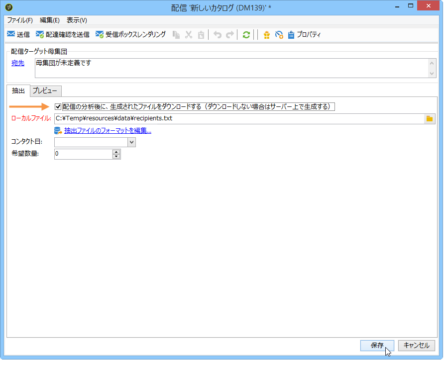
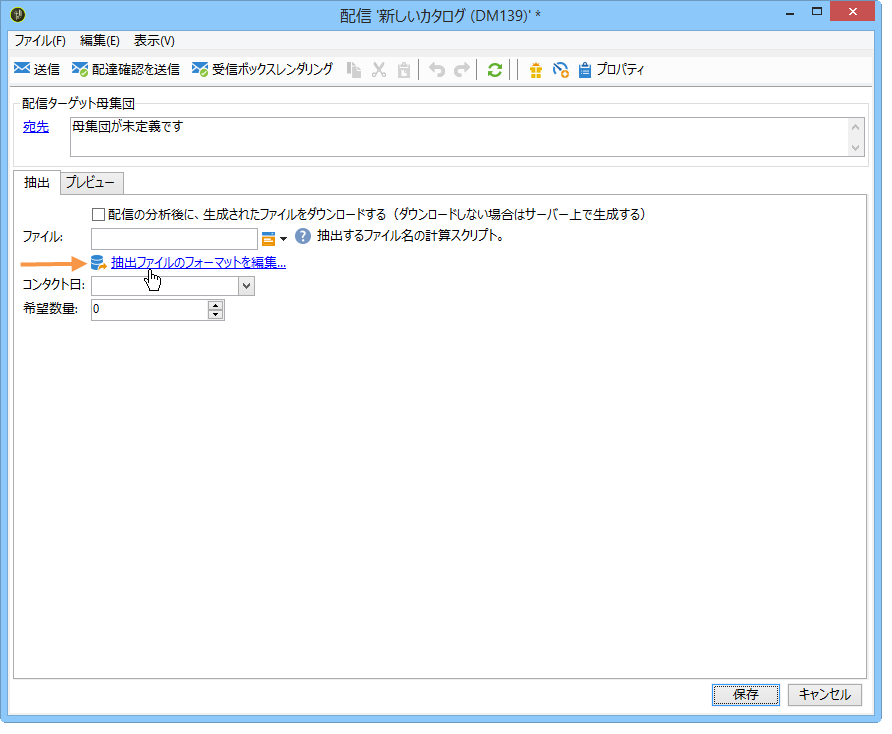
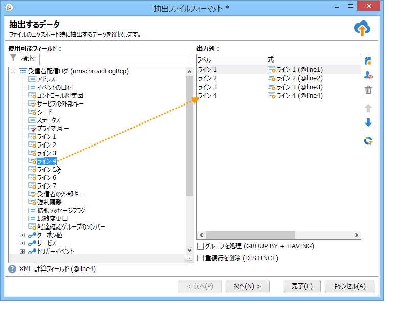

# ダイレクトメールコンテンツの定義{#defining-the-direct-mail-content}

## 抽出ファイル {#extraction-file}

The name of the file which contains the extracted data is defined in the **[!UICONTROL File]** field. フィールドの右にあるボタンを使用すると、ファイルネームを生成するためのパーソナライゼーションフィールドを指定できます。

抽出ファイルは、デフォルトではサーバー上に作成され、格納されますが、コンピューター上に保存することもできます。これを行うには、を確認しま **[!UICONTROL Download the generated file after the analysis of the delivery]**&#x200B;す。 この場合、ローカルストレージディレクトリのアクセスパスおよびファイル名を指定する必要があります。

ダイレクトメール配信の場合、抽出の内容はリンクで定義され **[!UICONTROL Edit the extraction file format...]** ます。

このリンクをクリックすると、抽出ウィザードにアクセスして、出力ファイルに抽出する情報（列）を定義できます。

抽出ファイルには、パーソナライズした URL を挿入することができます。詳しくは、[Web 機能](../../web/using/publishing-a-web-form.md)を参照してください。

>[!NOTE]
>
>このウィザードには、[はじめに](../../platform/using/exporting-data.md#export-wizard)の節で説明されているエクスポートウィザードの手順が含まれています。
