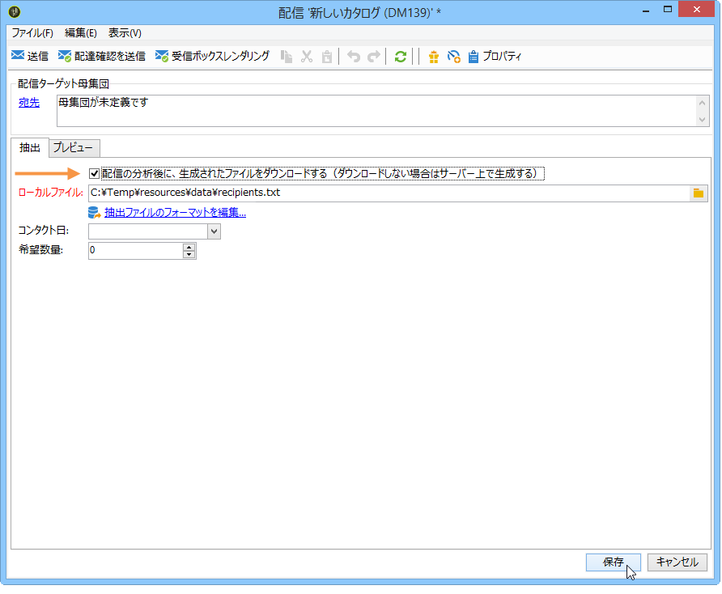
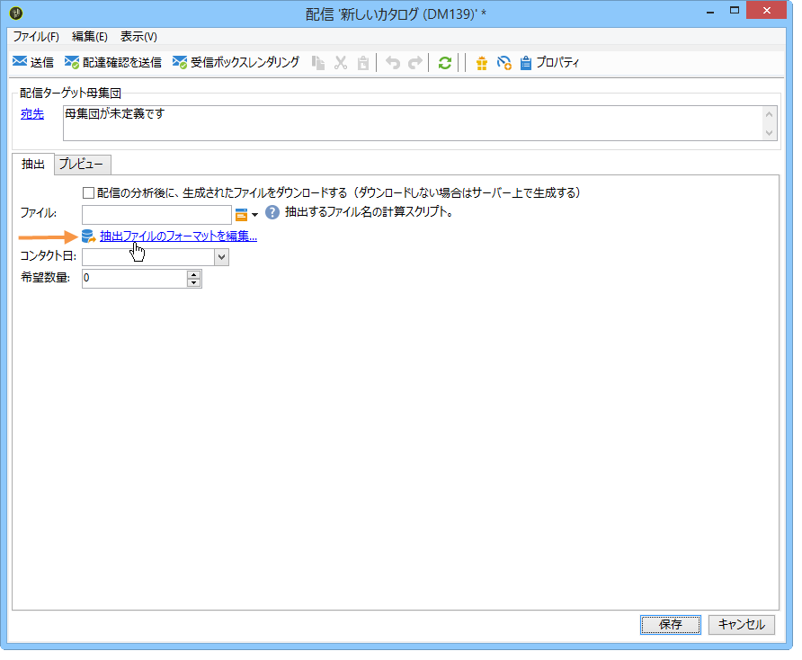
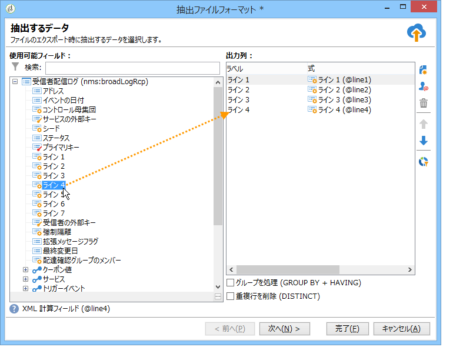

# ダイレクトメールコンテンツの定義{#defining-the-direct-mail-content}

## 抽出ファイル {#extraction-file}

抽出したデータを格納するファイルの名前は、「**[!UICONTROL ファイル]**」フィールドで定義します。 フィールドの右にあるボタンを使用すると、ファイルネームを生成するためのパーソナライゼーションフィールドを指定できます。

抽出ファイルは、デフォルトではサーバー上に作成され、格納されますが、 コンピューター上に保存することもできます。 そのためには、「**[!UICONTROL 配信の分析後に、生成されたファイルをダウンロードする]**」をオンにします。 この場合、ローカルストレージディレクトリのアクセスパスおよびファイル名を指定する必要があります。

ダイレクトメール配信の場合、抽出するデータのコンテンツは「**[!UICONTROL 抽出ファイルのフォーマットを編集]**」リンクを使用して定義します。

このリンクをクリックすると、抽出アシスタントにアクセスして、出力ファイルにエクスポートする情報（列）を定義できます。

抽出ファイルには、パーソナライズした URL を挿入することができます。 詳しくは、[この節](../../web/using/publishing-a-web-form.md)を参照してください。

>[!NOTE]
>
>このアシスタントには、[はじめに](../../platform/using/executing-export-jobs.md)の節で説明されているエクスポートアシスタントの手順が含まれています。
