# E メールコンテンツの定義{#defining-the-email-content}

## 送信者 {#sender}

To define the name and address of the sender which will appear in the header of messages sent, click the **[!UICONTROL From]** link.

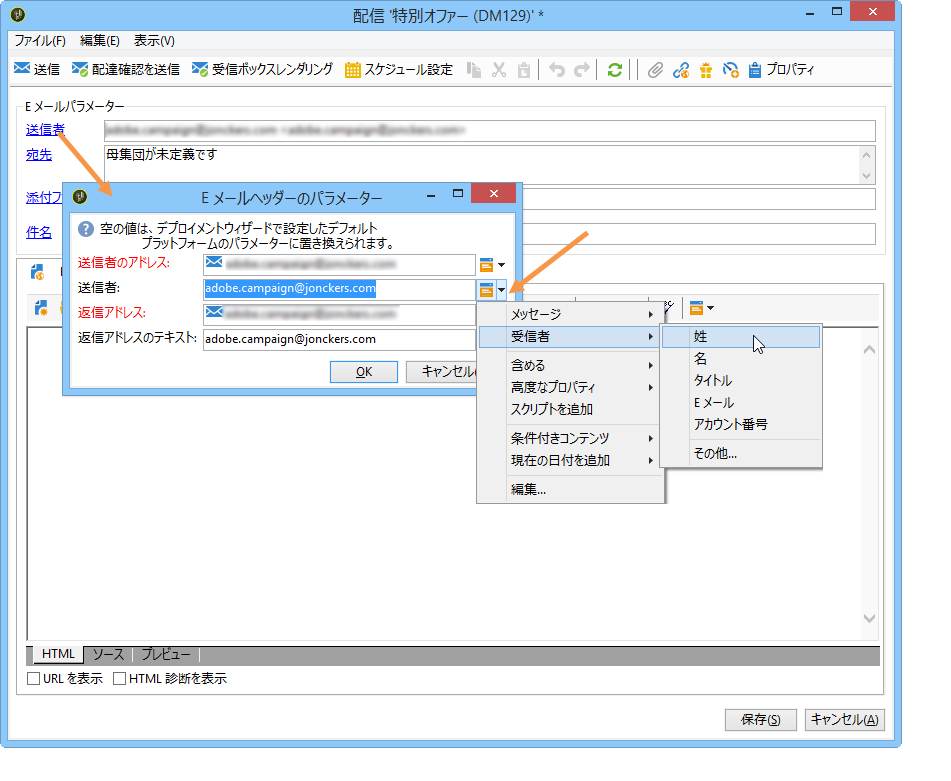

このウィンドウでは、E メールのメッセージヘッダーを作成するために必要なすべての情報を入力できます。この情報はパーソナライズ可能です。パーソナライズするには、入力フィールドの右にあるボタンを使用してパーソナライゼーションフィールドを挿入します。

To find out how to insert and use personalization fields, refer to [About personalization](../../delivery/using/about-personalization.md) section.

>[!NOTE]
>
>* 送信者のアドレスは、デフォルトで返信先として使用されます。
>* ヘッダーパラメーターの値は省略できません。デフォルトでは、ヘッダーパラメーターにはデプロイウィザードの設定時に入力された値が格納されています。詳しくは、[インストールガイド](../../installation/using/deploying-an-instance.md)を参照してください。
>* 送信者のアドレスは、E メールを送信するための必須情報です（RFC 標準規格）。
>* 入力した E メールアドレスの形式はチェックされます。

>[!CAUTION]
>
>インターネットアクセスプロバイダー（ISP）の迷惑メールチェック機能による誤認識を防ぐために、配信用と返信用のそれぞれのアドレスに対応した E メールアカウントを作成することをお勧めします。詳しくは、自社のシステム管理者にご相談ください。

## メッセージ件名 {#message-subject}

メッセージの件名は、該当するフィールドで設定します。You can enter it directly in the field or click the **[!UICONTROL Subject]** link to enter a script. パーソナライゼーションのリンクを使用して、件名の中にデータベースフィールドを挿入できます。

>[!CAUTION]
>
>メッセージの件名は必須です。

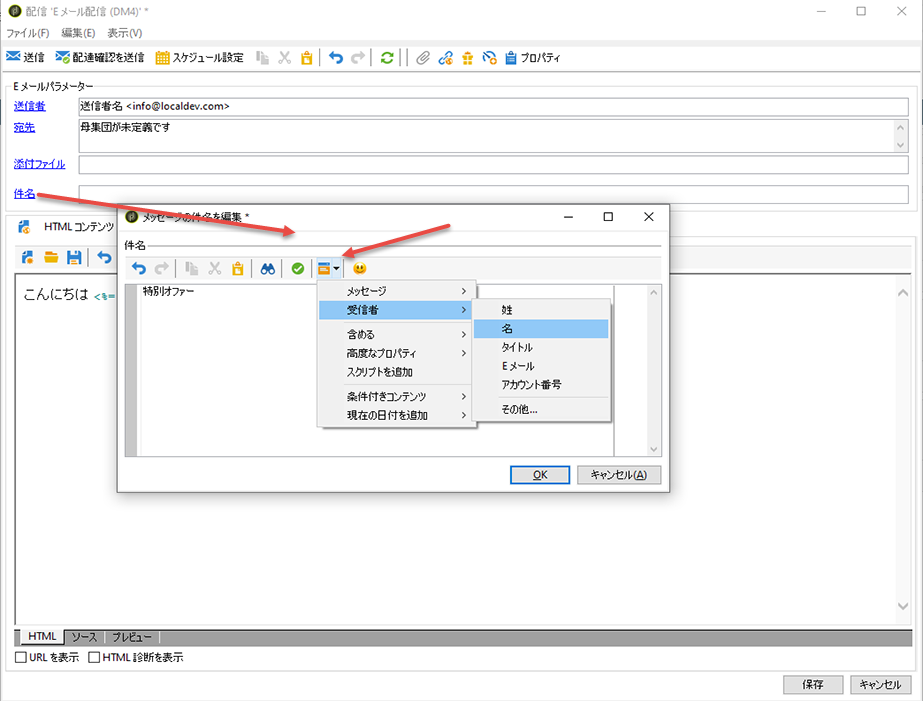

フィールドの内容は、メッセージが送信される際に、受信者のプロファイルに含まれる値で置き換えられます。

例えば、上のメッセージの場合、受信者のプロファイルから取得したデータに基づいて、受信者ごとに件名がパーソナライズされます。

>[!NOTE]
>
>The use of personalization fields is presented in [About personalization](../../delivery/using/about-personalization.md).

## メッセージの内容 {#message-content}

>[!CAUTION]
>
>プライバシー保護のために、すべての外部リソースに対して HTTPS を使用することをお勧めします。

メッセージの内容は、配信設定ウィンドウの下部のセクションで定義します。

デフォルトのメッセージ送信形式としては、受信者の環境設定に応じて HTML またはテキストのいずれかが使用されます。様々なメールシステム上でメッセージが正しく表示されるように、必ず両方の形式でコンテンツを作成することをお勧めします。詳しくは、「メッセージ形式の選択」を [参照してください](#selecting-message-formats)。

* To import an HTML content, use the **[!UICONTROL Open]** button. You can also paste the source code directly into the **[!UICONTROL Source]** sub-tab.

   [デジタルコンテンツエディター](../../web/using/about-campaign-html-editor.md)（DCE）を使用している場合は、[コンテンツテンプレートの選択](../../web/using/use-case--creating-an-email-delivery.md#step-3---selecting-a-content)を参照してください。

   >[!CAUTION]
   >
   >HTML コンテンツは、事前に作成してから Adobe Campaign にインポートする必要があります。HTML エディターはコンテンツ作成用に設計されたものではありません。

   The **[!UICONTROL Preview]** sub-tab lets you view the rendering of each content for a recipient. コンテンツのパーソナライゼーションフィールドや条件付き要素は、選択したプロファイル内の対応する情報で置き換えられます。

   ツールバーのボタンでは、標準的なアクションや HTML ページ用の書式設定パラメーターを使用できます。

   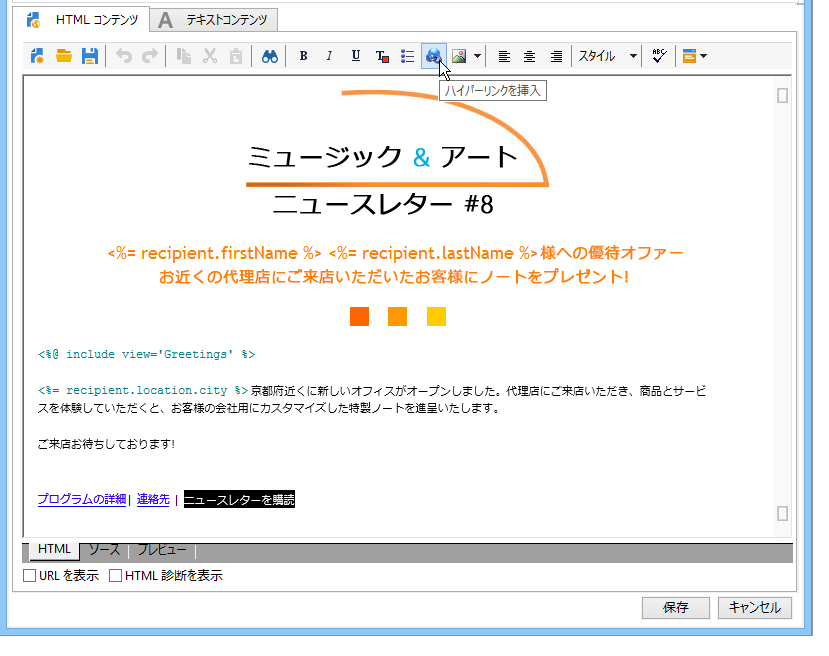

   画像をメッセージに挿入する場合は、ローカルファイルを読み込んで挿入するか、Adobe Campaign の画像ライブラリから挿入できます。To do this, click the **[!UICONTROL Image]** icon and select the appropriate option.

   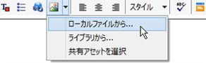

   ライブラリ画像には、フォルダツリーのフォ **[!UICONTROL Resources>Online>Public resources]** ルダからアクセスできます。 詳しくは、画像の追加 [も参照してください](#adding-images)。

   ツールバーの最後のボタンは、パーソナライゼーションフィールドを挿入するボタンです。

   >[!NOTE]
   >
   >The use of personalization fields is presented in [About personalization](../../delivery/using/about-personalization.md).

   ページの下部にあるタブでは、作成されるページの HTML コードや、メッセージにパーソナライゼーションを含めたレンダリング結果を表示して確認できます。To launch this display, click **[!UICONTROL Preview]** and select a recipient using the **[!UICONTROL Test personalization]** button in the toolbar. 定義済みターゲットの中から受信者を選択することも、別の受信者を指定することもできます。

   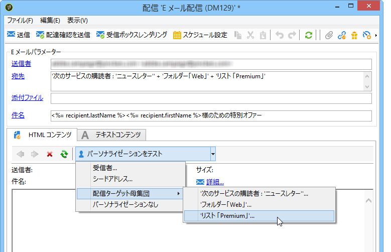

   HTML メッセージを検証できます。また、E メールヘッダーの内容も確認できます。

   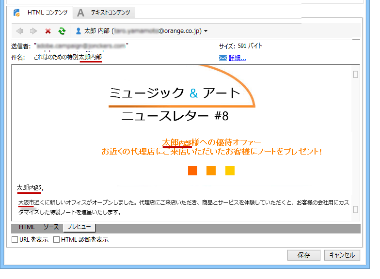

* To import a text content, use the **[!UICONTROL Open]** button, or the **[!UICONTROL Text Content]** tab to enter the content of the message when displayed in text format. ツールバーのボタンを使用して、コンテンツに対するアクションをします。最後のボタンは、パーソナライゼーションフィールドを挿入するボタンです。

   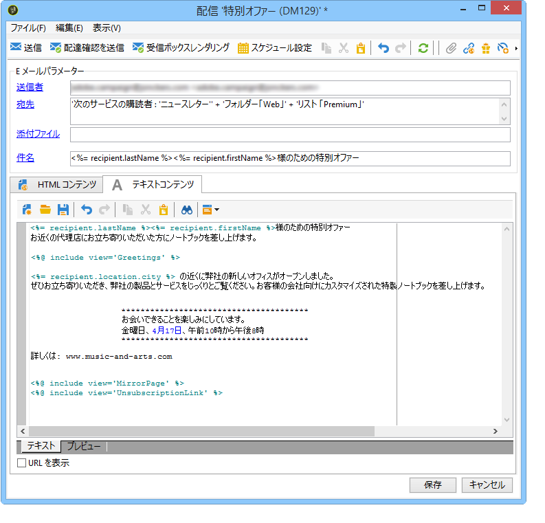

   As for the HTML format click the **[!UICONTROL Preview]** tab at the bottom of the page to view the rendering of the message with its personalization.

   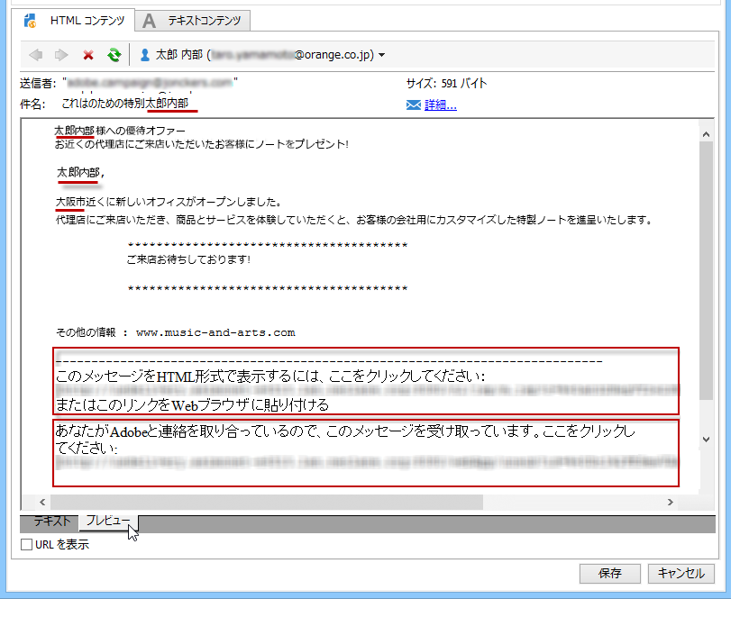

## メッセージ形式の選択 {#selecting-message-formats}

送信される E メールメッセージの形式は変更できます。To do this, edit the delivery properties and click the **[!UICONTROL Delivery]** tab.

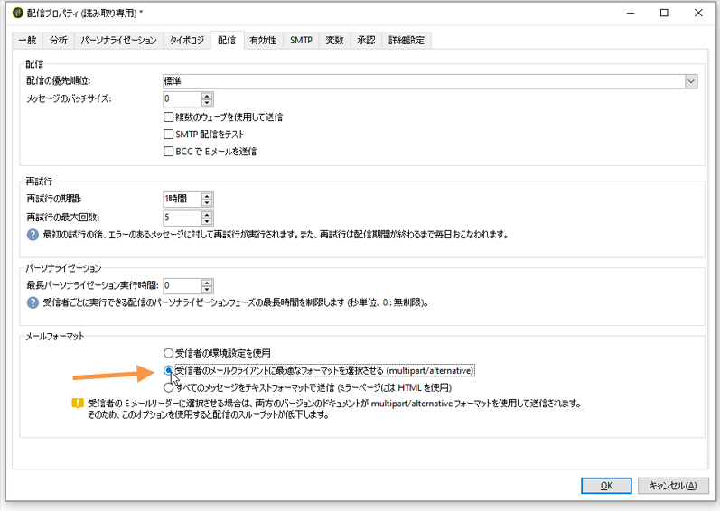

ウィンドウ下部のセクションで、E メールの形式を選択します。

* **[!UICONTROL Use recipient preferences]** （デフォルトモード）

   The message format is defined according to the data stored in the recipient profile and stored by default in the **[!UICONTROL email format]** field (@emailFormat). 受信者が特定の形式でメッセージを受信することを希望していれば、メッセージはその形式で送信されます。このフィールドに何も入力されていない場合は、マルチパート／オルタナティブメッセージが送信されます（以下を参照）。

* **[!UICONTROL Let recipient mail client choose the most appropriate format]**

   テキスト形式と HTML 形式の両方を含んだメッセージが送信されます。受信時に表示されるメッセージ形式は、受信者のメールソフトウェアの設定に応じて切り替わります（マルチパート／オルタナティブ）。

   >[!CAUTION]
   >
   >このオプションを指定すると、両方のバージョンのドキュメントがメッセージに含められます。したがって、メッセージサイズが大きくなり、配信の順位に影響があります。

* **[!UICONTROL Send all messages in text format]**

   メッセージはテキスト形式で送信されます。HTML 形式は送信されませんが、受信者がメッセージをクリックした場合にのみ表示されるミラーページに使用されます。

## インタラクティブコンテンツの定義 {#amp-for-email-format}

Adobe Campaignでは、特定の条件下で動的な電子メールの送信を可能にする、新しい  Email用インタラクティブAMP形式を試すことができます。

For more on this, see [this section](../../delivery/using/defining-interactive-content.md).

## コンテンツ管理の使用 {#using-content-management}

配信のコンテンツは、配信ウィザード内から直接コンテンツ管理フォームを使用して定義できます。To do this, you must reference the publication template of the content management to be used, in the **[!UICONTROL Advanced]** tab of the delivery properties.

追加されたタブにコンテンツを入力すると、コンテンツ管理ルールに基づき、このコンテンツの組み込みと書式設定が自動的におこなわれます。

>[!NOTE]
>
>For further information about content management in Adobe Campaign, refer to [this section](../../delivery/using/about-content-management.md).

## 画像の追加 {#adding-images}

HTML 形式の E メール配信には、画像を含めることができます。From the delivery wizard, you can import an HTML page containing images or insert images directly using the HTML editor via the **[!UICONTROL Image]** icon.

画像に関して、次のことができます。

* ローカル環境にある画像またはサーバー上から取得した画像
* Adobe Campaign のパブリックリソースライブラリに格納されている画像

   Public resources are accessible via the **[!UICONTROL Resources > Online]** node of the Adobe Campaign hierarchy. パブリックリソースは、ライブラリ内でグループ化したり、E メールメッセージに含めることができるだけでなく、キャンペーン用、タスク用、コンテンツ管理用に使用することもできます。

* Adobe Experience Cloud と共有されているアセット。[この節](../../integrations/using/sharing-assets-with-adobe-experience-cloud.md)を参照してください。

>[!CAUTION]
>
>配信ウィザードを使用して E メールメッセージに画像を含めるには、Adobe Campaign インスタンスの設定でパブリックリソースの管理が有効になっている必要があります。この設定は、デプロイウィザードで実行できます。設定について詳しくは、[この節](../../installation/using/deploying-an-instance.md)を参照してください。

配信ウィザードでは、ローカル環境にある画像またはライブラリに保存されている画像をメッセージのコンテンツに追加できます。To do this, click the **[!UICONTROL Image]** button in the HTML content toolbar.

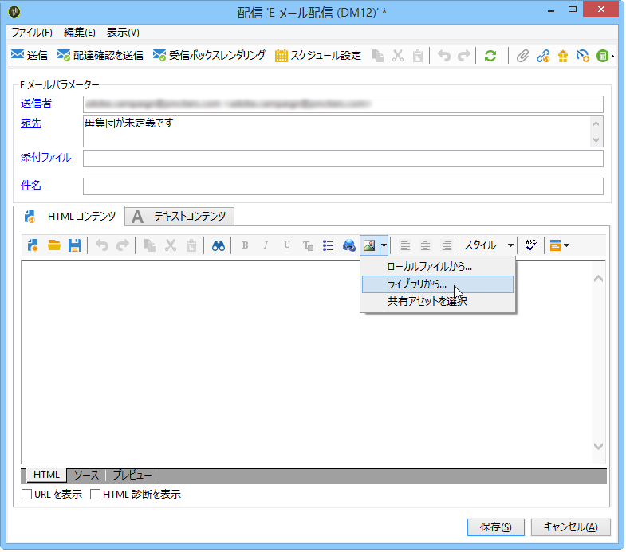

受け取ったメッセージ内の画像を受信者が表示できるようにするには、メッセージが、外部からアクセス可能なサーバー上に置かれている必要があります。

To manage images via the delivery wizard, you must click the **[!UICONTROL Tracking & Images]** icon in the toolbar.

タブで **[!UICONTROL Upload images]** を選択し **[!UICONTROL Images]** ます。 その画像を E メールメッセージに含めるかどうかを選択できます。

* 配信分析フェーズを待つことなく、手動で画像をアップロードできます。これを行うには、リンクをクリック **[!UICONTROL Upload images now]** します。
* トラッキングサーバー上の画像にアクセスするための、別のパスも指定できます。To do this, enter it in the **[!UICONTROL Image URL]** field. この値を指定すると、インストールウィザードのパラメーターで指定した値よりも優先されます。

配信ウィザードで、画像を含んだ HTML コンテンツを開くと、配信パラメーターに従ってすぐに画像をアップロードするかどうかを確認するメッセージが表示されます。

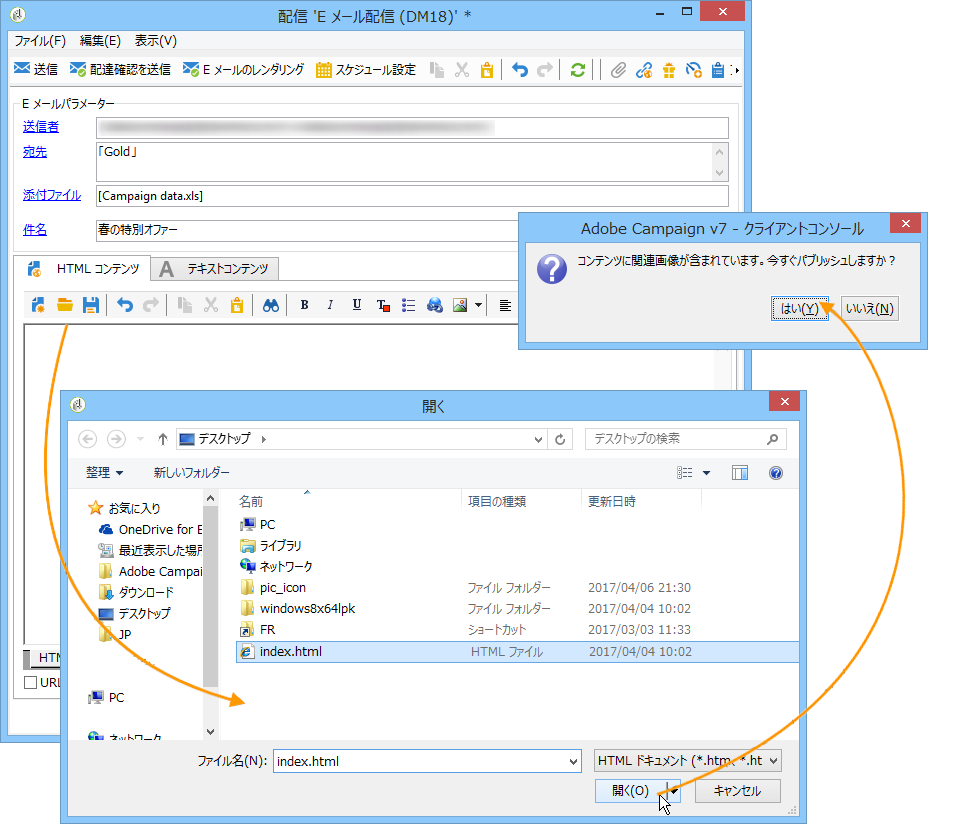

>[!CAUTION]
>
>画像へのアクセスパスは、手動でのアップロード時やメッセージの送信時に変更されます。

**例：画像付きのメッセージの送信{#example--sending-a-message-with-images}**

ここでは、4 個の画像を含んだ配信を例にとって説明します。

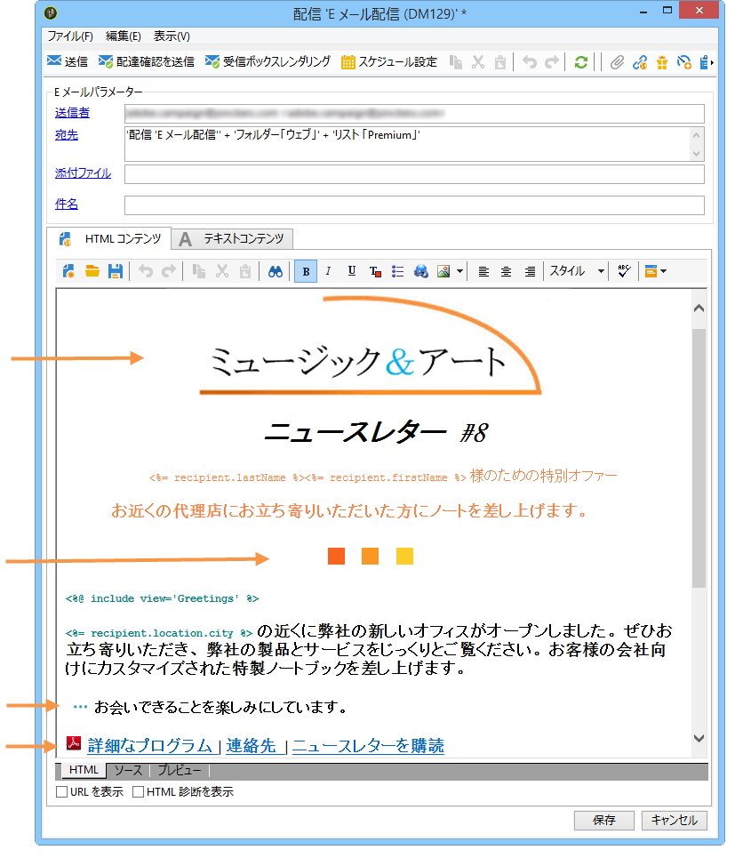

These images come from a local directory or Web site as you can verify from the **[!UICONTROL Source]** tab.

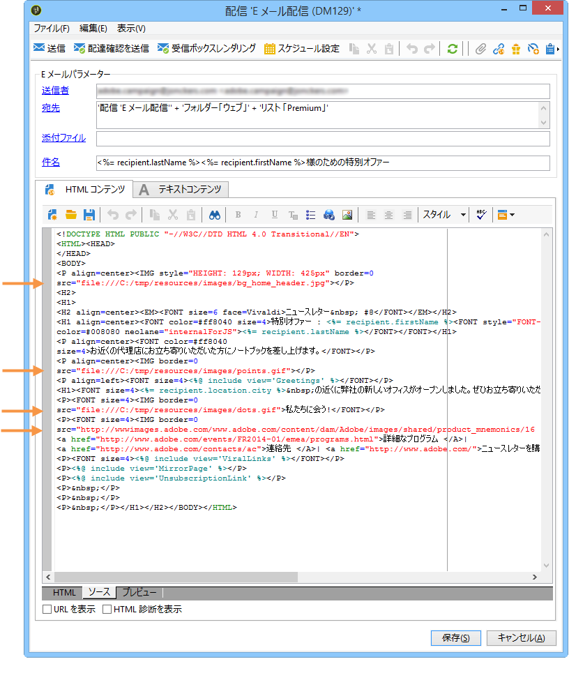

Click the **[!UICONTROL Tracking & Images]** icon and then the **[!UICONTROL Images]** tab to start detecting images in the message.

検出されたそれぞれの画像について、次のようにステータスが表示されます。

* If an image is stored locally or located on another server, even if this server is visible from the outside (on an internet site, for example), it will be detected as **[!UICONTROL Not yet online]**.
* The images are detected as **[!UICONTROL Already online]** if they were uploaded earlier while creating another delivery.
* In the deployment wizard, you can define URLs for which image detection is not enabled: uploading these images will be **[!UICONTROL Skipped]**.

>[!NOTE]
>
>画像の識別は、アクセスパスではなくコンテンツに基づいておこなわれます。This means that an image uploaded previously under a different name or in a different directory will be detected as **[!UICONTROL Already online]**.

事前にアップロードすることが必要なローカル画像の場合を除き、分析フェーズでは画像がサーバーへと自動的にアップロードされ、外部からアクセスできる状態になります。

画像のアップロード作業を早めにしておくと、他の Adobe Campaign オペレーターがそれらを参照でき、共同作業がスムーズになることがあります。これを行うには、をクリックし **[!UICONTROL Upload the images straightaway...]** て画像をサーバにアップロードします。

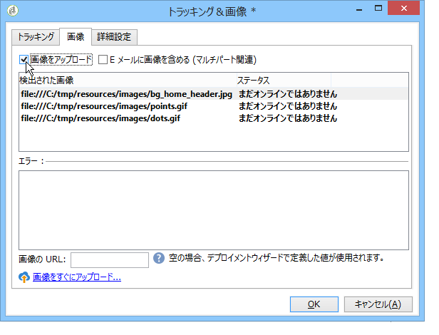

>[!NOTE]
>
>この後、E メールに含められる画像の URL（特にファイル名）は変更されます。

Once the images are online, you can view changes to their names and paths from the **[!UICONTROL Source]** tab of the message.

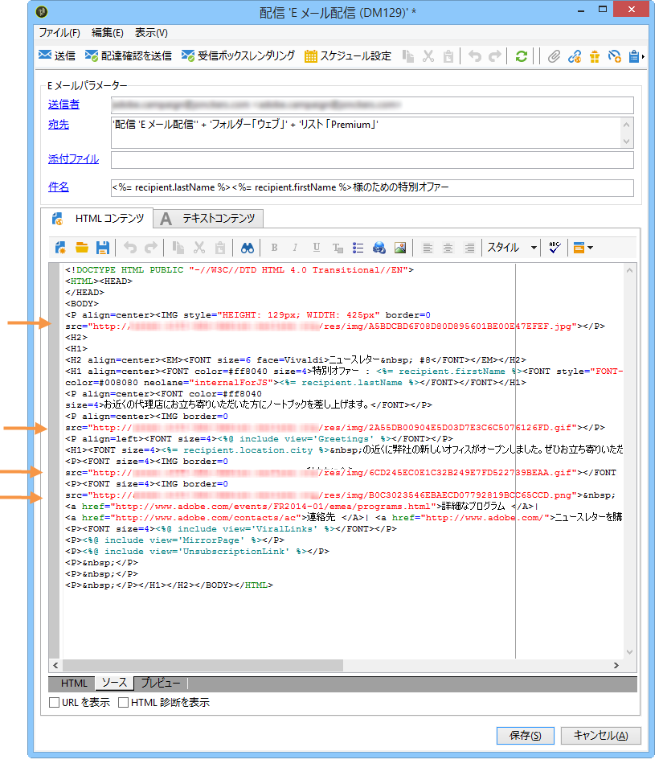

選択した場合は、 **[!UICONTROL Include the images in the email]**&#x200B;対応する列に含める画像を選択できます。

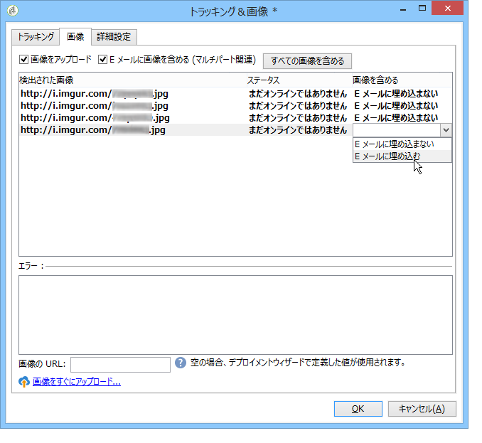

>[!NOTE]
>
>ローカル画像をメッセージに含める場合は、メッセージのソースコードに適用される変更を確認する必要があります。

## E メールへのバーコードの挿入{#inserting-a-barcode-in-an-email}

バーコード生成モジュールを使用して、2D バーコードなど、一般的基準に適合する、複数のタイプのバーコードを作成できます。

顧客側の基準を基に定義された値を使用して、バーコードをビットマップとして動的に生成できます。パーソナライズしたバーコードを E メールキャンペーンに含めることができます。受信者は、メッセージを印刷したり、（チェックアウト時などに）発行会社に提示してスキャンしたりできます。

バーコードを E メールに挿入するには、表示したいコンテンツ内にカーソルを置いて、パーソナライゼーションボタンをクリックします。選択 **[!UICONTROL Include > Barcode...]**.

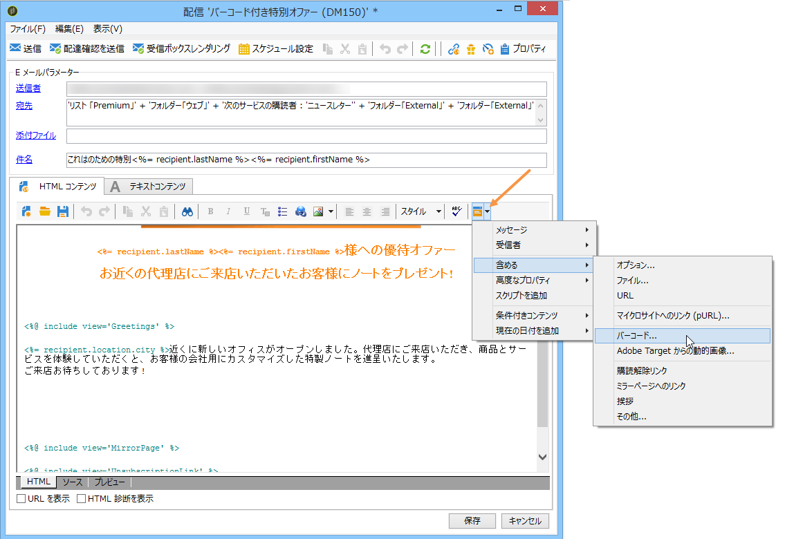

ニーズに合わせて次の要素を設定します。

1. バーコードのタイプを選択します。

   * 1D形式の場合、Adobe Campaignでは次のタイプを使用できます。Codabar、Code 128、GS1-128（旧EAN-128）、UPC-A、UPC-E、ISBN、EAN-8、Code39、Interleaved 2 of 5、POSTNET、Royal Mail(RM4SCC)。

      1D バーコードの例：

      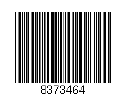

   * DataMatrix タイプと PDF417 タイプは 2D フォーマットを扱います。

      2D バーコードの例：

      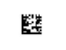

   * QR コードを挿入するには、このタイプを選択し、適用する誤り訂正レベルを入力します。このレベルで、データ量とコードの劣化の許容範囲を定義します。

      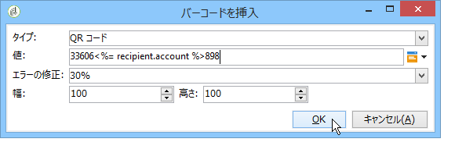

      QR コードの例：

      

1. E メールに挿入したいバーコードのサイズを入力します。縮尺を設定することによって、バーコードのサイズを 1 倍から 10 倍まで拡大または縮小できます。
1. The **[!UICONTROL Value]** field enables you to define the value of the barcode. 値は、特別オファーに対応させたり、ある基準の関数にすることができます。顧客にリンクされているデータベースフィールドの値にすることも可能です。

   次の例は、受信者のアカウント番号が追加された EAN-8 タイプのバーコードを示しています。To add this account number, click the personalization button to the right of the **[!UICONTROL Value]** field and select **[!UICONTROL Recipient > Account number]**.

   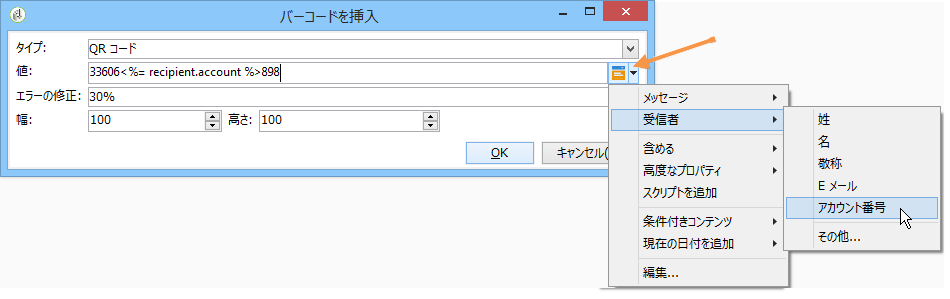

1. The **[!UICONTROL Height]** field lets you configure the height of the barcode without changing its width, by altering the amount of space between each bar.

   バーコードのタイプによる入力コントロールの制限はありません。バーコードの値が正しくない場合、バーコードは&#x200B;**プレビュー**&#x200B;モードで赤色の x 印で消された状態で表示されます。

   >[!NOTE]
   >
   >バーコードに割り当てる値は、バーコードのタイプによって異なります。例えば、EAN-8 タイプは 8 桁でなければなりません。
   >
   >The personalization button to the right of the **[!UICONTROL Value]** field lets you add data in addition to the value itself. バーコードの基準に則っていれば、これによりバーコードを充実させることができます。
   >
   >For example, if you are using a GS1-128 type barcode and want to enter the account number of a recipient in addition to the value, click the personalization button and select **[!UICONTROL Recipient > Account number]**. 選択した受信者のアカウント番号が正しく入力された場合、バーコードはこのアカウント番号を処理します。

これらの要素を設定したら、E メールを仕上げて送信できます。To avoid errors, always make sure your content is displayed correctly before performing a delivery by clicking the **[!UICONTROL Preview]** tab.

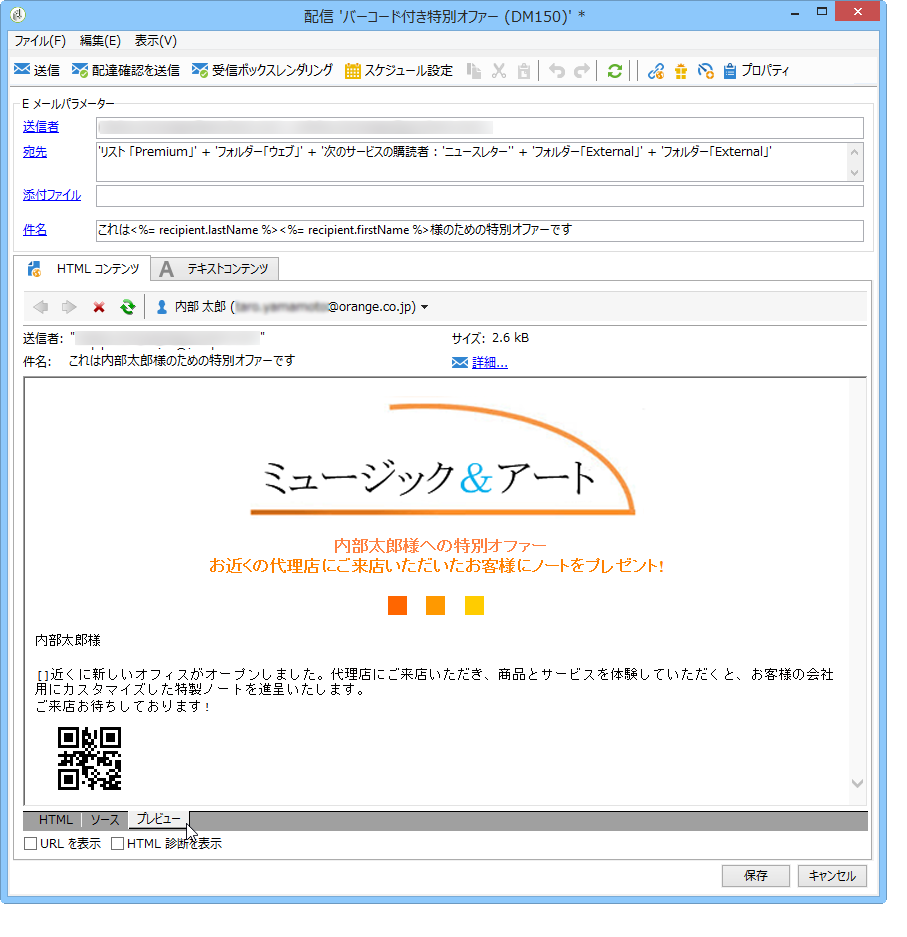

>[!NOTE]
>
>バーコードの値が正しくない場合、バーコードのビットマップは赤色の×印で消された状態で表示されます。

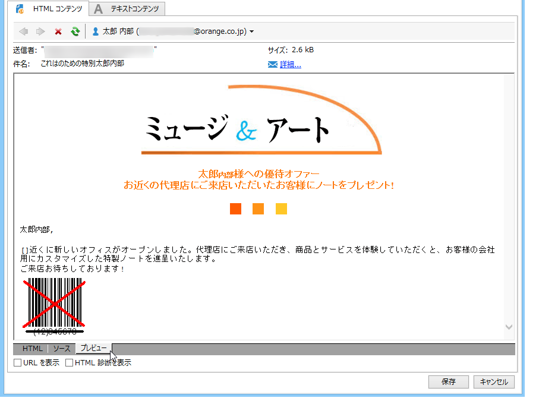

## 日本の携帯電話向け E メールの送信 {#sending-emails-on-japanese-mobiles}

### 日本の携帯電話向けの E メールフォーマット {#email-formats-for-japanese-mobiles}

Adobe Campaignは、モバイル版電子メール用に次の3種類の日本語形式を管理します。 **Deco-mail** (DoCoMo mobiles)、 **Decore Mail** (Softbank mobiles)、 **Decoration Mail** (KDDI AU mobiles)。 これらのフォーマットには、コーディング、構造、サイズに関する特定の制約事項があります。制限事項と推奨事項について詳しくは、[この節](#limitations-and-recommendations)を参照してください。

受信者が次のいずれかの形式でメッセージを正しく受け取れるように、または対応するプロファ **[!UICONTROL Deco-mail (DoCoMo)]**&#x200B;イル **[!UICONTROL Decore Mail (Softbank)]** を選択 **[!UICONTROL Decoration Mail (KDDI AU)]** することをお勧めします。

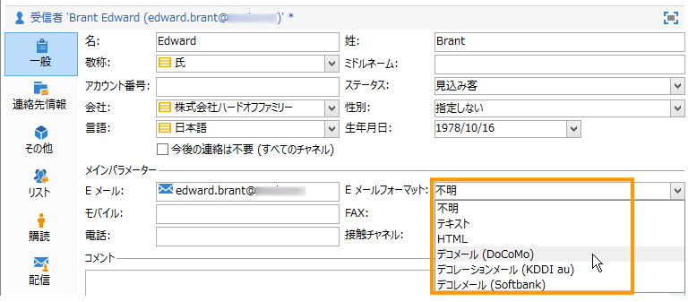

However, if you leave the **[!UICONTROL Email format]** option as **[!UICONTROL Unknown]**, **[!UICONTROL HTML]** or **[!UICONTROL Text]**, Adobe Campaign will automatically detect (when sending the email) the Japanese format to use so that the message is correctly displayed.

This automatic detection system is based on the list of predefined domains defined in the **[!UICONTROL Management of Email Formats]** mail rule set. E メールフォーマットの管理について詳しくは、[このページ](../../installation/using/email-deliverability.md#managing-email-formats)を参照してください。

### 制限事項と推奨事項 {#limitations-and-recommendations}

日本のプロバイダー（Softbank、DoCoMo、KDDI au）が取り扱う携帯電話で読まれる E メールの送信に関しては、いくつかの制約事項があります。

これらの事項を必ず満たすようにしてください。

* 画像は JPEG 形式または GIF 形式の画像のみにしてください。
* 厳密に 10,000 バイト未満のテキストセクションと HTML セクションから成る配信を作成します（KDDI au および DoCoMo 向け）。
* 画像の合計サイズ（エンコード前）が 100 KB 未満になるようにします。
* 1 件のメッセージにつき 20 件を超える画像を使用しないようにしてください。
* 縮小サイズの HTML フォーマットを使用します（各オペレーターで使用できるタグの数は制限されています）。

>[!NOTE]
>
>メッセージを作成する際には、各オペレーター固有の制限事項を考慮する必要があります。以下を参照してください。
>
>* DoCoMo については、[このページ](https://www.nttdocomo.co.jp/service/developer/make/content/deco_mail/index.html)を参照してください。
>* KDDI au については、[このページ](https://www.au.com/ezfactory/tec/spec/decorations/template.html)を参照してください。
>* Softbank については、[このページ](https://www.support.softbankmobile.co.jp/partner/home_tech3/index.cfm)を参照してください。

### E メールコンテンツのテスト {#testing-the-email-content}

#### メッセージのプレビュー {#previewing-the-message}

Adobe Campaign では、メッセージのフォーマットが日本の携帯電話への送信に適合しているかどうかを確認できます。

コンテンツを定義して E メールの件名を入力したら、メッセージを作成する際に表示と書式設定を確認できます。

コンテンツ編 **[!UICONTROL Preview]** 集ウィンドウのタブで、をクリックすると、次のこ **[!UICONTROL More... > Deco-mail diagnostic]** とができます。

* HTML コンテンツのタグが日本独自のフォーマットの制約を満たしていることのチェック
* メッセージに含まれる画像の数がフォーマットの制限を超えていないことのチェック（20 以下）
* メッセージの合計サイズのチェック（100 KB 未満）

   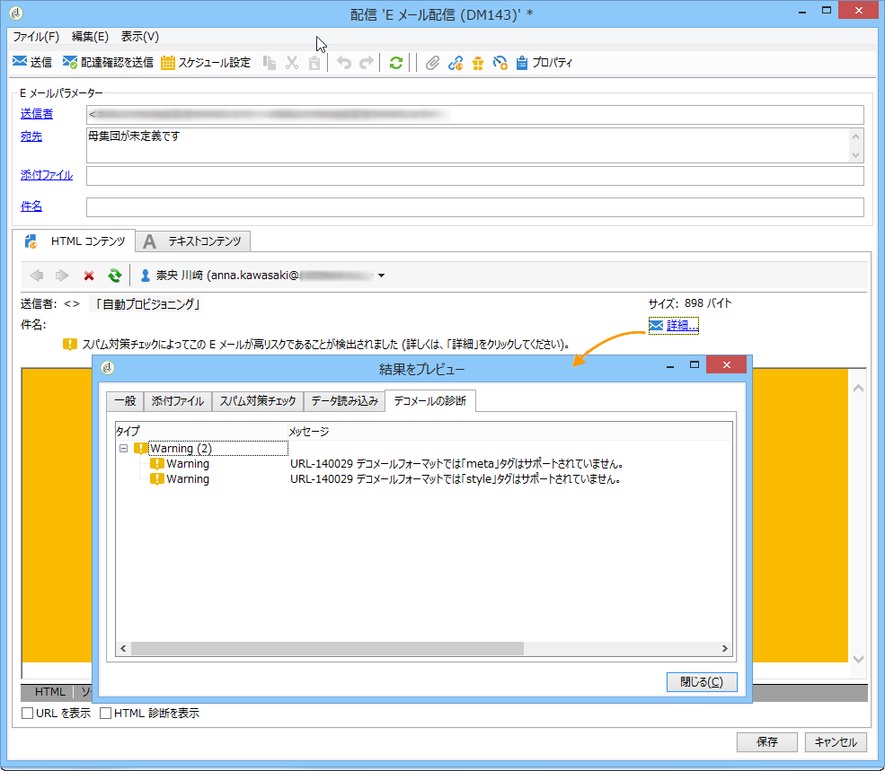

#### タイポロジルールの実行 {#running-typology-rule}

In addition to the previewing diagnosis, a second check is carried out when sending a proof or a delivery: a specific typology rule, **[!UICONTROL Deco-mail check]**, is started during the analysis.

>[!CAUTION]
>
>このタイポロジルールは、少なくとも1人の受信者が電子メールを受信するように設定されている場合、または形式でのみ **[!UICONTROL Deco-mail (DoCoMo)]**&#x200B;実行 **[!UICONTROL Decore Mail (Softbank)]** さ **[!UICONTROL Decoration Mail (KDDI AU)]** れます。

このタイポロジルールでは、特に E メールの合計サイズ、HTML セクションとテキストセクションのサイズ、メッセージ内の画像の数、HTML コンテンツのタグなどに関して、配信が日本のオペレーターによって定義された[フォーマットの制約](#limitations-and-recommendations)を守っていることを確認します。

#### 配達確認の送信 {#sending-proofs}

配達確認を送信して配信をテストできます。配達確認を送信する際、代用アドレスを使用している場合は、使用しているプロファイルの E メールフォーマットに対応しているアドレスを入力してください。

For example, you can replace a profile&#39;s address by test@softbank.ne.jp if the email format for this profile was defined beforehand on **[!UICONTROL Decore Mail (Softbank)]**.

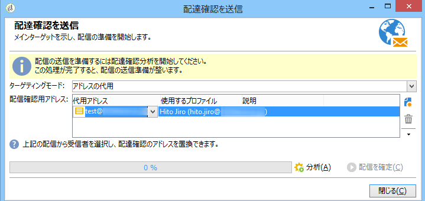

### メッセージの送信 {#sending-messages}

Campaign を使用して日本語 E メール形式で E メールを受信者に送信するには、2 つのオプションがあります。

* 2 つの配信を作成します。1 つは日本人の受信者専用で、もう 1 つは他の受信者用です。[この節](#designing-a-specific-delivery-for-japanese-formats)を参照してください。
* または、1 つの配信を作成し、使用するフォーマットを Adobe Campaign で自動検出します。[この節](#designing-a-delivery-for-all-formats)を参照してください。

#### 日本独自のフォーマットでの配信の作成 {#designing-a-specific-delivery-for-japanese-formats}

日本の携帯電話向けと、標準の E メールフォーマットを使用する受信者向けの 2 つの配信を含むワークフローを作成できます。

To do this, use the **[!UICONTROL Split]** activity in your workflow and define the Japanese email formats (Deco-mail, Decoration Mail and Decore Mail) as filtering conditions.

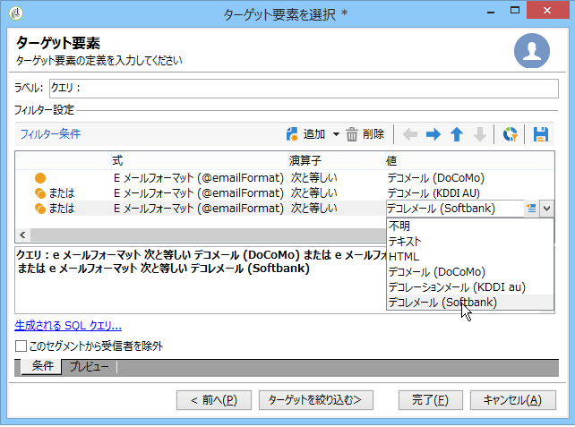

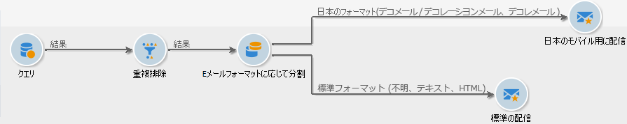

#### すべてのフォーマットを 1 つの配信でデザイン {#designing-a-delivery-for-all-formats}

When Adobe Campaign dynamically manages the formats according to the domain (profiles with email formats defined as **[!UICONTROL Unknown]**, **[!UICONTROL HTML]** or **[!UICONTROL Text]** ), you can send the same delivery to all of your recipients.

メッセージの連絡先は、日本の携帯電話のユーザーに対しても標準の受信者と同じように正しく表示されます。

>[!CAUTION]
>
>日本独自の E メールフォーマット（デコメール、デコレーションメール、デコレメール）に関連する特別な機能については注意が必要です。制限事項について詳しくは、[この節](#limitations-and-recommendations)を参照してください。
