<?xml version="1.0" encoding="UTF-8"?>
<xliff xmlns="urn:oasis:names:tc:xliff:document:1.2" xmlns:okp="okapi-framework:xliff-extensions" xmlns:its="http://www.w3.org/2005/11/its" xmlns:itsxlf="http://www.w3.org/ns/its-xliff/" version="1.2" its:version="2.0">
<file original="help/delivery/using/defining-the-email-content.md.mdsc" source-language="en-US" target-language="en-XX" datatype="x-text/markdown">
<body>
<trans-unit id="tu33" xml:space="preserve">
<source xml:lang="en-US">https://experienceleague.adobe.com/en/docs/control-panel/using/instances-settings/url-permissions</source>
<target xml:lang="en-XX">https://experienceleague.adobe.com/ja/docs/control-panel/using/instances-settings/url-permissions</target>
</trans-unit>
<trans-unit id="tu59" xml:space="preserve">
<source xml:lang="en-US">https://amp.dev/about/email/</source>
<target xml:lang="en-XX">https://amp.dev/ja/about/email/</target>
</trans-unit>
<trans-unit id="tu61" xml:space="preserve">
<source xml:lang="en-US">https://experienceleague.adobe.com/docs/campaign/campaign-v8/send/emails/defining-interactive-content.html</source>
<target xml:lang="en-XX">https://experienceleague.adobe.com/docs/campaign/campaign-v8/send/emails/defining-interactive-content.html?lang=ja</target>
</trans-unit>
<trans-unit id="tu1" restype="x-YAML_METADATA_HEADER_VALUE" xml:space="preserve">
<source xml:lang="en-US">Define the email content in Adobe Campaign Classic</source>
<target xml:lang="en-XX">Adobe Campaign Classic におけるメールコンテンツの定義</target>
</trans-unit>
<trans-unit id="tu2" restype="x-YAML_METADATA_HEADER_VALUE" xml:space="preserve">
<source xml:lang="en-US">Learn how to define the email content when using Adobe Campaign</source>
<target xml:lang="en-XX">Adobe Campaign を使用する際にメールコンテンツを定義する方法について説明します。</target>
</trans-unit>
<trans-unit id="tu3" xml:space="preserve">
<source xml:lang="en-US">Also applies to v8</source>
<target xml:lang="en-XX">v8 にも適用されます</target>
</trans-unit>
<trans-unit id="tu4" xml:space="preserve">
<source xml:lang="en-US">Also applies to Campaign v8</source>
<target xml:lang="en-XX">Campaign v8 にも適用されます</target>
</trans-unit>
<trans-unit id="tu5" xml:space="preserve">
<source xml:lang="en-US">Define the email content</source>
<target xml:lang="en-XX">メールコンテンツの定義</target>
</trans-unit>
<trans-unit id="tu6" xml:space="preserve">
<source xml:lang="en-US">Sender</source>
<target xml:lang="en-XX">送信者</target>
</trans-unit>
<trans-unit id="tu7" xml:space="preserve">
<source xml:lang="en-US">To define the name and address of the sender which will appear in the header of messages sent, click the <ph id="1" ctype="x-STRONG_EMPHASIS">**[!UICONTROL </ph>From<ph id="3" ctype="x-LINK_REF">]**</ph> link.</source>
<target xml:lang="en-XX">送信するメッセージのヘッダーに表示される送信者の名前とアドレスを定義するには、「<ph id="1" ctype="x-STRONG_EMPHASIS">**[!UICONTROL </ph>送信者<ph id="3" ctype="x-LINK_REF">]**</ph>」リンクをクリックします。</target>
</trans-unit>
<trans-unit id="tu8" xml:space="preserve">
<source xml:lang="en-US"><ph id="1" ctype="x-IMAGE">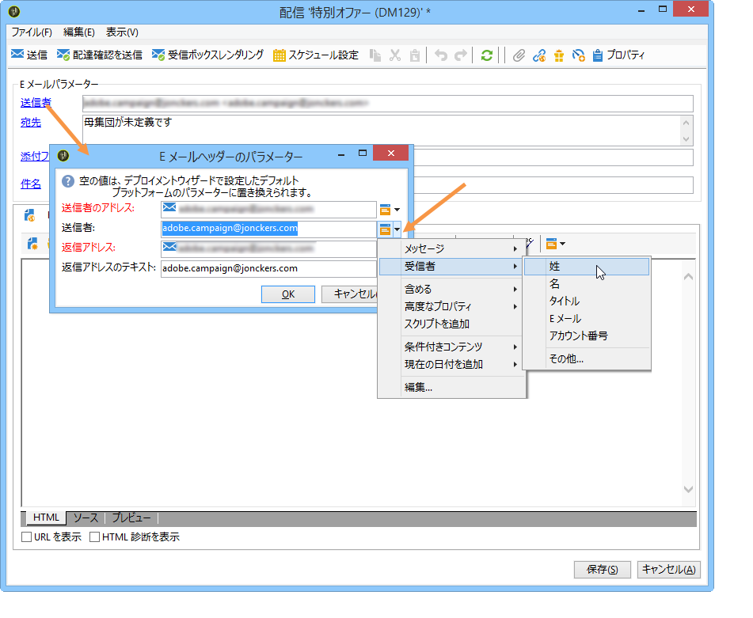</ph></source>
<target xml:lang="en-XX"><ph id="1" ctype="x-IMAGE"></ph></target>
</trans-unit>
<trans-unit id="tu9" xml:space="preserve">
<source xml:lang="en-US">This window lets you enter all the information required to create the email message headers. This information can be personalized. To do this, use the buttons to the right of the input fields to insert personalization fields.</source>
<target xml:lang="en-XX">このウィンドウでは、メールのメッセージヘッダーを作成するために必要なすべての情報を入力できます。 この情報はパーソナライズ可能です。 パーソナライズするには、入力フィールドの右にあるボタンを使用してパーソナライゼーションフィールドを挿入します。</target>
</trans-unit>
<trans-unit id="tu10" xml:space="preserve">
<source xml:lang="en-US">To find out how to insert and use personalization fields, refer to <ph id="1" ctype="x-LINK">[</ph>About personalization<ph id="2" ctype="x-LINK">](about-personalization.md)</ph> section.</source>
<target xml:lang="en-XX">パーソナライゼーションフィールドの挿入方法および使用方法については、<ph id="1" ctype="x-LINK">[</ph>パーソナライゼーションについて<ph id="2" ctype="x-LINK">](about-personalization.md)</ph>の節を参照してください。</target>
</trans-unit>
<trans-unit id="tu11" xml:space="preserve">
<source xml:lang="en-US"><ph id="1" ctype="x-regxph" equiv-text="&lbrack;!NOTE">[!NOTE]</ph></source>
<target xml:lang="en-XX"><ph id="1" ctype="x-regxph" equiv-text="&lbrack;!NOTE">[!NOTE]</ph></target>
</trans-unit>
<trans-unit id="tu12" xml:space="preserve">
<source xml:lang="en-US">The sender's address is used for replies by default.</source>
<target xml:lang="en-XX">送信者のアドレスは、デフォルトで返信先として使用されます。</target>
</trans-unit>
<trans-unit id="tu13" xml:space="preserve">
<source xml:lang="en-US">The header parameters must not be empty. By default, they contain the values input when configuring the deployment wizard. Learn more in <ph id="1" ctype="x-LINK">[</ph>this section<ph id="2" ctype="x-LINK">](../../installation/using/deploying-an-instance.md)</ph>.</source>
<target xml:lang="en-XX">ヘッダーパラメーターの値は省略できません。 デフォルトでは、ヘッダーパラメーターにはデプロイウィザードの設定時に入力された値が格納されています。 詳しくは、<ph id="1" ctype="x-LINK">[</ph>こちら<ph id="2" ctype="x-LINK">](../../installation/using/deploying-an-instance.md)</ph>を参照してください。</target>
</trans-unit>
<trans-unit id="tu14" xml:space="preserve">
<source xml:lang="en-US">The sender's address is mandatory to allow an email to be sent (RFC standard).</source>
<target xml:lang="en-XX">送信者のアドレスは、メールを送信するための必須情報です（RFC 標準規格）。</target>
</trans-unit>
<trans-unit id="tu15" xml:space="preserve">
<source xml:lang="en-US">Adobe Campaign checks the syntax of email addresses entered.</source>
<target xml:lang="en-XX">入力したメールアドレスの形式はチェックされます。</target>
</trans-unit>
<trans-unit id="tu16" xml:space="preserve">
<source xml:lang="en-US"><ph id="1" ctype="x-regxph" equiv-text="&lbrack;!CAUTION">[!CAUTION]</ph></source>
<target xml:lang="en-XX"><ph id="1" ctype="x-regxph" equiv-text="&lbrack;!CAUTION">[!CAUTION]</ph></target>
</trans-unit>
<trans-unit id="tu17" xml:space="preserve">
<source xml:lang="en-US">To avoid deliverability issues, the email accounts that correspond to the addresses specified for deliveries and replies must exist and must be monitored. Check with your system administrator.</source>
<target xml:lang="en-XX">配信品質の問題を回避するには、配信および返信用に指定したアドレスに対応するメールアカウントが存在し、監視する必要があります。 詳しくは、自社のシステム管理者にご相談ください。</target>
</trans-unit>
<trans-unit id="tu18" xml:space="preserve">
<source xml:lang="en-US">Message subject</source>
<target xml:lang="en-XX">メッセージ件名</target>
</trans-unit>
<trans-unit id="tu19" xml:space="preserve">
<source xml:lang="en-US">The subject of the message is configured in the corresponding field. You can enter it directly in the field or click the <ph id="1" ctype="x-STRONG_EMPHASIS">**[!UICONTROL </ph>Subject<ph id="3" ctype="x-LINK_REF">]**</ph> link to enter a script. The personalization link lets you insert database fields in the subject.</source>
<target xml:lang="en-XX">メッセージの件名は、該当するフィールドで設定します。 フィールドに直接入力することも、「<ph id="1" ctype="x-STRONG_EMPHASIS">**[!UICONTROL </ph>件名<ph id="3" ctype="x-LINK_REF">]**</ph>」リンクをクリックしてスクリプトを入力することもできます。 パーソナライゼーションのリンクを使用して、件名の中にデータベースフィールドを挿入できます。</target>
</trans-unit>
<trans-unit id="tu20" xml:space="preserve">
<source xml:lang="en-US"><ph id="1" ctype="x-regxph" equiv-text="&lbrack;!IMPORTANT">[!IMPORTANT]</ph></source>
<target xml:lang="en-XX"><ph id="1" ctype="x-regxph" equiv-text="&lbrack;!IMPORTANT">[!IMPORTANT]</ph></target>
</trans-unit>
<trans-unit id="tu21" xml:space="preserve">
<source xml:lang="en-US">The message subject is mandatory.</source>
<target xml:lang="en-XX">メッセージの件名は必須です。</target>
</trans-unit>
<trans-unit id="tu22" xml:space="preserve">
<source xml:lang="en-US"><ph id="1" ctype="x-IMAGE">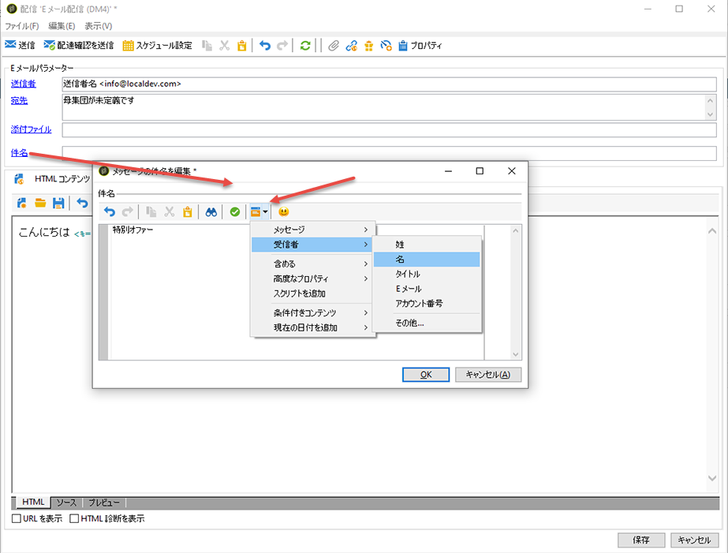</ph></source>
<target xml:lang="en-XX"><ph id="1" ctype="x-IMAGE"></ph></target>
</trans-unit>
<trans-unit id="tu23" xml:space="preserve">
<source xml:lang="en-US">The field content will be replaced by the value in the recipient profile when the message is sent.</source>
<target xml:lang="en-XX">フィールドの内容は、メッセージが送信される際に、受信者のプロファイルに含まれる値で置き換えられます。</target>
</trans-unit>
<trans-unit id="tu24" xml:space="preserve">
<source xml:lang="en-US">For example, in the message above, the subject of the message is personalized for each recipient with data from their profile.</source>
<target xml:lang="en-XX">例えば、上のメッセージの場合、受信者のプロファイルから取得したデータに基づいて、受信者ごとに件名がパーソナライズされます。</target>
</trans-unit>
<trans-unit id="tu25" xml:space="preserve">
<source xml:lang="en-US"><ph id="1" ctype="x-regxph" equiv-text="&lbrack;!NOTE">[!NOTE]</ph></source>
<target xml:lang="en-XX"><ph id="1" ctype="x-regxph" equiv-text="&lbrack;!NOTE">[!NOTE]</ph></target>
</trans-unit>
<trans-unit id="tu26" xml:space="preserve">
<source xml:lang="en-US">The use of personalization fields is presented in <ph id="1" ctype="x-LINK">[</ph>About personalization<ph id="2" ctype="x-LINK">](about-personalization.md)</ph>.</source>
<target xml:lang="en-XX">パーソナライゼーションフィールドの使用方法については、<ph id="1" ctype="x-LINK">[</ph>パーソナライゼーションについて<ph id="2" ctype="x-LINK">](about-personalization.md)</ph>を参照してください。</target>
</trans-unit>
<trans-unit id="tu27" xml:space="preserve">
<source xml:lang="en-US">You can also insert emoticons to your subject line with the <ph id="1" ctype="x-STRONG_EMPHASIS">**[!UICONTROL </ph>Insert emoticon<ph id="3" ctype="x-LINK_REF">]**</ph> pop-up window.</source>
<target xml:lang="en-XX"><ph id="1" ctype="x-STRONG_EMPHASIS">**[!UICONTROL </ph>顔文字を挿入<ph id="3" ctype="x-LINK_REF">]**</ph>ポップアップウィンドウを使用して、件名行に顔文字を挿入することもできます。</target>
</trans-unit>
<trans-unit id="tu28" xml:space="preserve">
<source xml:lang="en-US">Message content</source>
<target xml:lang="en-XX">メッセージコンテンツ</target>
</trans-unit>
<trans-unit id="tu29" xml:space="preserve">
<source xml:lang="en-US"><ph id="1" ctype="x-regxph" equiv-text="&lbrack;!IMPORTANT">[!IMPORTANT]</ph></source>
<target xml:lang="en-XX"><ph id="1" ctype="x-regxph" equiv-text="&lbrack;!IMPORTANT">[!IMPORTANT]</ph></target>
</trans-unit>
<trans-unit id="tu30" xml:space="preserve">
<source xml:lang="en-US">For privacy reasons, we recommend using HTTPS for all external resources.</source>
<target xml:lang="en-XX">プライバシー保護のために、すべての外部リソースに対して HTTPS を使用することをお勧めします。</target>
</trans-unit>
<trans-unit id="tu31" xml:space="preserve">
<source xml:lang="en-US"><ph id="1" ctype="x-regxph" equiv-text="&lbrack;!IMPORTANT">[!IMPORTANT]</ph></source>
<target xml:lang="en-XX"><ph id="1" ctype="x-regxph" equiv-text="&lbrack;!IMPORTANT">[!IMPORTANT]</ph></target>
</trans-unit>
<trans-unit id="tu32" xml:space="preserve">
<source xml:lang="en-US">Release 7.4.4 (build 9401) includes an update to the external URL allow list. Make sure the domains used in your message content are added to your instance's approved allow list so that resources continue to load without interruption. As a Campaign Administrator, use the Control Panel to add and manage allow-listed URLs. See <ph id="1" ctype="x-LINK">&lbrack;</ph>Add URL permissions<ph id="2" ctype="x-LINK">[#$tu33]{target="_blank"}</ph> for steps.</source>
<target xml:lang="en-XX">リリース 7.4.4（ビルド 9401）には、外部 URL 許可リストのアップデートが含まれています。リソースが中断することなく継続して読み込まれるよう、メッセージコンテンツで使用されるドメインが、インスタンスの承認済み許可リストに追加されていることを確認してください。Campaign 管理者として、コントロールパネルを使用して、許可リスト登録済み URL を追加および管理してください。手順について詳しくは、<ph id="1" ctype="x-LINK">&lbrack;</ph>URL 権限の追加<ph id="2" ctype="x-LINK">[#$tu33]{target="_blank"}</ph>を参照してください。</target>
</trans-unit>
<trans-unit id="tu34" xml:space="preserve">
<source xml:lang="en-US">The content of the message is defined in the lower section of the delivery configuration window.</source>
<target xml:lang="en-XX">メッセージの内容は、配信設定ウィンドウの下部のセクションで定義します。</target>
</trans-unit>
<trans-unit id="tu35" xml:space="preserve">
<source xml:lang="en-US">Messages are sent in HTML or text format by default, according to recipient preference. We recommend creating content in both formats to ensure that messages can be correctly displayed in any mail system. For more on this, refer to <ph id="1" ctype="x-LINK">[</ph>Selecting message formats<ph id="2" ctype="x-LINK">](email-parameters.md#selecting-message-formats)</ph>.</source>
<target xml:lang="en-XX">デフォルトのメッセージ送信形式としては、受信者の環境設定に応じて HTML またはテキストのいずれかが使用されます。 様々なメールシステム上でメッセージが正しく表示されるように、必ず両方の形式でコンテンツを作成することをお勧めします。 詳しくは、<ph id="1" ctype="x-LINK">[</ph>メッセージ形式の選択<ph id="2" ctype="x-LINK">](email-parameters.md#selecting-message-formats)</ph>を参照してください。</target>
</trans-unit>
<trans-unit id="tu36" xml:space="preserve">
<source xml:lang="en-US">To import an HTML content, use the <ph id="1" ctype="x-STRONG_EMPHASIS">**[!UICONTROL </ph>Open<ph id="3" ctype="x-LINK_REF">]**</ph> button. You can also paste the source code directly into the <ph id="5" ctype="x-STRONG_EMPHASIS">**[!UICONTROL </ph>Source<ph id="7" ctype="x-LINK_REF">]**</ph> sub-tab.</source>
<target xml:lang="en-XX">HTML コンテンツをインポートするには、「<ph id="1" ctype="x-STRONG_EMPHASIS">**[!UICONTROL </ph>開く<ph id="3" ctype="x-LINK_REF">]**</ph>」ボタンを使用します。 「<ph id="5" ctype="x-STRONG_EMPHASIS">**[!UICONTROL </ph>ソース<ph id="7" ctype="x-LINK_REF">]**</ph>」サブタブに直接ソースコードを貼り付けることもできます。</target>
</trans-unit>
<trans-unit id="tu37" xml:space="preserve">
<source xml:lang="en-US">If you are using the <ph id="1" ctype="x-LINK">[</ph>Digital Content Editor<ph id="2" ctype="x-LINK">](../../web/using/about-campaign-html-editor.md)</ph> (DCE), refer to <ph id="3" ctype="x-LINK">[</ph>Selecting a content template<ph id="4" ctype="x-LINK">](../../web/using/use-case-creating-an-email-delivery.md#step-3---selecting-a-content)</ph>.</source>
<target xml:lang="en-XX"><ph id="1" ctype="x-LINK">[</ph>デジタルコンテンツエディター<ph id="2" ctype="x-LINK">](../../web/using/about-campaign-html-editor.md)</ph>（DCE）を使用している場合は、<ph id="3" ctype="x-LINK">[</ph>コンテンツテンプレートの選択<ph id="4" ctype="x-LINK">](../../web/using/use-case-creating-an-email-delivery.md#step-3---selecting-a-content)</ph>を参照してください。</target>
</trans-unit>
<trans-unit id="tu38" xml:space="preserve">
<source xml:lang="en-US"><ph id="1" ctype="x-regxph" equiv-text="&lbrack;!IMPORTANT">[!IMPORTANT]</ph></source>
<target xml:lang="en-XX"><ph id="1" ctype="x-regxph" equiv-text="&lbrack;!IMPORTANT">[!IMPORTANT]</ph></target>
</trans-unit>
<trans-unit id="tu39" xml:space="preserve">
<source xml:lang="en-US">The HTML content must be created beforehand, then imported into Adobe Campaign. The HTML editor is not designed for content creation.</source>
<target xml:lang="en-XX">HTML コンテンツは、事前に作成してから Adobe Campaign にインポートする必要があります。 HTML エディターはコンテンツ作成用に設計されたものではありません。</target>
</trans-unit>
<trans-unit id="tu40" xml:space="preserve">
<source xml:lang="en-US">The <ph id="1" ctype="x-STRONG_EMPHASIS">**[!UICONTROL </ph>Preview<ph id="3" ctype="x-LINK_REF">]**</ph> sub-tab lets you view the rendering of each content for a recipient. The personalization fields and the conditional elements of content are replaced with the corresponding information for the selected profile.</source>
<target xml:lang="en-XX">「<ph id="1" ctype="x-STRONG_EMPHASIS">**[!UICONTROL </ph>プレビュー<ph id="3" ctype="x-LINK_REF">]**</ph>」サブタブでは、特定の受信者向けに各コンテンツをレンダリングした結果を確認できます。 コンテンツのパーソナライゼーションフィールドや条件付き要素は、選択したプロファイル内の対応する情報で置き換えられます。</target>
</trans-unit>
<trans-unit id="tu41" xml:space="preserve">
<source xml:lang="en-US">The toolbar buttons provide access to the standard actions and formatting parameters for the HTML page.</source>
<target xml:lang="en-XX">ツールバーのボタンでは、標準的なアクションや HTML ページ用の書式設定パラメーターを使用できます。</target>
</trans-unit>
<trans-unit id="tu42" xml:space="preserve">
<source xml:lang="en-US"><ph id="1" ctype="x-IMAGE">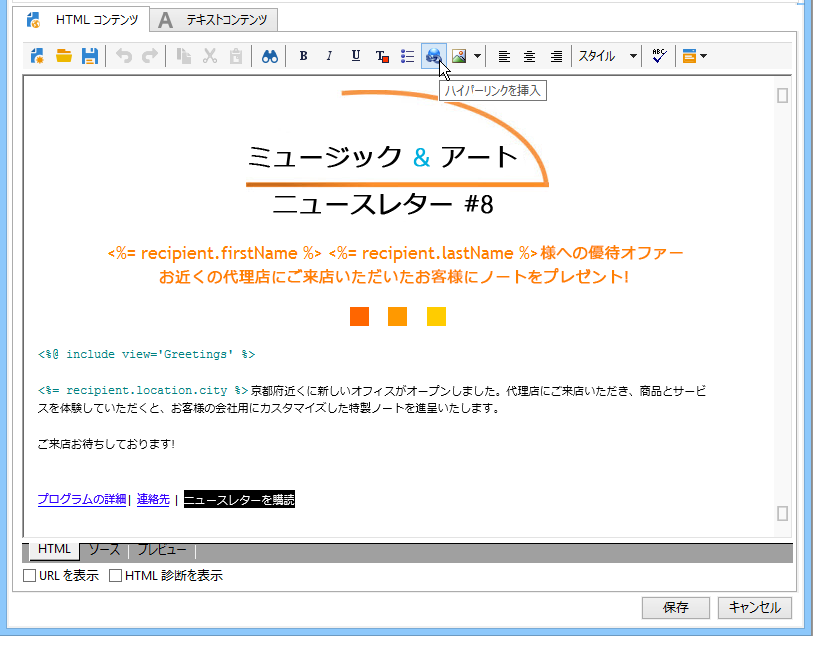</ph></source>
<target xml:lang="en-XX"><ph id="1" ctype="x-IMAGE"></ph></target>
</trans-unit>
<trans-unit id="tu43" xml:space="preserve">
<source xml:lang="en-US">You can insert images in messages from a local file or from an image library in Adobe Campaign. To do this, click the <ph id="1" ctype="x-STRONG_EMPHASIS">**[!UICONTROL </ph>Image<ph id="3" ctype="x-LINK_REF">]**</ph> icon and select the appropriate option.</source>
<target xml:lang="en-XX">画像をメッセージに挿入する場合は、ローカルファイルを読み込んで挿入するか、Adobe Campaign の画像ライブラリから挿入できます。 そのためには、<ph id="1" ctype="x-STRONG_EMPHASIS">**[!UICONTROL </ph>画像<ph id="3" ctype="x-LINK_REF">]**</ph>アイコンをクリックし、適切なオプションを選択します。</target>
</trans-unit>
<trans-unit id="tu44" xml:space="preserve">
<source xml:lang="en-US"><ph id="1" ctype="x-IMAGE">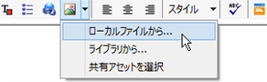</ph></source>
<target xml:lang="en-XX"><ph id="1" ctype="x-IMAGE"></ph></target>
</trans-unit>
<trans-unit id="tu45" xml:space="preserve">
<source xml:lang="en-US">Library images can be accessed via the <ph id="1" ctype="x-STRONG_EMPHASIS">**[!UICONTROL </ph>Resources>Online>Public resources<ph id="3" ctype="x-LINK_REF">]**</ph> folder in the folder tree. Also refer to <ph id="5" ctype="x-LINK">[</ph>Adding images<ph id="6" ctype="x-LINK">](#adding-images)</ph>.</source>
<target xml:lang="en-XX">ライブラリ画像には、フォルダーツリー内の<ph id="1" ctype="x-STRONG_EMPHASIS">**[!UICONTROL </ph>リソース／オンライン／パブリックリソース<ph id="3" ctype="x-LINK_REF">]**</ph>フォルダーからアクセスできます。 <ph id="5" ctype="x-LINK">[</ph>画像の追加<ph id="6" ctype="x-LINK">](#adding-images)</ph>も参照してください。</target>
</trans-unit>
<trans-unit id="tu46" xml:space="preserve">
<source xml:lang="en-US">The last button in the toolbar lets you insert personalization fields.</source>
<target xml:lang="en-XX">ツールバーの最後のボタンは、パーソナライゼーションフィールドを挿入するボタンです。</target>
</trans-unit>
<trans-unit id="tu47" xml:space="preserve">
<source xml:lang="en-US"><ph id="1" ctype="x-regxph" equiv-text="&lbrack;!NOTE">[!NOTE]</ph></source>
<target xml:lang="en-XX"><ph id="1" ctype="x-regxph" equiv-text="&lbrack;!NOTE">[!NOTE]</ph></target>
</trans-unit>
<trans-unit id="tu48" xml:space="preserve">
<source xml:lang="en-US">The use of personalization fields is presented in <ph id="1" ctype="x-LINK">[</ph>About personalization<ph id="2" ctype="x-LINK">](about-personalization.md)</ph>.</source>
<target xml:lang="en-XX">パーソナライゼーションフィールドの使用方法については、<ph id="1" ctype="x-LINK">[</ph>パーソナライゼーションについて<ph id="2" ctype="x-LINK">](about-personalization.md)</ph>を参照してください。</target>
</trans-unit>
<trans-unit id="tu49" xml:space="preserve">
<source xml:lang="en-US">The tabs at the bottom of the page let you display the HTML code of the page being created and view the rendering of the message with its personalization. To launch this display, click <ph id="1" ctype="x-STRONG_EMPHASIS">**[!UICONTROL </ph>Preview<ph id="3" ctype="x-LINK_REF">]**</ph> and select a recipient using the <ph id="5" ctype="x-STRONG_EMPHASIS">**[!UICONTROL </ph>Test personalization<ph id="7" ctype="x-LINK_REF">]**</ph> button in the toolbar. You can select a recipient from the defined target(s) or choose another recipient.</source>
<target xml:lang="en-XX">ページの下部にあるタブでは、作成されるページの HTML コードや、メッセージにパーソナライゼーションを含めたレンダリング結果を表示して確認できます。 これらを表示するには、「<ph id="1" ctype="x-STRONG_EMPHASIS">**[!UICONTROL </ph>プレビュー<ph id="3" ctype="x-LINK_REF">]**</ph>」をクリックし、ツールバーの<ph id="5" ctype="x-STRONG_EMPHASIS">**[!UICONTROL </ph>パーソナライゼーションをテスト<ph id="7" ctype="x-LINK_REF">]**</ph>ボタンを使用して受信者を選択します。 定義済みターゲットの中から受信者を選択することも、別の受信者を指定することもできます。</target>
</trans-unit>
<trans-unit id="tu50" xml:space="preserve">
<source xml:lang="en-US"><ph id="1" ctype="x-IMAGE">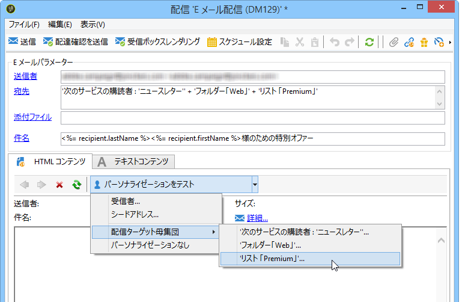</ph></source>
<target xml:lang="en-XX"><ph id="1" ctype="x-IMAGE"></ph></target>
</trans-unit>
<trans-unit id="tu51" xml:space="preserve">
<source xml:lang="en-US">You can validate the HTML message. You can also view the content of the email header.</source>
<target xml:lang="en-XX">HTML メッセージを検証できます。 また、メールヘッダーの内容も確認できます。</target>
</trans-unit>
<trans-unit id="tu52" xml:space="preserve">
<source xml:lang="en-US"><ph id="1" ctype="x-IMAGE">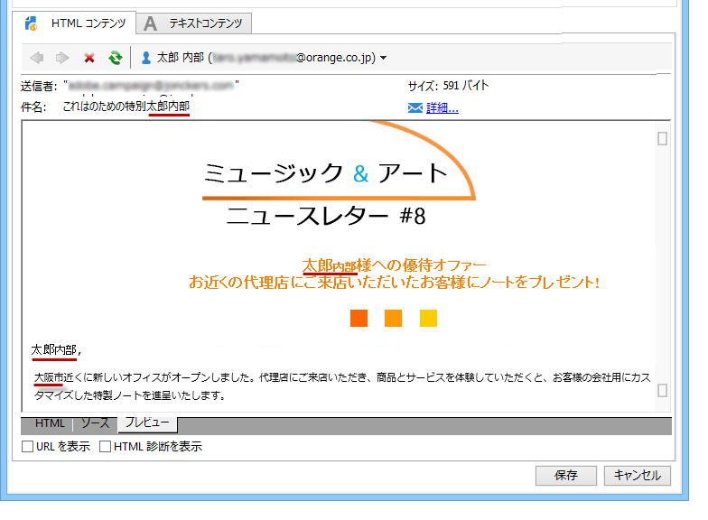</ph></source>
<target xml:lang="en-XX"><ph id="1" ctype="x-IMAGE"></ph></target>
</trans-unit>
<trans-unit id="tu53" xml:space="preserve">
<source xml:lang="en-US">To import a text content, use the <ph id="1" ctype="x-STRONG_EMPHASIS">**[!UICONTROL </ph>Open<ph id="3" ctype="x-LINK_REF">]**</ph> button, or the <ph id="5" ctype="x-STRONG_EMPHASIS">**[!UICONTROL </ph>Text Content<ph id="7" ctype="x-LINK_REF">]**</ph> tab to enter the content of the message when displayed in text format. Use the toolbar buttons to access actions on the contents. The last button lets you insert personalization fields.</source>
<target xml:lang="en-XX">テキストコンテンツをインポートするには、「<ph id="1" ctype="x-STRONG_EMPHASIS">**[!UICONTROL </ph>開く<ph id="3" ctype="x-LINK_REF">]**</ph>」ボタンを使用するか、メッセージがテキスト形式で表示される場合のメッセージのコンテンツを「<ph id="5" ctype="x-STRONG_EMPHASIS">**[!UICONTROL </ph>テキストコンテンツ<ph id="7" ctype="x-LINK_REF">]**</ph>」タブで入力します。 ツールバーのボタンを使用して、コンテンツに対するアクションをします。 最後のボタンは、パーソナライゼーションフィールドを挿入するボタンです。</target>
</trans-unit>
<trans-unit id="tu54" xml:space="preserve">
<source xml:lang="en-US"><ph id="1" ctype="x-IMAGE">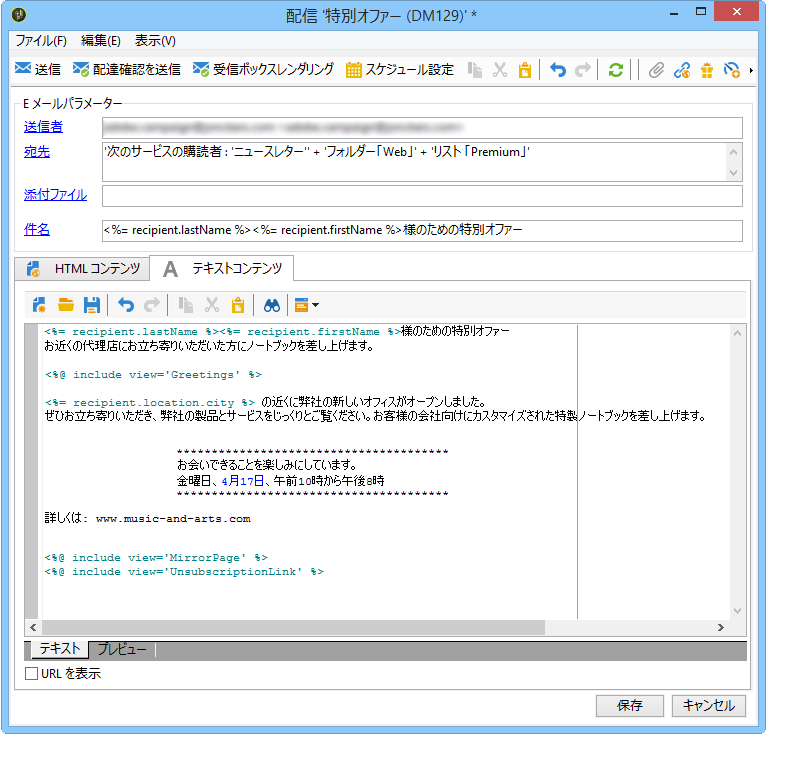</ph></source>
<target xml:lang="en-XX"><ph id="1" ctype="x-IMAGE"></ph></target>
</trans-unit>
<trans-unit id="tu55" xml:space="preserve">
<source xml:lang="en-US">As for the HTML format click the <ph id="1" ctype="x-STRONG_EMPHASIS">**[!UICONTROL </ph>Preview<ph id="3" ctype="x-LINK_REF">]**</ph> tab at the bottom of the page to view the rendering of the message with its personalization.</source>
<target xml:lang="en-XX">HTML 形式については、ページ下部の「<ph id="1" ctype="x-STRONG_EMPHASIS">**[!UICONTROL </ph>プレビュー<ph id="3" ctype="x-LINK_REF">]**</ph>」タブをクリックすると、メッセージにパーソナライゼーションを含めたレンダリング結果を表示して確認できます。</target>
</trans-unit>
<trans-unit id="tu56" xml:space="preserve">
<source xml:lang="en-US"><ph id="1" ctype="x-IMAGE">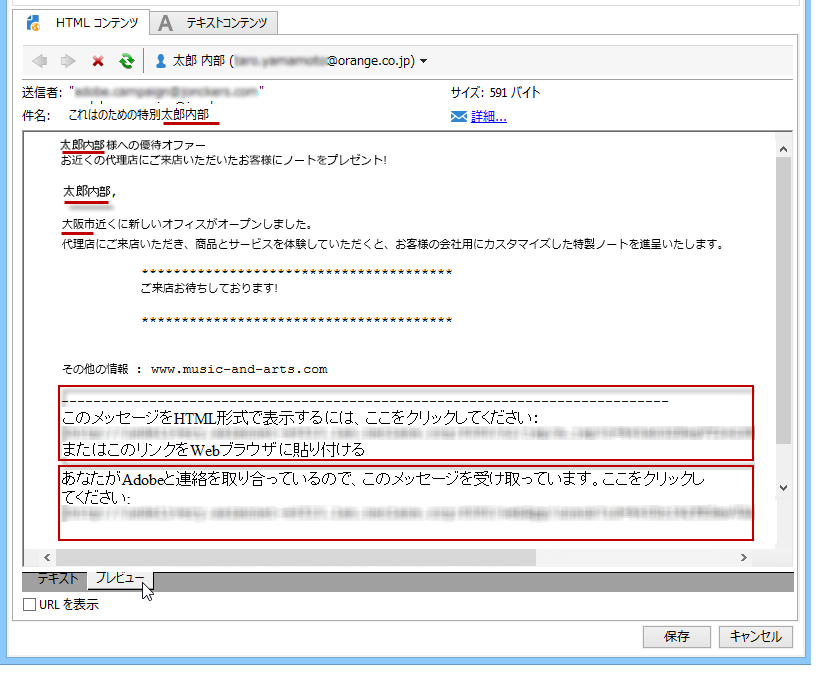</ph></source>
<target xml:lang="en-XX"><ph id="1" ctype="x-IMAGE"></ph></target>
</trans-unit>
<trans-unit id="tu57" xml:space="preserve">
<source xml:lang="en-US">Define interactive content</source>
<target xml:lang="en-XX">インタラクティブコンテンツの定義</target>
</trans-unit>
<trans-unit id="tu58" xml:space="preserve">
<source xml:lang="en-US">Adobe Campaign enables you to try the new interactive <ph id="1" ctype="x-LINK">&lbrack;</ph>AMP for Email<ph id="2" ctype="x-LINK">[#$tu59]</ph> format, which enables to send dynamic emails, under certain conditions.</source>
<target xml:lang="en-XX">Adobe Campaign では、特定の条件下での動的なメールの送信を可能にする、新しいインタラクティブ <ph id="1" ctype="x-LINK">&lbrack;</ph>AMP for Email<ph id="2" ctype="x-LINK">[#$tu59]</ph> フォーマットを試すことができます。</target>
</trans-unit>
<trans-unit id="tu60" xml:space="preserve">
<source xml:lang="en-US">For more on this, see the <ph id="1" ctype="x-LINK">&lbrack;</ph>Campaign v8 documentation<ph id="2" ctype="x-LINK">[#$tu61]{target="_blank"}</ph>.</source>
<target xml:lang="en-XX">詳しくは、<ph id="1" ctype="x-LINK">&lbrack;</ph>Campaign v8 ドキュメント<ph id="2" ctype="x-LINK">[#$tu61]{target="_blank"}</ph>を参照してください。</target>
</trans-unit>
<trans-unit id="tu62" xml:space="preserve">
<source xml:lang="en-US">Use content management</source>
<target xml:lang="en-XX">コンテンツ管理の使用</target>
</trans-unit>
<trans-unit id="tu63" xml:space="preserve">
<source xml:lang="en-US">You can define the content of the delivery using the content management forms, directly in the delivery assistant. To do this, you must reference the publication template of the content management to be used, in the <ph id="1" ctype="x-STRONG_EMPHASIS">**[!UICONTROL </ph>Advanced<ph id="3" ctype="x-LINK_REF">]**</ph> tab of the delivery properties.</source>
<target xml:lang="en-XX">配信のコンテンツは、配信アシスタント内から直接コンテンツ管理フォームを使用して定義できます。 そのためには、配信プロパティの「<ph id="1" ctype="x-STRONG_EMPHASIS">**[!UICONTROL </ph>詳細設定<ph id="3" ctype="x-LINK_REF">]**</ph>」タブで、使用するコンテンツ管理のパブリッシュテンプレートを参照する必要があります。</target>
</trans-unit>
<trans-unit id="tu64" xml:space="preserve">
<source xml:lang="en-US"><ph id="1" ctype="x-IMAGE">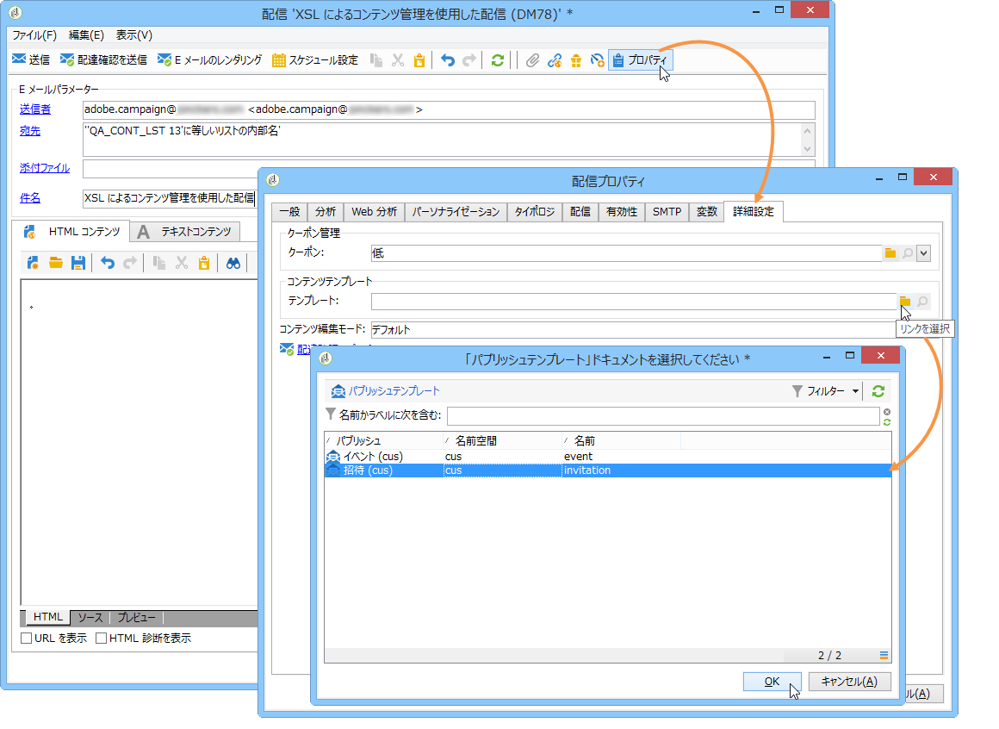</ph></source>
<target xml:lang="en-XX"><ph id="1" ctype="x-IMAGE"></ph></target>
</trans-unit>
<trans-unit id="tu65" xml:space="preserve">
<source xml:lang="en-US">An additional tab lets you enter content that will automatically be integrated and formatted according to the content management rules.</source>
<target xml:lang="en-XX">追加されたタブにコンテンツを入力すると、コンテンツ管理ルールに基づき、このコンテンツの組み込みと書式設定が自動的におこなわれます。</target>
</trans-unit>
<trans-unit id="tu66" xml:space="preserve">
<source xml:lang="en-US"><ph id="1" ctype="x-IMAGE">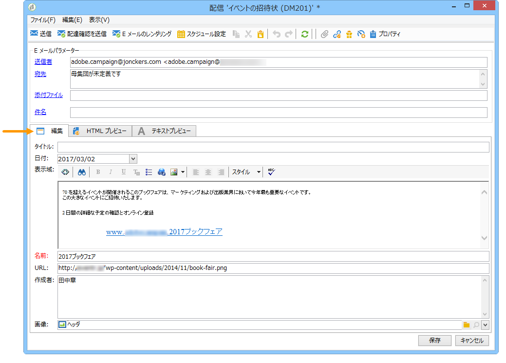</ph></source>
<target xml:lang="en-XX"><ph id="1" ctype="x-IMAGE"></ph></target>
</trans-unit>
<trans-unit id="tu67" xml:space="preserve">
<source xml:lang="en-US"><ph id="1" ctype="x-regxph" equiv-text="&lbrack;!NOTE">[!NOTE]</ph></source>
<target xml:lang="en-XX"><ph id="1" ctype="x-regxph" equiv-text="&lbrack;!NOTE">[!NOTE]</ph></target>
</trans-unit>
<trans-unit id="tu68" xml:space="preserve">
<source xml:lang="en-US">For further information about content management in Adobe Campaign, refer to <ph id="1" ctype="x-LINK">[</ph>this section<ph id="2" ctype="x-LINK">](about-content-management.md)</ph>.</source>
<target xml:lang="en-XX">Adobe Campaign のコンテンツ管理について詳しくは、<ph id="1" ctype="x-LINK">[</ph>この節<ph id="2" ctype="x-LINK">](about-content-management.md)</ph>を参照してください。</target>
</trans-unit>
<trans-unit id="tu69" xml:space="preserve">
<source xml:lang="en-US">Insert emoticons</source>
<target xml:lang="en-XX">顔文字の挿入</target>
</trans-unit>
<trans-unit id="tu70" xml:space="preserve">
<source xml:lang="en-US">You can insert emoticons to your email content.</source>
<target xml:lang="en-XX">メールコンテンツに顔文字を挿入できます。</target>
</trans-unit>
<trans-unit id="tu71" xml:space="preserve">
<source xml:lang="en-US">Click the <ph id="1" ctype="x-STRONG_EMPHASIS">**[!UICONTROL </ph>Insert emoticon<ph id="3" ctype="x-LINK_REF">]**</ph> icon.</source>
<target xml:lang="en-XX"><ph id="1" ctype="x-STRONG_EMPHASIS">**[!UICONTROL </ph>顔文字を挿入<ph id="3" ctype="x-LINK_REF">]**</ph>アイコンをクリックします。</target>
</trans-unit>
<trans-unit id="tu72" xml:space="preserve">
<source xml:lang="en-US">Select an emoticon from the pop-up window.</source>
<target xml:lang="en-XX">ポップアップウィンドウから顔文字を選択します。</target>
</trans-unit>
<trans-unit id="tu73" xml:space="preserve">
<source xml:lang="en-US"><ph id="1" ctype="x-IMAGE">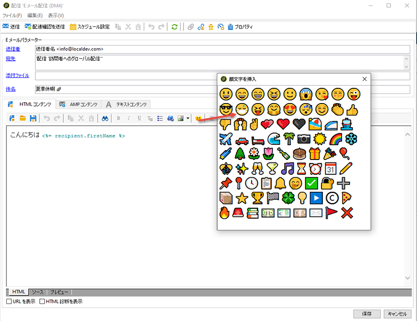</ph></source>
<target xml:lang="en-XX"><ph id="1" ctype="x-IMAGE"></ph></target>
</trans-unit>
<trans-unit id="tu74" xml:space="preserve">
<source xml:lang="en-US">Click the <ph id="1" ctype="x-STRONG_EMPHASIS">**[!UICONTROL </ph>Close<ph id="3" ctype="x-LINK_REF">]**</ph> button when done.</source>
<target xml:lang="en-XX">挿入が完了したら、「<ph id="1" ctype="x-STRONG_EMPHASIS">**[!UICONTROL </ph>閉じる<ph id="3" ctype="x-LINK_REF">]**</ph>」ボタンをクリックします。</target>
</trans-unit>
<trans-unit id="tu75" xml:space="preserve">
<source xml:lang="en-US">To customize the emoticon list, refer to this <ph id="1" ctype="x-LINK">[</ph>page<ph id="2" ctype="x-LINK">](customizing-emoticon-list.md)</ph>.</source>
<target xml:lang="en-XX">顔文字のリストをカスタマイズするには、この<ph id="1" ctype="x-LINK">[</ph>ページ<ph id="2" ctype="x-LINK">](customizing-emoticon-list.md)</ph>を参照してください。</target>
</trans-unit>
<trans-unit id="tu76" xml:space="preserve">
<source xml:lang="en-US">Add images</source>
<target xml:lang="en-XX">画像を追加</target>
</trans-unit>
<trans-unit id="tu77" xml:space="preserve">
<source xml:lang="en-US">HTML format email deliveries can contain images. From the delivery assistant, you can import an HTML page containing images or insert images directly using the HTML editor via the <ph id="1" ctype="x-STRONG_EMPHASIS">**[!UICONTROL </ph>Image<ph id="3" ctype="x-LINK_REF">]**</ph> icon.</source>
<target xml:lang="en-XX">HTML 形式のメール配信には、画像を含めることができます。 配信アシスタントで、画像を含んだ HTML ページをインポートするか、HTML エディターの<ph id="1" ctype="x-STRONG_EMPHASIS">**[!UICONTROL </ph>画像<ph id="3" ctype="x-LINK_REF">]**</ph>アイコンを使用して直接画像を挿入します。</target>
</trans-unit>
<trans-unit id="tu78" xml:space="preserve">
<source xml:lang="en-US">Guardrails</source>
<target xml:lang="en-XX">ガードレール</target>
</trans-unit>
<trans-unit id="tu79" xml:space="preserve">
<source xml:lang="en-US">To avoid performance issues, images included in emails cannot exceed 100 KB. This limit, set by default, can be changed from the <ph id="1" ctype="x-CODE">`NmsDelivery_MaxDownloadedImageSize`</ph> option. However, Adobe strongly recommends to avoid large images in your email deliveries.</source>
<target xml:lang="en-XX">パフォーマンスの問題を回避するために、メールに含める画像のサイズは 100 KB 以下にする必要があります。 この制限は、デフォルトで設定されており、<ph id="1" ctype="x-CODE">`NmsDelivery_MaxDownloadedImageSize`</ph> オプションから変更できます。 ただし、アドビでは、メール配信で大きな画像を使用しないことを強くお勧めします。</target>
</trans-unit>
<trans-unit id="tu80" xml:space="preserve">
<source xml:lang="en-US">Learn more in <ph id="1" ctype="x-LINK">[</ph>the list of Campaign Classic options<ph id="2" ctype="x-LINK">](../../installation/using/configuring-campaign-options.md#delivery)</ph>.</source>
<target xml:lang="en-XX">詳しくは、<ph id="1" ctype="x-LINK">[</ph>Campaign Classic のオプションのリスト<ph id="2" ctype="x-LINK">](../../installation/using/configuring-campaign-options.md#delivery)</ph>を参照してください。</target>
</trans-unit>
<trans-unit id="tu81" xml:space="preserve">
<source xml:lang="en-US">Types of images</source>
<target xml:lang="en-XX">画像のタイプ</target>
</trans-unit>
<trans-unit id="tu82" xml:space="preserve">
<source xml:lang="en-US">Images can be:</source>
<target xml:lang="en-XX">画像に関して、次のことができます。</target>
</trans-unit>
<trans-unit id="tu83" xml:space="preserve">
<source xml:lang="en-US">A local image, or an image called from a server</source>
<target xml:lang="en-XX">ローカル環境にある画像またはサーバー上から取得した画像</target>
</trans-unit>
<trans-unit id="tu84" xml:space="preserve">
<source xml:lang="en-US">An image stored in the Adobe Campaign public resources library</source>
<target xml:lang="en-XX">Adobe Campaign のパブリックリソースライブラリに格納されている画像</target>
</trans-unit>
<trans-unit id="tu85" xml:space="preserve">
<source xml:lang="en-US">Public resources are accessible via the <ph id="1" ctype="x-STRONG_EMPHASIS">**[!UICONTROL </ph>Resources > Online<ph id="3" ctype="x-LINK_REF">]**</ph> node of the Adobe Campaign hierarchy. They are grouped in a library and can be included in email messages, but can also be used for campaigns or tasks, or for content management.</source>
<target xml:lang="en-XX">パブリックリソースには、Adobe Campaign 階層構造の<ph id="1" ctype="x-STRONG_EMPHASIS">**[!UICONTROL </ph>リソース／オンライン<ph id="3" ctype="x-LINK_REF">]**</ph>ノードからアクセスできます。 パブリックリソースは、ライブラリ内でグループ化したり、メールメッセージに含めることができるだけでなく、キャンペーン用、タスク用、コンテンツ管理用に使用することもできます。</target>
</trans-unit>
<trans-unit id="tu86" xml:space="preserve">
<source xml:lang="en-US">An asset shared with Adobe Experience Cloud. Refer to <ph id="1" ctype="x-LINK">[</ph>this section<ph id="2" ctype="x-LINK">](../../integrations/using/sharing-assets-with-adobe-experience-cloud.md)</ph>.</source>
<target xml:lang="en-XX">Adobe Experience Cloud と共有されているアセット。 <ph id="1" ctype="x-LINK">[</ph>この節<ph id="2" ctype="x-LINK">](../../integrations/using/sharing-assets-with-adobe-experience-cloud.md)</ph>を参照してください。</target>
</trans-unit>
<trans-unit id="tu87" xml:space="preserve">
<source xml:lang="en-US">Insert and manage images</source>
<target xml:lang="en-XX">画像の挿入と管理</target>
</trans-unit>
<trans-unit id="tu88" xml:space="preserve">
<source xml:lang="en-US">The delivery assistant lets you add local images, or images stored in the library, to the content of messages. To do this, click the <ph id="1" ctype="x-STRONG_EMPHASIS">**[!UICONTROL </ph>Image<ph id="3" ctype="x-LINK_REF">]**</ph> button in the HTML content toolbar.</source>
<target xml:lang="en-XX">配信アシスタントでは、ローカル環境にある画像またはライブラリに保存されている画像を、メッセージのコンテンツに追加できます。 そのためには、HTML コンテンツツールバーの「<ph id="1" ctype="x-STRONG_EMPHASIS">**[!UICONTROL </ph>画像<ph id="3" ctype="x-LINK_REF">]**</ph>」ボタンをクリックします。</target>
</trans-unit>
<trans-unit id="tu89" xml:space="preserve">
<source xml:lang="en-US"><ph id="1" ctype="x-IMAGE">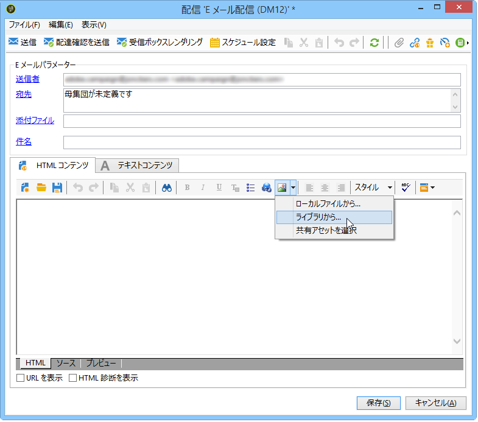</ph></source>
<target xml:lang="en-XX"><ph id="1" ctype="x-IMAGE"></ph></target>
</trans-unit>
<trans-unit id="tu90" xml:space="preserve">
<source xml:lang="en-US"><ph id="1" ctype="x-regxph" equiv-text="&lbrack;!IMPORTANT">[!IMPORTANT]</ph></source>
<target xml:lang="en-XX"><ph id="1" ctype="x-regxph" equiv-text="&lbrack;!IMPORTANT">[!IMPORTANT]</ph></target>
</trans-unit>
<trans-unit id="tu91" xml:space="preserve">
<source xml:lang="en-US">In order for the recipients to be able to view the images included in the messages that they receive, these messages must be available on a server accessible from the outside.</source>
<target xml:lang="en-XX">受け取ったメッセージ内の画像を受信者が表示できるようにするには、メッセージが、外部からアクセス可能なサーバー上に置かれている必要があります。</target>
</trans-unit>
<trans-unit id="tu92" xml:space="preserve">
<source xml:lang="en-US">To manage images via the delivery assistant:</source>
<target xml:lang="en-XX">配信アシスタントを使用して画像を管理するには、以下を実行します。</target>
</trans-unit>
<trans-unit id="tu93" xml:space="preserve">
<source xml:lang="en-US">Click the <ph id="1" ctype="x-STRONG_EMPHASIS">**[!UICONTROL </ph>Tracking &amp; Images<ph id="3" ctype="x-LINK_REF">]**</ph> icon in the toolbar.
</source>
<target xml:lang="en-XX">ツールバーの「<ph id="1" ctype="x-STRONG_EMPHASIS">**[!UICONTROL </ph>トラッキング＆画像<ph id="3" ctype="x-LINK_REF">]**</ph>」アイコンをクリックします。
</target>
</trans-unit>
<trans-unit id="tu94" xml:space="preserve">
<source xml:lang="en-US"><ph id="1" ctype="x-IMAGE">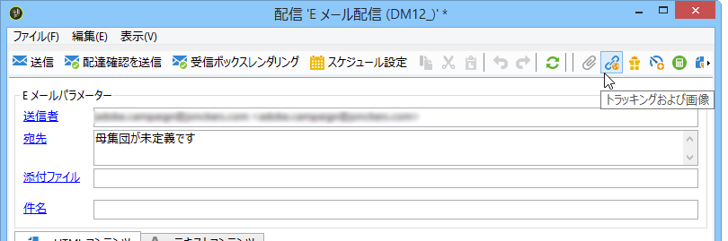</ph></source>
<target xml:lang="en-XX"><ph id="1" ctype="x-IMAGE"></ph></target>
</trans-unit>
<trans-unit id="tu95" xml:space="preserve">
<source xml:lang="en-US">Select <ph id="1" ctype="x-STRONG_EMPHASIS">**[!UICONTROL </ph>Upload images<ph id="3" ctype="x-LINK_REF">]**</ph> in the <ph id="5" ctype="x-STRONG_EMPHASIS">**[!UICONTROL </ph>Images<ph id="7" ctype="x-LINK_REF">]**</ph> tab.</source>
<target xml:lang="en-XX">「<ph id="1" ctype="x-STRONG_EMPHASIS">**[!UICONTROL </ph>画像<ph id="3" ctype="x-LINK_REF">]**</ph>」タブの「<ph id="5" ctype="x-STRONG_EMPHASIS">**[!UICONTROL </ph>画像をアップロード<ph id="7" ctype="x-LINK_REF">]**</ph>」を選択します。</target>
</trans-unit>
<trans-unit id="tu96" xml:space="preserve">
<source xml:lang="en-US">You can then choose whether you wish to include the images in the email message.
</source>
<target xml:lang="en-XX">その画像をメールメッセージに含めるかどうかを選択できます。
</target>
</trans-unit>
<trans-unit id="tu97" xml:space="preserve">
<source xml:lang="en-US"><ph id="1" ctype="x-IMAGE">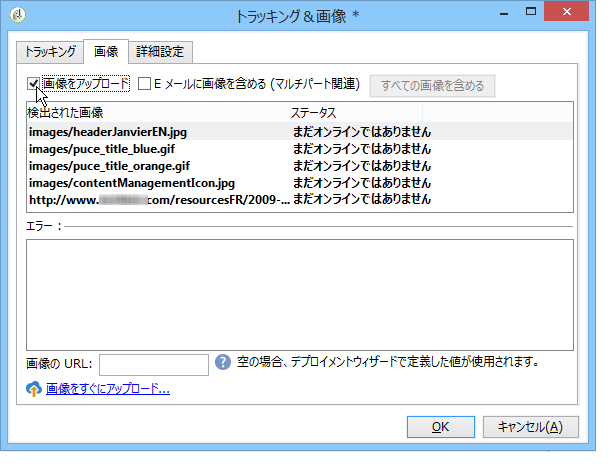</ph></source>
<target xml:lang="en-XX"><ph id="1" ctype="x-IMAGE"></ph></target>
</trans-unit>
<trans-unit id="tu98" xml:space="preserve">
<source xml:lang="en-US">You can upload images manually without waiting for the delivery analysis phase. To do this, click the <ph id="1" ctype="x-STRONG_EMPHASIS">**[!UICONTROL </ph>Upload the images straightaway...<ph id="3" ctype="x-LINK_REF">]**</ph> link.</source>
<target xml:lang="en-XX">配信分析フェーズを待つことなく、手動で画像をアップロードできます。 そのためには、「<ph id="1" ctype="x-STRONG_EMPHASIS">**[!UICONTROL </ph>画像をすぐにアップロード...<ph id="3" ctype="x-LINK_REF">]**</ph>」リンクをクリックします。</target>
</trans-unit>
<trans-unit id="tu99" xml:space="preserve">
<source xml:lang="en-US">You can specify another path for access to the images on the tracking server. To do this, enter it in the <ph id="1" ctype="x-STRONG_EMPHASIS">**[!UICONTROL </ph>Images URL<ph id="3" ctype="x-LINK_REF">]**</ph> field. This value overrides the value defined in the parameters of the installation assistant.</source>
<target xml:lang="en-XX">トラッキングサーバー上の画像にアクセスするための、別のパスも指定できます。 そのためには、「<ph id="1" ctype="x-STRONG_EMPHASIS">**[!UICONTROL </ph>画像の URL<ph id="3" ctype="x-LINK_REF">]**</ph>」フィールドにパスを入力します。 この値を指定すると、インストールアシスタントのパラメーターで指定した値よりも優先されます。</target>
</trans-unit>
<trans-unit id="tu100" xml:space="preserve">
<source xml:lang="en-US">When you open HTML content with included images in the delivery assistant, a message gives you the option of uploading the images immediately, according to the delivery parameters.</source>
<target xml:lang="en-XX">配信アシスタントで、画像を含んだ HTML コンテンツを開くと、配信パラメーターに従ってすぐに画像をアップロードするかどうかを確認するメッセージが表示されます。</target>
</trans-unit>
<trans-unit id="tu101" xml:space="preserve">
<source xml:lang="en-US"><ph id="1" ctype="x-IMAGE">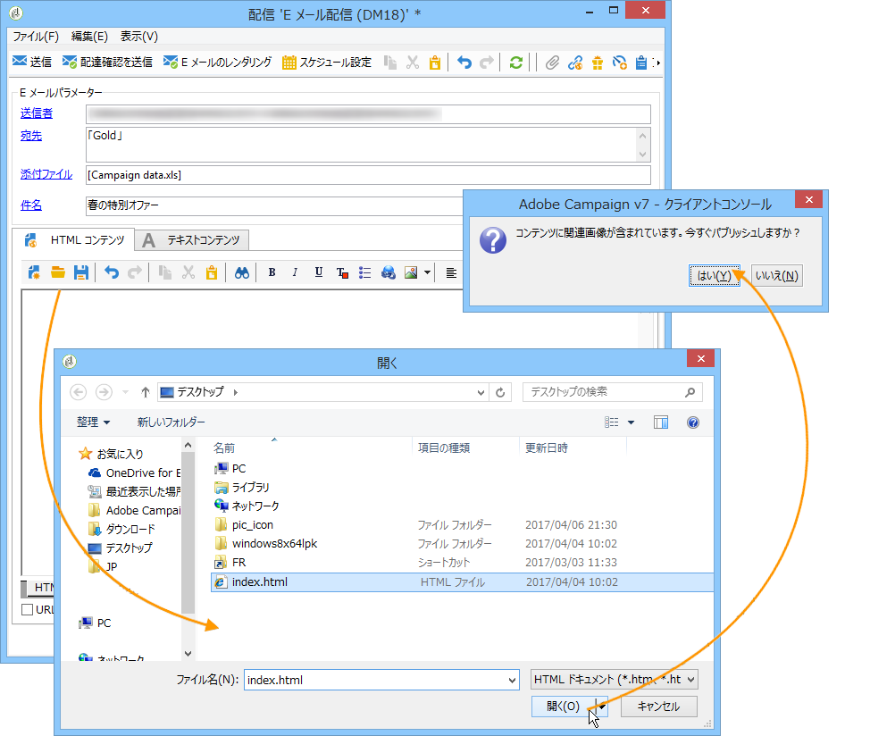</ph></source>
<target xml:lang="en-XX"><ph id="1" ctype="x-IMAGE"></ph></target>
</trans-unit>
<trans-unit id="tu102" xml:space="preserve">
<source xml:lang="en-US"><ph id="1" ctype="x-regxph" equiv-text="&lbrack;!IMPORTANT">[!IMPORTANT]</ph></source>
<target xml:lang="en-XX"><ph id="1" ctype="x-regxph" equiv-text="&lbrack;!IMPORTANT">[!IMPORTANT]</ph></target>
</trans-unit>
<trans-unit id="tu103" xml:space="preserve">
<source xml:lang="en-US">The image URLs are modified during manual uploading or when sending messages.</source>
<target xml:lang="en-XX">画像 URL は、手動でのアップロード時やメッセージの送信時に変更されます。</target>
</trans-unit>
<trans-unit id="tu104" xml:space="preserve">
<source xml:lang="en-US">Use case: send a message with images</source>
<target xml:lang="en-XX">ユースケース：画像付きメッセージの送信</target>
</trans-unit>
<trans-unit id="tu105" xml:space="preserve">
<source xml:lang="en-US">Below is a sample of a delivery with four images:</source>
<target xml:lang="en-XX">以下に、4 つの画像を含む配信のサンプルを示します。</target>
</trans-unit>
<trans-unit id="tu106" xml:space="preserve">
<source xml:lang="en-US"><ph id="1" ctype="x-IMAGE">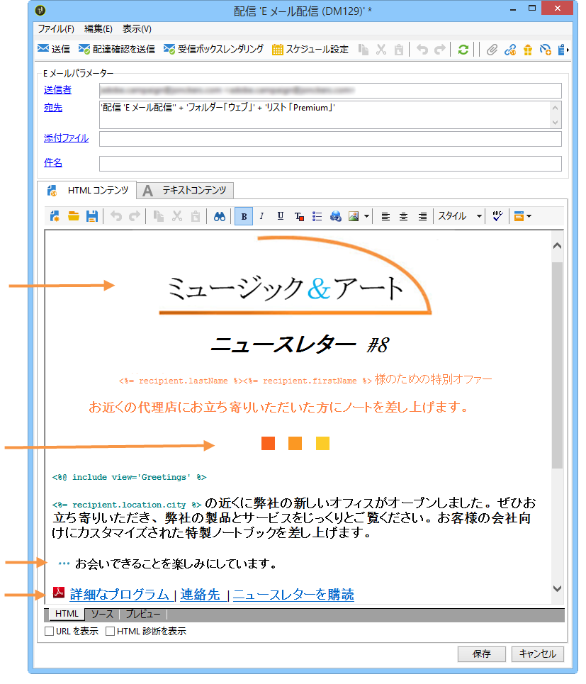</ph></source>
<target xml:lang="en-XX"><ph id="1" ctype="x-IMAGE"></ph></target>
</trans-unit>
<trans-unit id="tu107" xml:space="preserve">
<source xml:lang="en-US">These images come from a local directory or Web site as you can verify from the <ph id="1" ctype="x-STRONG_EMPHASIS">**[!UICONTROL </ph>Source<ph id="3" ctype="x-LINK_REF">]**</ph> tab.</source>
<target xml:lang="en-XX">これらの画像は、ローカルディレクトリ内または Web サイト上から取得されるものとします。画像のある場所は「<ph id="1" ctype="x-STRONG_EMPHASIS">**[!UICONTROL </ph>ソース<ph id="3" ctype="x-LINK_REF">]**</ph>」タブで確認できます。</target>
</trans-unit>
<trans-unit id="tu108" xml:space="preserve">
<source xml:lang="en-US"><ph id="1" ctype="x-IMAGE">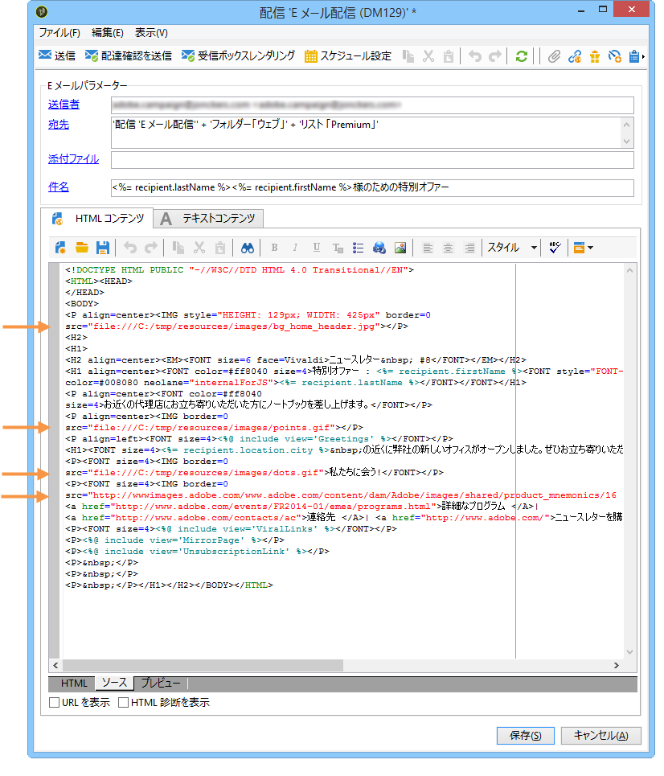</ph></source>
<target xml:lang="en-XX"><ph id="1" ctype="x-IMAGE"></ph></target>
</trans-unit>
<trans-unit id="tu109" xml:space="preserve">
<source xml:lang="en-US">Click the <ph id="1" ctype="x-STRONG_EMPHASIS">**[!UICONTROL </ph>Tracking &amp; Images<ph id="3" ctype="x-LINK_REF">]**</ph> icon and then the <ph id="5" ctype="x-STRONG_EMPHASIS">**[!UICONTROL </ph>Images<ph id="7" ctype="x-LINK_REF">]**</ph> tab to start detecting images in the message.</source>
<target xml:lang="en-XX"><ph id="1" ctype="x-STRONG_EMPHASIS">**[!UICONTROL </ph>トラッキングおよび画像<ph id="3" ctype="x-LINK_REF">]**</ph>アイコンをクリックし、次に「<ph id="5" ctype="x-STRONG_EMPHASIS">**[!UICONTROL </ph>画像<ph id="7" ctype="x-LINK_REF">]**</ph>」タブをクリックして、メッセージに含まれる画像の検出を開始します。</target>
</trans-unit>
<trans-unit id="tu110" xml:space="preserve">
<source xml:lang="en-US">For each image detected, you can view its status:</source>
<target xml:lang="en-XX">検出されたそれぞれの画像について、次のようにステータスが表示されます。</target>
</trans-unit>
<trans-unit id="tu111" xml:space="preserve">
<source xml:lang="en-US">If an image is stored locally or located on another server, even if this server is visible from the outside (on an internet site, for example), it will be detected as <ph id="1" ctype="x-STRONG_EMPHASIS">**[!UICONTROL </ph>Not yet online<ph id="3" ctype="x-LINK_REF">]**</ph>.</source>
<target xml:lang="en-XX">ローカル環境内または別のサーバー上にある画像については、そのサーバーが外部から参照可能な状態になっている（例えばインターネットサイト上にある）としても、「<ph id="1" ctype="x-STRONG_EMPHASIS">**[!UICONTROL </ph>まだオンラインではありません<ph id="3" ctype="x-LINK_REF">]**</ph>」と認識されます。</target>
</trans-unit>
<trans-unit id="tu112" xml:space="preserve">
<source xml:lang="en-US">The images are detected as <ph id="1" ctype="x-STRONG_EMPHASIS">**[!UICONTROL </ph>Already online<ph id="3" ctype="x-LINK_REF">]**</ph> if they were uploaded earlier while creating another delivery.</source>
<target xml:lang="en-XX">別の配信を作成する際に既にアップロードが完了している画像については、「<ph id="1" ctype="x-STRONG_EMPHASIS">**[!UICONTROL </ph>既にオンラインです<ph id="3" ctype="x-LINK_REF">]**</ph>」と認識されます。</target>
</trans-unit>
<trans-unit id="tu113" xml:space="preserve">
<source xml:lang="en-US">In the deployment wizard, you can define URLs for which image detection is not enabled: uploading these images will be <ph id="1" ctype="x-STRONG_EMPHASIS">**[!UICONTROL </ph>Skipped<ph id="3" ctype="x-LINK_REF">]**</ph>.</source>
<target xml:lang="en-XX">デプロイウィザードでは、画像検出の対象としない URL を定義できます。それらの URL に該当する画像のアップロードは「<ph id="1" ctype="x-STRONG_EMPHASIS">**[!UICONTROL </ph>スキップ<ph id="3" ctype="x-LINK_REF">]**</ph>」されます。</target>
</trans-unit>
<trans-unit id="tu114" xml:space="preserve">
<source xml:lang="en-US"><ph id="1" ctype="x-regxph" equiv-text="&lbrack;!NOTE">[!NOTE]</ph></source>
<target xml:lang="en-XX"><ph id="1" ctype="x-regxph" equiv-text="&lbrack;!NOTE">[!NOTE]</ph></target>
</trans-unit>
<trans-unit id="tu115" xml:space="preserve">
<source xml:lang="en-US">Images are identified by their content and not by their access paths. This means that an image uploaded previously under a different name or in a different directory will be detected as <ph id="1" ctype="x-STRONG_EMPHASIS">**[!UICONTROL </ph>Already online<ph id="3" ctype="x-LINK_REF">]**</ph>.</source>
<target xml:lang="en-XX">画像の識別は、アクセスパスではなくコンテンツに基づいておこなわれます。 つまり、たとえ以前とは名前やディレクトリが異なっていても、既にアップロードされたことがある画像は「<ph id="1" ctype="x-STRONG_EMPHASIS">**[!UICONTROL </ph>既にオンラインです<ph id="3" ctype="x-LINK_REF">]**</ph>」と認識されます。</target>
</trans-unit>
<trans-unit id="tu116" xml:space="preserve">
<source xml:lang="en-US">During the analysis phase, the images are automatically uploaded to the server so that they are accessible from the exterior, except for the local images which must be uploaded beforehand.</source>
<target xml:lang="en-XX">事前にアップロードすることが必要なローカル画像の場合を除き、分析フェーズでは画像がサーバーへと自動的にアップロードされ、外部からアクセスできる状態になります。</target>
</trans-unit>
<trans-unit id="tu117" xml:space="preserve">
<source xml:lang="en-US">You can work ahead and upload images so that they can be viewed by other Adobe Campaign operators. You may find this useful if working collaboratively. To do this, click <ph id="1" ctype="x-STRONG_EMPHASIS">**[!UICONTROL </ph>Upload the images straightaway...<ph id="3" ctype="x-LINK_REF">]**</ph> to upload the images onto the server.</source>
<target xml:lang="en-XX">画像のアップロード作業を早めにしておくと、他の Adobe Campaign オペレーターがそれらを参照でき、 共同作業がスムーズになることがあります。 そのためには、「<ph id="1" ctype="x-STRONG_EMPHASIS">**[!UICONTROL </ph>画像をすぐにアップロード<ph id="3" ctype="x-LINK_REF">]**</ph>」をクリックし、サーバーに画像をアップロードします。</target>
</trans-unit>
<trans-unit id="tu118" xml:space="preserve">
<source xml:lang="en-US"><ph id="1" ctype="x-IMAGE">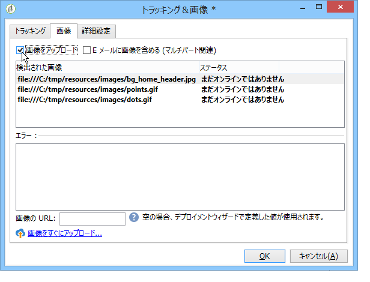</ph></source>
<target xml:lang="en-XX"><ph id="1" ctype="x-IMAGE"></ph></target>
</trans-unit>
<trans-unit id="tu119" xml:space="preserve">
<source xml:lang="en-US"><ph id="1" ctype="x-regxph" equiv-text="&lbrack;!NOTE">[!NOTE]</ph></source>
<target xml:lang="en-XX"><ph id="1" ctype="x-regxph" equiv-text="&lbrack;!NOTE">[!NOTE]</ph></target>
</trans-unit>
<trans-unit id="tu120" xml:space="preserve">
<source xml:lang="en-US">The URLs of the images in the email, and their names in particular, are then modified.</source>
<target xml:lang="en-XX">この後、メールに含められる画像の URL（特にファイル名）は変更されます。</target>
</trans-unit>
<trans-unit id="tu121" xml:space="preserve">
<source xml:lang="en-US">Once the images are online, you can view changes to their names and paths from the <ph id="1" ctype="x-STRONG_EMPHASIS">**[!UICONTROL </ph>Source<ph id="3" ctype="x-LINK_REF">]**</ph> tab of the message.</source>
<target xml:lang="en-XX">画像がオンラインになった後、メッセージの「<ph id="1" ctype="x-STRONG_EMPHASIS">**[!UICONTROL </ph>ソース<ph id="3" ctype="x-LINK_REF">]**</ph>」タブを参照すると、画像の名前やパスがどのように変更されたかを確認できます。</target>
</trans-unit>
<trans-unit id="tu122" xml:space="preserve">
<source xml:lang="en-US"><ph id="1" ctype="x-IMAGE">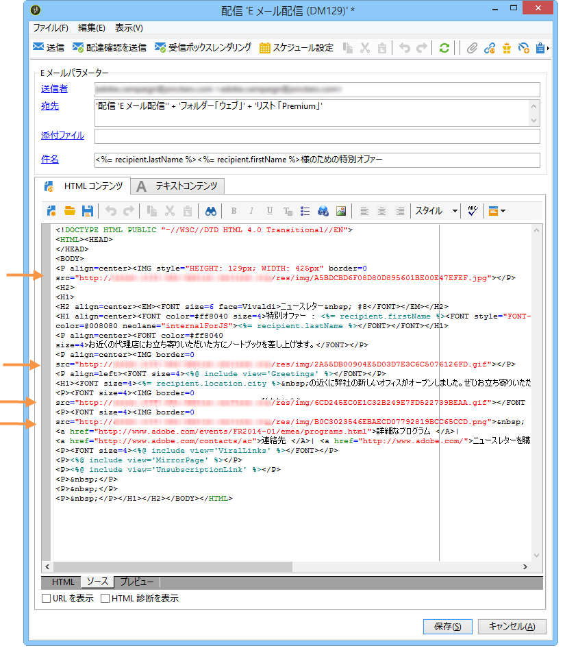</ph></source>
<target xml:lang="en-XX"><ph id="1" ctype="x-IMAGE"></ph></target>
</trans-unit>
<trans-unit id="tu123" xml:space="preserve">
<source xml:lang="en-US">If you select <ph id="1" ctype="x-STRONG_EMPHASIS">**[!UICONTROL </ph>Include the images in the email<ph id="3" ctype="x-LINK_REF">]**</ph>, you can choose which images to include in the corresponding column.</source>
<target xml:lang="en-XX">「<ph id="1" ctype="x-STRONG_EMPHASIS">**[!UICONTROL </ph>メールに画像を含める<ph id="3" ctype="x-LINK_REF">]**</ph>」を選択した場合は、対応する列で、含める画像を選択できます。</target>
</trans-unit>
<trans-unit id="tu124" xml:space="preserve">
<source xml:lang="en-US"><ph id="1" ctype="x-IMAGE">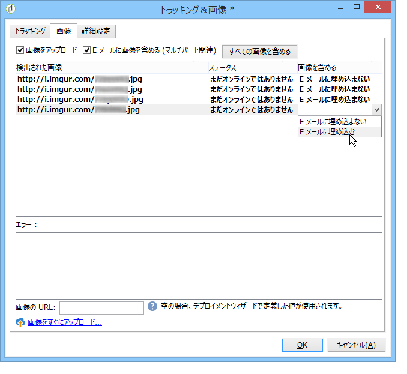</ph></source>
<target xml:lang="en-XX"><ph id="1" ctype="x-IMAGE"></ph></target>
</trans-unit>
<trans-unit id="tu125" xml:space="preserve">
<source xml:lang="en-US"><ph id="1" ctype="x-regxph" equiv-text="&lbrack;!NOTE">[!NOTE]</ph></source>
<target xml:lang="en-XX"><ph id="1" ctype="x-regxph" equiv-text="&lbrack;!NOTE">[!NOTE]</ph></target>
</trans-unit>
<trans-unit id="tu126" xml:space="preserve">
<source xml:lang="en-US">If local images are included in the message, you must confirm changes to the message source code.</source>
<target xml:lang="en-XX">ローカル画像をメッセージに含める場合は、メッセージのソースコードに適用される変更を確認する必要があります。</target>
</trans-unit>
<trans-unit id="tu127" xml:space="preserve">
<source xml:lang="en-US">Insert a personalized barcode</source>
<target xml:lang="en-XX">パーソナライズしたバーコードの挿入</target>
</trans-unit>
<trans-unit id="tu128" xml:space="preserve">
<source xml:lang="en-US">The barcode generation module lets you create several types of barcodes that comply with many common standards, including 2D barcodes.</source>
<target xml:lang="en-XX">バーコード生成モジュールを使用して、2D バーコードなど、一般的基準に適合する、複数のタイプのバーコードを作成できます。</target>
</trans-unit>
<trans-unit id="tu129" xml:space="preserve">
<source xml:lang="en-US">It is possible to dynamically generate a barcode as a bitmap using a value defined using customer criteria. Personalized barcodes can be included in email campaigns. The recipient can print the message and show it to the issuing company for scanning (when checking out for example).</source>
<target xml:lang="en-XX">顧客側の基準を基に定義された値を使用して、バーコードをビットマップとして動的に生成できます。 パーソナライズしたバーコードをメールキャンペーンに含めることができます。 受信者は、メッセージを印刷したり、（チェックアウト時などに）発行会社に提示してスキャンしたりできます。</target>
</trans-unit>
<trans-unit id="tu130" xml:space="preserve">
<source xml:lang="en-US">To insert a barcode into an email, place the cursor in the content where you want to display it, then click the personalization button. Select <ph id="1" ctype="x-STRONG_EMPHASIS">**[!UICONTROL </ph>Include > Barcode...<ph id="3" ctype="x-LINK_REF">]**</ph>.</source>
<target xml:lang="en-XX">バーコードをメールに挿入するには、表示したいコンテンツ内にカーソルを置いて、パーソナライゼーションボタンをクリックします。 <ph id="1" ctype="x-STRONG_EMPHASIS">**[!UICONTROL </ph>含める／バーコード<ph id="3" ctype="x-LINK_REF">]**</ph>を選択します。</target>
</trans-unit>
<trans-unit id="tu131" xml:space="preserve">
<source xml:lang="en-US"><ph id="1" ctype="x-IMAGE">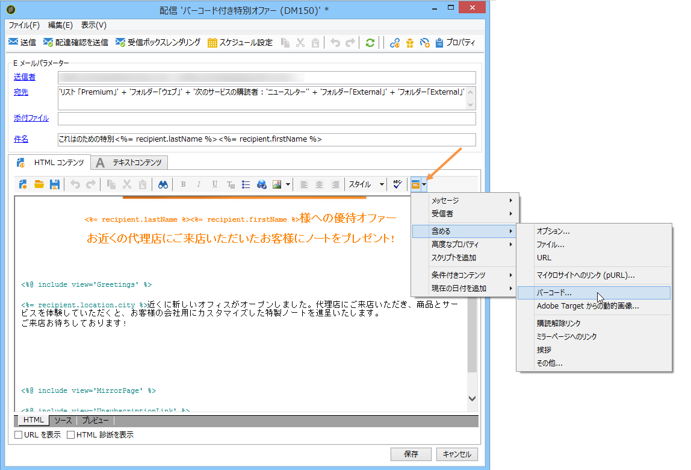</ph></source>
<target xml:lang="en-XX"><ph id="1" ctype="x-IMAGE"></ph></target>
</trans-unit>
<trans-unit id="tu132" xml:space="preserve">
<source xml:lang="en-US">Then configure the following elements to suit your needs:</source>
<target xml:lang="en-XX">ニーズに合わせて次の要素を設定します。</target>
</trans-unit>
<trans-unit id="tu133" xml:space="preserve">
<source xml:lang="en-US">Select the type of barcode.</source>
<target xml:lang="en-XX">バーコードのタイプを選択します。</target>
</trans-unit>
<trans-unit id="tu134" xml:space="preserve">
<source xml:lang="en-US">For 1D format, the following types are available in Adobe Campaign: Codabar, Code 128, GS1-128 (formerly EAN-128), UPC-A, UPC-E, ISBN, EAN-8, Code39, Interleaved 2 of 5, POSTNET and Royal Mail (RM4SCC).</source>
<target xml:lang="en-XX">1D フォーマットの場合、Adobe Campaign で使用できるタイプは、Codabar、コード 128、GS1-128（以前の EAN-128）、UPC-A、UPC-E、ISBN、EAN-8、Code39、インターリーブ 2/5、POSTNET および Royal Mail（RM4SCC）です。</target>
</trans-unit>
<trans-unit id="tu135" xml:space="preserve">
<source xml:lang="en-US">Example of a 1D barcode:</source>
<target xml:lang="en-XX">1D バーコードの例：</target>
</trans-unit>
<trans-unit id="tu136" xml:space="preserve">
<source xml:lang="en-US"><ph id="1" ctype="x-IMAGE">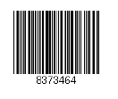</ph></source>
<target xml:lang="en-XX"><ph id="1" ctype="x-IMAGE"></ph></target>
</trans-unit>
<trans-unit id="tu137" xml:space="preserve">
<source xml:lang="en-US">The DataMatrix and PDF417 types concern the 2D format.</source>
<target xml:lang="en-XX">DataMatrix タイプと PDF417 タイプは 2D フォーマットを扱います。</target>
</trans-unit>
<trans-unit id="tu138" xml:space="preserve">
<source xml:lang="en-US">Example of a 2D barcode:</source>
<target xml:lang="en-XX">2D バーコードの例：</target>
</trans-unit>
<trans-unit id="tu139" xml:space="preserve">
<source xml:lang="en-US"><ph id="1" ctype="x-IMAGE">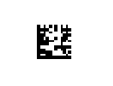</ph></source>
<target xml:lang="en-XX"><ph id="1" ctype="x-IMAGE"></ph></target>
</trans-unit>
<trans-unit id="tu140" xml:space="preserve">
<source xml:lang="en-US">To insert a QR code, select this type and enter the error correction rate to apply. This rate defines the quantity of information repeated and the tolerance to deterioration.</source>
<target xml:lang="en-XX">QR コードを挿入するには、このタイプを選択し、適用する誤り訂正レベルを入力します。 このレベルで、データ量とコードの劣化の許容範囲を定義します。</target>
</trans-unit>
<trans-unit id="tu141" xml:space="preserve">
<source xml:lang="en-US"><ph id="1" ctype="x-IMAGE">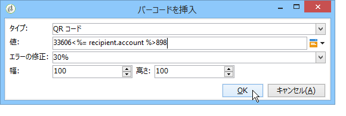</ph></source>
<target xml:lang="en-XX"><ph id="1" ctype="x-IMAGE"></ph></target>
</trans-unit>
<trans-unit id="tu142" xml:space="preserve">
<source xml:lang="en-US">Example of a QR code:</source>
<target xml:lang="en-XX">QR コードの例：</target>
</trans-unit>
<trans-unit id="tu143" xml:space="preserve">
<source xml:lang="en-US"><ph id="1" ctype="x-IMAGE"></ph></source>
<target xml:lang="en-XX"><ph id="1" ctype="x-IMAGE"></ph></target>
</trans-unit>
<trans-unit id="tu144" xml:space="preserve">
<source xml:lang="en-US">Enter the size of the barcode that you want to insert into the email: configuring the scale lets you increase or reduce the size of the barcode, from x1 to x10.</source>
<target xml:lang="en-XX">メールに挿入したいバーコードのサイズを入力します。縮尺を設定することによって、バーコードのサイズを 1 倍から 10 倍まで拡大または縮小できます。</target>
</trans-unit>
<trans-unit id="tu145" xml:space="preserve">
<source xml:lang="en-US">The <ph id="1" ctype="x-STRONG_EMPHASIS">**[!UICONTROL </ph>Value<ph id="3" ctype="x-LINK_REF">]**</ph> field enables you to define the value of the barcode. A value can match a special offer and can be the function of a criteria, it can be the value of a database field linked to the customers.</source>
<target xml:lang="en-XX">「<ph id="1" ctype="x-STRONG_EMPHASIS">**[!UICONTROL </ph>値<ph id="3" ctype="x-LINK_REF">]**</ph>」フィールドを使用して、バーコードの値を定義できます。 値は、特別オファーに対応させたり、ある基準の関数にすることができます。顧客にリンクされているデータベースフィールドの値にすることも可能です。</target>
</trans-unit>
<trans-unit id="tu146" xml:space="preserve">
<source xml:lang="en-US">This example shows an EAN-8 type barcode, to which was added the account number of a recipient. To add this account number, click the personalization button to the right of the <ph id="1" ctype="x-STRONG_EMPHASIS">**[!UICONTROL </ph>Value<ph id="3" ctype="x-LINK_REF">]**</ph> field and select <ph id="5" ctype="x-STRONG_EMPHASIS">**[!UICONTROL </ph>Recipient > Account number<ph id="7" ctype="x-LINK_REF">]**</ph>.</source>
<target xml:lang="en-XX">次の例は、受信者のアカウント番号が追加された EAN-8 タイプのバーコードを示しています。 このアカウント番号を追加するには、「<ph id="1" ctype="x-STRONG_EMPHASIS">**[!UICONTROL </ph>値<ph id="3" ctype="x-LINK_REF">]**</ph>」フィールドの右側のパーソナライゼーションボタンをクリックして、<ph id="5" ctype="x-STRONG_EMPHASIS">**[!UICONTROL </ph>受信者／アカウント番号<ph id="7" ctype="x-LINK_REF">]**</ph>を選択します。</target>
</trans-unit>
<trans-unit id="tu147" xml:space="preserve">
<source xml:lang="en-US"><ph id="1" ctype="x-IMAGE">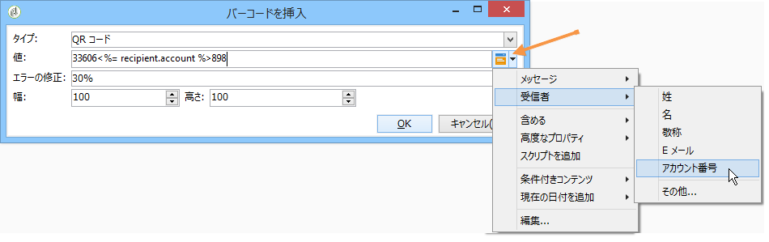</ph></source>
<target xml:lang="en-XX"><ph id="1" ctype="x-IMAGE"></ph></target>
</trans-unit>
<trans-unit id="tu148" xml:space="preserve">
<source xml:lang="en-US">The <ph id="1" ctype="x-STRONG_EMPHASIS">**[!UICONTROL </ph>Height<ph id="3" ctype="x-LINK_REF">]**</ph> field lets you configure the height of the barcode without changing its width, by altering the amount of space between each bar.</source>
<target xml:lang="en-XX">「<ph id="1" ctype="x-STRONG_EMPHASIS">**[!UICONTROL </ph>高さ<ph id="3" ctype="x-LINK_REF">]**</ph>」フィールドを使用すると、それぞれの線の間のスペース量を変更することによって、バーコードの幅を変更することなく、バーコードの高さを設定できます。</target>
</trans-unit>
<trans-unit id="tu149" xml:space="preserve">
<source xml:lang="en-US">There is no restrictive entry control depending on the type of barcode. If a barcode value is incorrect, it will only be visible in <ph id="1" ctype="x-STRONG_EMPHASIS">**</ph>Preview<ph id="2" ctype="x-STRONG_EMPHASIS">**</ph> mode where the barcode will be crossed out in red.</source>
<target xml:lang="en-XX">バーコードのタイプによる入力コントロールの制限はありません。 バーコードの値が正しくない場合、バーコードは<ph id="1" ctype="x-STRONG_EMPHASIS">**</ph>プレビュー<ph id="2" ctype="x-STRONG_EMPHASIS">**</ph>モードで赤色の x 印で消された状態で表示されます。</target>
</trans-unit>
<trans-unit id="tu150" xml:space="preserve">
<source xml:lang="en-US"><ph id="1" ctype="x-regxph" equiv-text="&lbrack;!NOTE">[!NOTE]</ph></source>
<target xml:lang="en-XX"><ph id="1" ctype="x-regxph" equiv-text="&lbrack;!NOTE">[!NOTE]</ph></target>
</trans-unit>
<trans-unit id="tu151" xml:space="preserve">
<source xml:lang="en-US">The value assigned to a barcode depends on its type. For example, an EAN-8 type shall have exactly 8 numbers.</source>
<target xml:lang="en-XX">バーコードに割り当てる値は、バーコードのタイプによって異なります。 例えば、EAN-8 タイプは 8 桁でなければなりません。</target>
</trans-unit>
<trans-unit id="tu152" xml:space="preserve">
<source xml:lang="en-US">The personalization button to the right of the <ph id="1" ctype="x-STRONG_EMPHASIS">**[!UICONTROL </ph>Value<ph id="3" ctype="x-LINK_REF">]**</ph> field lets you add data in addition to the value itself. This enriches the barcode, provided that the barcode standard accepts it.</source>
<target xml:lang="en-XX">「<ph id="1" ctype="x-STRONG_EMPHASIS">**[!UICONTROL </ph>値<ph id="3" ctype="x-LINK_REF">]**</ph>」フィールドの右側のパーソナライゼーションボタンを使用して、値自体に加えてデータを追加できます。 バーコードの基準に則っていれば、これによりバーコードを充実させることができます。</target>
</trans-unit>
<trans-unit id="tu153" xml:space="preserve">
<source xml:lang="en-US">For example, if you are using a GS1-128 type barcode and want to enter the account number of a recipient in addition to the value, click the personalization button and select <ph id="1" ctype="x-STRONG_EMPHASIS">**[!UICONTROL </ph>Recipient > Account number<ph id="3" ctype="x-LINK_REF">]**</ph>. If the account number of the selected recipient is entered correctly, the barcode takes it into account.</source>
<target xml:lang="en-XX">例えば、GS1-128 タイプのバーコードを使用していて、値以外に受信者のアカウント番号を入力したい場合は、パーソナライゼーションボタンをクリックして、<ph id="1" ctype="x-STRONG_EMPHASIS">**[!UICONTROL </ph>受信者／アカウント番号<ph id="3" ctype="x-LINK_REF">]**</ph>を選択します。 選択した受信者のアカウント番号が正しく入力された場合、バーコードはこのアカウント番号を処理します。</target>
</trans-unit>
<trans-unit id="tu154" xml:space="preserve">
<source xml:lang="en-US">Once these elements have been configured, you can finalize your email and send it. To avoid errors, always make sure your content is displayed correctly before performing a delivery by clicking the <ph id="1" ctype="x-STRONG_EMPHASIS">**[!UICONTROL </ph>Preview<ph id="3" ctype="x-LINK_REF">]**</ph> tab.</source>
<target xml:lang="en-XX">これらの要素を設定したら、メールを仕上げて送信できます。 エラーを避けるには、「<ph id="1" ctype="x-STRONG_EMPHASIS">**[!UICONTROL </ph>プレビュー<ph id="3" ctype="x-LINK_REF">]**</ph>」タブをクリックして、配信を実行する前にコンテンツが正しく表示されることを常に確認します。</target>
</trans-unit>
<trans-unit id="tu155" xml:space="preserve">
<source xml:lang="en-US"><ph id="1" ctype="x-IMAGE">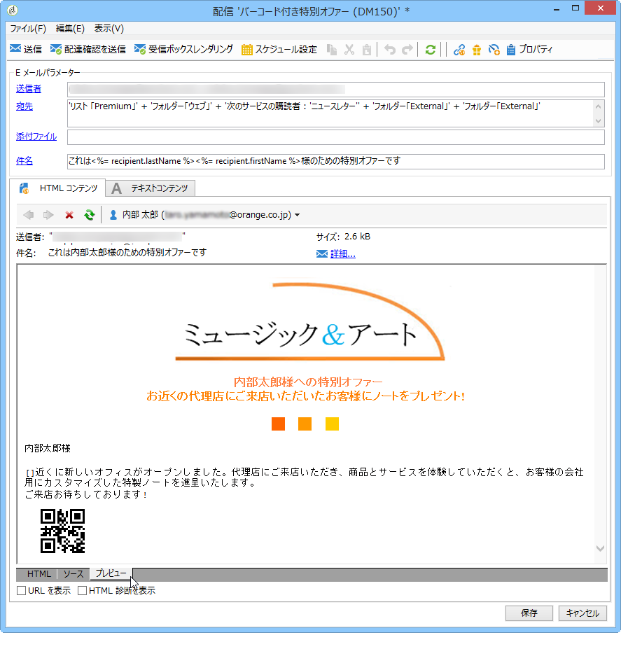</ph></source>
<target xml:lang="en-XX"><ph id="1" ctype="x-IMAGE"></ph></target>
</trans-unit>
<trans-unit id="tu156" xml:space="preserve">
<source xml:lang="en-US"><ph id="1" ctype="x-regxph" equiv-text="&lbrack;!NOTE">[!NOTE]</ph></source>
<target xml:lang="en-XX"><ph id="1" ctype="x-regxph" equiv-text="&lbrack;!NOTE">[!NOTE]</ph></target>
</trans-unit>
<trans-unit id="tu157" xml:space="preserve">
<source xml:lang="en-US">If the value of a barcode is incorrect, its bitmap is shown crossed out in red.</source>
<target xml:lang="en-XX">バーコードの値が正しくない場合、バーコードのビットマップは赤色の×印で消された状態で表示されます。</target>
</trans-unit>
<trans-unit id="tu158" xml:space="preserve">
<source xml:lang="en-US"><ph id="1" ctype="x-IMAGE">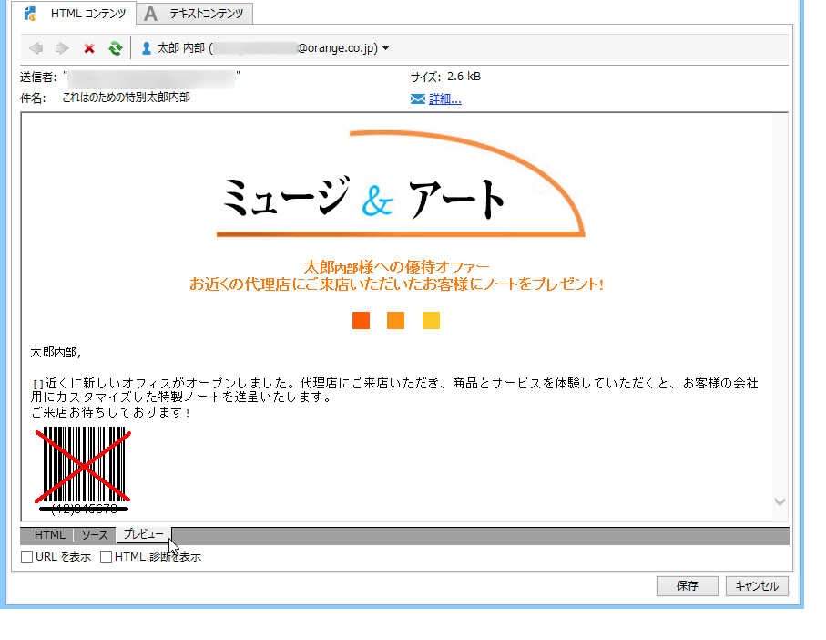</ph></source>
<target xml:lang="en-XX"><ph id="1" ctype="x-IMAGE"></ph></target>
</trans-unit>
</body>
</file>
</xliff>