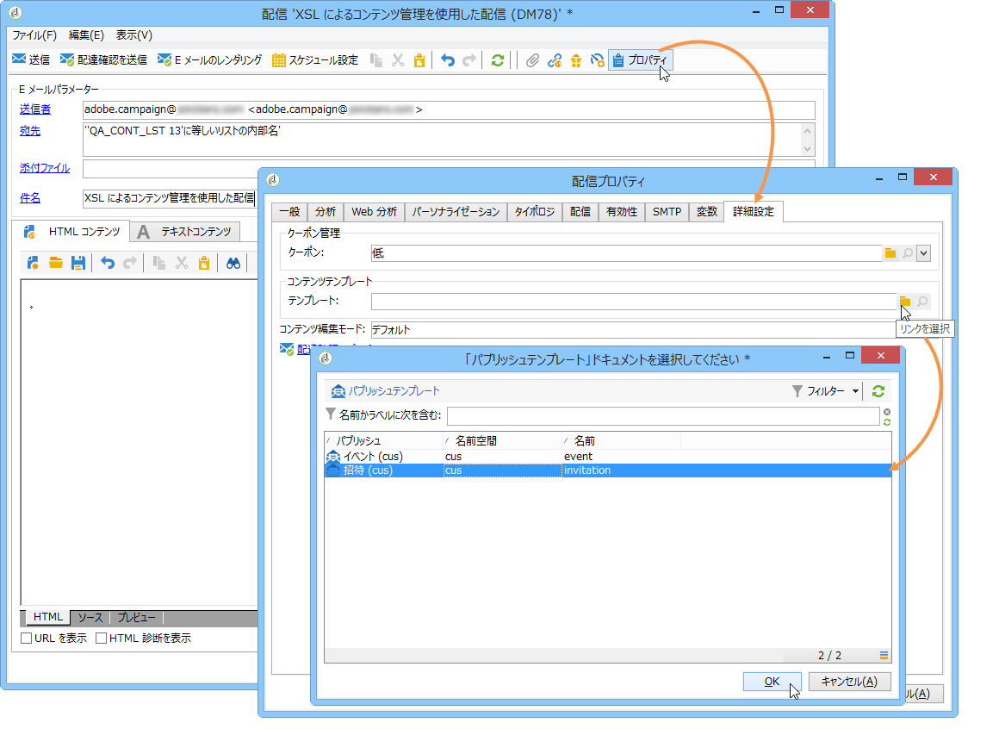
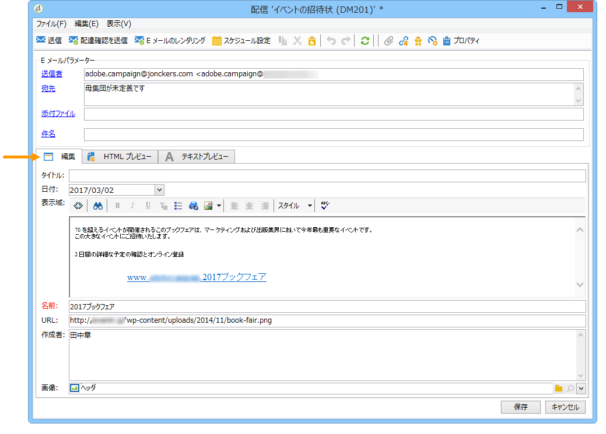
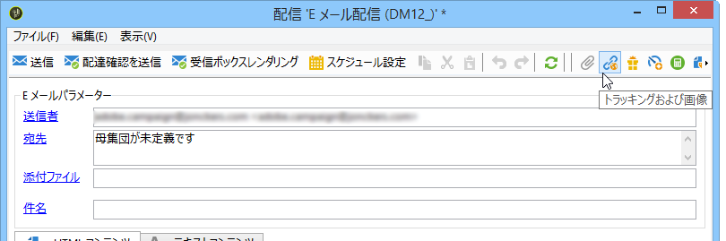

# E メールコンテンツの定義 {#defining-the-email-content}

## 送信者 {#sender}

送信するメッセージのヘッダーに表示される送信者の名前とアドレスを定義するには、「**[!UICONTROL 送信者]**」リンクをクリックします。

このウィンドウでは、E メールのメッセージヘッダーを作成するために必要なすべての情報を入力できます。この情報はパーソナライズ可能です。パーソナライズするには、入力フィールドの右にあるボタンを使用してパーソナライゼーションフィールドを挿入します。

パーソナライゼーションフィールドの挿入方法および使用方法については、[パーソナライゼーションについて](../../delivery/using/about-personalization.md)の節を参照してください。

>[!NOTE]
>
>* 送信者のアドレスは、デフォルトで返信先として使用されます。
>* ヘッダーパラメーターの値は省略できません。デフォルトでは、ヘッダーパラメーターにはデプロイウィザードの設定時に入力された値が格納されています。詳しくは、[インストールガイド](../../installation/using/deploying-an-instance.md)を参照してください。
>* 送信者のアドレスは、E メールを送信するための必須情報です（RFC 標準規格）。
>* 入力した E メールアドレスの形式はチェックされます。

>[!IMPORTANT]
>
>インターネットアクセスプロバイダー（ISP）の迷惑メールチェック機能による誤認識を防ぐために、配信用と返信用のそれぞれのアドレスに対応した E メールアカウントを作成することをお勧めします。詳しくは、自社のシステム管理者にご相談ください。

## メッセージ件名 {#message-subject}

メッセージの件名は、該当するフィールドで設定します。フィールドに直接入力することも、「**[!UICONTROL 件名]**」リンクをクリックしてスクリプトを入力することもできます。パーソナライゼーションのリンクを使用して、件名の中にデータベースフィールドを挿入できます。

>[!IMPORTANT]
>
>メッセージの件名は必須です。

フィールドの内容は、メッセージが送信される際に、受信者のプロファイルに含まれる値で置き換えられます。

例えば、上のメッセージの場合、受信者のプロファイルから取得したデータに基づいて、受信者ごとに件名がパーソナライズされます。

>[!NOTE]
>
>パーソナライゼーションフィールドの使用方法については、[パーソナライゼーションについて](../../delivery/using/about-personalization.md)を参照してください。

**[!UICONTROL 顔文字を挿入]**&#x200B;ポップアップウィンドウを使用して、件名行に顔文字を挿入することもできます。

## メッセージの内容 {#message-content}

>[!IMPORTANT]
>
>プライバシー保護のために、すべての外部リソースに対して HTTPS を使用することをお勧めします。

メッセージの内容は、配信設定ウィンドウの下部のセクションで定義します。

デフォルトのメッセージ送信形式としては、受信者の環境設定に応じて HTML またはテキストのいずれかが使用されます。様々なメールシステム上でメッセージが正しく表示されるように、必ず両方の形式でコンテンツを作成することをお勧めします。詳しくは、[メッセージ形式の選択](#selecting-message-formats)を参照してください。

* HTML コンテンツをインポートするには、「**[!UICONTROL 開く]**」ボタンを使用します。「**[!UICONTROL ソース]**」サブタブに直接ソースコードを貼り付けることもできます。

   [デジタルコンテンツエディター](../../web/using/about-campaign-html-editor.md)（DCE）を使用している場合は、[コンテンツテンプレートの選択](../../web/using/use-case--creating-an-email-delivery.md#step-3---selecting-a-content)を参照してください。

   >[!IMPORTANT]
   >
   >HTML コンテンツは、事前に作成してから Adobe Campaign にインポートする必要があります。HTML エディターはコンテンツ作成用に設計されたものではありません。

   「**[!UICONTROL プレビュー]**」サブタブでは、特定の受信者向けに各コンテンツをレンダリングした結果を確認できます。コンテンツのパーソナライゼーションフィールドや条件付き要素は、選択したプロファイル内の対応する情報で置き換えられます。

   ツールバーのボタンでは、標準的なアクションや HTML ページ用の書式設定パラメーターを使用できます。

   

   画像をメッセージに挿入する場合は、ローカルファイルを読み込んで挿入するか、Adobe Campaign の画像ライブラリから挿入できます。そのためには、**[!UICONTROL 画像]**&#x200B;アイコンをクリックし、適切なオプションを選択します。

   

   ライブラリ画像には、フォルダーツリー内の&#x200B;**[!UICONTROL リソース／オンライン／パブリックリソース]**&#x200B;フォルダーからアクセスできます。[画像の追加](#adding-images)も参照してください。

   ツールバーの最後のボタンは、パーソナライゼーションフィールドを挿入するボタンです。

   >[!NOTE]
   >
   >パーソナライゼーションフィールドの使用方法については、[パーソナライゼーションについて](../../delivery/using/about-personalization.md)を参照してください。

   ページの下部にあるタブでは、作成されるページの HTML コードや、メッセージにパーソナライゼーションを含めたレンダリング結果を表示して確認できます。これらを表示するには、「**[!UICONTROL プレビュー]**」をクリックし、ツールバーの&#x200B;**[!UICONTROL パーソナライゼーションをテスト]**&#x200B;ボタンを使用して受信者を選択します。定義済みターゲットの中から受信者を選択することも、別の受信者を指定することもできます。

   

   HTML メッセージを検証できます。また、E メールヘッダーの内容も確認できます。

   

* テキストコンテンツをインポートするには、「**[!UICONTROL 開く]**」ボタンを使用するか、メッセージがテキスト形式で表示される場合のメッセージのコンテンツを「**[!UICONTROL テキストコンテンツ]**」タブで入力します。ツールバーのボタンを使用して、コンテンツに対するアクションをします。最後のボタンは、パーソナライゼーションフィールドを挿入するボタンです。

   

   HTML 形式については、ページ下部の「**[!UICONTROL プレビュー]**」タブをクリックすると、メッセージにパーソナライゼーションを含めたレンダリング結果を表示して確認できます。

   

<!--## Selecting message formats {#selecting-message-formats}

You can change the format of email messages sent. To do this, edit the delivery properties and click the **[!UICONTROL Delivery]** tab.

Select the format of the email in the lower section of the window:

* **[!UICONTROL Use recipient preferences]** (default mode)

  The message format is defined according to the data stored in the recipient profile and stored by default in the **[!UICONTROL email format]** field (@emailFormat). If a recipient wishes to receive messages in a certain format, this is the format sent. If the field is not filled in, a multipart-alternative message is sent (see below).

* **[!UICONTROL Let recipient mail client choose the most appropriate format]**

  The message contains both formats: text and HTML. The format displayed on reception depends on the configuration of the recipient's mail software (multipart-alternative).

  >[!IMPORTANT]
  >
  >This option includes both versions of the document. It therefore impacts the delivery rate, because the message size is greater.

* **[!UICONTROL Send all messages in text format]**

  The message is sent in text format. HTML format will not be sent, but used for the mirror page only when the recipient clicks on the message.-->

## インタラクティブコンテンツの定義 {#amp-for-email-format}

Adobe Campaign では、特定の条件下での動的な E メールの送信を可能にする、新しいインタラクティブ [AMP for Email](https://amp.dev/about/email/) フォーマットを試すことができます。

詳しくは、[この節](../../delivery/using/defining-interactive-content.md)を参照してください。

## コンテンツ管理の使用 {#using-content-management}

配信のコンテンツは、配信ウィザード内から直接コンテンツ管理フォームを使用して定義できます。そのためには、配信プロパティの「**[!UICONTROL 詳細設定]**」タブで、使用するコンテンツ管理のパブリッシュテンプレートを参照する必要があります。

追加されたタブにコンテンツを入力すると、コンテンツ管理ルールに基づき、このコンテンツの組み込みと書式設定が自動的におこなわれます。

>[!NOTE]
>
>Adobe Campaign のコンテンツ管理について詳しくは、[この節](../../delivery/using/about-content-management.md)を参照してください。

## 顔文字を挿入{#inserting-emoticons}

E メールコンテンツに顔文字を挿入できます。

1. **[!UICONTROL 顔文字を挿入]**&#x200B;アイコンをクリックします。
1. ポップアップウィンドウから顔文字を選択します。

   

1. 挿入が完了したら、「**[!UICONTROL 閉じる]**」ボタンをクリックします。

顔文字のリストをカスタマイズするには、この[ページ](../../delivery/using/customizing-emoticon-list.md)を参照してください。

## 画像の追加 {#adding-images}

HTML 形式の E メール配信には、画像を含めることができます。配信ウィザードで、画像を含んだ HTML ページをインポートするか、HTML エディターの&#x200B;**[!UICONTROL 画像]**&#x200B;アイコンを使用して直接画像を挿入します。

画像に関して、次のことができます。

* ローカル環境にある画像またはサーバー上から取得した画像
* Adobe Campaign のパブリックリソースライブラリに格納されている画像

   パブリックリソースには、Adobe Campaign 階層構造の&#x200B;**[!UICONTROL リソース／オンライン]**&#x200B;ノードからアクセスできます。パブリックリソースは、ライブラリ内でグループ化したり、E メールメッセージに含めることができるだけでなく、キャンペーン用、タスク用、コンテンツ管理用に使用することもできます。

* Adobe Experience Cloud と共有されているアセット。[この節](../../integrations/using/sharing-assets-with-adobe-experience-cloud.md)を参照してください。

>[!IMPORTANT]
>
>配信ウィザードを使用して E メールメッセージに画像を含めるには、Adobe Campaign インスタンスの設定でパブリックリソースの管理が有効になっている必要があります。この設定は、デプロイウィザードで実行できます。設定について詳しくは、[この節](../../installation/using/deploying-an-instance.md)を参照してください。

配信ウィザードでは、ローカル環境にある画像またはライブラリに保存されている画像をメッセージのコンテンツに追加できます。そのためには、HTML コンテンツツールバーの「**[!UICONTROL 画像]**」ボタンをクリックします。

>[!IMPORTANT]
>
>受け取ったメッセージ内の画像を受信者が表示できるようにするには、メッセージが、外部からアクセス可能なサーバー上に置かれている必要があります。

配信ウィザードを使用して画像を管理するには、以下を実行します。

1. ツールバーの「**[!UICONTROL トラッキング＆画像]**」アイコンをクリックします。
   

1. 「**[!UICONTROL 画像]**」タブの「**[!UICONTROL 画像をアップロード]**」を選択します。
1. その画像を E メールメッセージに含めるかどうかを選択できます。
   

* 配信分析フェーズを待つことなく、手動で画像をアップロードできます。そのためには、「**[!UICONTROL 画像をすぐにアップロード...]**」リンクをクリックします。
* トラッキングサーバー上の画像にアクセスするための、別のパスも指定できます。そのためには、「**[!UICONTROL 画像の URL]**」フィールドにパスを入力します。この値を指定すると、インストールウィザードのパラメーターで指定した値よりも優先されます。

配信ウィザードで、画像を含んだ HTML コンテンツを開くと、配信パラメーターに従ってすぐに画像をアップロードするかどうかを確認するメッセージが表示されます。

>[!IMPORTANT]
>
>画像へのアクセスパスは、手動でのアップロード時やメッセージの送信時に変更されます。

### 画像付きのメッセージの送信 {#sending-a-message-with-images}

>[!NOTE]
>
>パフォーマンスの問題を回避するために、パーソナライズされた URL からその場でダウンロードされた画像を[添付ファイル](../../delivery/using/attaching-files.md)として含める場合、デフォルトで各画像サイズが 100,000 バイトを超えないようにする必要があります。この推奨しきい値は、[Campaign Classic オプションのリスト](../../installation/using/configuring-campaign-options.md#delivery)から設定できます。

ここでは、4 個の画像を含んだ配信を例にとって説明します。

これらの画像は、ローカルディレクトリ内または Web サイト上から取得されるものとします。画像のある場所は「**[!UICONTROL ソース]**」タブで確認できます。

**[!UICONTROL トラッキングおよび画像]**&#x200B;アイコンをクリックし、次に「**[!UICONTROL 画像]**」タブをクリックして、メッセージに含まれる画像の検出を開始します。

検出されたそれぞれの画像について、次のようにステータスが表示されます。

* ローカル環境内または別のサーバー上にある画像については、そのサーバーが外部から参照可能な状態になっている（例えばインターネットサイト上にある）としても、「**[!UICONTROL まだオンラインではありません]**」と認識されます。
* 別の配信を作成する際に既にアップロードが完了している画像については、「**[!UICONTROL 既にオンラインです]**」と認識されます。
* デプロイウィザードでは、画像検出の対象としない URL を定義できます。それらの URL に該当する画像のアップロードは「**[!UICONTROL スキップ]**」されます。

>[!NOTE]
>
>画像の識別は、アクセスパスではなくコンテンツに基づいておこなわれます。つまり、たとえ以前とは名前やディレクトリが異なっていても、既にアップロードされたことがある画像は「**[!UICONTROL 既にオンラインです]**」と認識されます。

事前にアップロードすることが必要なローカル画像の場合を除き、分析フェーズでは画像がサーバーへと自動的にアップロードされ、外部からアクセスできる状態になります。

画像のアップロード作業を早めにしておくと、他の Adobe Campaign オペレーターがそれらを参照でき、共同作業がスムーズになることがあります。そのためには、「**[!UICONTROL 画像をすぐにアップロード]**」をクリックし、サーバーに画像をアップロードします。

>[!NOTE]
>
>この後、E メールに含められる画像の URL（特にファイル名）は変更されます。

画像がオンラインになった後、メッセージの「**[!UICONTROL ソース]**」タブを参照すると、画像の名前やパスがどのように変更されたかを確認できます。

「**[!UICONTROL E メールに画像を含める]**」を選択した場合は、対応する列で、含める画像を選択できます。

>[!NOTE]
>
>ローカル画像をメッセージに含める場合は、メッセージのソースコードに適用される変更を確認する必要があります。

## E メールへのバーコードの挿入{#inserting-a-barcode-in-an-email}

バーコード生成モジュールを使用して、2D バーコードなど、一般的基準に適合する、複数のタイプのバーコードを作成できます。

顧客側の基準を基に定義された値を使用して、バーコードをビットマップとして動的に生成できます。パーソナライズしたバーコードを E メールキャンペーンに含めることができます。受信者は、メッセージを印刷したり、（チェックアウト時などに）発行会社に提示してスキャンしたりできます。

バーコードを E メールに挿入するには、表示したいコンテンツ内にカーソルを置いて、パーソナライゼーションボタンをクリックします。**[!UICONTROL 含める／バーコード]**&#x200B;を選択します。

ニーズに合わせて次の要素を設定します。

1. バーコードのタイプを選択します。

   * 1D フォーマットの場合、Adobe Campaign で使用できるタイプは、Codabar、コード 128、GS1-128（以前の EAN-128）、UPC-A、UPC-E、ISBN、EAN-8、Code39、インターリーブ 2/5、POSTNET および Royal Mail（RM4SCC）です。

      1D バーコードの例：

      

   * DataMatrix タイプと PDF417 タイプは 2D フォーマットを扱います。

      2D バーコードの例：

      

   * QR コードを挿入するには、このタイプを選択し、適用する誤り訂正レベルを入力します。このレベルで、データ量とコードの劣化の許容範囲を定義します。

      

      QR コードの例：

      

1. E メールに挿入したいバーコードのサイズを入力します。縮尺を設定することによって、バーコードのサイズを 1 倍から 10 倍まで拡大または縮小できます。
1. 「**[!UICONTROL 値]**」フィールドを使用して、バーコードの値を定義できます。値は、特別オファーに対応させたり、ある基準の関数にすることができます。顧客にリンクされているデータベースフィールドの値にすることも可能です。

   次の例は、受信者のアカウント番号が追加された EAN-8 タイプのバーコードを示しています。このアカウント番号を追加するには、「**[!UICONTROL 値]**」フィールドの右側のパーソナライゼーションボタンをクリックして、**[!UICONTROL 受信者／アカウント番号]**&#x200B;を選択します。

   

1. 「**[!UICONTROL 高さ]**」フィールドを使用すると、それぞれの線の間のスペース量を変更することによって、バーコードの幅を変更することなく、バーコードの高さを設定できます。

   バーコードのタイプによる入力コントロールの制限はありません。バーコードの値が正しくない場合、バーコードは&#x200B;**プレビュー**&#x200B;モードで赤色の x 印で消された状態で表示されます。

   >[!NOTE]
   >
   >バーコードに割り当てる値は、バーコードのタイプによって異なります。例えば、EAN-8 タイプは 8 桁でなければなりません。
   >
   >「**[!UICONTROL 値]**」フィールドの右側のパーソナライゼーションボタンを使用して、値自体に加えてデータを追加できます。バーコードの基準に則っていれば、これによりバーコードを充実させることができます。
   >
   >例えば、GS1-128 タイプのバーコードを使用していて、値以外に受信者のアカウント番号を入力したい場合は、パーソナライゼーションボタンをクリックして、**[!UICONTROL 受信者／アカウント番号]**&#x200B;を選択します。選択した受信者のアカウント番号が正しく入力された場合、バーコードはこのアカウント番号を処理します。

これらの要素を設定したら、E メールを仕上げて送信できます。エラーを避けるには、「**[!UICONTROL プレビュー]**」タブをクリックして、配信を実行する前にコンテンツが正しく表示されることを常に確認します。

>[!NOTE]
>
>バーコードの値が正しくない場合、バーコードのビットマップは赤色の×印で消された状態で表示されます。

<!--## Sending emails on Japanese mobiles {#sending-emails-on-japanese-mobiles}

### Email formats for Japanese mobiles {#email-formats-for-japanese-mobiles}

Adobe Campaign manages three specific Japanese formats for email on mobiles: **Deco-mail** (DoCoMo mobiles), **Decore Mail** (Softbank mobiles) and **Decoration Mail** (KDDI AU mobiles). These formats impose particular coding, structure, and size constraints. Learn more about limitations and recommendations in [this section](#limitations-and-recommendations).

In order for the recipient to correctly receive messages in one of these formats, we recommend selecting **[!UICONTROL Deco-mail (DoCoMo)]**, **[!UICONTROL Decore Mail (Softbank)]** or **[!UICONTROL Decoration Mail (KDDI AU)]** in the corresponding profile:

However, if you leave the **[!UICONTROL Email format]** option as **[!UICONTROL Unknown]**, **[!UICONTROL HTML]** or **[!UICONTROL Text]**, Adobe Campaign will automatically detect (when sending the email) the Japanese format to use so that the message is correctly displayed.

This automatic detection system is based on the list of predefined domains defined in the **[!UICONTROL Management of Email Formats]** mail rule set. For more on managing email formats, refer to [this page](../../installation/using/email-deliverability.md#managing-email-formats).

### Limitations and recommendations {#limitations-and-recommendations}

A certain number of constraints apply for sending emails that will be read on a mobile operated by a Japanese provider (Softbank, DoCoMo, KDDI AU).

Therefore, you must:

* Only use images in JPEG or GIF format
* Create a delivery with text and HTML sections that are strictly lower than 10 000 bytes (for KDDI AU and DoCoMo)
* Use images with a total size (before encoding) that is lower than 100 KB
* Do not use more than 20 images per message
* Use a reduced size HTML format (a limited number of tags are available for each operator)

>[!NOTE]
>
>Limitations specific to each operator are to be taken into account when creating your message. Refer to:  
>
>* For DoCoMo, refer to [this page](https://www.nttdocomo.co.jp/service/developer/make/content/deco_mail/index.html)
>* For KDDI AU, refer to [this page](https://www.au.com/ezfactory/tec/spec/decorations/template.html)
>* For Softbank, refer to [this page](https://www.support.softbankmobile.co.jp/partner/home_tech3/index.cfm)

### Testing the email content {#testing-the-email-content}

#### Previewing the message {#previewing-the-message}

Adobe Campaign allows you to check that your message format is adapted to be sent to a Japanese mobile.

Once you have defined your content and entered the email subject, you can check the display and formatting when the message is created.

In the **[!UICONTROL Preview]** tab of the content editing window, clicking **[!UICONTROL More... > Deco-mail diagnostic]** allows you to:

* Check that the HTML content tags conform to the Japanese format restrictions
* Check that the number of images in the message does not exceed the limit imposed by the format (20 images)
* Check the total message size (less than 100kB)

  

#### Running typology rule {#running-typology-rule}

In addition to the previewing diagnosis, a second check is carried out when sending a proof or a delivery: a specific typology rule, **[!UICONTROL Deco-mail check]**, is started during the analysis.

>[!IMPORTANT]
>
>This typology rule is only executed if at least one of the recipients is configured to receive emails in **[!UICONTROL Deco-mail (DoCoMo)]**, **[!UICONTROL Decore Mail (Softbank)]** or **[!UICONTROL Decoration Mail (KDDI AU)]** format.

This typology rule allows you to make sure that the delivery respects the [format constraints](#limitations-and-recommendations) defined by the Japanese operators, particularly in relation to the total size of the email, the size of the HTML and text sections, the number of images in the messages, and the tags in the HTML content.

#### Sending proofs {#sending-proofs}

You can send proofs to test your delivery. When you send the proof, if you are using substitution addresses, please enter addresses that correspond to the email format of the profile used.

For example, you can replace a profile's address by test@softbank.ne.jp if the email format for this profile was defined beforehand on **[!UICONTROL Decore Mail (Softbank)]**.

### Sending messages {#sending-messages}

To send an email to recipients with Japanese email formats with Campaign, two options are possible:

* Create two deliveries: one only for Japanese recipients and another for other recipients - refer to [this section](#designing-a-specific-delivery-for-japanese-formats).
* Create a single delivery and Adobe Campaign will automatically detect the format to use - refer to [this section](#designing-a-delivery-for-all-formats).

#### Designing a specific delivery for Japanese formats {#designing-a-specific-delivery-for-japanese-formats}

You can create a workflow that contains two deliveries: one to be read on a Japanese mobile and another for recipients with a standard email format.

To do this, use the **[!UICONTROL Split]** activity in your workflow and define the Japanese email formats (Deco-mail, Decoration Mail and Decore Mail) as filtering conditions.

#### Designing a delivery for all formats {#designing-a-delivery-for-all-formats}

When Adobe Campaign dynamically manages the formats according to the domain (profiles with email formats defined as **[!UICONTROL Unknown]**, **[!UICONTROL HTML]** or **[!UICONTROL Text]** ), you can send the same delivery to all of your recipients.

The message contact will display correctly for the users on Japanese mobiles, just as for the standard recipients.

>[!IMPORTANT]
>
>Make sure to respect the special features associated with each Japanese email format (Deco-mail, Decoration Mail, and Decore Mail). For more information on limitations, refer to [this section](#limitations-and-recommendations).-->
