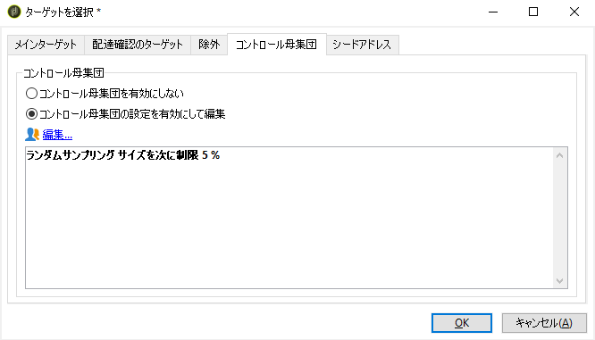

# 配信のベストプラクティス {#delivery-best-practices}

## 配信の最適化 {#optimize-delivery}

配信の作成に入る前に、送信プロセスを保証し、最適化するためにいくつかの作業をおこないます。

以下の節では、Adobe Campaign を最適に設定するためのベストプラクティスと推奨手順について説明します。このベストプラクティスに従えば、後で問題が発生する可能性を最小限に抑えることができます。

### プラットフォームのパフォーマンス

いくつかの要因がサーバーのパフォーマンスに直接影響し、プラットフォームの速度が低下することがあります。

* パーソナライゼーション要素の数とタイプ： 電子メールのパーソナライゼーションは、各受信者のデータベースからデータを取り出します。 パーソナライゼーション要素が多数ある場合は、配信の準備に必要なデータの量もそれだけ多くなります。この節のパーソナライゼーションの詳細 [を表示します](../../delivery/using/about-personalization.md)

* サーバーの読み込み： marketing serverが多数の異なるタスクを同時に処理している場合、パフォーマンスが低下する可能性があります。 マーケティングサーバーでは、すべての配信の入出力データをすべて調整して、データが正しく、かつ時間どおりになっていることを確認する必要があります。

   **ヒント** — これを避けるには、最高のパフォーマンスを確保するために、チームの他のメンバーと配信のスケジュールを調整します。

* ワークフローの実行： ワークフローの監視は、プラットフォームのパフォーマンスの問題を回避するために不可欠です。 このドキュメントに示すガイドライン [に従います](../../workflow/using/workflow-best-practices.md#execution-and-performance)。

* ホスト対象のお客様は、 [キャンペーンコントロールパネルの機能を利用して](https://docs.adobe.com/content/help/ja-JP/control-panel/using/discover-control-panel/key-features.html) 、  パフォーマンス監視機能を使用してプラットフォームを監視できます。

### ネットワーク設定の確認 {#network-config}

大量の E メールを配信してもスパム送信者と間違えられないようにするために、サーバーの身元を隠そうとしない適切なネットワーク設定を使用する必要があります。

**ヒント**:  ブランドのWebサイトに対応する透明な送信者アドレスを使用します。 例えば、旅行代理店の会社がバレンティノホテルチェーンを管理しているとします。 同社は、そのホテルチェーン用の Web サイトドメインとして valentino.com を所有しています。また、パリの Valentino ホテルの販促には paris.valentino.com サブドメインを使用しています。したがって、適切な送信者アドレスは hotel@paris.valentino.com などとなります。

### 配信品質の管理 {#deliverability-management}

バウンスメールが返ってきたり、スパムに指定されたりすることなく、E メールを受信者の受信ボックスに確実に届けるには、メッセージの配信品質の割合を向上させる必要があります。

* 配信品質とは何でしょうか。

   * 配信品質とは、受信者のサーバーが E メールを許可する能力を測定するためのファクターです。ISP（インターネットサービスプロバイダー）は、スパムとして識別した E メールを除外するか、E メール内の画像のダウンロードを禁止します。ISP は、特定のドメインから大量の E メールが送信されていると判断すると、その送信者から送られる E メールの許可数に上限を設定します。

   * E メールの配信品質を確認するときは、データ品質、メッセージとコンテンツ、送信インフラストラクチャ、レピュテーションという 4 つの主要カテゴリを中心に調べます。このトピックの詳細については、 [このセクションを参照してください](../../delivery/using/about-deliverability.md)。

* このドキュメントで詳しく説明 [する推奨を適用します](../../delivery/using/deliverability-key-points.md)。

* Adobeの担当者にお問い合わせください。

### 強制隔離の管理 {#quarantine-management}

強制隔離の管理プロセスを適切に維持することをお勧めします。

新しいプラットフォームで E メールの送信を開始するときは、まだ選定が十分でないアドレスのリストを使用することがあります。無効なアドレスやハニーポットアドレス（スパム送信者を誘き寄せるために作成されたメールボックス）に送信すると、プラットフォームのレピュテーションの低下につながります。適切な強制隔離管理プロセスは、次の目的に役立ちます。 アドレスの質を維持し、インターネットアクセスプロバイダによるブロックリストを回避し、エラー率を低減し、配信とスループットを高速化します。

**ヒント**

* If you have a list of invalid addresses, Adobe recommends importing it to the quarantine table, through **[!UICONTROL Administration]** > **[!UICONTROL Campaign Management]** > **[!UICONTROL Non deliverables Management]** > **[!UICONTROL Non deliverables and addresses]**.

* アドレスが強制隔離されている受信者は、配信分析時にデフォルトで除外され、ターゲティングされません。これによって配信が迅速になります。エラー率は配信の速度に大きく影響するからです。例えば、受信ボックスの容量が超過している場合や、アドレスが存在しない場合などに、E メールアドレスを強制隔離できます。[さらに詳しく](#identifying-quarantined-addresses-for-a-delivery)

* Adobe Campaign では、返されるエラーのタイプに応じて不正なアドレスを管理します。詳しくは、[この節](../../delivery/using/understanding-quarantine-management.md)を参照してください。

* 一部のインターネットアクセスプロバイダーは、無効なアドレスの割合が高すぎる場合、E メールを自動的にスパムとみなします。したがって、強制隔離を使用すると、これらのプロバイダーによってブロックリストに追加されるのを回避できます。

* 強制隔離管理は、誤った電話番号を配信から除外することで、SMSの送信コストを削減するのに役立ちます。

### 二重のオプトインのメカニズム {#double-opt-in}

無効なアドレスにメッセージが送信されるのを回避し、不適切な通信を規制し、送信者のレピュテーションを向上させるには、購読後の確認をおこなう二重のオプトインのメカニズムを実装することをお勧めします。これにより、受信者が意図的に購読したことを確認できます。

このメカニズムの実装の詳細については、 [この節で説明します](../../web/using/use-cases--web-forms.md)。

## テンプレートの使用 {#use-templates}

配信テンプレートは、一般的なアクティビティについての既製のシナリオを提供し、作業の効率化に役立ちます。配信テンプレートを使用すれば、最小限のカスタマイズをおこなうだけで、より迅速に新しいキャンペーンをデプロイできます。

配信テンプレートの詳細については、 [この節を参照してください](../../delivery/using/creating-a-delivery-template.md)。

### 配信テンプレートを使い始める {#gs-templates}

[配信テンプレートを使用すると](../../delivery/using/creating-a-delivery-template.md) 、ニーズに合った技術的な特性と機能的な特性を一度定義すれば、将来の配信で再利用できます。 その後、必要に応じて時間を節約し、配信を標準化できます。

Adobe Campaign で複数のブランドを管理する場合は、ブランドごとに 1 つのサブドメインを使用することをお勧めします。例えば銀行ならば、個々の支店に対応する複数のサブドメインを所有できます。銀行のドメインが bluebank.com の場合、サブドメインは、@ny.bluebank.com、@ma.bluebank.com、@ca.bluebank.com などになります。サブドメインごとに 1 つの配信テンプレートを用意すれば、それぞれのブランドに合わせて事前に設定されたパラメーターをいつでも使用でき、エラーの回避や時間の節約につながります。

**ヒント**:  Campaign Standardでの設定エラーを回避するには、新しいテンプレートを作成するのではなく、ネイティブのテンプレートを重複し、そのプロパティを変更することをお勧めします。

**アドレスの設定**

* 送信者のアドレスは、E メールを送信するための必須情報です。

* ISP（インターネットサービスプロバイダー）によっては、メッセージを許可する前に、送信者アドレスの有効性をチェックする場合があります。

* 正しくない形式のアドレスは、受信サーバーによって拒否される可能性があります。正しいアドレスが指定されていることを確認する必要があります。

* アドレスは、送信者を明示的に識別する必要があります。ドメインは、送信者によって所有され、登録されている必要があります。

* 配信アドレスと返信アドレスの E メールアカウントを作成することをお勧めします。詳しくは、自社のシステム管理者にご相談ください。

キャンペーンインターフェイスでアドレスを設定するには、次の手順に従います。

1. [配信テンプレートで](../../delivery/using/creating-a-delivery-template.md)、「 **[!UICONTROL 開始]** 」リンクをクリックします。 **[!UICONTROL E メールヘッダーのパラメーター]**&#x200B;ウィンドウで、次のフィールドに入力します。

   

1. 「 **[!UICONTROL Sender address]** 」フィールドで、アドレスドメインがAdobeに委任したサブドメインと同じであることを確認します。 「@」より前の部分は変更できますが、ドメインアドレスは変更できません。

1. 「 **[!UICONTROL 送信者]** 」フィールドで、ブランド名など、受信者が簡単に識別できる名前を使用して、配信の開放率を高めます。 受信者のエクスペリエンスの質を高めるために、「Megastore（担当：田中）」のように個人名を追加する方法もあります。

1. 「 **[!UICONTROL 返信アドレス]** 」のテキストフィールドでは、送信者のアドレスがデフォルトで返信に使用されます。 カスタマーサポートの代表アドレスなど、実際にある既存のアドレスを使用することをお勧めします。そうすれば、受信者から返信が来た場合に、カスタマーサポートが対応することができます。

**コントロール母集団の設定**

配信が送信されたら、除外された受信者の行動と、配信を受信した受信者の行動を比較します。その後、キャンペーンの効率性を測定できます。 コントロール母集団の詳細につ [いては、この節を参照してください](../../campaign/using/marketing-campaign-deliveries.md#defining-a-control-group)。

コントロール母集団を設定するには、「 **[!UICONTROL 宛先]** 」リンクをクリックします。 **[!UICONTROL ターゲットを選択]**&#x200B;ウィンドウで「**[!UICONTROL コントロール母集団]**」タブを選択します。ターゲットの一部を抽出できます。例えば、ランダムサンプリングとしてターゲットの 5％を抽出します。

**フィルターまたは制御ルールを適用するためのタイポロジの使用**

タイポロジには、メッセージを送信する前の分析フェーズで適用されるチェックルールが含まれています。

テンプレートのプロパティの「**[!UICONTROL タイポロジ]**」タブで、必要に応じて、デフォルトのタイポロジを変更します。

例えば、アウトバウンドトラフィックの制御を強化するために、使用可能な IP アドレスを定義するには、サブドメインごとに 1 つのアフィニティを定義し、アフィニティごとに 1 つのタイポロジを作成します。アフィニティは、インスタンスの設定ファイルで定義されます。 Adobe Campaign管理者に問い合わせてください。

For more on typologies, refer to [this section](../../campaign/using/about-campaign-typologies.md).

## 設計とパーソナライズ {#design-and-personalize}

メッセージコンテンツを設計するときは、配信の実行を妨げる可能性がある一般的な問題が発生しないようにします。Most of the time, possible errors are related to [personalization](../../delivery/using/about-personalization.md), [formatting](../../delivery/using/defining-the-email-content.md#message-content) and [images](../../delivery/using/defining-the-email-content.md#adding-images).

### パーソナライゼーションの最適化 {#optimize-personalization}

配信の実行を妨げる可能性がある一般的な問題を回避し、受信者のエクスペリエンスを向上させるために、Adobe Campaign でメッセージをパーソナライズできます。

Adobe Campaignデータベースに格納された受信者のデータを使用したり、トラッキング、ランディングページ、購読などを通じて収集されたデータを使用したりできます。
パーソナライゼーションの基本につ [いては、この節に説明します](../../delivery/using/personalization-fields.md)。

エラーを避けるために、メッセージコンテンツが適切に設計されていることを確認します。多くのエラーはパーソナライゼーションに関係しています。

**ヒント**: サードパーティベンダーが提供する外部ファイルからのパーソナライゼーションフィールドで、外部HTMLコンテンツが誤っている場合があります。 この問題を避けるには、構文、タグの使い方、使用されている文字などを確認します。例えば、Adobe Campaign のパーソナライゼーションタグは必ず &lt;%=table.field%> という形式で使用します。詳しくは、[この節](../../delivery/using/about-personalization.md)を参照してください。

パーソナライゼーションブロック内でのパラメーターの使い方が間違っていると、問題になる場合があります。例えば、JavaScript の変数は次のように使用する必要があります。

    &lt;%
    
    var brand = &quot;xxx&quot;
    
    %>

For more on personalization blocks, refer to the [this section](../../delivery/using/personalization-blocks.md).

配信の準備分析を向上させるために、ワークフローでパーソナライゼーションデータを準備できます。 これは、パーソナライゼーションデータが外部テーブルからFederated Data Access(FDA)を介して送られる場合に特に使用します。 このオプションについては、この節で説明 [します](../../delivery/using/personalization-fields.md#optimizing-personalization)

### 最適化されたコンテンツの作成 {#optimize-content}

E メールを作成する際は、以下の一般的なベストプラクティスを考慮してください。

* デザインをシンプルにする

* モバイルユーザーに注意

* 完全な画像ベースの電子メールを避ける

* 電子メールセーフフォントの使用

* 特殊文字のエンコード

**件名行** - [件名行に対してオープン率を改善する作業](../../delivery/using/defining-the-email-content.md#message-content) :

* 長すぎる件名は避けます。最大50文字を使用

* 「free」や「オファー」など、スパムと見なされる可能性のある繰り返しの単語を使用しないでください。

* 大文字や、「!」、「£」、「€」、「$」などの特殊文字は使用しないでください。

**ミラーページ** — 常にミラーページリンクを含めます。 電子メールの先頭に優先順位を付けます。 [さらに詳しく](../../delivery/using/sending-messages.md#generating-the-mirror-page)

**購読解除リンク** -購読解除リンクは必須です。 購読解除リンクが表示され、有効である必要があり、フォームが機能する必要があります。By default, when the message is analyzed, a [typology rule](../../delivery/using/steps-validating-the-delivery.md#validation-process-with-typologies) checks whether an opt-out link has been included and generates a warning if it is missing.

**ヒント**: 人為的エラーは常に可能なので、送信のたびにオプトアウトリンクが正しく機能することを確認してください。 例えば、配達確認を送信するときは、リンクが有効であること、フォームがオンラインであること、「今後のこの受信者への連絡は不要」フィールドが「はい」に変更されていることを確認します。

この節では、オプトアウトリンクを挿入する方法 [について説明します](../../delivery/using/personalization-blocks.md#personalization-blocks-example)。

**電子メールサイズ** — パフォーマンスや配信品質の問題を回避するため、電子メールの推奨最大サイズは約35 KB ****。 To check the message size, go the **[!UICONTROL Preview]** tab and choose a test profile. メッセージが生成されると、サイズが右上隅に表示されます。

E メールの制限を守るには、以下を考慮してください。

* 重複したスタイルまたは未使用のスタイルを削除する

* 一部の電子メールコンテンツをランディングページに移動

* コードの縮小

最後の送信の前に、変更をテストしてください

**SMS の長さ**

デフォルトでは、SMS の文字数は GSM（Global System for Mobile Communications）標準に準じています。GSM エンコードを使用する SMS メッセージは 160 文字以内に制限されています。複数の部分に分けて送信されるメッセージの場合は、SMS 1 件につき 153 文字以内です。

表記変換では、SMS の特定の文字が GSM 標準に準じていない場合に、別の文字に置き換えられます。パーソナライゼーションフィールドを SMS メッセージのコンテンツに入れると、GSM エンコードに対応していない文字が含まれる場合があります。文字の表記変換を許可するには、対応する&#x200B;**[!UICONTROL 外部アカウント]**&#x200B;の「SMPP チャネル設定」タブにあるチェックボックスをオンにします。Learn more [in this section](../../delivery/using/sms-channel.md#creating-an-smpp-external-account).

**ヒント**:

* SMS メッセージのすべての文字をそのまま維持するには（例えば、固有名詞が改変されないようにするには）、表記変換を有効にしないでください。

* ただし、SMS メッセージに GSM 標準に準じていない文字が多数含まれる場合は、表記変換を有効にしてメッセージ送信のコストを抑えることができます。

Learn more [in this section](../../delivery/using/sms-channel.md#about-character-transliteration).

### フォーマット {#formatting}

フォーマットに関する一般的なエラーを回避するには、次の点を確認します。

* Correct **date formatting**: Adobe Campaign provides date formatting functions for the JavaScript templates and XSL stylesheets. [さらに詳しく](../../delivery/using/formatting.md#date-display)

* 電子メールでの **認証文字の使用** : 電子メールアドレスに有効な文字のリストは、&quot;XtkEmail_Characters&quot;オプションで定義されます。 この節では、キャンペーンオプションにアクセス [する方法を説明します](../../installation/using/configuring-campaign-options.md)。 特殊文字を適切に処理するには、Adobe Campaign を Unicode でインストールする必要があります。

* Configuration of **Email Authentication**: 電子メールヘッダーにDKIM署名が含まれていることを確認します。 DKIM（Domain Keys Identified Mail）認証を使用すると、受信 E メールサーバーは、送信したと主張する個人または法人によってメッセージが実際に送信されたかと、メッセージコンテンツが最初に送信された（および DKIM が「署名された」）ときと受信時で変更されているかどうかを検証できます。この標準は、通常、「From」または「Sender」ヘッダーのドメインを使用します。詳しくは、[この節](../../delivery/using/technical-recommendations.md#dkim)を参照してください。

* **レスポンシブ E メールデザインを使用すると、E メールを開封するデバイスに応じて E メールを最適に表示できます。**

   * Web HTML ではなく、レスポンシブ E メール HTML を使用します。

   * プレビューモードと配達確認を使用して、できるだけ多くのデバイス上でレンダリングをテストします。

   * The Adobe Campaign Classic Digital Content Editor (DCE) module includes some responsive design formatted templates for mobile available via **[!UICONTROL Resources]** > **[!UICONTROL Templates]** > **[!UICONTROL Content templates]**. 詳細 [については、この記事](https://theblog.adobe.com/responsive-email-design-101/)。

### 画像の管理 {#manage-images}

画像を使用する場合は、次のガイドラインに従ってください。

* **画像のブロックを防ぐ** — 一部の電子メールクライアントは、デフォルトで画像をブロックし、一部のユーザーはデータ使用時の保存を禁止する設定を変更します。 したがって、画像をダウンロードしないと、メッセージ全体が失われる可能性があります。 これを回避するには：

   * コンテンツと画像とテキストのバランスを取ります。画像のみの E メールは避けます。

   * 画像にテキストを含める必要がある場合は、代替テキストやタイトルテキストを使用して、必ずメッセージが伝わるようにします。代替テキストやタイトルテキストのスタイルを設定して、外観を改善します。

   * 背景画像は一部の E メールクライアントでサポートされていないので、使用しないようにします。

* **画像をレスポンシブにする** — 画像をレスポンシブでサイズ変更可能にするようにします。 これは作成に時間がかかるので、コストに影響する可能性があります。

* **絶対画像参照の使用** — 外部からアクセスできるように、キャンペーンにリンクされた電子メールやパブリックリソースで使用される画像は、外部からアクセス可能なサーバー上に存在する必要があります。

   * インスタンスの設定でパブリックリソースの管理が有効になっているかどうかを確認できます。[さらに詳しく](../../installation/using/deploying-an-instance.md#managing-public-resources)

   * 配信ウィザードで、画像を含んだ HTML ページをインポートするか、HTML エディターの&#x200B;**[!UICONTROL 画像]**&#x200B;アイコンを使用して直接画像を挿入します。[さらに詳しく](../../delivery/using/defining-the-email-content.md#adding-images)

   * 画像が表示されない場合は、その画像がサーバー上で使用できることを確認してください。そのためには、配信から「ソース」タブをクリックします。使用する画像を探し、各画像の URL をコピーして Web ブラウザーに貼り付けます。画像が表示されない場合は、IT 管理者か、配信コンテンツを提供しているサードパーティベンダーに問い合わせてください。

### メッセージのプレビュー {#preview-msg}

Adobeでは、メッセージをプレビューして、個人設定と受信者に対する配信の表示方法を確認することをお勧めします。

* In the delivery wozard, the **[!UICONTROL Preview]** sub-tab lets you view the rendering of each content for a recipient. コンテンツのパーソナライゼーションフィールドや条件付き要素は、選択したプロファイル内の対応する情報で置き換えられます。[さらに詳しく](../../delivery/using/defining-the-email-content.md#message-content)

* 各プレビュー中に自動的にアンチスパムチェックを行う。 「 **[!UICONTROL プレビュー]** 」サブタブで、「 [SpamAssicin](../../delivery/using/spamassassin.md) spam scoring」をチェックします。  「 **[!UICONTROL 詳細…]** 」をクリックして、警告の詳細を確認します。  これを行う前に、SpamAssinが正しくインストールされ、Adobe Campaignアプリケーションサーバーに設定されていることを確認してください。 [さらに詳しく](../../installation/using/configuring-spamassassin.md)

## 適切なターゲットの定義 {#define-the-right-target}

ターゲット母集団が鍵です。リストを慎重に作成し、一般的な E メールクライアントやモバイルデバイスで E メールをテストし、E メールリストが最新のものであるか（不明なアドレスや古いアドレスが含まれていないこと）を確認します。また、もれのない検証サイクルを確立するために、配達確認を送信することもできます。

この節のターゲット数の詳細 [を表示します](../../delivery/using/steps-defining-the-target-population.md)

### 適切なオーディエンスのターゲット {#target-the-right-audience}

コンテンツを用意できたら、メッセージの受信者を慎重に定義する必要があります。

配信を適切におこなうには、適切な受信者に最も関連性の高いパーソナライズされたコンテンツを送信する必要があります。Adobe Campaign では、精度の高いターゲットを作成できます。つまり、年齢、場所、購入履歴、以前の配信でリンクをクリックしたかどうかなどの条件に基づいて、受信者を選択できます。また、ターゲットの的確性を確認するために、テストプロファイル、コントロール母集団、シードアドレスを定義することもできます。

### ターゲットマッピング {#target-mappings}

Campaign Classicでは、デフォルトで配信テンプレートターゲット **受信者**。 Adobe Campaign では、必要に応じて、これ以外のターゲットマッピングも配信に使用できます。

例えば、ソーシャルネットワークからプロファイルを収集された訪問者や、情報サービスを購読している訪問者に配信できます。

これらのマッピングは、こ [の節に示します](../../delivery/using/selecting-a-target-mapping.md)。

また、カスタマイズしたターゲットマッピングを作成して使用することもできます。詳しくは、[この節](../../configuration/using/target-mapping.md)を参照してください。

### 外部受信者 {#external-recipients}

データベースに保存されている受信者ではなく、外部ファイルに保存されている受信者に配信できます。Learn more [in this section](../../delivery/using/steps-defining-the-target-population.md#selecting-external-recipients).

### 購読者に送信 {#send-to-subscribers}

ニュースレターの購読者にメッセージを送信するには、購読者を対応する情報サービスに直接ターゲットします。 Learn more [in this section](../../delivery/using/managing-subscriptions.md#delivering-to-the-subscribers-of-a-service).

### テスト受信者とシードアドレス {#test-recipients-seed-addresses}

配信をテストするには、メインターゲットに送信する前に配達確認を使用します。

配達確認の受信者には適切な人を選択してください。配達確認の受信者は、メッセージのフォームとコンテンツを検証する必要があります。配達確認受信者を定義する手順は、こ [の節で説明します](../../delivery/using/steps-defining-the-target-population.md#selecting-the-proof-target)。

シードアドレスは、定義されたターゲット条件に合わない受信者を配信のターゲットにして、メインターゲットに送信する前に配信テストをおこなう場合に使用します。They are presented [in this section](../../delivery/using/about-seed-addresses.md).

### 重複したアドレス {#deduplicate-addresses}

重複した E メールアドレスがあると、ターゲットに影響する可能性があるので、E メールアドレスの重複を回避することが重要です。

* ターゲットが分割されている場合は、同じメッセージを複数回送信できます。

* 受信者がメッセージを受信後に購読解除しても、重複したプロファイルはその後もメッセージを受信します。

アドレスの重複は、送信レピュテーションを保護し、適切な強制隔離管理をおこなうためのものです。

詳し [くは、この使用例を参照してください](../../workflow/using/deduplication.md#example--identify-the-duplicates-before-a-delivery)。

### 電子メールアドレスのインデックス作成 {#index-addresses}

このアプリケーションで使用する SQL クエリのパフォーマンスを最適化するには、データスキーマのメイン要素からインデックスを宣言します。

The steps for adding an index to the email address are presented [in this section](../../configuration/using/database-mapping.md#indexed-fields).

## 送信前にすべてのチェックを実行する {#perform-all-checks}

メッセージを用意できたら、そのコンテンツがすべてのデバイス上で正しく表示されることを確認します。また、パーソナライゼーションの誤りや壊れたリンクなどのエラーがないことも確認します。

メッセージを送信する前に、配信パラメーターと配信設定に矛盾がないことも確認します。

### 検証が重要 {#validation-is-key}

配信を送信する前に、配信を本当に届けたい受信者にメッセージが届くかどうかを確認する必要があります。そのためには、メッセージのコンテンツと配信パラメーターを検証します。

この手順により、メインターゲットに配信する前に、エラーを検出して修正できます。

配信を検証する手順は、この節 [で説明します](../../delivery/using/steps-validating-the-delivery.md)。

### 受信ボックスレンダリング {#inbox-and-email-rendering}

受信ボックスレンダリングを使用すると、主な E メールクライアントでメッセージをプレビューし、コンテンツとレピュテーションをスキャンし、受信者がどのようにメッセージを読むかを確認できます。

**ヒント**:

* 送信されたメッセージは、Web メールやメッセージサービス、モバイルなど、メッセージを受信する様々なコンテキストで表示できます。

* 受信ボックスレンダリング機能は、E メールキャンペーンで E メールが主要な ISP（インターネットサービスプロバイダー）および Web メールサービスのフィルターを無事通過できるかどうかを確認するために非常に重要です。このようなツールは、テスト用受信ボックスのネットワークに E メールのプリフライトコピーを送信します。これにより、メッセージがこれらのサービスでどのように表示（レンダリング）されるかを確認できます。このツールには、迅速な識別および修正に役立つレポートとコード修正オプションも含まれており、配信品質を向上させることができます。

Learn more [in this section](../../delivery/using/inbox-rendering.md).

### 配達確認メッセージ {#proof-messages}

配達確認を送信すると、オプトアウトリンクやミラーページ、その他のリンクの確認、メッセージの検証、画像の表示の確認、エラーの検出などをおこなうことができます。また、様々なデバイス上でデザインとレンダリングを確認することもできます。

Learn more [in this section](../../delivery/using/steps-validating-the-delivery.md#sending-a-proof).

### 配信の A/B テストの設定 {#a-b-testing-deliveries}

E メール配信で使用するコンテンツがいくつかある場合は、A/B テストを使用して、ターゲット母集団に与える影響が最も大きいコンテンツを見つけることができます。

**ヒント**:

* 一部の受信者に異なるバージョンを送信する

* 成功率が最も高い成功率のものを選択し、それを残りのターゲットに送信します。

Learn more [in this section](../../workflow/using/a-b-testing.md).

### メッセージを確実に配信する {#make-sure-your-message-is-delivered}

最後の手順です。メッセージが実際に関連性の高い受信者に配信されるように Adobe Campaign Classic の機能を最大限に活用します。

**検証プロセスの実行** -Adobe Campaign演算子やグループを含む完全な検証プロセスを定義して、ターゲットとメッセージの内容の両方を検証できます。 これにより、キャンペーンの様々なプロセスを完全に監視および制御できます。 ターゲット設定、コンテンツ、予算、抽出、配達確認の送信を行います。 ユーザーは、それぞれの権限に応じた通知を受け取ります。また、配達確認を受信したり、メッセージを検証または却下することもできます。Learn more [in this section](../../campaign/using/marketing-campaign-approval.md#approval-process).

**ウェーブの使用** -ウェーブを使用して、送信されるボリュームを徐々に増やすことができます。 これにより、メッセージがスパムとしてマークされたり、1日あたりのメッセージ数を制限したい場合を回避できます。 ウェーブを使用すると、一度に大量のメッセージを送信するのではなく、配信をいくつかのバッチに分割できます。Learn more [in this section](../../delivery/using/steps-sending-the-delivery.md#sending-using-multiple-waves).

**メッセージの優先順位を設定** — 優先順位レベルを指定することで、配信の送信順序を設定できます。 それには、次の手順に従います。

1. 配信プロパティを編集し、「**[!UICONTROL 配信]**」タブを選択します。

1. 「**[!UICONTROL 非常に低い]**」から「**[!UICONTROL 非常に高い]**」までのスケール上で、この配信の優先順位レベルを定義します。

>[!NOTE]
>
>配信内からメッセージを送信する順序を定義することはできません。

**IPアフィニティの設定** — 送信SMTPトラフィックをより適切に制御するために、各アフィニティで使用できる特定のIPアドレスを定義することで、アフィニティを管理できます。 この設定により、コンピューターや出力アドレスに配信される E メールの数を制限できます。例えば、1 つの国またはサブドメインにつき 1 つのアフィニティを使用できます。さらに、1 つの国につき 1 つのタイポロジを作成し、各アフィニティを各国の対応するタイポロジに関連付けることができます。

次の操作をおこなうことができます。

* serverConf.xml 設定ファイルに IP アフィニティを定義します。[さらに詳しく](../../installation/using/configuring-campaign-server.md#managing-outbound-smtp-traffic-with-affinities)

* IPAffinity 要素ごとに、使用可能な IP アドレスを宣言します。[さらに詳しく](../../installation/using/email-deliverability.md#list-of-ip-addresses-to-use)

* In the [typology](../../campaign/using/about-campaign-typologies.md) of your choice, use the **[!UICONTROL Managing affinities with IP addresses]** field to link deliveries to the delivery server (MTA) which manages the said affinity. [詳細情報](../../campaign/using/applying-rules.md#control-outgoing-smtp-traffic)。

* E メールを送信したら、配信の送信元 IP アドレスをヘッダーで確認します。ヘッダー情報は E メール管理者から入手できます。

>[!NOTE]
>
>これらの手順のほとんどは外部ユーザーのみ実行できます。

**タイポロジの使用** -タイポロジルールを使用して、特定の条件に基づいてターゲットの一部を除外できます。 このテストにより、企業のコミュニケーションポリシーに準拠しつつ、顧客のニーズと期待に応える最適なメッセージを送信できます。例えば、ニュースレターの対象から未成年の受信者を除外できます。詳し [くは、この例を参照してください](../../campaign/using/filtering-rules.md)。

**添付ファイルの回避** — 添付ファイルは、マルウェアの増加に最も一般的なベクトルの1つです。特に、一括送信時には添付ファイルが存在します。 ドキュメントを添付するのではなく、ドキュメントへのセキュアなリンクを渡します。これにより、セキュリティレベルを引き上げて意図しない再配布を防ぐことができます。また、受信側の E メールゲートウェイでサイズ超過やセキュリティ上の理由によりメッセージが拒否される可能性を大幅に減らすこともできます。

## トラッキングと監視 {#track-and-monitor}

「送信」ボタンをクリックしましたか。何が起こるかを見てみましょう。配信の送信後、Adobe Campaign では、送信済みメッセージをトラッキングして、配信に対する受信者の反応を確認できます。これは、今後の送信を改善し、次のキャンペーンを最適化するのに役立ちます。

### 配信の監視 {#monitoring-deliveries}

キャンペーンを制御するには、メッセージが実際に受信者に配信されたことを確認する必要があります。

キャンペーン配信ダッシュボードから、処理済みのメッセージと配信の監査ログを確認できます。
配信ログのメッセージのステータスも制御できます。[詳細情報](../../delivery/using/monitoring-a-delivery.md#delivery-dashboard)。

配信が送信されず、そのステータスが「**保留中**」のままになっている場合は、どのような状況が考えられるでしょうか。

* 実行プロセスが、リソースが使用可能になるのを待っています。MTA が開始されていない可能性があります。mta@instanceモジュールがMTAサーバーで起動されていることを確認し、必要に応じてMTAモジュールを開始します。 [詳細情報](../../production/using/administration.md)。

* 送信インスタンスに設定されていないアフィニティを配信で使用している可能性があります。ヒント： トラフィック管理(IPアフィニティ)の設定を確認します。 詳しくは、送信 SMTP トラフィックの制御を参照してください。

>[!NOTE]
>
>これらの手順はエキスパートユーザーのみ実行できます。

### トラッキング {#tracking-deliveries}

受信者の動作をより深く知るには、配信に対するユーザーの反応を追跡します。 受信、開封、リンクのクリック、購読解除など Campaign Classicでは、この情報は、配信がターゲットとする受信者の「追跡」タブと配信の「追跡」タブに表示されます。 Campaign Standardは、配信の「トラッキングログ」タブに表示されます。

**ヒント**: メッセージ追跡はデフォルトで有効です。 URL を設定するには、配信ウィザードの下部のセクションで「URL を表示」オプションを選択します。メッセージの URL ごとに、トラッキングを有効化するかどうかを選択できます。

For more on this, refer to the [Configuring tracking](../../delivery/using/how-to-configure-tracked-links.md) section and the [Tracking indicators](../../reporting/using/delivery-reports.md#tracking-indicators) description.

### 配信パフォーマンス {#delivery-performances}

メッセージが配信される速度を測定するには、配信スループットを制御します。1 時間に送信されたメッセージの数とメッセージのサイズ（bps）が基準になります。詳しくは、[配信スループット](../../reporting/using/global-reports.md#delivery-throughput)を参照してください。

**ヒント**:

* 配信を失敗した状態のままインスタンス上で放置すると、一時テーブルが維持され、パフォーマンスに影響が生じるため、配信を失敗した状態のまま放置しないでください。

* アドレスの品質を維持するため、不要になった配信やアクティブでない受信者はデータベースから削除してください。

* 大規模な配信を同時にスケジュールしないようにしてください。負荷がシステム全体で均等に分散されるまでには、5～10 分かかることがあります。

## 配信のトラブルシューティング {#delivery-troubleshooting}

配信に関する問題が発生した場合は、特定のアクションを実行できます。

* [配信品質の問題](../../production/using/performance-and-throughput-issues.md#deliverability_issues)

* [画像の表示の問題](../../production/using/image-display-issues.md)

* [配信パフォーマンスの問題](../../delivery/using/monitoring-a-delivery.md#performance_issues)

* [一時ファイルの問題](../../production/using/temporary-files.md) — 社内 *のお客様のみ*
