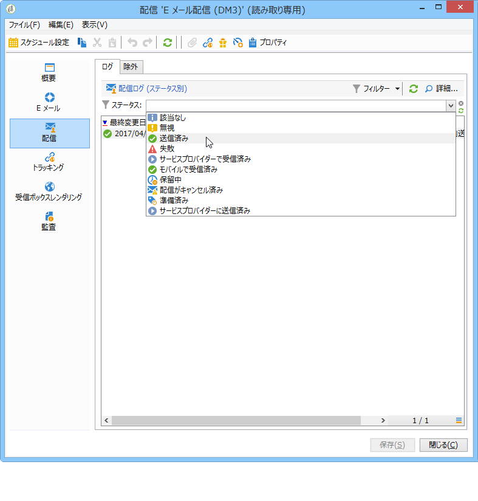
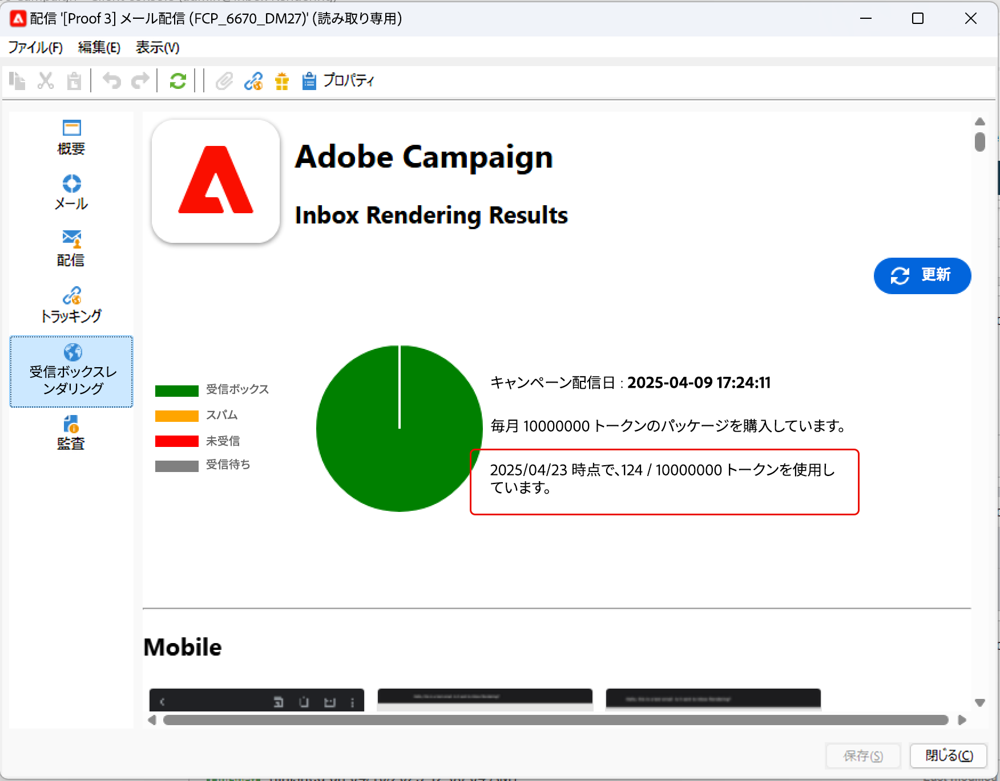

# 配信ダッシュボード {#delivery-dashboard}

**配信ダッシュボード**&#x200B;は、配信と、メッセージの送信時に結果として起こる問題を監視するための重要な要素です。

配信の情報を取得し、必要に応じて編集できます。 配信の送信後、タブの内容が変更されなくなる場合があります。

ダッシュボードで使用可能ないくつかのタブを使用して監視できる情報は、次のとおりです。

* [配信の概要](#delivery-summary)
* [配信レポート](#delivery-reports)
* [配信ログ、ミラーページ、除外](#delivery-logs-and-history)
* [配信トラッキングログと履歴](#tracking-logs)
* [配信レンダリング](#delivery-rendering)
* [配信監査](#delivery-audit-)


**関連トピック：**

* [配信エラーの理解](../../delivery/using/understanding-delivery-failures.md)
* [強制隔離管理の理解](../../delivery/using/understanding-quarantine-management.md)
* [配信のベストプラクティス](../../delivery/using/delivery-best-practices.md)
* [配信品質の管理](../../delivery/using/about-deliverability.md)

## 配信の概要 {#delivery-summary}

「**[!UICONTROL 概要]**」タブには、配信ステータス、使用するチャネル、送信者に関する情報、件名、実行に関連する情報など、配信の内容が表示されます。

## 配信レポート {#delivery-reports}

**[!UICONTROL 「レポート]**」リンクは、**[!UICONTROL 「概要]**」タブからアクセスでき、配信操作に関連するレポートのセットを確認できます。一般配信レポート、詳細レポート、配信レポート、失敗したメッセージの配信、開始率、クリック数、トランザクション数など

このタブの内容は、必要に応じて設定できます。 配信レポートの詳細については、[この](../../reporting/using/delivery-reports.md)を参照してください。


## 配信ログ、履歴、除外{#delivery-logs-and-history}

「**[!UICONTROL 配信]**」タブには、この配信内で発生した事象の履歴が表示されます。このタブには、配信ログ、つまり、送信されたメッセージのリストとそのステータスおよび関連メッセージが含まれます。

1 つの配信について、（例えば）配信が失敗した受信者や、アドレスが強制隔離中の受信者のみを表示できます。そのためには、「**[!UICONTROL フィルター]**」ボタンをクリックして、「**[!UICONTROL ステータス別]**」を選択します。ドロップダウンリストでステータスを選択します。各種ステータスについて詳しくは、[このページ](../../delivery/using/delivery-statuses.md)を参照してください。

>[!NOTE]
>
>配信ログを表示するリストは、Campaign Classic内の任意のリストと同様にカスタマイズできます。 例えば、配信で各電子メールに送信したIPアドレスを示す列を追加できます。 詳しくは、[このセクション](#use-case)で詳しく説明している使用事例を参照してください。



「**[!UICONTROL このメッセージのミラーページを表示]**」リンクを使用して、リストから選択した配信のコンテンツのミラーページを新しいウィンドウに表示できます。

ミラーページは、HTML コンテンツが定義済みの配信に対してのみ表示可能です。詳しくは、[ミラーページの生成](../../delivery/using/sending-messages.md#generating-the-mirror-page)を参照してください。


## 配信トラッキングログと履歴{#tracking-logs}

「**[!UICONTROL トラッキング]**」タブには、この配信のトラッキング履歴が一覧表示されます。このタブには、送信されたメッセージのトラッキングデータ、つまり、Adobe Campaign によってトラッキングされたすべての URL が表示されます。トラッキングデータは 1 時間ごとに更新されます。

>[!NOTE]
>
>配信の追跡が有効になっていない場合、このタブは表示されません。

トラッキング設定は、配信ウィザードの適切なステージで実行されます。[トラッキングするリンクの設定方法](../../delivery/using/how-to-configure-tracked-links.md)を参照してください。

**[!UICONTROL トラッキング]**&#x200B;データは、配信レポートに表示されます。[この節](../../reporting/using/delivery-reports.md)を参照してください。


## 受信ボックスレンダリング {#delivery-rendering}

「**[!UICONTROL インボックスレンダリング]**」タブを使用すると、メッセージを受信する別のコンテキストにプレビューし、主要なデスクトップおよびアプリケーションでの互換性を確認できます。

これにより、様々なWebクライアント、Webメール、デバイス上で最適な方法で受信者にメッセージが表示されるようにできます。

インボックスのレンダリングについて詳しくは、[このページ](../../delivery/using/inbox-rendering.md)を参照してください。



## 配信監査 {#delivery-audit-}

「**[!UICONTROL 監査]**」タブには、配信ログと、配達確認に関連するすべてのメッセージが含まれます。

**[!UICONTROL 更新]**&#x200B;ボタンを使用してデータを更新できます。「**[!UICONTROL フィルター]**」ボタンを使用して、データに対してフィルターを定義します。

特別なアイコンによって、エラーまたは警告を識別できます。[配信の分析](../../delivery/using/steps-validating-the-delivery.md#analyzing-the-delivery)を参照してください。

「**[!UICONTROL 配達確認]**」サブタブには、送信済みの配達確認のリストが表示されます。


表示する列を選択することによって、このウィンドウ（および「**[!UICONTROL 配信]**」タブと「**[!UICONTROL トラッキング]**」タブ）に表示される情報を変更できます。そのためには、右下隅にある&#x200B;**[!UICONTROL リストを設定]**&#x200B;アイコンをクリックします。リストの表示について詳しくは、[この節](../../platform/using/adobe-campaign-workspace.md#configuring-lists)を参照してください。

## 配信ダッシュボードの同期 {#delivery-dashboard-synchronization}

配信が正常に送信されたことを確認するために、配信ダッシュボードから、処理されたメッセージおよび配信ログを確認できます。

一部の指標またはステータスが間違っていたり、最新ではないことがあります。これは、次の解決策で解消できる場合があります。

* 配信ステータスが間違っている場合は、この配信に対して必要なすべての承認がおこなわれていることと、**[!UICONTROL operationMgt]** および **[!UICONTROL deliveryMgt]** ワークフローがエラーなしで実行されていることを確認します。これは、送信インスタンスで設定されていないアフィニティを配信で使用していることが原因である可能性もあります。

* 配信指標がゼロのままで、ミッドソーシング設定である場合は、**[!UICONTROL ミッドソーシング（配信カウンター）]**&#x200B;テクニカルワークフローをチェックします。ステータスが&#x200B;**[!UICONTROL 開始済み]**&#x200B;ではない場合は、開始します。その後、Adobe Campaign エクスプローラーで関連する配信を右クリックして、**[!UICONTROL アクション]**／**[!UICONTROL 配信とトラッキング指標を再計算]**&#x200B;を選択することによって、指標を再計算できます。トラッキング指標について詳しくは、この[節](../../reporting/using/delivery-reports.md#tracking-indicators)を参照してください。

* 配信カウンターが配信と一致しない場合は、Adobe Campaign エクスプローラーで関連する配信を右クリックし、**[!UICONTROL アクション]**／**[!UICONTROL 配信とトラッキング指標を再計算]**&#x200B;を選択して、指標を再計算して再同期してください。トラッキング指標について詳しくは、この[節](../../reporting/using/delivery-reports.md#tracking-indicators)を参照してください。

* ミッドソーシングデプロイメントの配信カウンターが最新ではない場合は、**[!UICONTROL ミッドソーシング（配信カウンター）]**&#x200B;テクニカルワークフローが実行されていることを確認します。詳しくは、この[ページ](../../installation/using/mid-sourcing-deployment.md)を参照してください。

配信ダッシュボードで各種レポートの配信をトラッキングすることもできます。詳しくは、[この節](../../reporting/using/delivery-reports.md)を参照してください。

## 使用例：送信者のIPアドレスをログに追加する{#use-case}

この節では、配信に各電子メールを送信したIPアドレスに関する配信ログ情報を追加する方法を学びます。

>[!NOTE]
>
>この変更は、単一のインスタンスまたはミッドソーシングインスタンスを使用する場合と異なります。 変更を行う前に、電子メール送信インスタンスに接続していることを確認します。

### 手順1:スキーマの拡張

配信ログに&#x200B;**publicID**&#x200B;を追加するには、まずスキーマを拡張する必要があります。 次の手順に従って進むことができます。

1. **[!UICONTROL 管理]** > **[!UICONTROL 設定]** > **[!UICONTROL データスキーマ]** > **[!UICONTROL 新規]**&#x200B;の下に、スキーマ拡張を作成します。

   スキーマ拡張機能の詳細については、[このページ](../../configuration/using/extending-a-schema.md)を参照してください。

1. 受信者配信ログ(nms)を拡張し、カスタム名前空間を定義するには、**[!UICONTROL broadLogRcp]**&#x200B;を選択します。 この場合、「cus」になります。

   

   >[!NOTE]
   >
   >インスタンスがミッドソーシングの場合は、broadLogMidスキーマを使用する必要があります。

1. 拡張部追加の新しいフィールド。 このサンプルでは、次の

   ```
   <element img="nms:broadLog.png" label="Recipient delivery logs" labelSingular="Recipient delivery log" name="broadLogRcp"/>
   ```

   作成者：

   ```
   <element img="nms:broadLog.png" label="Recipient delivery logs" labelSingular="Recipient delivery log" name="broadLogRcp">
   <attribute desc="Outbound IP identifier" label="IP identifier"
   name="publicId" type="long"/>
   </element>
   ```

   

### 手順2:データベース構造の更新

変更が完了したら、データベース構造を更新して、論理的な説明と一致させる必要があります。

これをおこなうには、以下の手順に従います。

1. **[!UICONTROL ツール]** > **[!UICONTROL 詳細]** > **[!UICONTROL データベース構造の更新…をクリックします。]**&#x200B;メニュー。

   

1. **[!UICONTROL テーブルの編集]**&#x200B;ウィンドウで、**[!UICONTROL NmsBroadLogRcp]**&#x200B;テーブル(ミッドソーシング環境の場合は&#x200B;**[!UICONTROL broadLogMid]**&#x200B;テーブル)が次のようにチェックされます。

   

   >[!IMPORTANT]
   >
   >**[!UICONTROL NmsBroadLoGRcp]**&#x200B;テーブル(ミッドソーシング環境の場合は&#x200B;**[!UICONTROL broadLogMid]**&#x200B;テーブル)を除き、他の変更がないことを必ず確認してください。 その場合は、他のテーブルのチェックを外します。

1. 「**[!UICONTROL 次へ]**」をクリックして確認します。次の画面が表示されます。

   

1. 「**[!UICONTROL 次へ]**」、「**[!UICONTROL 開始]**」の順にクリックして、データベース構造の更新を開始します。 インデックスの作成を開始しています。 この手順は、**[!UICONTROL NmsBroadLogRcp]**&#x200B;テーブルの行数に応じて長くなる場合があります。

   

>[!NOTE]
>
>データベースの物理構造の更新が正常に完了したら、変更を考慮に入れるために、接続を解除し、再接続する必要があります。

### 手順3:変更の検証

すべてが正しく動作していることを確認するには、配信ログ画面を更新する必要があります。

これを行うには、配信ログにアクセスし、「IP identifier」列を追加します。


>[!NOTE]
>
>Campaign Classicインターフェイスでリストを設定する方法については、[このページ](../../platform/using/adobe-campaign-workspace.md)を参照してください。

次に、変更後の&#x200B;**[!UICONTROL 「配信]**」タブの内容を示します。


