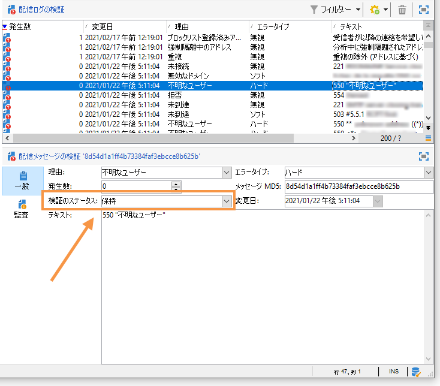
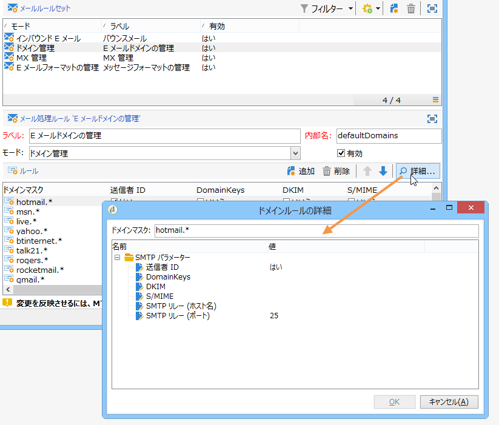

# 配信エラーと強制隔離の管理 {#delivery-failures-quarantine}

>[!NOTE]
>
>配信エラーと強制隔離の管理に関する包括的なガイダンスについて詳しくは、Campaign v8 ドキュメントを参照してください。このコンテンツは、Campaign Classic v7 と Campaign v8 の両方のユーザーに適用されます。
>
>* [配信エラーについて](https://experienceleague.adobe.com/ja/docs/campaign/campaign-v8/send/monitor/delivery-failures){target="_blank"} - エラーのタイプ、エラーの理由、同期／非同期エラー、再試行管理、トラブルシューティングについて説明します
>* [強制隔離の管理](https://experienceleague.adobe.com/ja/docs/campaign/campaign-v8/send/monitor/quarantines){target="_blank"} - 強制隔離とブロックリスト、ソフトエラーしきい値、強制隔離レポート、アドレス削除について説明します
>
>このページでは、ハイブリッドおよびオンプレミスのデプロイメントでのバウンスメールと強制隔離の管理に対する **Campaign Classic v7 固有の設定**&#x200B;について説明します。

## 配信エラーについて

配信エラーの一般的な概念、エラーのタイプ、トラブルシューティングのガイダンスについて詳しくは、[Campaign v8 配信エラーについてのドキュメント](https://experienceleague.adobe.com/ja/docs/campaign/campaign-v8/send/monitor/delivery-failures){target="_blank"}を参照してください。

## バウンスメールの設定 {#bounce-mail-config}

**Campaign Classic v7 ハイブリッド／オンプレミスデプロイメント**&#x200B;では、バウンスメールの処理を管理するために次の設定オプションを使用できます。

### バウンスメールボックスの設定 {#bounce-mailbox-configuration}

オンプレミスインストールの場合、バウンスメールボックスの設定について詳しくは、[この節](../../installation/using/deploying-an-instance.md#managing-bounced-emails)を参照してください。

メール管理ルールのリストを充実させるために、非同期エラーメッセージは、バウンスメールボックスを通じて Adobe Campaign プラットフォームによって収集され、inMail プロセスによって選定されます。

>[!NOTE]
>
>Campaign v8 Managed Cloud Services ユーザーの場合、バウンスメールボックスの設定はアドビで実行および管理されます。設定は必要ありません。

### バウンスメールの選定の管理 {#bounce-mail-qualification-management}

従来の Campaign MTA を使用したオンプレミスインストールおよびホスト／ハイブリッドインストールの場合、メールの配信に失敗すると、Adobe Campaign 配信サーバーは、メッセージングサーバーまたはリモート DNS サーバーからエラーメッセージを受け取ります。エラーのリストは、リモートサーバーが返したメッセージに含まれる文字列で構成されます。エラータイプと理由が各エラーメッセージに割り当てられます。

このリストは、**[!UICONTROL 管理／キャンペーン管理／配信不能件数の管理／配信ログ選定]**&#x200B;ノードから表示できます。このリストには、配信エラーを評価するために Adobe Campaign が使用するすべてのルールが含まれています。このリストは、完成されたものではなく、Adobe Campaign によって定期的に更新されます。ユーザーが管理することもできます。

このエラータイプが最初に発生したときにリモートサーバーから返されたメッセージは、**[!UICONTROL 配信ログ選定]**&#x200B;テーブルの&#x200B;**[!UICONTROL 最初のテキスト]**&#x200B;列に表示されます。この列が表示されない場合は、リストの右下にある「**[!UICONTROL リストを設定]**」ボタンをクリックし、この列を選択します。

Adobe Campaign は、このメッセージをフィルター処理して変数コンテンツ（ID、日付、メールアドレス、電話番号など）を削除し、フィルター処理した結果を&#x200B;**[!UICONTROL テキスト]**&#x200B;列に表示します。変数は、**`#xxx#`** で置き換えられます（ただし、アドレスは **`*`** で置き換えられます）。

このプロセスで同じタイプのすべてのエラーをまとめることにより、同じようなエラーの複数のエントリが配信ログ選定テーブルに含まれないようにすることができます。

>[!NOTE]
>
>「**[!UICONTROL 発生数]**」フィールドには、リスト内のメッセージの発生回数が表示されます。上限は 100,000 回です。このフィールドは、リセットする場合など、必要に応じて編集できます。

バウンスメールは、次の選定ステータスを持つことができます。

* **[!UICONTROL 選定必要]**：バウンスメールを選定できませんでした。選定を配信品質チームに割り当てて、効率的なプラットフォーム配信品質を保証する必要があります。選定されていないバウンスメールは、メール管理ルールのリストのエンリッチメントには使用されません。
* **[!UICONTROL 保持]**：バウンスメールは検証されました。**配信品質の更新**&#x200B;ワークフローは、このバウンスメールを既存のメール管理ルールとの比較およびリストのエンリッチメントに使用します。
* **[!UICONTROL 無視]**：バウンスメールは Campaign MTA では無視され、このバウンスによって受信者のアドレスが強制隔離されることはありません。**配信品質の更新**&#x200B;ワークフローでは使用されず、クライアントインスタンスに送信されません。

>[!NOTE]
>
>ISP を利用できなくなった場合、Campaign を通じて送信されたメールは、誤ってバウンスとしてマークされます。 これを修正するには、バウンス選定条件を更新する必要があります。詳しくは、[このページ](update-bounce-qualification.md)を参照してください。

### メール管理ルールの設定 {#email-management-rules}

メールルールには、**[!UICONTROL 管理／キャンペーン管理／配信不能件数の管理／メールルールセット]**&#x200B;ノードからアクセスします。メール管理ルールがウィンドウの下部に表示されます。

>[!NOTE]
>
>プラットフォームのデフォルトのパラメーターは、デプロイウィザードで設定します。詳しくは、[この節](../../installation/using/deploying-an-instance.md)を参照してください。

デフォルトのルールには次のものがあります。

>[!IMPORTANT]
>
>* パラメーターを変更した場合は、配信サーバー（MTA）を再起動する必要があります。
>* 管理ルールを変更または作成できるのは、エキスパートユーザーのみです。

#### 受信メール {#inbound-email}

これらのルールには、リモートサーバーが返すことができ、エラー（**ハード**、**ソフト**&#x200B;または&#x200B;**無視**）を選定できる文字列が含まれます。

メールが失敗すると、リモートサーバーがプラットフォームのパラメーターで指定されたアドレスにバウンスメッセージを返します。Adobe Campaign は、各バウンスメッセージのコンテンツをルールリストの文字列と比較して、3 つのエラータイプのいずれかを割り当てます。

>[!NOTE]
>
>ユーザーは独自のルールを作成できます。パッケージをインポートする際や、**配信品質の更新**&#x200B;ワークフローでデータを更新する際には、ユーザーが作成したルールが上書きされます。

バウンスメールの選定について詳しくは、[この節](#bounce-mail-qualification-management)を参照してください。

#### ドメイン管理 {#domain-management}

オンプレミスインストールの場合、MTA は 1 つの&#x200B;**ドメイン管理**&#x200B;ルールをすべてのドメインに適用します。

<!---->

* 特定の識別標準や、**送信者 ID**、**DomainKeys**、**DKIM**、**S/MIME** などドメイン名をチェックするための暗号鍵を有効化するかどうかを選択できます。
* **SMTP リレー**&#x200B;パラメーターは、特定のドメインのリレーサーバーの IP アドレスおよびポートを設定できます。詳しくは、[この節](../../installation/using/configuring-campaign-server.md#smtp-relay)を参照してください。

メッセージの差出人アドレスに「**[!UICONTROL ...が代理で送信]**」と表示される場合、Microsoft が提供する廃止された専用メール認証標準である **Sender ID** を使用してメールに署名しないようにしてください。「**[!UICONTROL 送信者 ID]**」オプションが有効な場合は、対応するボックスのチェックマークを外し、[アドビカスタマーケア](https://helpx.adobe.com/jp/enterprise/admin-guide.html/enterprise/using/support-for-experience-cloud.ug.html)に連絡します。配信品質に影響はありません。

#### MX 管理 {#mx-management}

オンプレミスインストールの場合、MX 管理ルールを使用して、特定のドメインに送信されるメールのフローを規制します。

<!---->

以下のルールは、デプロイメントウィザードで使用でき、カスタマイズできます。

* **[!UICONTROL MX 管理]**：このルールは、ドメインに送信されるメールのフローを制御するために使用されます。バウンスメッセージをサンプリングし、必要に応じて送信をブロックします。

* **[!UICONTROL 期間]**：メッセージがスロットルまたはブロックされる期間。

* **[!UICONTROL 制限]**：期間ごとに許可されるメッセージの最大数。

* **[!UICONTROL タイプ]**：送信動作を決定するために使用されるエラータイプ（ハード、ソフト、無視）。エラータイプの定義について詳しくは、[Campaign v8 ドキュメント](https://experienceleague.adobe.com/ja/docs/campaign/campaign-v8/send/monitor/delivery-failures){target="_blank"}を参照してください。

MX 管理について詳しくは、[この節](../../installation/using/email-deliverability.md#about-mx-rules)を参照してください。

>[!NOTE]
>
>Campaign v8 Managed Cloud Services ユーザーの場合、MX ルールとメールフロー管理は、管理対象インフラストラクチャの一部としてアドビで管理されます。特定のユースケースに合わせて MX 設定を調整する必要がある場合は、アドビカスタマーケアにお問い合わせください。

## 強制隔離の管理 {#quarantine-management}

包括的な強制隔離の管理ガイダンスについて詳しくは、[Campaign v8 強制隔離の管理ドキュメント](https://experienceleague.adobe.com/ja/docs/campaign/campaign-v8/send/monitor/quarantines){target="_blank"}を参照してください。

## 強制隔離の設定 {#quarantine-config}

**Campaign Classic v7 ハイブリッド／オンプレミスデプロイメント**&#x200B;では、強制隔離の動作をカスタマイズするために次の設定オプションを使用できます。

### ソフトエラーしきい値の設定 {#soft-error-threshold}

従来の Campaign MTA を使用したオンプレミスインストールの場合、アドレスが強制隔離される前のエラーの数と 2 つのエラーの間の期間を変更できます。

これらの設定を指定するには：

1. **[!UICONTROL ツール]**／**[!UICONTROL 詳細]**／**[!UICONTROL デプロイメントウィザード]**&#x200B;からデプロイメントウィザードにアクセスします
2. **[!UICONTROL メールチャネル]**／**[!UICONTROL 詳細設定パラメーター]**&#x200B;に移動します
3. 次の設定を行います。
   * **エラー数**：アドレスが強制隔離される前のソフトエラーの最大数（デフォルト：5）
   * **2 つの重大なエラーの間の期間**：エラーをカウントする時間枠（秒単位）（デフォルト：86,400秒 = 1日）

エラーカウンターがしきい値に達すると、アドレスが強制隔離されます。最後の重大なエラーが 10 日以上前に発生した場合、エラーカウンターは再初期化されます。

詳しくは、**配信の送信**／**再試行の設定**&#x200B;の下にある[このページ](communication-channels.md)を参照してください。

>[!NOTE]
>
>Campaign v8 Managed Cloud Services ユーザーの場合、再試行設定とエラーしきい値は、IP パフォーマンスとドメインの評判に基づいてアドビで管理されます。設定は必要ありません。

### データベースクリーンアップのワークフロー {#database-cleanup-workflow}

オンプレミスインストールの場合、**[!UICONTROL データベースクリーンアップ]**&#x200B;テクニカルワークフローによって、特定の条件に一致する強制隔離されたアドレスが自動的に削除されます。

このワークフローには、**[!UICONTROL 管理]**／**[!UICONTROL 本番]**／**[!UICONTROL テクニカルワークフロー]**／**[!UICONTROL データベースクリーンアップ]**&#x200B;からアクセスします。

ワークフローでは、次の場合に強制隔離からアドレスを削除します。

* 配信成功後に「**[!UICONTROL エラーあり]**」ステータスになったアドレス
* 最後のソフトバウンスが 10 日以上前に発生した場合に「**[!UICONTROL エラーあり]**」ステータスになったアドレス
* 30 日後に&#x200B;**[!UICONTROL メールボックス容量超過]**&#x200B;エラーが発生し、「**[!UICONTROL エラーあり]**」ステータスになったアドレス

強制隔離リストのハイジーンを維持するために、このワークフローが定期的（推奨：毎日）に実行されていることを確認します。

データベースクリーンアップについて詳しくは、[この節](../../production/using/database-cleanup-workflow.md)を参照してください。

>[!NOTE]
>
>Campaign v8 Managed Cloud Services ユーザーの場合、データベースクリーンアップワークフローは アドビで監視および管理されます。

### プッシュ通知の強制隔離の詳細 {#push-quarantine-specifics}

Campaign Classic v7 の場合、プッシュ通知の強制隔離は、一部のチャネル固有の動作を含む一般的な強制隔離メカニズムに従います。

**iOS** および **Android** のプッシュ通知の場合、強制隔離メカニズムでは、メールアドレスではなくデバイストークンが使用されます。モバイルアプリケーションをアンインストールまたは再インストールすると、関連するトークンが強制隔離されます。

プッシュ通知の強制隔離シナリオ（iOS および Android のエラータイプ、再試行動作など）について詳しくは、包括的なプッシュ通知エラータイプテーブルを含む[配信エラーについて](https://experienceleague.adobe.com/ja/docs/campaign/campaign-v8/send/monitor/delivery-failures){target="_blank"}ドキュメントを参照してください。

### SMS の強制隔離の詳細 {#sms-quarantine-specifics}

Campaign Classic v7 の場合、SMS の強制隔離は、メールアドレスではなく電話番号に関連する一部のチャネル固有の動作を含む一般的な強制隔離メカニズムに従います。

SMS の強制隔離メカニズムは、使用するコネクタによって異なります。

* **標準 SMPP コネクタ**：**[!UICONTROL 管理／キャンペーン管理／配信不能の管理／配信ログの選定]**&#x200B;で定義したエラー選定ルールが SMS 配信に適用されます。

* **拡張された汎用 SMPP コネクタ**：エラー管理は、SMSC プロバイダーで返されるステータスレポート（SR）メッセージを解析するために正規表現（regexes）を使用して異なる方法で処理されます。

SMS の強制隔離シナリオとエラータイプについて詳しくは、包括的な SMS エラータイプテーブルを含む[配信エラーについて](https://experienceleague.adobe.com/ja/docs/campaign/campaign-v8/send/monitor/delivery-failures){target="_blank"}ドキュメントを参照してください。

## 関連トピック

* [配信エラーについて](https://experienceleague.adobe.com/ja/docs/campaign/campaign-v8/send/monitor/delivery-failures){target="_blank"}（Campaign v8 ドキュメント）
* [強制隔離の管理](https://experienceleague.adobe.com/ja/docs/campaign/campaign-v8/send/monitor/quarantines){target="_blank"}（Campaign v8 ドキュメント）
* [配信のベストプラクティス](https://experienceleague.adobe.com/ja/docs/campaign/campaign-v8/start/delivery-best-practices){target="_blank"}（Campaign v8 ドキュメント）
* [配信ステータス](https://experienceleague.adobe.com/ja/docs/campaign/campaign-v8/send/monitor/delivery-statuses){target="_blank"}（Campaign v8 ドキュメント）
* [データベースクリーンアップワークフロー](../../production/using/database-cleanup-workflow.md)（v7 ハイブリッド／オンプレミス）
* [配信再試行の設定](communication-channels.md)（v7 ハイブリッド／オンプレミス）
* [バウンスの選定の更新](update-bounce-qualification.md)（v7 ハイブリッド／オンプレミス）
* [メール配信品質の設定](../../installation/using/email-deliverability.md)（v7 ハイブリッド／オンプレミス）
* [インスタンスのデプロイ](../../installation/using/deploying-an-instance.md#managing-bounced-emails)（v7 ハイブリッド／オンプレミス）

