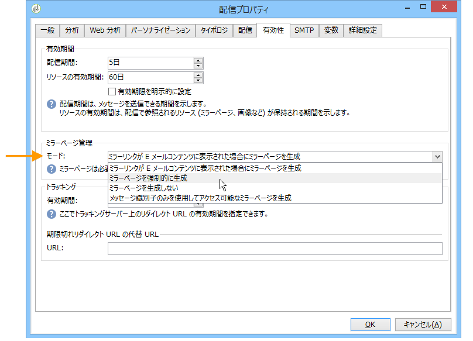

# E メールパラメーター {#email-parameters}

この節では、電子メール配信に固有のオプションとパラメーターについて説明します。

## BCC で E メールを送信{#email-bcc}

Adobe Campaign では、BCC アドレスをメッセージのターゲットに追加するだけで、BCC 経由で E メールを外部システムに保存することができます。

このオプションを有効にしたら、送信したすべてのメッセージの正確なコピーがこの配信用に保持されます。

「BCC で E メールを送信」の設定とベストプラクティスの詳細については、 [この節](../../installation/using/email-archiving.md)を参照してください。

>[!NOTE]
>
>「BCC で E メールを送信」はオプションの機能です。この機能を有効にするには、ライセンス契約を確認したうえで、アカウント担当者にお問い合わせください。

新しい配信または配信テンプレートを作成する場合、「BCC で E メールを送信」はデフォルトで有効になっていません。電子メール配信または配信テンプレートレベルで手動で有効にする必要があります。

<!--
>[!IMPORTANT]
>
>If you have upgraded to the [Enhanced MTA](../../delivery/using/sending-with-enhanced-mta.md), you can request to use Email BCC with Enhanced MTA for improved efficiency and less latency. In that case, all sent emails are automatically sent to the BCC address. You cannot enable it at the delivery or delivery template level, thus the steps below do not apply. For more on this, see [this section](../../installation/using/email-archiving.md).-->

E メール配信テンプレートの「BCC で E メールを送信」を有効にするには、次の手順に従います。

1. **[!UICONTROL キャンペーン管理]**／**[!UICONTROL 配信]**&#x200B;または&#x200B;**[!UICONTROL リソース]**／**[!UICONTROL テンプレート]**／**[!UICONTROL 配信テンプレート]**&#x200B;に移動します。
1. 目的の配信を選択します。または、標準の **E メール配信**&#x200B;テンプレートを複製して、複製されたテンプレートを選択します。
1. 「**プロパティ**」ボタンをクリックします。
1. 「**[!UICONTROL 配信]**」タブを選択します。
1. 「**BCC で E メールを送信**」オプションを選択します。このテンプレートに基づく各配信に対するすべての送信済みメッセージのコピーが、設定済みの「BCC で E メールを送信」アドレスに送信されます。

   

>[!NOTE]
>
>BCC アドレスに送信された電子メールが開封され、クリックされた場合は、送信分析の&#x200B;**[!UICONTROL 合計開封数]**&#x200B;と&#x200B;**[!UICONTROL クリック数]**&#x200B;に含められますが、計算の誤りの原因となる可能性があります。

## メッセージ形式の選択 {#selecting-message-formats}

送信される E メールメッセージの形式は変更できます。変更するには、配信プロパティを編集し、「**[!UICONTROL 配信]**」タブをクリックします。

ウィンドウ下部のセクションで、E メールの形式を選択します。

* **[!UICONTROL 受信者の環境設定を使用]**（デフォルトのモード）

   メッセージの形式は、受信者のプロファイルに格納されたデータに従って定義され、デフォルトでは「**[!UICONTROL E メールフォーマット]**」フィールド（@emailFormat）に保存されます。受信者が特定の形式でメッセージを受信することを希望していれば、メッセージはその形式で送信されます。このフィールドに何も入力されていない場合は、マルチパート／オルタナティブメッセージが送信されます（以下を参照）。

* **[!UICONTROL 受信者のメールクライアントに最適なフォーマットを選択させる]**

   テキスト形式と HTML 形式の両方を含んだメッセージが送信されます。受信時に表示されるメッセージ形式は、受信者のメールソフトウェアの設定に応じて切り替わります（マルチパート／オルタナティブ）。

   >[!IMPORTANT]
   >
   >このオプションを指定すると、両方のバージョンのドキュメントがメッセージに含められます。したがって、メッセージサイズが大きくなり、配信の順位に影響があります。

* **[!UICONTROL すべてのメッセージをテキストフォーマットで送信]**

   メッセージはテキスト形式で送信されます。HTML 形式は送信されませんが、受信者がメッセージをクリックした場合にのみ表示されるミラーページに使用されます。

>[!NOTE]
>
>電子メールの内容の定義について詳しくは、[このセクション](../../delivery/using/defining-the-email-content.md)を参照してください。

## ミラーページの生成 {#generating-mirror-page}

ミラーページは、Web ブラウザーからオンラインアクセス可能な HTML ページです。コンテンツは E メールと変わりません。

デフォルトでは、メールコンテンツ内にリンクが挿入されているとミラーページが生成されます。パーソナライゼーションブロックの挿入について詳しくは、[パーソナライゼーションブロック](../../delivery/using/personalization-blocks.md)を参照してください。

配信プロパティの「**[!UICONTROL 有効性]**」タブにある「**[!UICONTROL モード]**」フィールドを使用すると、このページの生成モードを変更できます。

>[!IMPORTANT]
>
>ミラーページを作成するには、その配信の HTML コンテンツが定義されている必要があります。

デフォルトモードのほかに、次のオプションも選択できます。

* **[!UICONTROL ミラーページを強制的に生成]**：配信コンテンツ内にミラーページへのリンクが挿入されていなくても、ミラーページを生成します。
* **[!UICONTROL ミラーページを生成しない]**：配信コンテンツ内にリンクが挿入されていても、ミラーページを生成しません。
* **[!UICONTROL メッセージ識別子のみを使用してアクセス可能なミラーページを生成]**：配信ログウィンドウで、パーソナライゼーション情報を含むミラーページのコンテンツにアクセスできるようにします。これを使用するには、配信が完了した後に「**[!UICONTROL 配信]**」タブをクリックし、メッセージを受け取った受信者の行を選択してから、「**[!UICONTROL このメッセージのミラーページを表示]**」リンクをクリックします。

   

## 文字エンコーディング {#character-encoding}

配信パラメーターの「**[!UICONTROL SMTP]**」タブで、「**[!UICONTROL 文字エンコーディング]**」セクションを使用して特定のエンコードを設定できます。

デフォルトのエンコードは UTF-8 です。一部の受信者の E メールプロバイダーが UTF-8 規格のエンコーディングをサポートしていない場合、E メールの受信者に対して特殊文字を適切に表示するために特定のエンコーディングを設定する必要があります。

例えば、日本語の文字を含む E メールを送信するとします。すべての文字が日本の受信者に正しく表示されるようにするには、標準の UTF-8 ではなく、日本語文字をサポートするエンコーディングを使用します。

そのためには、「**[!UICONTROL 文字エンコーディング]**」セクションの「**[!UICONTROL メッセージに使用されているエンコーディングを強制]**」オプションを選択し、表示されるドロップダウンリストからエンコーディングを選択します。

## バウンスメールの管理 {#managing-bounce-emails}

配信パラメーターの「**[!UICONTROL SMTP]**」タブでは、バウンスメール管理を設定できます。

デフォルトでは、バウンスメールはプラットフォームのデフォルトエラーボックスに受信されますが、配信用の専用エラーアドレスを定義することもできます。

また、バウンスメールの発生理由をアプリケーションで自動判定できない場合の調査用に、この画面から特定のアドレスを定義できます。これらの各フィールドに対して、**パーソナライズされたフィールド追加**&#x200B;アイコンを使用して、パーソナライズパラメーターを追加できます。

バウンスメールの管理について詳しくは、[このセクション](../../delivery/using/understanding-delivery-failures.md#bounce-mail-management)を参照してください。

## SMTP ヘッダーの追加 {#adding-smtp-headers}

配信には SMTP ヘッダーを追加できます。そのためには、配信の「**[!UICONTROL SMTP]**」タブの関連するセクションを使用します。

このウィンドウで入力するスクリプトは、**name:value** の形式で 1 行ごとに 1 つのヘッダーを参照する必要があります。

値は必要に応じて自動的にエンコードされます。

>[!IMPORTANT]
>
>スクリプトを追加すると、挿入する SMTP ヘッダーを追加できます。これは高度な知識を持つユーザー向けに用意されています。
>
>スクリプトの構文は、このコンテンツタイプの要件を満たしている必要があります（不要なスペースや空行を含まないなど）。
