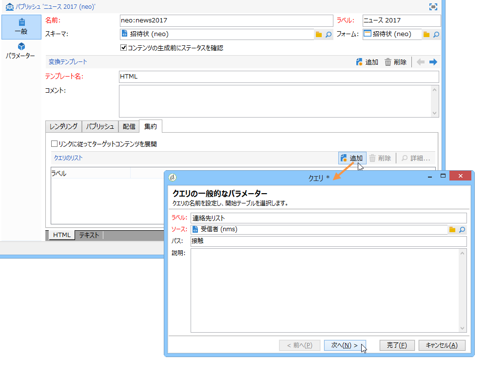
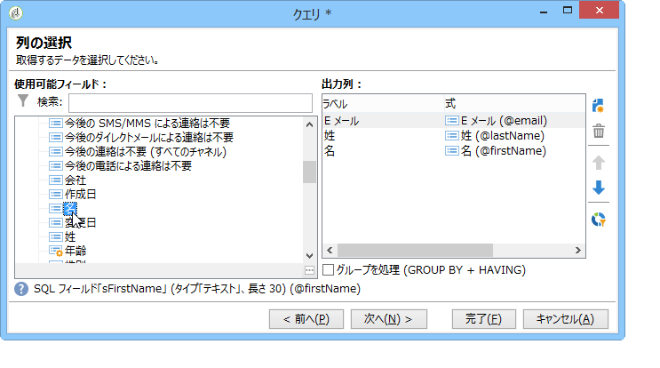
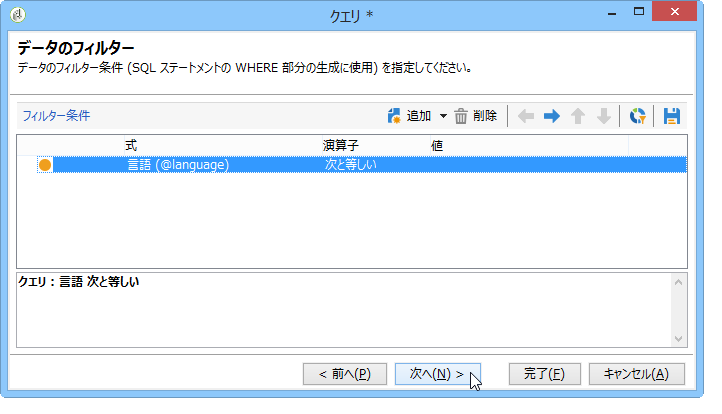
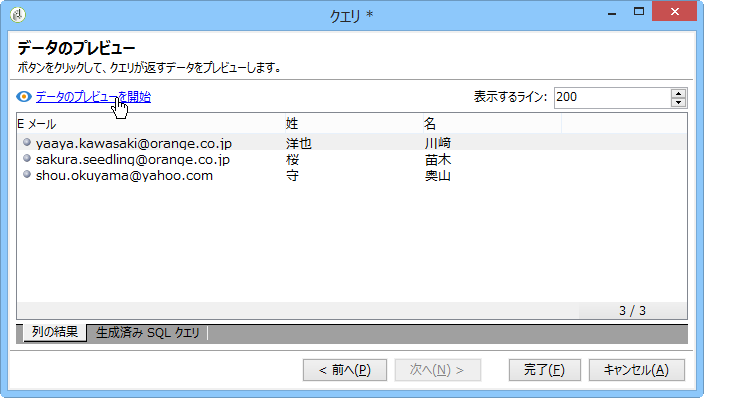
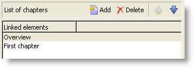

# コンテンツのエンリッチメント{#enriching-content}

集約機能を利用すると、コンテンツを外部データでエンリッチメントできます。このデータは、汎用クエリまたはリンクされたテーブルから取得します。

## 汎用クエリ {#generic-queries}

Queries are configured via the publication template in the **[!UICONTROL Aggregator]** tab.

XML 出力ドキュメントのメイン要素を使用して、取得したデータでこのドキュメントをエンリッチメントします。

受信者スキーマ（**nms:recipient**）に対するクエリの戻り値の例：

```
<book name="Content Management">
  ...
  <collection-recipient>
    <recipient lastName="Doe" firstName="John" email="john.doe@aolf.com">
    ...
  </collection-recipient>
</book>
```

The **`<collection-recipient>`** element represents the input element of the document resulting from a query. 取得したデータは、この要素の下に返されます（この例では受信者リスト）。

### クエリの追加 {#adding-a-query}

クエリのパラメーターは、ウィザードを使用して編集します。

1. 最初のページで、ラベルおよび取得するデータを含むスキーマを指定します。

   

   >[!NOTE]
   >
   >「**パス**」編集フィールドを使用して、クエリの出力要素名を変更します。

1. 次のページでは、取得するデータを選択できます。

   

1. 次のページでは、フィルター条件を定義します。

   

1. 最後のページで、クエリが返すデータのプレビューを開始します。

   

## リンクされたテーブル {#linked-tables}

リンクを使用して、コンテンツにリンクされた外部データを取得できます。

次の 2 種類のリンク済みデータがあります。

* コンテンツリンク：ネイティブなコンテンツ管理モードです。リンクのコンテンツは、XML 出力ドキュメントに自動的に統合されます。
* 外部テーブルへのリンクによって、データベース内のその他すべてのテーブルにアクセスできます。その際、選択したリンクのデータを集約で取得するという制約があります。

### コンテンツスキーマへのリンク {#link-to-a-content-schema}

コンテンツリンクは、データスキーマ内で次のように宣言します。

```
<element expandSchemaTarget="cus:chapter" label="Main chapter" name="mainChapter" type="string"/>
```

The definition of the link is populated on a **string**-type **`<element>`**, and the **expandSchemaTarget** attribute references the target schema (&quot;cus:chapter&quot; in our example). 参照するスキーマは、コンテンツスキーマである必要があります。

The content of the targeted element enriches the link element, i.e. the **`<chapter>`** element in our example schema:

```
<mainChapter computeString="Introduction" id="7011" title="Introduction" xtkschema="cus:chapter">    
  <page>Introduction to input <STRONG>forms</STRONG>.</page>
</mainChapter>
```

>[!NOTE]
>
>リンクの&#x200B;**計算文字列**&#x200B;は、**computeString** 属性から提供されます。

リンクの編集コントロールは、入力フォーム内で次のように宣言します。

```
<input type="articleEdit" xpath="mainChapter"/>
```


The **[!UICONTROL Magnifier]** icon enables you to open the edit form of the linked element.

#### リンクコレクション {#link-collection}

リンクのコレクションを設定するには、データスキーマ内のリンク要素の定義に **unbound=&quot;true&quot;** 属性を追加します。

```
<element expandSchemaTarget="cus:chapter" label="List of chapters" name="chapter"  ordered="true" unbound="true"/>
```

ターゲット要素のコンテンツは、各コレクション要素をエンリッチメントします。

```
<chapter computeString="Introduction" id="7011" title="Introduction" xtkschema="cus:chapter">    
  <page>Introduction to input <STRONG>forms</STRONG>.</page>
</chapter>
```

リストコントロールは、入力フォーム内で次のように宣言します。

```
<input editable="false" nolabel="true" toolbarCaption="List of chapters" type="articleList" xpath="chapter" zoom="true"/>
```



ターゲット要素の&#x200B;**計算文字列**&#x200B;を確認するために、デフォルトの列が表示されます。

### 外部テーブルへのリンク {#links-to-external-tables}

外部テーブルへのリンクは、データスキーマ内で次のように宣言します。

```
<element label="Main contact" name="mainContact" target="nms:recipient" type="link"/>
```

The definition of the link is populated on a **link**-type **`<element>`**, and the **target** attribute references the target schema (&quot;nms:recipient&quot; in our example).

慣例によって、リンクはデータスキーマのメイン要素から宣言する必要があります。

The **Compute string** and the key of the targeted element enrich the **`<name>-id`** and **`<name>-cs`** attributes on the main element.

この例では、リンクは「cus:book」スキーマ内に入力され、リンクデータのコンテンツは「mainContact-id」属性と「mainContact-cs」属性に格納されます。

```
<book computeString="Content management" date="2006/06/08" id="6106" language="en" mainContact-cs="John Doe (john.doe@adobe.com)" mainContact-id="3012" name="Content management" xtkschema="cus:book">
```

リンク編集コントロールは次のように宣言します。

```
<input xpath="mainContact"/>
```


You can restrict the choice of target elements by adding the **`<sysfilter>`** element via the link definition in the input form:

```
<input xpath="mainContact">
  <!-- Filter the selection of the link on the Adobe domain -->
  <sysFilter>
    <condition expr="@domain =  'adobe.com '"/>
  </sysFilter>
</input>
```

>[!NOTE]
>
>この制約はコンテンツリンクにも適用されます。

#### リンクコレクション {#link-collection-1}

コレクションの定義は、コレクション要素に対するリストの定義と同じです。

```
<element label="List of contacts" name="contact" unbound="true">
  <element label="Recipient" name="recipient" target="nms:recipient" type="link"/>
</element>
```

リストコントロールは、入力フォーム内で次のように宣言します。

```
<input nolabel="true" toolbarCaption="List of contacts" type="list" xpath="contact">
  <input xpath="recipient"/>
</input>
```


>[!NOTE]
>
>リストは編集可能で、上述の「リンク」タイプのコントロールからリンクを選択できます。

ターゲット要素のコンテンツは、出力ドキュメント内の各コレクション要素をエンリッチメントします。

```
<contact id="11504978621" recipient-cs="Doe John (john.doe@adobe.com)" recipient-id="3012"/>
<contact id="11504982510" recipient-cs="Martinez Peter (peter.martinez@adobe.com)" recipient-id="3013"/>
```

#### リンクの集約 {#link-aggregation}

参照される各リンクのコンテンツは、ターゲット要素の内部キーと&#x200B;**計算文字列**&#x200B;に制限があります。

JavaScript スクリプトを使用して、SOAP クエリによってリンクのコンテンツをエンリッチメントします。

**例**:「mainContact」リンクと「contact」コレクションリンクに受信者名を追加します。

```
// Update <mainContact> link
var mainContactId = content.@['mainContact-id']
var query = xtk.queryDef.create(
    <queryDef schema="nms:recipient" operation="get">
      <select>
        <node expr="@lastName"/>
      </select>
      <where>
        <condition expr={"@id="+mainContactId}/>
      </where>
    </queryDef>)

var recipient = query.ExecuteQuery()
content.mainContact.@lastName = recipient.@lastName

// Update <contact> link collection
for each(var contact in content.contact)
{
  var contactId = contact.@['recipient-id']
  var query = xtk.queryDef.create(
    <queryDef schema="nms:recipient" operation="get">
      <select>
        <node expr="@lastName"/>
      </select>
      <where>
        <condition expr={"@id="+contactId}/>
      </where>
    </queryDef>
  )
  
  var recipient = query.ExecuteQuery()
  contact.@lastName = recipient.@lastName
}
```

スクリプト実行後に取得された結果：

```
<mainContact lastName="Doe"/>

<contact id="11504978621" lastName="Doe" recipient-cs="Doe John (john.doe@adobe.com)" recipient-id="3012"/>  
<contact id="11504982510" lastName="Martinez" recipient-cs="Martinez Peter (peter.martinez@adobe.com)" recipient-id="3013"/> 
```

The content of the JavaScript code is added via the **[!UICONTROL Administration > Configuration > Content management > JavaScript Codes]** folder and must be populated in the publication template for each transformation.


