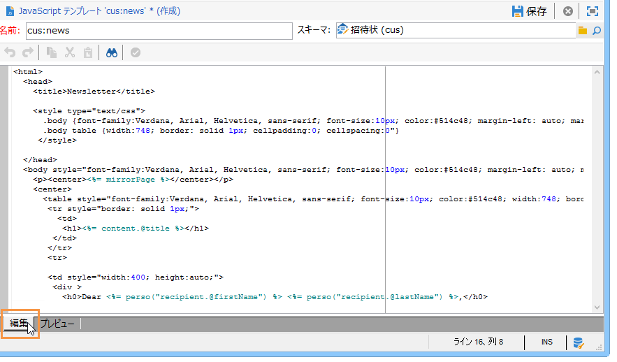
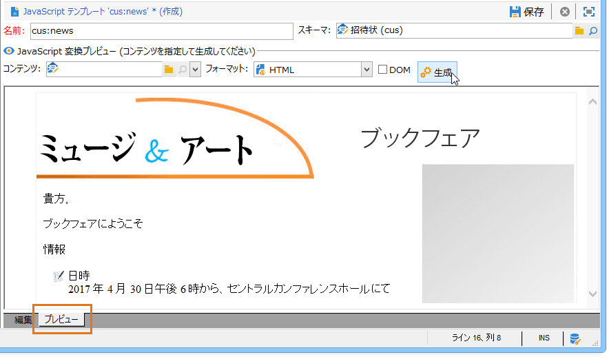
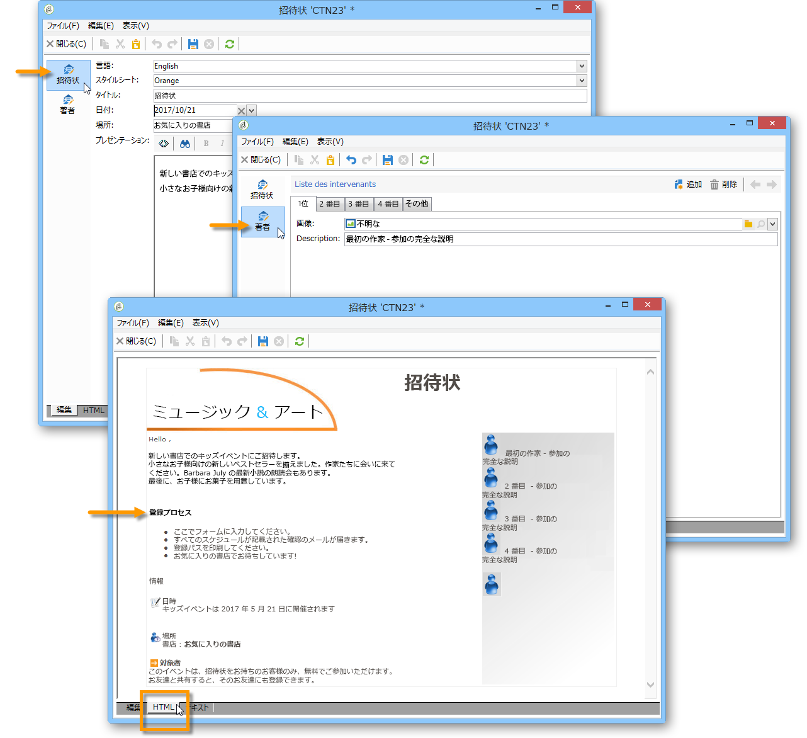
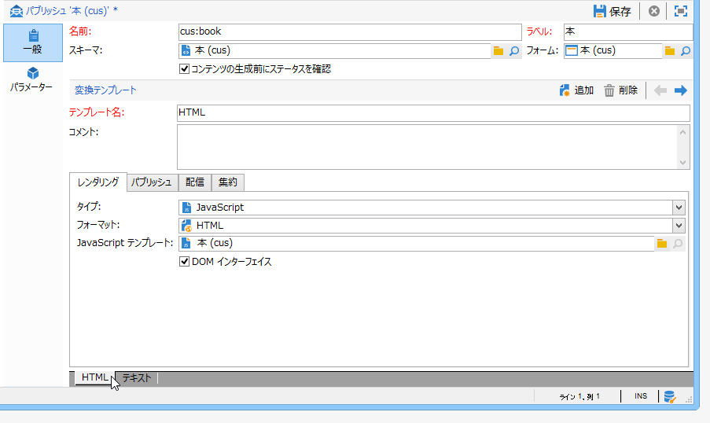
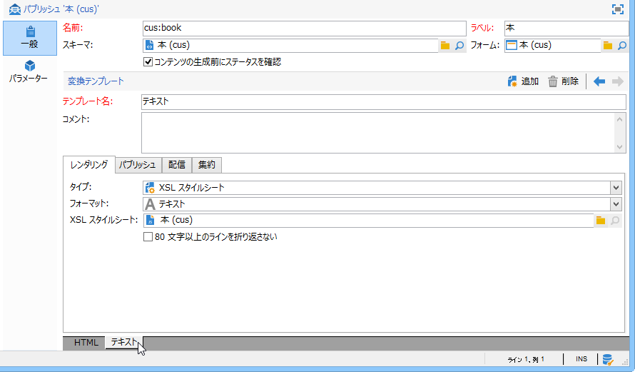
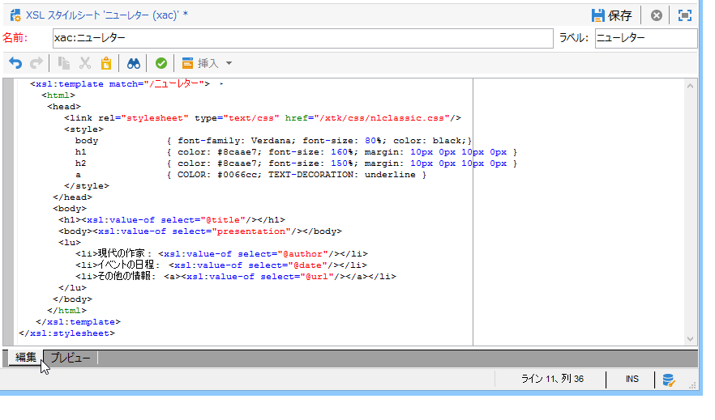
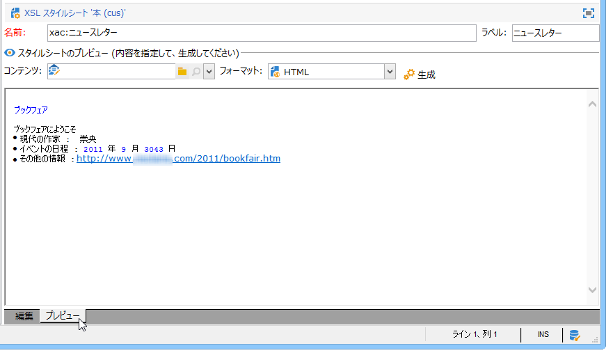

# 書式設定{#formatting}

## JavaScript テンプレート {#javascript-templates}

JavaScript テンプレートは、JavaScript コードを含む HTML ドキュメントまたはテキストドキュメントです。JavaScript テンプレートは、配信アクションにおける E メールコンテンツの構築と同じ方法で構築します。

### JavaScript テンプレートの識別 {#identification-of-a-javascript-template}

JavaScript テンプレートは、スキーマやフォームと同様に、名前と名前空間で識別されます。ただし、テンプレート名には **.js** オプションを追加することをお勧めします。

### JavaScript テンプレートの構造 {#structure-of-a-javascript-template}

「cus:book」スキーマをベースとする JavaScript HTML 書式設定テンプレートの例を次に示します。

```
<html>
  <body>
    <!-- Title of book -->
    <h1><%= content.@name %></h1>
    <ul>
      <% for each(var chapter in content.chapter) { %>
        <li><%= chapter.@name %></li>
      <% }%>
    </ul>
  </body>
</html>
```

様々な JavaScript ディレクティブが次の形式で表現されます。

* 結合フィールド：**`<%= <source> %>`** 構文を使用してデータのコンテンツを表示します。`<source>` は表示するデータのソースフィールドです。
* 命令ブロック：&lt;% タグと %> タグの間に含まれる一連の JavaScript 命令を実行します。

**content** オブジェクトは、入力 XML ドキュメントのメイン要素を表します。

今回の例では、次の行により、本の名前が name であるコンテンツが表示されます。

```
<h1><%= content.@name %></h1>
```

次のコードは、`<chapter>` コレクションの各要素に対して反復処理をおこないます。

```
<% for each(var chapter in content.chapter) { %>
  <li><%= chapter.@name %></li>
<% }%>
```

コンテンツの属性と要素は JavaScript オブジェクトとして表され、ソースドキュメントの構造を遵守します。

**例**：

* **content.@name**：メイン要素の「name」属性の値を取得します。
* **content.@`['name']`**：** content.@name **構文と同一です。
* **content.chapter.length**：`<chapter` コレクション要素にある要素数を返します。
* **content.chapter`[0]`.@name**：最初の `<chapter>` 要素の名前を取得します。
* **chapter.name()**：`<chapter>` 要素の名前を返します。
* **chapter.parent().name()**：`<chapter>` の親要素の名前を返します。

>[!CAUTION]
>
>「-」文字は JavaScript 言語で予約されているので、この文字を含む属性または要素の値の復元は `['<field>']` 構文を使用して実行する必要があります。
>
>例：`content.@['offer-id']`

プログラミング言語のすべての機能（変数、ループ、条件付きテスト、関数など）を使用して、出力ドキュメントを構築できます。SOAP API にアクセスして、出力ドキュメントを高度なものにすることができます。

例：

* 条件付きテスト：

   ```
   <% if (content.@number == 1 || content.@language == 'en') { %>
   <!-- Content to be displayed if test is true--> 
   <% } %>
   ```

* 関数の呼び出し：

   ```
   <!-- Displays a horizontal bar -->
   ;<% function DisplayHorizontalBar() { %>
     <hr/>
   <% } %> 
   
   <!-- The same function in a block  -->
   <% 
   function DisplayHorizontalBar2()
   {
     document.write('<hr/>');
   }
   %> 
   
   <!-- Returns the value in uppercase -->
   <% 
   function formatName(value)
   { 
     return value.toUpperCase(); 
   }
   %>
   
   <!-- Call functions -->
   <%= DisplayHorizontalBar1() %>
   <%= DisplayHorizontalBar2() %>
   <%= formatName(content.@name) %>
   ```

* 宣言と変数の呼び出し：

   ```
   <%  var counter = 0; %>
   
   <%= counter += 10 %>
   ```

* 静的メソッドを使用した受信者名の取得と表示：

   ```
   <% var recipient = nms.recipient.get(1246); %>
   <%= recipient.lastName %>
   ```

* 非静的メソッドを使用した受信者名の取得と表示：

   ```
   <% var query = xtk.queryDef.create(
     <queryDef schema="nms:recipient" operation="get">
       <select>
         <node expr="@lastName"/>
       </select>
       <where>
         <condition expr="@id=1246"/>
       </where>
     </queryDef>);
   
     var recipient = query.ExecuteQuery();
   %>
   
   <%= recipient.@lastName %>
   ```

### JavaScript テンプレートの取り込み {#including-a-javascript-template}

関数または変数のライブラリを構成して、後で使用することができます。そのためには、**eval** 関数を使用して JavaScript テンプレートをインポートします。JavaScript テンプレートをインポートすることにより、他の JavaScript テンプレートで宣言されている追加機能でコンテキストを高度なものにできます。

**例**：**common.jsp** テンプレートのインポート

```
<% eval(xtk.javascript.get("cus:common.js").data);  %>
```

### JavaScript テンプレートの編集 {#editing-a-javascript-template}

編集領域を使用して、JavaScript テンプレートのコンテンツを入力できます。



>[!NOTE]
>
>JavaScript オブジェクトを初期化するために、関連付けられたデータモデルスキーマを入力する必要があります。

出力ドキュメントのプレビューを生成するには、コンテンツと出力フォーマット（HTML、テキスト、XML）を選択して、「**[!UICONTROL 生成]**」をクリックします。



>[!NOTE]
>
>出力ドキュメントをプレビューするために、変更を保存する必要はありません。

### JavaScript テンプレートの作成および使用例 {#example-of-how-to-create-and-use-a-javascript-template}

JavaScript テンプレートを使用して、次のコンテンツ管理を実施するために必要な設定を次に示します。



この例では、次の手順に従います。

1. 次のスキーマを作成します（この場合 **neo:news**）。

   ```
   <srcSchema _cs="Invitation (neo)"   entitySchema="xtk:srcSchema" img="xtk:schema.png" label="Invitation" mappingType="sql" name="news" namespace="neo" xtkschema="xtk:srcSchema">
   
     <enumeration basetype="string" default="en" name="language">
       <value label="Français" name="fr" value="fr"/>
       <value label="English" name="gb" value="gb"/>
     </enumeration>
   
     <enumeration basetype="string" name="css">
       <value label="Blue" name="bl" value="blue"/>
       <value label="Orange" name="or" value="orange"/>
     </enumeration>
   
     <element label="Intervenants" name="attendee">
       <key internal="true" name="id">
         <keyfield xpath="@id"/>
       </key>
       <attribute label="Name" name="name" type="string"/>
       <element label="Image" name="image" target="xtk:fileRes" type="link"/>
       <attribute label="Description" name="description" type="string"/>
       <attribute default="Gid()" label="Id" name="id" type="long"/>
     </element>
   
     <element label="Invitation" name="news" template="ncm:content" xmlChildren="true">
   
       <compute-string expr="@name"/>
       <attribute enum="language" label="Language" name="language" type="string"/>
       <attribute enum="css" label="Stylesheet" name="css" type="string"/>
       <attribute label="Title" name="title" type="string"/>
       <element label="Presentation" name="presentation" type="html"/>
       <attribute label="Date" name="date" type="date"/>
       <element label="Attendees list" name="attendeesList" ordered="true" ref="attendee" unbound="true"/>
   
     </element>
   </srcSchema>
   ```

1. リンクされた&#x200B;**[!UICONTROL コンテンツ管理]**&#x200B;タイプのフォーム（**neo:news**）を作成します。

   ```
   <form _cs="News (neo)" entitySchema="xtk:form"  img="xtk:form.png" label="News"  name="news" namespace="neo" type="contentForm" xtkschema="xtk:form">
   
     <container type="iconbox">
       <container label="Invitation">
         <input xpath="@langue"/>
         <input xpath="@css"/>
         <input xpath="@title"/>
         <input xpath="@date"/>
         <input xpath="presentation"/>
       </container>
   
       <container label="Intervenants">
         <container toolbarCaption="Liste des intervenants" type="notebooklist" xpath="attendeesList" xpath-label="@nom">
           <container>
             <input xpath="@nom"/>
             <input img="nl:sryimage.png" newEntityFormChoice="true" xpath="image">
               <sysFilter>
                 <condition expr="@isImage = true"/>
               </sysFilter>
             </input>
             <input xpath="@description"/>
           </container>
         </container>
       </container>
     </container>
   
   </form>
   ```

1. HTML フォーマットおよびテキストフォーマット用のメッセージコンテンツを持つ JavaScript テンプレートを作成します。

   * HTML の場合：

      ```
      <html>     
        <head>         
          <title>Newsletter</title>
           <style type="text/css">
            .body {font-family:Verdana, Arial, Helvetica, sans-serif; font-size:10px; color:#514c48; margin-left: auto; margin-right: auto;}
            .body table {width:748; border: solid 1px; cellpadding:0; cellspacing:0"}
           </style>
        </head>     
        <body>
          <p><center><%= mirrorPage %></center></p>
          <center>
            <table>      
             <tr>
              <td>                                                         
                                                   
              </td>
              <td>
                <h1><%= content.@title %></h1>
              </td>
             </tr>
             <tr>
      
             <td>
              <div >                                    
                <h0><%= hello,</h0>                              
                <p><%= content.presentation %></p>                                          
      
                <h0>Useful information</h0>                              
                <p>                                  
                  When? <br/><%= formatDate(content.@date, "%2D %Bl %4Y") %> From 10 AM in your bookshop.</p><br/>                                       
                <p>                                  
                  Who? <br>Meet our favorite authors and illustrators and get a signed copy of their book.</p><br/>                                                         
                <p>                                  
                  Attendance is free but there is a limited number of seats: sign up now!</p>
            </div>
            </td>
      
              <td>                                                    
               <div style="text-align:left; width:210; height:400px; background:url([IMAGE DE FOND])">
      
                  <h0><%= participant %></h0>
                  <%
                  var i
                  var iLength = content.attendeesList.length()
                  for (i=0; i<iLength; i++)
                  { %>
                  <p>
                    <%= generateImgTag(content.attendeesList[i].@["image-id"]) %>  <%= content.attendeesList[i].@description %>
                  </p>  
                  <% }  
                  %>                              
               </div2>
              </td>
          </tr>
        </table>
      </center>
      </body>    
      </html>
      ```

   * テキストの場合：

      ```
      <%= content.@title %>
      <%= content.presentation %>
      
      *** When? On <%= formatDate(content.@date, "%2D %Bl %4Y") %> From 10 AM in your bookshop.
      
      *** Who? Come and meet our favorite authors and illustrators and get a signed copy of their books. 
      
      *** Attendance is free but there is a limited number of seats: sign up now!
      
      Guests:
      ******************
      <%
      var i
      var iLength = content.attendeesList.length()
      //for (i=(iLength-1); i>-1; i--)
      for( i=0 ; i<iLength ; i++ )
        { %>
        Description <%= i %> : <%= content.attendeesList[i].@description %>
        <% }  
      %>
      ```

1. 今度は、どちらのフォーマットにも使用するパブリッシュテンプレートを作成します。

   * HTML の場合：

      

   * テキストの場合：

      

1. このコンテンツテンプレートを配信で使用できます。

   詳しくは、[コンテンツテンプレートの使用](../../delivery/using/using-a-content-template.md)を参照してください。

## XSL スタイルシート {#xsl-stylesheets}

XSLT 言語を使用して、XML ドキュメントを出力ドキュメントに変換できます。スタイルシートの出力方法に応じて、HTML、プレーンテキストまたは XML ツリーとしてドキュメントを生成できます。

この変換は、スタイルシートと呼ばれているドキュメントに XML で詳述されます。

### スタイルシートの識別 {#identifying-a-stylesheet}

スタイルシートは、スキーマやフォームと同様に、名前と名前空間で識別されます。ただし、スタイルシートの名前には **.xsl** 拡張子を追加することをお勧めします。

スタイルシートの識別キーは、コロンで分けられた名前空間と名前によって形成される文字列です。例：**cus:book.xsl**

### スタイルシートの構造 {#structure-of-a-stylesheet}

サンプルスキーマ「cus:book」をベースとする HTML 書式設定スタイルシートの例：

```
<?xml version="1.0" encoding="ISO-8859-1" ?>
<xsl:stylesheet xmlns:xsl="http://www.w3.org/1999/XSL/Transform" version="1.0">
  <xsl:output encoding="ISO-8859-1" method="html"/>
  <!-- Point of entry of the stylesheet -->
  <xsl:template match="/book">
    <html>
      <body>
        <!-- Book title -->
        <h1><xsl:value-of select="@name"/></h1>
        <lu>
          <!-- List of chapters -->
          <xsl:for-each select="child::chapter">
            <li><xsl:value-of select="@name"/></li>
          </xsl:for-each>
       </lu>
      </body>
    </html>
   </xsl:template>
</xsl:stylesheet>
```

スタイルシートは、次のルールを遵守した XML ドキュメントです。

* 属性の値は引用符で囲む
* 要素には開始マーカーと終了マーカーがなければならない
* 「&lt;」文字または「&amp;」文字は&#x200B;**「&lt;」**&#x200B;エンティティまたは&#x200B;**「&amp;」**&#x200B;エンティティで置き換える
* 各 XSL 要素は **xsl** 名前空間を使用する必要がある

スタイルシートは、XSL ルート要素マーカー **`<xsl:stylesheet>`** で始まり、**`</xsl:stylesheet>`** マーカーで終了する必要があります。XSL 名前空間は、次のように開始マーカー内で定義する必要があります。

```
<xsl:stylesheet xmlns:xsl="http://www.w3.org/1999/XSL/Transform" version="1.0">
```

**`<xsl:output>`** 要素で、生成するドキュメントのフォーマットを指定します。目的の文字セットと出力フォーマットを指定します。

```
<xsl:output encoding="ISO-8859-1" method="html"/>
```

次の命令は、出力ドキュメントを書式設定するためのスタイルシートの設定を記述したものです。

```
<xsl:template match="/book">
  <html>
    <body>
      <!-- Book title -->
      <h1><xsl:value-of select="@name"/></h1>
      <lu>
        <!-- List of chapters -->
        <xsl:for-each select="child::chapter">
          <li><xsl:value-of select="@name"/></li>
        </xsl:for-each>
      </lu>
    </body>
  </html>
</xsl:template>
```

デフォルトでは、XSLT プロセッサーは、入力 XML ドキュメントのルートまたはメインノードに適用する&#x200B;**テンプレート**&#x200B;を探します。この&#x200B;**テンプレート**&#x200B;を基に、出力ドキュメントの構築が始まります。

この例では、本の名前と章のリストを表示することにより、HTML ページが「cus:book」スキーマから生成されます。

>[!NOTE]
>
>XSLT 言語について詳しくは、XSLT のリファレンスドキュメントを参照してください。

### HTML／XML の表示 {#displaying-html-xml}

**html** フィールドを表示するには、**`<xsl:value-of>`** ディレクティブの **disable-output-escaping=&quot;yes&quot;** オプションを使用します。このオプションを使用すると、文字が XML エンティティに置き換えられる（例えば、&lt; が &lt; に置き換えられる）ことを回避できます。

**disable-output-escaping=&quot;yes&quot;** オプションの **`<xsl:text>`** ディレクティブを使用して、パーソナライゼーションフィールド用または条件付きテスト用の JavaScript タグを挿入できます。

例：

* 「html」タイプのフィールドのコンテンツの表示：

   ```
   <xsl:value-of select="summary" disable-output-escaping="yes"/>
   ```

* パーソナライゼーションフィールド **&lt;%= recipient.email %>** の挿入：

   ```
   <xsl:text disable-output-escaping="yes"><%= recipient.email %></xsl:text>
   ```

* 条件付きテスト **&lt;% if (recipient.language == &#39;en&#39;) { %>** の追加：

   ```
   <xsl:text disable-output-escaping="yes"><% if (recipient.language == 'en') { %></xsl:text>
   ```

### スタイルシートの取り込み {#including-stylesheets}

テンプレートまたは変数のライブラリを構築して、複数のスタイルシートで共有できます。上述の「longMonth」**テンプレート**&#x200B;は、後で再利用できるように、スタイルシート内の離れた場所にテンプレートを配置する典型的な有効事例です。

**`<xsl:include>`** ディレクティブは、ドキュメントに取り込むスタイルシートの名前を示します。

**例**：「common.xsl」スタイルシートの取り込み

```
<? xml version="1.0" encoding="ISO-8859-1" ?>
<xsl:stylesheet xmlns:xsl="http://www.w3.org/1999/XSL/Transform" version="1.0">
  <xsl:include href="common.xsl"/> 
  <xsl:output encoding="ISO-8859-1" method="jsp" indent="yes"/>
  ...
</xsl:stylesheet>
```

>[!NOTE]
>
>名前空間の名前を、取り込むスタイルシートの参照として入力しないでください。通常、このスタイルシートはユーザーの名前空間を使用して作成されます。

### スタイルシートの編集 {#editing-a-stylesheet}

編集領域を使用して、スタイルシートのコンテンツを入力できます。



出力ドキュメントのプレビューを生成するには、コンテンツインスタンスとフォーマット（HTML、テキスト、XML）を選択して、「**[!UICONTROL 生成]**」をクリックします。



>[!NOTE]
>
>出力ドキュメントのプレビューを表示するために、スタイルシートの変更を保存する必要はありません。

## 画像の管理 {#image-management}

### 画像の参照 {#image-referencing}

HTML 出力ドキュメントに入力する画像は、絶対参照または相対参照を使用して参照できます。

相対参照を使用して、画像を格納しているサーバーの URL を **NcmRessourcesDir** オプションおよび **NcmRessourcesDirPreview** オプションに入力できます。これらのオプションに、Adobe Campaign のクライアントコンソールでパブリッシュおよびプレビューする画像の場所が格納されます。

これら 2 つのオプションには、**[!UICONTROL 管理／プラットフォーム／オプション]**&#x200B;フォルダー内のオプション管理画面からアクセスできます。

**例**：

* NcmResourcesDir = &quot;https://server/images/&quot;
* NcmResourcesDirPreview = &quot;x:/images/&quot;

スタイルシートの処理時に、コンテキスト（プレビューまたはパブリッシュ）に応じて、これらのオプションのいずれかが自動的に、入力 XML ドキュメントのメイン要素の **_resPath** 属性に設定されます。

画像配置オプションの使用方法と、オプションを画像に使用する方法の例：

```
/newsletter/image.png"/>
```

>[!NOTE]
>
>画像が保存されているサーバーの参照を格納する変数（この例では「resPath」）を宣言することをお勧めします。

### パブリックリソースの使用 {#using-public-resources}

**[!UICONTROL パブリックリソース]**&#x200B;を使用して、デプロイウィザードに入力したインスタンス設定に応じて画像を宣言し、サーバー上にアップロードすることもできます。

その後、その画像をコンテンツに呼び出すことができます。そのためには、次の構文をコンテンツ管理スキーマで使用します。

```
<element label="Image" name="image" target="xtk:fileRes" type="link"/>
```

次の構文により、画像を選択するためのフィールドがフォーム内に追加されます。

```
<input img="nl:sryimage.png" newEntityFormChoice="true" xpath="image">
    <sysFilter>
      <condition expr="@isImage = true"/>
    </sysFilter>
  </input>
```

>[!NOTE]
>
>**[!UICONTROL パブリックリソース]**&#x200B;とその設定および使用方法について詳しくは、[この節](../../installation/using/deploying-an-instance.md#managing-public-resources)を参照してください。

## 日付の表示 {#date-display}

XML 入力ドキュメントでは、日付は内部 XML 形式（**YYYY/MM/DD HH:MM:SS**）で保存されます。例：2018/10/01 12:23:30

Adobe Campaign では、以下に詳しく説明するように、JavaScript テンプレートと XSL スタイルシート用の日付の書式設定関数を提供しています。

### JavaScript の日付の書式設定 {#javascript-date-formatting}

目的のフォーマットで日付を表示するには、**formatDate** 関数を使用します。この関数は、日付のコンテンツと出力フォーマットを指定する文字列（構文は **%4Y/%2M/%2D %2H%2N%2S**）を入力として取得します。

例：

* 「**31/10/2018**」形式で日付を表示：

   ```
    <%= formatDate(content.@date, "%2D/%2M/%4Y") %>
   ```

* 「**July 2018**」形式で日付を表示：

   ```
   <%
    function displayDate(date)
     {
       var aMonth = 
       [ 'January', 'February', 'March', 'April', 'May', 'June', 'July', 'August', 'September', 'October', 'November', 'December' ];
   
       var month = formatDate(content.@date, "%2M")
       var year = formatDate(content.@date, "%4Y")
   
       return aMonth[month-1]+" "+year;
     }
   %>
   
   <%= displayDate(content.@date) %>
   ```

### XSL の日付の書式設定 {#xsl-date-formatting}

XSLT 構文に標準の日付管理関数はありません。目的のフォーマットで日付を表示するには、外部関数 **date-format** を使用します。この関数は、日付のコンテンツと出力フォーマットを指定する文字列（構文は **%4Y/%2M/%2D %2H%2N%2S**）を入力として取得します。

例：

* 「**01/10/2018**」形式で日付を表示するには：

   ```
   <xsl:value-of select="external:date-format(@date, '%2D/%2M/%4Y')"/>
   ```

* 「**July 2018**」形式で日付を表示するには：

   ```
   <!-- Returns the month in the form of a string with the month number as input -->
   <xsl:template name="longMonth">
     <xsl:param name="monthNumber"/>
   
     <xsl:choose>
       <xsl:when test="$monthNumber = 1">January</xsl:when>
       <xsl:when test="$monthNumber = 2">February</xsl:when>
       <xsl:when test="$monthNumber = 3">March</xsl:when>
       <xsl:when test="$monthNumber = 4">April</xsl:when>
       <xsl:when test="$monthNumber = 5">May</xsl:when>
       <xsl:when test="$monthNumber = 6">June</xsl:when>
       <xsl:when test="$monthNumber = 7">July</xsl:when>
       <xsl:when test="$monthNumber = 8">August</xsl:when>
       <xsl:when test="$monthNumber = 9">September</xsl:when>
       <xsl:when test="$monthNumber = 10">October</xsl:when>
       <xsl:when test="$monthNumber = 11">November</xsl:when>
       <xsl:when test="$monthNumber = 12">December</xsl:when>
     </xsl:choose>
   </xsl:template> 
   
   <!-- Display date -->
   <xsl:call-template name="longMonth">
     <xsl:with-param name="monthNumber">
       <xsl:value-of select="external:date-format(@date, '%2M')"/>
     </xsl:with-param>
   </xsl:call-template>
    <xsl:value-of select="external:date-format(@date, '%4y')"/>
   ```
