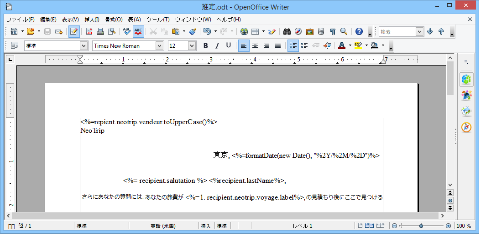
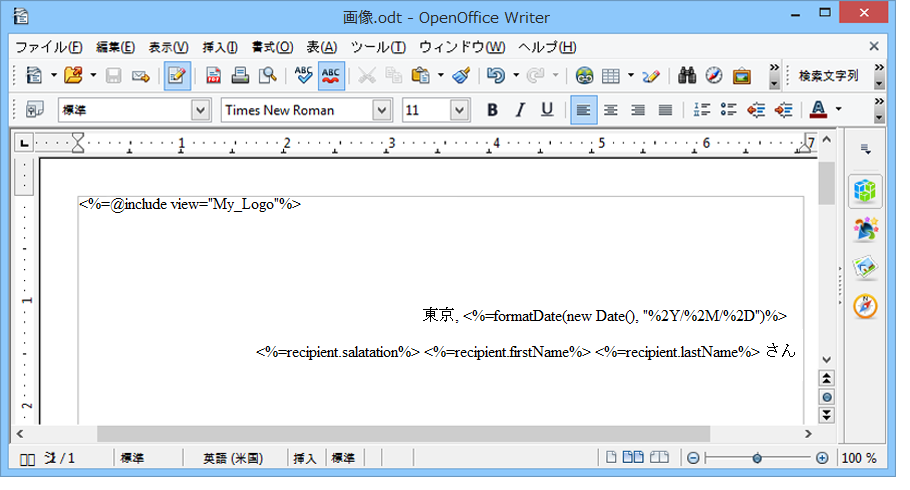
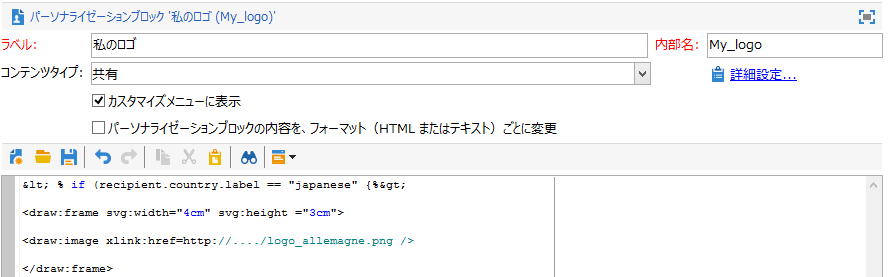
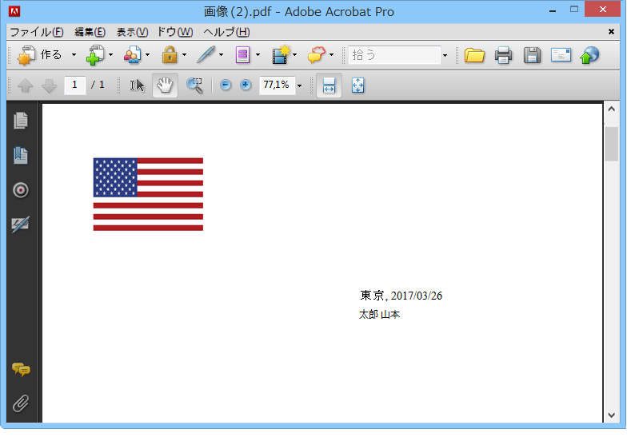

# パーソナライズした PDF ドキュメントの生成{#generating-personalized-pdf-documents}

## 様々な PDF ドキュメントについて {#about-variable-pdf-documents}

Adobe Campaign では、LibreOffice または Microsoft Word ドキュメントから（E メール添付ファイル、ダイレクトメール配信用に）PDF ドキュメントを生成することができます。

次の拡張機能がサポートされています。&quot;.docx&quot;、&quot;.doc&quot;、および&quot;.odt&quot;

ドキュメントをパーソナライズする場合、E メールのパーソナライゼーションと同じ JavaScript 機能を使用します。

このオプションを有効にする必要が **[!UICONTROL "The content of the file is personalized and converted to PDF during the delivery of each message"]** あります。 このオプションは、配信 E メールにファイルを添付する際にアクセスできます。For more on attaching a calculated file, refer to the [Attaching files](../../delivery/using/attaching-files.md) section.

請求書のヘッダーのパーソナライゼーションの例：



動的テーブルを生成する場合や URL 経由で画像を含める場合は、特定のプロセスを実行する必要があります。

## 動的テーブルの生成 {#generating-dynamic-tables}

動的テーブルを生成する手順は次のとおりです。

* 3 つの行と必要な数の列を含むテーブルを作成し、レイアウト（境界線など）を設定します。
* Place your cursor on the table and click the **[!UICONTROL Table > Table properties]** menu. Go to the **[!UICONTROL Table]** tab and enter a name beginning with **NlJsTable**.
* 1 行目の最初のセルで、テーブルで表示する値の反復処理を可能にするループ（例：for）を定義します。
* テーブルの 2 行目の各セルに、表示する値を返すスクリプトを挿入します。
* テーブルの 3 行目（最後の行）でループを閉じます。

   動的テーブルの定義の例：

   

## 外部画像の挿入 {#inserting-external-images}

外部画像の挿入は、例えば、画像付きドキュメントの URL が受信者のフィールドに入力されており、そのドキュメントをパーソナライズしたい場合に便利です。

そのためには、パーソナライゼーションブロックを設定してから、パーソナライゼーションブロックに対する呼び出しを添付ファイルに含める必要があります。

**例：受信者の国に応じてパーソナライズされたロゴを挿入する**

**ステップ 1：添付ファイルの作成：**

* パーソナライゼーションブロックへの呼び出しを挿入します。 **&lt;%@ include view=&quot;blockname&quot; %>**.
* コンテンツ（パーソナライズされている、またはパーソナライズされていない）をファイルの本文に挿入します。



**ステップ 2：パーソナライゼーションブロックの作成：**

* Adobe Campaignコンソール **[!UICONTROL Resources > Campaign management > Personalization blocks]** のメニューに移動します。
* 「My_Logo」を内部名に持つ新しい「My Logo」パーソナライゼーションブロックを作成します。
* リンクをクリックし **[!UICONTROL Advanced parameters...]** て、オプションを選択 **[!UICONTROL "The content of the block is included in an attachment"]** します。 これにより、パーソナライゼーションブロックの定義を直接 OpenOffice ファイルのコンテンツにコピーできます。

   

   パーソナライゼーションブロック内の 2 つのタイプの宣言を区別する必要があります。

   * The Adobe Campaign code of the personalization fields for which the &quot;open&quot; and &quot;closed&quot; chevrons must be replaced with escape characters (respectively `&lt;` and `&gt;`).
   * OpenOffice XML コード全体が OpenOffice ドキュメントにコピーされます。

今回の例では、パーソナライゼーションブロックは次のようになります。

```
<% if (recipient.country.label == "Germany") { %>
<draw:frame svg:width="4cm" svg:height="3cm">
<draw:image xlink:href=https://..../logo_germany.png />
</draw:frame>
<% } else
if (recipient.country.label == "USA")
{ %>
<draw:frame svg:width="4cm" svg:height="3cm">
<draw:image xlink:href=https://..../logo_USA.png />
</draw:frame>
<% } %>
```

受信者の国に応じて、パーソナライズされたコンテンツが配信にリンクされているドキュメントに表示されます。


