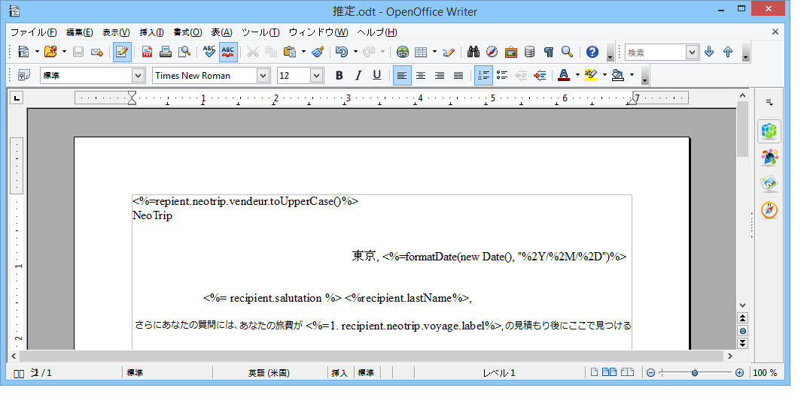
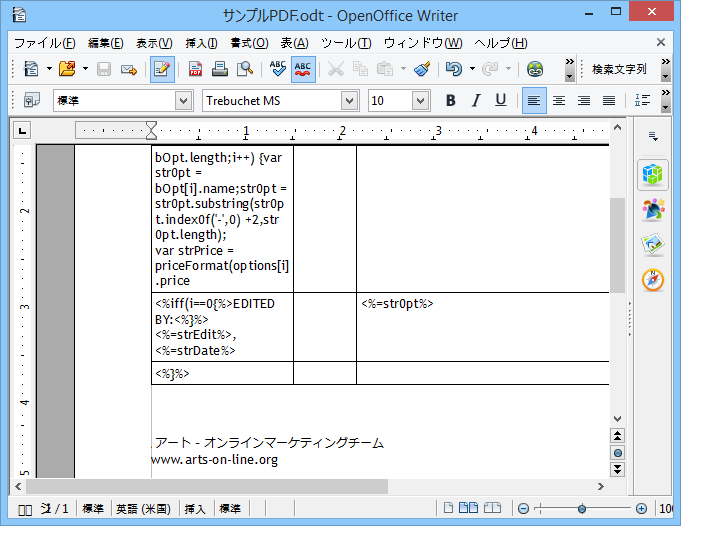
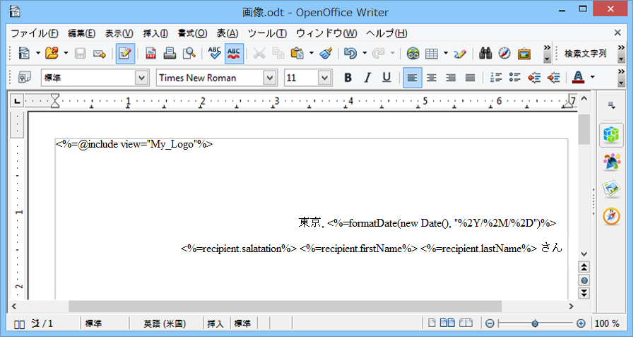
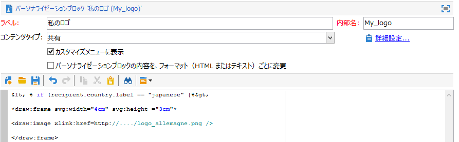
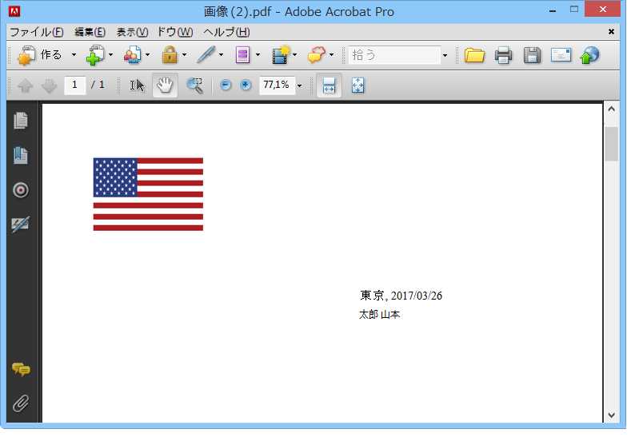

<?xml version="1.0" encoding="UTF-8"?>
<xliff xmlns="urn:oasis:names:tc:xliff:document:1.2" xmlns:okp="okapi-framework:xliff-extensions" xmlns:its="http://www.w3.org/2005/11/its" xmlns:itsxlf="http://www.w3.org/ns/its-xliff/" version="1.2" its:version="2.0">
<file original="help/delivery/using/generating-personalized-pdf-documents.md.mdsc" source-language="en-US" target-language="en-XX" datatype="x-text/markdown">
<body>
<trans-unit id="tu11" xml:space="preserve">
<source xml:lang="en-US">https://experienceleague.adobe.com/docs/campaign/campaign-v8/send/emails/attaching-files.html</source>
<target xml:lang="en-XX">https://experienceleague.adobe.com/docs/campaign/campaign-v8/send/emails/attaching-files.html?lang=ja</target>
</trans-unit>
<trans-unit id="tu27" xml:space="preserve">
<source xml:lang="en-US">https://experienceleague.adobe.com/en/docs/control-panel/using/instances-settings/url-permissions</source>
<target xml:lang="en-XX">https://experienceleague.adobe.com/ja/docs/control-panel/using/instances-settings/url-permissions</target>
</trans-unit>
<trans-unit id="tu1" restype="x-YAML_METADATA_HEADER_VALUE" xml:space="preserve">
<source xml:lang="en-US">Generate personalized PDF documents</source>
<target xml:lang="en-XX">パーソナライズされた PDF ドキュメントの生成</target>
</trans-unit>
<trans-unit id="tu2" restype="x-YAML_METADATA_HEADER_VALUE" xml:space="preserve">
<source xml:lang="en-US">Learn how to generate personalized PDF documents</source>
<target xml:lang="en-XX">パーソナライズされた PDF ドキュメントを生成する方法を学ぶ</target>
</trans-unit>
<trans-unit id="tu3" xml:space="preserve">
<source xml:lang="en-US">Also applies to v8</source>
<target xml:lang="en-XX">v8 にも適用されます</target>
</trans-unit>
<trans-unit id="tu4" xml:space="preserve">
<source xml:lang="en-US">Also applies to Campaign v8</source>
<target xml:lang="en-XX">Campaign v8 にも適用されます</target>
</trans-unit>
<trans-unit id="tu5" xml:space="preserve">
<source xml:lang="en-US">Generate personalized PDF documents</source>
<target xml:lang="en-XX">パーソナライズされた PDF ドキュメントの生成</target>
</trans-unit>
<trans-unit id="tu6" xml:space="preserve">
<source xml:lang="en-US">About variable PDF documents</source>
<target xml:lang="en-XX">様々な PDF ドキュメントについて</target>
</trans-unit>
<trans-unit id="tu7" xml:space="preserve">
<source xml:lang="en-US">Adobe Campaign lets you generate variable PDF documents for email attachments from LibreOffice or Microsoft Word documents.</source>
<target xml:lang="en-XX">Adobe Campaign では、LibreOffice や Microsoft Word ドキュメントから、メールの添付ファイル用に可変 PDF ドキュメントを生成することができます。</target>
</trans-unit>
<trans-unit id="tu8" xml:space="preserve">
<source xml:lang="en-US">The following extensions are supported: ".docx", ".doc", and ".odt".</source>
<target xml:lang="en-XX">サポートされる拡張子は、「.docx」、「.doc」および「.odt」です。</target>
</trans-unit>
<trans-unit id="tu9" xml:space="preserve">
<source xml:lang="en-US">To personalize your documents, the same JavaScript functionalities as for email personalization are available.</source>
<target xml:lang="en-XX">ドキュメントをパーソナライズする場合、メールのパーソナライゼーションと同じ JavaScript 機能を使用します。</target>
</trans-unit>
<trans-unit id="tu10" xml:space="preserve">
<source xml:lang="en-US">You need to activate the <ph id="1" ctype="x-STRONG_EMPHASIS">**[!UICONTROL </ph>"The content of the file is personalized and converted to PDF during the delivery of each message"<ph id="3" ctype="x-LINK_REF">]**</ph> option. This option is accessible when you attach the file to the delivery email. For more on attaching a calculated file, refer the <ph id="5" ctype="x-LINK">&lbrack;</ph>Campaign v8 documentation<ph id="6" ctype="x-LINK">[#$tu11]{target="_blank"}</ph>.</source>
<target xml:lang="en-XX">「<ph id="1" ctype="x-STRONG_EMPHASIS">**[!UICONTROL </ph>メッセージの配信中にファイルのコンテンツはパーソナライズされて PDF に変換<ph id="3" ctype="x-LINK_REF">]**</ph>」オプションを有効化する必要があります。 このオプションは、配信メールにファイルを添付する際にアクセスできます。 計算済みファイルの添付について詳しくは、<ph id="5" ctype="x-LINK">&lbrack;</ph>Campaign v8 ドキュメント<ph id="6" ctype="x-LINK">[#$tu11]{target="_blank"}</ph>を参照してください。</target>
</trans-unit>
<trans-unit id="tu12" xml:space="preserve">
<source xml:lang="en-US">Example of an invoice header personalization:</source>
<target xml:lang="en-XX">請求書のヘッダーのパーソナライゼーションの例：</target>
</trans-unit>
<trans-unit id="tu13" xml:space="preserve">
<source xml:lang="en-US"><ph id="1" ctype="x-IMAGE"></ph></source>
<target xml:lang="en-XX"><ph id="1" ctype="x-IMAGE"></ph></target>
</trans-unit>
<trans-unit id="tu14" xml:space="preserve">
<source xml:lang="en-US">To generate dynamic tables or include images via a URL, you need to follow a specific process.</source>
<target xml:lang="en-XX">動的テーブルを生成する場合や URL 経由で画像を含める場合は、特定のプロセスを実行する必要があります。</target>
</trans-unit>
<trans-unit id="tu15" xml:space="preserve">
<source xml:lang="en-US">Generate dynamic tables</source>
<target xml:lang="en-XX">動的テーブルの生成</target>
</trans-unit>
<trans-unit id="tu16" xml:space="preserve">
<source xml:lang="en-US">The procedure for generating dynamic tables is as follows:</source>
<target xml:lang="en-XX">動的テーブルを生成する手順は次のとおりです。</target>
</trans-unit>
<trans-unit id="tu17" xml:space="preserve">
<source xml:lang="en-US">Create a table with three lines and as many columns as necessary, then configure its layout (borders, etc.).</source>
<target xml:lang="en-XX">3 つの行と必要な数の列を含むテーブルを作成し、レイアウト（境界線など）を設定します。</target>
</trans-unit>
<trans-unit id="tu18" xml:space="preserve">
<source xml:lang="en-US">Place your cursor on the table and click the <ph id="1" ctype="x-STRONG_EMPHASIS">**[!UICONTROL </ph>Table > Table properties<ph id="3" ctype="x-LINK_REF">]**</ph> menu. Go to the <ph id="5" ctype="x-STRONG_EMPHASIS">**[!UICONTROL </ph>Table<ph id="7" ctype="x-LINK_REF">]**</ph> tab and enter a name beginning with <ph id="9" ctype="x-STRONG_EMPHASIS">**</ph>NlJsTable<ph id="10" ctype="x-STRONG_EMPHASIS">**</ph>.</source>
<target xml:lang="en-XX">テーブルにカーソルを置いて、<ph id="1" ctype="x-STRONG_EMPHASIS">**[!UICONTROL </ph>表／表プロパティ<ph id="3" ctype="x-LINK_REF">]**</ph>メニューをクリックします。 「<ph id="5" ctype="x-STRONG_EMPHASIS">**[!UICONTROL </ph>表<ph id="7" ctype="x-LINK_REF">]**</ph>」タブに移動して、<ph id="9" ctype="x-STRONG_EMPHASIS">**</ph>NlJsTable<ph id="10" ctype="x-STRONG_EMPHASIS">**</ph> で始まる名前を入力します。</target>
</trans-unit>
<trans-unit id="tu19" xml:space="preserve">
<source xml:lang="en-US">In the first cell of the first line, define a loop ("for", for example) that enables iteration on the values you want to display in the table.</source>
<target xml:lang="en-XX">1 行目の最初のセルで、テーブルで表示する値の反復処理を可能にするループ（例：for）を定義します。</target>
</trans-unit>
<trans-unit id="tu20" xml:space="preserve">
<source xml:lang="en-US">In each cell of the second line of the table, insert scripts that return the values to display.</source>
<target xml:lang="en-XX">テーブルの 2 行目の各セルに、表示する値を返すスクリプトを挿入します。</target>
</trans-unit>
<trans-unit id="tu21" xml:space="preserve">
<source xml:lang="en-US">Close the loop in the third and last line of the table.</source>
<target xml:lang="en-XX">テーブルの 3 行目（最後の行）でループを閉じます。</target>
</trans-unit>
<trans-unit id="tu22" xml:space="preserve">
<source xml:lang="en-US">Example of a dynamic table definition:</source>
<target xml:lang="en-XX">動的テーブルの定義の例：</target>
</trans-unit>
<trans-unit id="tu23" xml:space="preserve">
<source xml:lang="en-US"><ph id="1" ctype="x-IMAGE"></ph></source>
<target xml:lang="en-XX"><ph id="1" ctype="x-IMAGE"></ph></target>
</trans-unit>
<trans-unit id="tu24" xml:space="preserve">
<source xml:lang="en-US">Insert external images</source>
<target xml:lang="en-XX">外部画像の挿入</target>
</trans-unit>
<trans-unit id="tu25" xml:space="preserve">
<source xml:lang="en-US"><ph id="1" ctype="x-regxph" equiv-text="&lbrack;!IMPORTANT">[!IMPORTANT]</ph></source>
<target xml:lang="en-XX"><ph id="1" ctype="x-regxph" equiv-text="&lbrack;!IMPORTANT">[!IMPORTANT]</ph></target>
</trans-unit>
<trans-unit id="tu26" xml:space="preserve">
<source xml:lang="en-US">Release 7.4.4 (build 9401) includes an update to the external URL allow list. Make sure the domains used for external images in your attachments are added to your instance's approved allow list so that resources continue to load without interruption. As a Campaign Administrator, use the Control Panel to add and manage allow-listed URLs. See <ph id="1" ctype="x-LINK">&lbrack;</ph>Add URL permissions<ph id="2" ctype="x-LINK">[#$tu27]{target="_blank"}</ph> for steps.</source>
<target xml:lang="en-XX">リリース 7.4.4（ビルド 9401）には、外部 URL 許可リストのアップデートが含まれています。リソースが中断することなく継続して読み込まれるよう、添付ファイルの外部画像で使用されるドメインが、インスタンスの承認済み許可リストに追加されていることを確認してください。Campaign 管理者として、コントロールパネルを使用して、許可リスト登録済み URL を追加および管理してください。手順について詳しくは、<ph id="1" ctype="x-LINK">&lbrack;</ph>URL 権限の追加<ph id="2" ctype="x-LINK">[#$tu27]{target="_blank"}</ph>を参照してください。</target>
</trans-unit>
<trans-unit id="tu28" xml:space="preserve">
<source xml:lang="en-US">The insertion of external images is useful if, for instance, you want to personalize a document with an image whose URL is entered in a field of the recipient.</source>
<target xml:lang="en-XX">外部画像の挿入は、例えば、画像付きドキュメントの URL が受信者のフィールドに入力されており、そのドキュメントをパーソナライズしたい場合に便利です。</target>
</trans-unit>
<trans-unit id="tu29" xml:space="preserve">
<source xml:lang="en-US">To do this, you need to configure a personalization block, then include a call to the personalization block in the attachment.</source>
<target xml:lang="en-XX">そのためには、パーソナライゼーションブロックを設定してから、パーソナライゼーションブロックに対する呼び出しを添付ファイルに含める必要があります。</target>
</trans-unit>
<trans-unit id="tu30" xml:space="preserve">
<source xml:lang="en-US"><ph id="1" ctype="x-STRONG_EMPHASIS">**</ph>Example: insert a personalized logo depending on the recipient's country<ph id="2" ctype="x-STRONG_EMPHASIS">**</ph></source>
<target xml:lang="en-XX"><ph id="1" ctype="x-STRONG_EMPHASIS">**</ph>例：受信者の国に応じてパーソナライズされたロゴを挿入する<ph id="2" ctype="x-STRONG_EMPHASIS">**</ph></target>
</trans-unit>
<trans-unit id="tu31" xml:space="preserve">
<source xml:lang="en-US"><ph id="1" ctype="x-STRONG_EMPHASIS">**</ph>Step 1: create the attachment:<ph id="2" ctype="x-STRONG_EMPHASIS">**</ph></source>
<target xml:lang="en-XX"><ph id="1" ctype="x-STRONG_EMPHASIS">**</ph>ステップ 1：添付ファイルの作成：<ph id="2" ctype="x-STRONG_EMPHASIS">**</ph></target>
</trans-unit>
<trans-unit id="tu32" xml:space="preserve">
<source xml:lang="en-US">Insert the call to the personalization block: <ph id="1" ctype="x-STRONG_EMPHASIS">**</ph>&lt;%@ include view="blockname" %><ph id="2" ctype="x-STRONG_EMPHASIS">**</ph>.</source>
<target xml:lang="en-XX">パーソナライゼーションブロックに対する呼び出し <ph id="1" ctype="x-STRONG_EMPHASIS">**</ph>&lt;%@ include view="blockname" %><ph id="2" ctype="x-STRONG_EMPHASIS">**</ph> を挿入します。</target>
</trans-unit>
<trans-unit id="tu33" xml:space="preserve">
<source xml:lang="en-US">Insert your content (personalized or not) into the body of the file.</source>
<target xml:lang="en-XX">コンテンツ（パーソナライズされている、またはパーソナライズされていない）をファイルの本文に挿入します。</target>
</trans-unit>
<trans-unit id="tu34" xml:space="preserve">
<source xml:lang="en-US"><ph id="1" ctype="x-IMAGE"></ph></source>
<target xml:lang="en-XX"><ph id="1" ctype="x-IMAGE"></ph></target>
</trans-unit>
<trans-unit id="tu35" xml:space="preserve">
<source xml:lang="en-US"><ph id="1" ctype="x-STRONG_EMPHASIS">**</ph>Step 2: create the personalization block:<ph id="2" ctype="x-STRONG_EMPHASIS">**</ph></source>
<target xml:lang="en-XX"><ph id="1" ctype="x-STRONG_EMPHASIS">**</ph>ステップ 2：パーソナライゼーションブロックの作成：<ph id="2" ctype="x-STRONG_EMPHASIS">**</ph></target>
</trans-unit>
<trans-unit id="tu36" xml:space="preserve">
<source xml:lang="en-US">Go to the <ph id="1" ctype="x-STRONG_EMPHASIS">**[!UICONTROL </ph>Resources > Campaign management > Personalization blocks<ph id="3" ctype="x-LINK_REF">]**</ph> menu of the Adobe Campaign console.</source>
<target xml:lang="en-XX">Adobe Campaign コンソールの<ph id="1" ctype="x-STRONG_EMPHASIS">**[!UICONTROL </ph>リソース／キャンペーン管理／パーソナライゼーションブロック<ph id="3" ctype="x-LINK_REF">]**</ph>メニューに移動します。</target>
</trans-unit>
<trans-unit id="tu37" xml:space="preserve">
<source xml:lang="en-US">Create a new "My Logo" personalization block with "My_Logo" as an internal name.</source>
<target xml:lang="en-XX">「My_Logo」を内部名に持つ新しい「My Logo」パーソナライゼーションブロックを作成します。</target>
</trans-unit>
<trans-unit id="tu38" xml:space="preserve">
<source xml:lang="en-US">Click on the <ph id="1" ctype="x-STRONG_EMPHASIS">**[!UICONTROL </ph>Advanced parameters...<ph id="3" ctype="x-LINK_REF">]**</ph> link then check the <ph id="5" ctype="x-STRONG_EMPHASIS">**[!UICONTROL </ph>"The content of the block is included in an attachment"<ph id="7" ctype="x-LINK_REF">]**</ph> option. This lets you copy the definition of the personalization block directly into the content of the OpenOffice file.</source>
<target xml:lang="en-XX">「<ph id="1" ctype="x-STRONG_EMPHASIS">**[!UICONTROL </ph>詳細設定...<ph id="3" ctype="x-LINK_REF">]**</ph>」リンクをクリックして、「<ph id="5" ctype="x-STRONG_EMPHASIS">**[!UICONTROL </ph>ブロックは次に含まれるオプションで「添付ファイル」をオンにします<ph id="7" ctype="x-LINK_REF">]**</ph>」オプションをオンにします。 これにより、パーソナライゼーションブロックの定義を直接 OpenOffice ファイルのコンテンツにコピーできます。</target>
</trans-unit>
<trans-unit id="tu39" xml:space="preserve">
<source xml:lang="en-US"><ph id="1" ctype="x-IMAGE"></ph></source>
<target xml:lang="en-XX"><ph id="1" ctype="x-IMAGE"></ph></target>
</trans-unit>
<trans-unit id="tu40" xml:space="preserve">
<source xml:lang="en-US">You need to differentiate two types of declarations within the personalization block:</source>
<target xml:lang="en-XX">パーソナライゼーションブロック内の 2 つのタイプの宣言を区別する必要があります。</target>
</trans-unit>
<trans-unit id="tu41" xml:space="preserve">
<source xml:lang="en-US">The Adobe Campaign code of the personalization fields for which the "open" and "closed" chevrons must be replaced with escape characters (respectively <ph id="1" ctype="x-CODE">`&amp;lt;`</ph> and <ph id="2" ctype="x-CODE">`&amp;gt;`</ph>).</source>
<target xml:lang="en-XX">パーソナライゼーションフィールドの Adobe Campaign コードにおける「開く」および「閉じる」山括弧は、エスケープ文字（それぞれ <ph id="1" ctype="x-CODE">`&amp;lt;`</ph> と <ph id="2" ctype="x-CODE">`&amp;gt;`</ph>）で置き換える必要があります。</target>
</trans-unit>
<trans-unit id="tu42" xml:space="preserve">
<source xml:lang="en-US">The entire OpenOffice XML code will be copied into the OpenOffice document.</source>
<target xml:lang="en-XX">OpenOffice XML コード全体が OpenOffice ドキュメントにコピーされます。</target>
</trans-unit>
<trans-unit id="tu43" xml:space="preserve">
<source xml:lang="en-US">In the example, the personalization block looks like this:</source>
<target xml:lang="en-XX">今回の例では、パーソナライゼーションブロックは次のようになります。</target>
</trans-unit>
<trans-unit id="tu44" xml:space="preserve">
<source xml:lang="en-US">Depending on the recipient's country, personalization is visible in the document linked to the delivery:</source>
<target xml:lang="en-XX">受信者の国に応じて、パーソナライズされたコンテンツが配信にリンクされているドキュメントに表示されます。</target>
</trans-unit>
<trans-unit id="tu45" xml:space="preserve">
<source xml:lang="en-US"><ph id="1" ctype="x-IMAGE"></ph></source>
<target xml:lang="en-XX"><ph id="1" ctype="x-IMAGE"></ph></target>
</trans-unit>
</body>
</file>
</xliff>