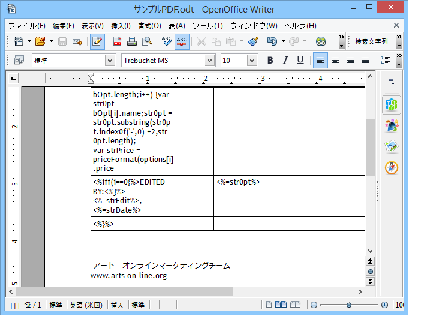

# パーソナライズした PDF ドキュメントの生成{#generating-personalized-pdf-documents}

## 様々な PDF ドキュメントについて {#about-variable-pdf-documents}

Adobe Campaign では、LibreOffice または Microsoft Word ドキュメントから（E メール添付ファイル、ダイレクトメール配信用に）PDF ドキュメントを生成することができます。

サポートされる拡張子は、「.docx」、「.doc」および「.odt」です。

ドキュメントをパーソナライズする場合、E メールのパーソナライゼーションと同じ JavaScript 機能を使用します。

「**[!UICONTROL メッセージの配信中にファイルのコンテンツはパーソナライズされて PDF に変換]**」オプションを有効化する必要があります。このオプションは、配信 E メールにファイルを添付する際にアクセスできます。計算済み添付ファイルについて詳しくは、[ファイルの添付](../../delivery/using/attaching-files.md)の節を参照してください。

請求書のヘッダーのパーソナライゼーションの例：


動的テーブルを生成する場合や URL 経由で画像を含める場合は、特定のプロセスを実行する必要があります。

## 動的テーブルの生成 {#generating-dynamic-tables}

動的テーブルを生成する手順は次のとおりです。

* 3 つの行と必要な数の列を含むテーブルを作成し、レイアウト（境界線など）を設定します。
* テーブルにカーソルを置いて、**[!UICONTROL 表／表プロパティ]**&#x200B;メニューをクリックします。「**[!UICONTROL 表]**」タブに移動して、**NlJsTable** で始まる名前を入力します。
* 1 行目の最初のセルで、テーブルで表示する値の反復処理を可能にするループ（例：for）を定義します。
* テーブルの 2 行目の各セルに、表示する値を返すスクリプトを挿入します。
* テーブルの 3 行目（最後の行）でループを閉じます。

   動的テーブルの定義の例：

   

## 外部画像の挿入 {#inserting-external-images}

外部画像の挿入は、例えば、画像付きドキュメントの URL が受信者のフィールドに入力されており、そのドキュメントをパーソナライズしたい場合に便利です。

そのためには、パーソナライゼーションブロックを設定してから、パーソナライゼーションブロックに対する呼び出しを添付ファイルに含める必要があります。

**例：受信者の国に応じてパーソナライズされたロゴを挿入する**

**ステップ 1：添付ファイルの作成：**

* パーソナライゼーションブロックに対する呼び出し **&lt;%@ include view=&quot;blockname&quot; %>** を挿入します。
* コンテンツ（パーソナライズされている、またはパーソナライズされていない）をファイルの本文に挿入します。


**ステップ 2：パーソナライゼーションブロックの作成：**

* Adobe Campaign コンソールの&#x200B;**[!UICONTROL リソース／キャンペーン管理／パーソナライゼーションブロック]**&#x200B;メニューに移動します。
* 「My_Logo」を内部名に持つ新しい「My Logo」パーソナライゼーションブロックを作成します。
* 「**[!UICONTROL 詳細設定...]**」リンクをクリックして、「**[!UICONTROL ブロックは次に含まれるオプションで「添付ファイル」をオンにします]**」オプションをオンにします。これにより、パーソナライゼーションブロックの定義を直接 OpenOffice ファイルのコンテンツにコピーできます。

   

   パーソナライゼーションブロック内の 2 つのタイプの宣言を区別する必要があります。

   * パーソナライゼーションフィールドの Adobe Campaign コードにおける「開く」および「閉じる」山括弧は、エスケープ文字（それぞれ `&lt;` と `&gt;`）で置き換える必要があります。
   * OpenOffice XML コード全体が OpenOffice ドキュメントにコピーされます。

今回の例では、パーソナライゼーションブロックは次のようになります。

```
<% if (recipient.country.label == "Germany") { %>
<draw:frame svg:width="4cm" svg:height="3cm">
<draw:image xlink:href=https://..../logo_germany.png />
</draw:frame>
<% } else
if (recipient.country.label == "USA")
{ %>
<draw:frame svg:width="4cm" svg:height="3cm">
<draw:image xlink:href=https://..../logo_USA.png />
</draw:frame>
<% } %>
```

受信者の国に応じて、パーソナライズされたコンテンツが配信にリンクされているドキュメントに表示されます。


