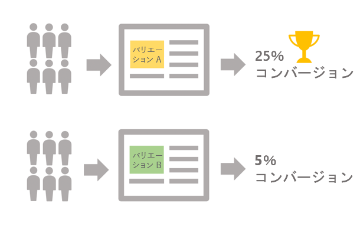

# A/Bテストの開始{#get-started-a-b-testing}

A/Bテストを使用すると、ターゲット母集団に最も大きな影響を与える配信を識別するために、複数のバージョンのバージョンを相互に比較できます。

これを行うには、まず配信の複数のバリアントを定義する必要があります。 その後、選択した条件に応じてどのバリエーションのパフォーマンスが良いかを判断するために、各バリエーションが母集団サンプルに送られます（開く、スパム、特定のリンクのクリックなど）。

次の例では、配信ターゲットが2つのグループに分割され、それぞれがターゲット母集団の50%を表しています。 各グループは、2つの異なるプロモーションオファーを持つ2つの配信を受け取ります。 配信の送信後、販促用オファーのクリック数に基づいて、バリアントAの方が良いパフォーマンスが得られたと結論付けられます。

Campaign Classicにより、A/Bテストはワークフローを通じて実装されます。ターゲットする母集団と各バリアントを受け取るグループを指定します（[A/bテストの設定](../../delivery/using/configuring-a-b-testing.md)を参照）。

主な手順は次のとおりです。

1. **目的の訪問者を** ターゲット設定します。
1. **配信のバリエーションをテストするサブセットに** 母集団を分割します。

   例えば、あるバージョンの配信をターゲット母集団の一部に、別のバージョンを残りの訪問者に送信できます。 これにより、通常顧客に送信される配信とは異なり、新しい配信をテストできます。 また、ターゲット母集団を3つのグループに分割して、1つの配信の3つの異なるバージョンを送信することもできます。

1. **各サブセットに対応する複数** の配信を作成します。テストするバリアントは、件名、メッセージの内容、送信者名などです。
1. ワークフローを開始し、**配信ログ**&#x200B;を使用して、各バリアントでのサブセットの動作を分析します。

>[!NOTE]
>
>また、ワークフローを使用すると、より良いパフォーマンスを示した配信バリアントを自動的に識別し、残りの訪問者に送信することで、プロセスを自動化できます。 詳しくは、この専用の[使用例](../../delivery/using/a-b-testing-use-case.md)を参照してください。
