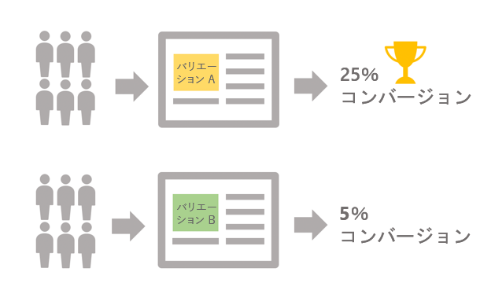

# A/B テストの基本を学ぶ {#get-started-a-b-testing}

A/B テストを使用すると、複数のバージョンを相互に比較して、ターゲット母集団に最も大きな影響を与える配信を識別できます。

それには、まず配信の複数のバリエーションを定義する必要があります。 選択した条件（開封数、スパム苦情数、特定のリンクのクリック数など）に応じて、どのバリエーションのパフォーマンスが良いかを判断するために、各バリエーションが母集団サンプルに送られます。

次の例では、配信ターゲットが 2 つのグループに分割され、それぞれがターゲット母集団の 50％に相当します。 各グループは、2 つの異なるプロモーションオファーを持つ 2 つのバージョンの配信を受け取ります。 配信の送信後、販促用オファーのクリック数に基づいて、バージョン A の方が良いパフォーマンスが得られたと結論付けられます。

Campaign Classic により、A/B テストはワークフローを通じて実装されます。ターゲットにする母集団と、各バリアントを受け取るグループを指定します（[A/B テストの設定](configuring-a-b-testing.md)を参照）。

主な手順は次のとおりです。

1. 目的の母集団を&#x200B;**ターゲット**&#x200B;にします。
1. 配信のバリエーションをテストするサブセットに&#x200B;**母集団を分割**&#x200B;します。

   例えば、あるバージョンの配信をターゲット母集団の一部に、別のバージョンをその他の母集団に送信できます。 これにより、通常顧客に送信される配信とは異なる、新しいバージョンの配信をテストできます。 また、ターゲット母集団を 3 つのグループに分割して、1 つの配信の 3 つの異なるバージョンを送信することもできます。

1. 各サブセットに対応する&#x200B;**複数のバージョンの配信を作成**&#x200B;します。 テストするバリエーションは、件名、メッセージの内容、送信者名などです。
1. ワークフローを開始したあと、**配信ログ**&#x200B;を使用して、各バリアントでサブセットの動作を分析します。

>[!NOTE]
>
>また、ワークフローを使用すると、プロセスの自動化が可能です。より良いパフォーマンスを示した配信バリアントを自動的に識別して、その他の母集団に送信できます。 詳しくは、この専用の[ユースケース](a-b-testing-use-case.md)を参照してください。
