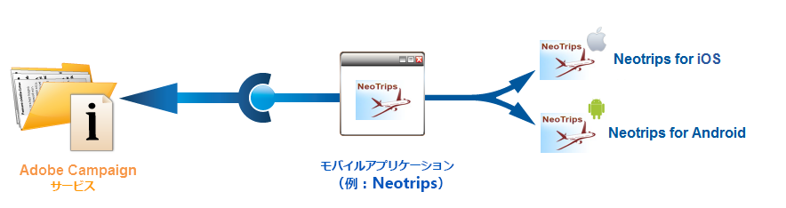

# アプリ設定の基本を学ぶ

この節は、オンラインホリデーパッケージを販売する会社を想定した設定例です。 同社のモバイルアプリケーション（Neotrips）は、Android 用 Neotrips と iOS 用 Neotrips の 2 つのバージョンで顧客に提供されています。

Adobe Campaign でプッシュ通知を送信するには、次の操作が必要です。

* Neotrips モバイルアプリケーション用に、**[!UICONTROL モバイルアプリケーション]**&#x200B;タイプの情報サービスを作成します。 iOS については、[この節](configuring-the-mobile-application.md#configuring-ios-service)を参照してください。 Android については、[この節](configuring-the-mobile-application-android.md#configuring-android-service)を参照してください。
* このサービスに、iOS バージョンと Android バージョンのアプリケーションを追加します。
* [iOS](create-notifications-ios.md) と [Android](create-notifications-android.md) 用の配信を作成します。

>[!NOTE]
>
>サービスの「**[!UICONTROL 購読]**」タブに移動して、サービスの購読者（モバイルデバイスにアプリケーションをインストールして、通知の受信に同意したすべてのユーザー）のリストを表示します。

## パッケージのインストール {#installing-package-ios}

[!BADGE オンプレミスおよびハイブリッド]{type=Caution url="https://experienceleague.adobe.com/docs/campaign-classic/using/installing-campaign-classic/architecture-and-hosting-models/hosting-models-lp/hosting-models.html?lang=ja" tooltip="オンプレミスデプロイメントとハイブリッドデプロイメントにのみ適用されます"}

 [モバイルアプリパッケージのインストール方法をビデオで確認](https://experienceleague.adobe.com/docs/campaign-classic-learn/tutorials/sending-messages/push-channel/installing-the-mobile-app-channel.html?lang=ja#sending-messages)

ハイブリッド／ホスト型のお客様は、[アドビカスタマーケア](https://helpx.adobe.com/jp/enterprise/admin-guide.html/enterprise/using/support-for-experience-cloud.ug.html)チームに連絡して、Campaign のプッシュ通知チャネルにアクセスします。

オンプレミスのお客様は、ビルトインのパッケージをインストールする必要があります。

>[!CAUTION]
>
>Campaign のビルトインパッケージ、ベストプラクティス、レコメンデーションについて詳しくは、[このページ](../../installation/using/installing-campaign-standard-packages.md)を参照してください。

インストール手順は次のとおりです。

1. Adobe Campaign クライアントコンソールの&#x200B;**[!UICONTROL ツール／高度なツール／パッケージをインポート]**&#x200B;から、パッケージインポートアシスタントにアクセスします。

   

1. 「**[!UICONTROL 標準パッケージをインストール]**」を選択します。

1. 表示されるリストで、「**[!UICONTROL モバイルアプリチャネル]**」をチェックします。

   

1. 「**[!UICONTROL 次へ]**」、「**[!UICONTROL 開始]**」の順にクリックして、パッケージのインストールを開始します。

   パッケージがインストールされると、進行状況バーに **100%** と表示され、インストールログに、「**[!UICONTROL パッケージが正常にインストールされました]**」と表示されます。

   

1. インストールウィンドウを&#x200B;**[!UICONTROL 閉じます]**。

この手順が完了したら、Android および iOS アプリを設定できます。
次の節を参照してください。

* [iOS の設定手順](configuring-the-mobile-application.md)

* [Android の設定手順](configuring-the-mobile-application-android.md)
