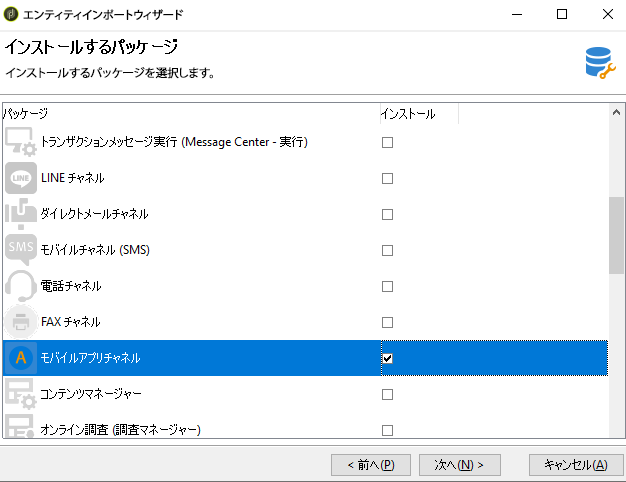

# アプリ設定を使い始める

この節では、オンラインの休日用パッケージを販売する会社に基づく設定例を見つけることができます。 そのモバイルアプリケーション（Neotrips）は、Android 用 Neotrips と iOS 用 Neotrips の 2 つのバージョンを顧客に提供しています。

Adobe Campaignでプッシュ通知を送信するには、次の操作が必要です。

* Neotrips モバイルアプリケーション用に、**[!UICONTROL モバイルアプリケーション]**&#x200B;タイプの情報サービスを作成します。iOSについては、 [この節を参照してください](../../delivery/using/configuring-the-mobile-application.md#configuring-ios-service)。 Androidの場合は [この節を参照してください](../../delivery/using/configuring-the-mobile-application-android.md#configuring-android-service)。
* このサービスに、iOS バージョンと Android バージョンのアプリケーションを追加します。
* iOS と Android の両方用に配信を作成します。[このページ](../../delivery/using/creating-notifications.md)を参照してください。

>[!NOTE]
>
>サービスの「**[!UICONTROL 購読]**」タブに移動して、サービスの購読者（モバイルデバイスにアプリケーションをインストールして、通知の受信に同意したすべてのユーザー）のリストを表示します。

## パッケージのインストール {#installing-package-ios}

ハイブリッド/ホストのお客様は、Adobeカスタマーケアチームに連絡して、キャンペーンのプッシュ通知チャネルにアクセスします。

オンプレミスのお客様は、次のインストール手順を実行する必要があります。

1. Adobe Campaign クライアントコンソールの&#x200B;**[!UICONTROL ツール／高度なツール／パッケージをインポート...]**&#x200B;からパッケージ読み込みウィザードにアクセスします。

   

1. 「**[!UICONTROL 標準パッケージをインストール]**」を選択します。

1. 表示されるリストで、「**[!UICONTROL モバイルアプリチャネル]**」をチェックします。

   

1. 「**[!UICONTROL 次へ]**」、「**[!UICONTROL 開始]**」の順にクリックして、パッケージのインストールを開始します。

   パッケージがインストールされると、進行状況バーに **100%** と表示され、インストールログに、「**[!UICONTROL パッケージが正常にインストールされました]**」と表示されます。

   

1. インストールウィンドウを&#x200B;**[!UICONTROL 閉じます]**。

この手順が完了したら、AndroidおよびiOSアプリを設定できます。
次の節を参照してください。

* [iOSの設定手順](../../delivery/using/configuring-the-mobile-application.md)

* [Androidの設定手順](../../delivery/using/configuring-the-mobile-application-android.md)
