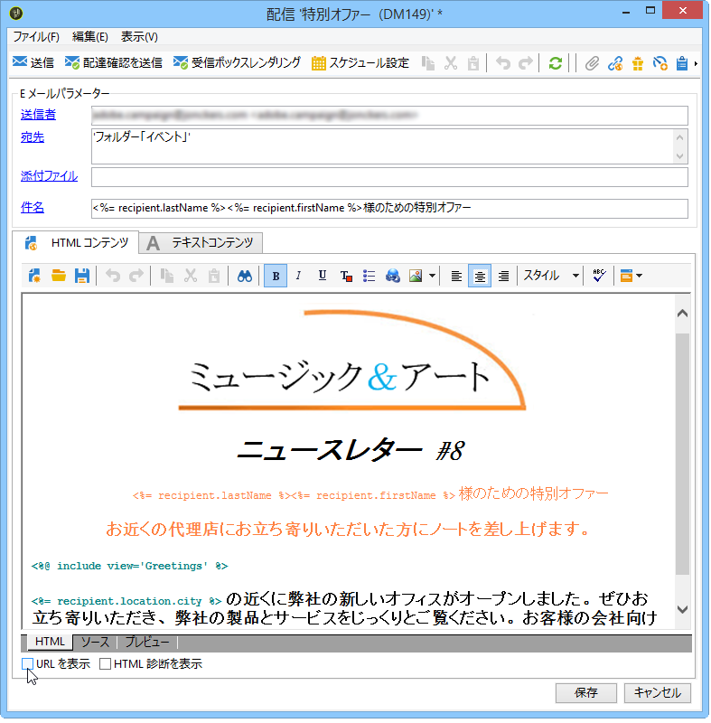
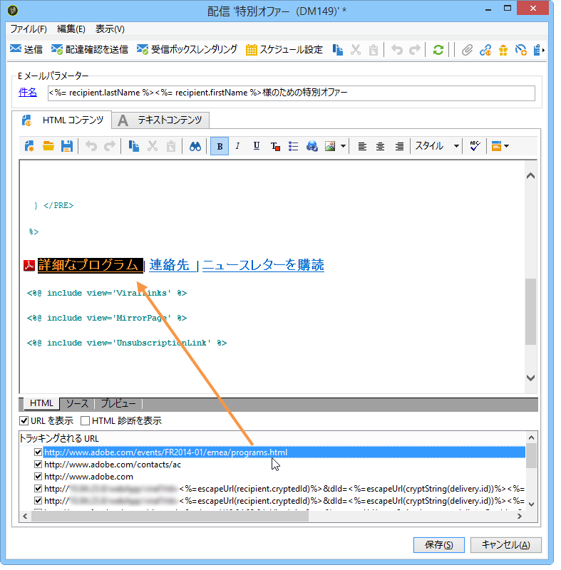
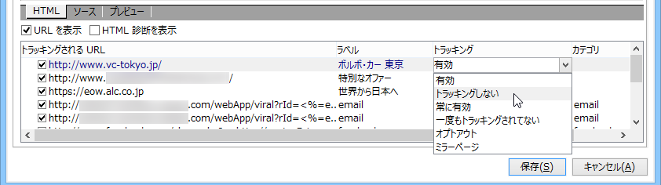

# トラッキングするリンクの設定方法{#how-to-configure-tracked-links}

配信ごとに、メッセージの受信と、メッセージコンテンツに挿入されたリンクの有効化をトラッキングできます。これによって、ターゲットとした配信アクションに続く受信者の行動をトラッキングできます。

>[!NOTE]
>
>トラッキングはメッセージに適用されますが、Web トラッキングを使用すると、受信者がどのように Web サイトを閲覧しているか（訪問したページ、購入など）を監視できます。
>
>Web トラッキングの設定については、[この節](../../configuration/using/about-web-tracking.md)で説明しています。

メッセージトラッキングは、デフォルトで有効になっています。URL のトラッキング方法をパーソナライズするには、以下の手順に従います。

1. Select the **[!UICONTROL Display URLs]** option in the lower section of the delivery wizard, under the message content.

   

   トラッキングされる URL のリストから URL を選択すると、ミラーページ内のリンクとデフォルトで提供される購読解除リンクを除いて、配信コンテンツ内でその URL が強調表示されます。

   

1. メッセージの URL ごとに、トラッキングを有効化するかどうかを選択します。

   >[!CAUTION]
   >
   >リンクの URL がラベルとして使用されている場合は、トラッキングを無効化してフィッシングによる拒否のリスクを回避することをお勧めします。
   >
   >例えば、www.adobe.com URL がメッセージに挿入され、トラッキングが有効化されている場合、ハイパーテキストリンクのコンテンツは https://nlt.adobe.net/r/?id=xxxxxx に変更されます。これは、この URL が受信者のメッセージクライアントによって不正とみなされる可能性があることを意味します。

1. 必要に応じて、トラッキングラベルを変更します。それには、ラベルをダブルクリックして、新しいラベルを入力します。

   >[!NOTE]
   >
   >トラッキングされる URL のラベルとラベルを変更して、配信のトラッキング時に情報を見やすくすることができます。クリック数の計算時には、同じ名前を持つ 2 つの URL または 2 つのラベルがまとめられます。

1. If needed, change the tracking mode, select a new mode in the **[!UICONTROL Tracking]** column which matches the targeted link, as shown below:

   

   URL ごとに、トラッキングモードを次のいずれかの値に設定できます。

   * **[!UICONTROL Enabled]** :このURLの追跡をアクティブにします。
   * **[!UICONTROL Not tracked]** :このURLの追跡を有効にします。
   * **[!UICONTROL Always enabled]** :常にこのURLの追跡をアクティブにします。 この情報は保存されるので、次回この URL が将来のメッセージコンテンツに再び表示された場合にそのトラッキングが自動的に有効化されます。
   * **[!UICONTROL Never tracked]** :は、このURLの追跡をアクティブにしません。 この情報は保存されるので、次回この URL が将来のメッセージに再び表示された場合にそのトラッキングが自動的に無効化されます。
   * **[!UICONTROL Opt-out]** :は、このURLをオプトアウトURLまたは購読解除URLと見なします。
   * **[!UICONTROL Mirror page]** :は、このURLをミラーページURLと見なします。

1. In addition, you can select a category for each tracked URL in the drop-down list of the **[!UICONTROL Category]** column. These categories can be displayed reports, as for example in **[!UICONTROL URLs and click streams]** (see [this section](../../reporting/using/reports-on-deliveries.md#urls-and-click-streams)). カテゴリは特定の列挙で定義されます。 **[!UICONTROL urlCategory]** (列挙の [管理を参照](../../platform/using/managing-enumerations.md))。
