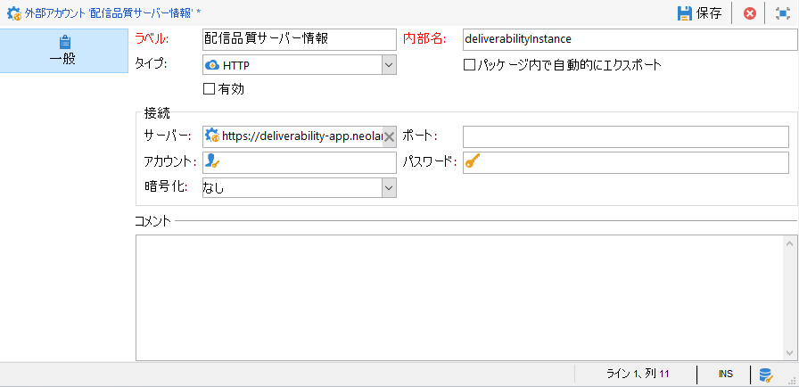
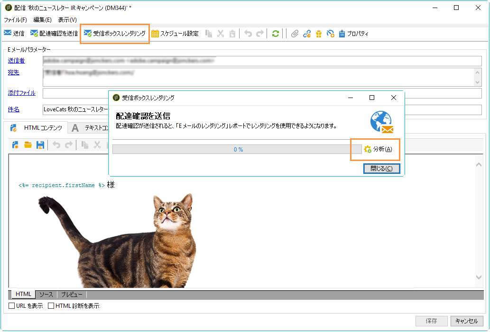
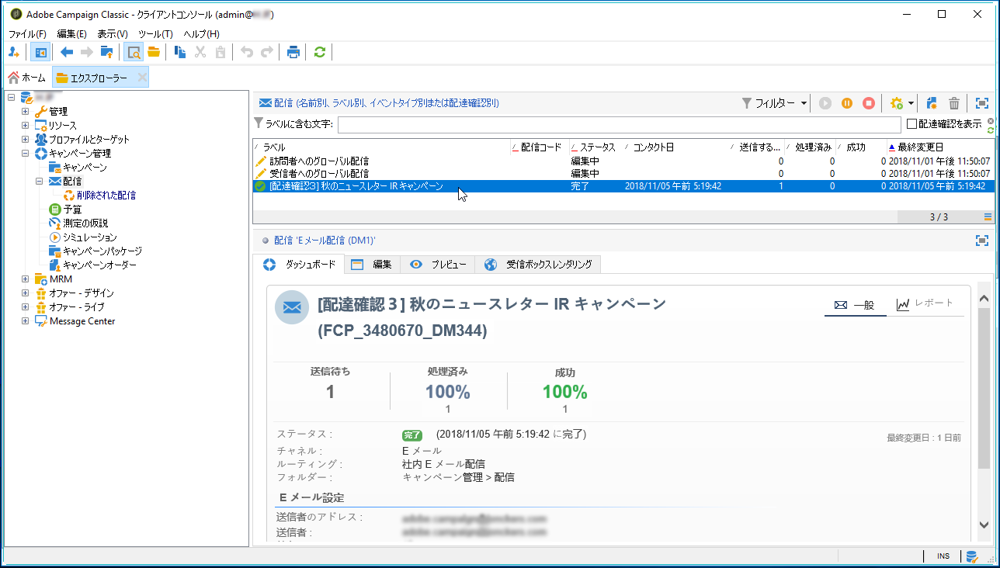
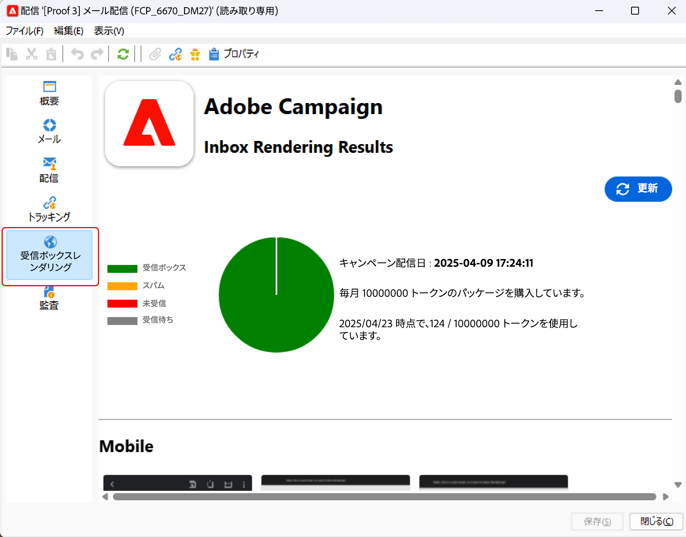
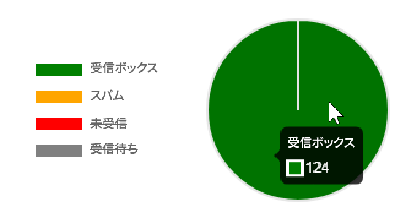
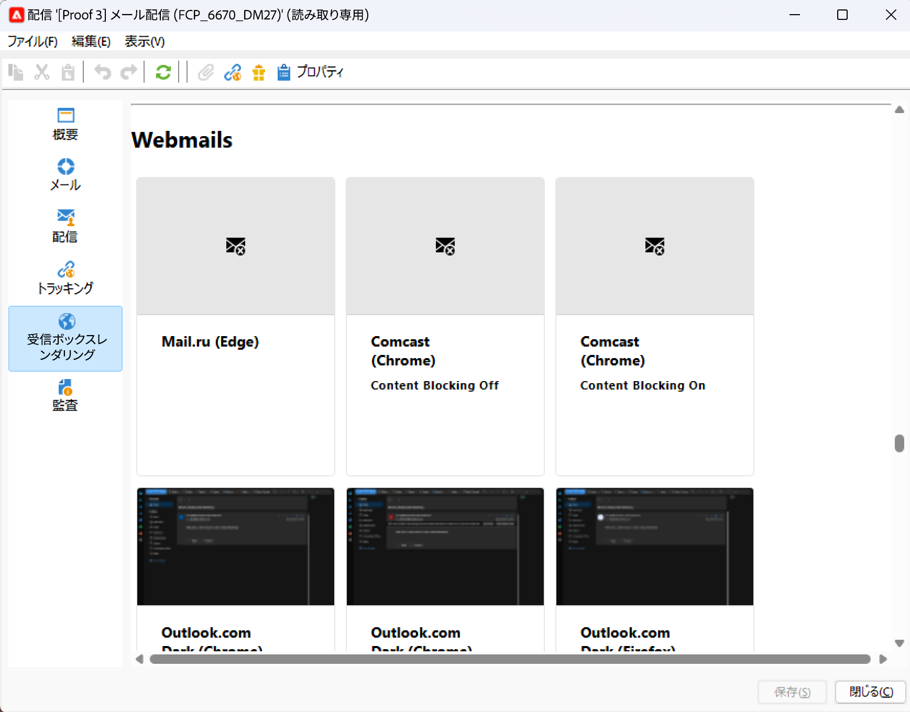
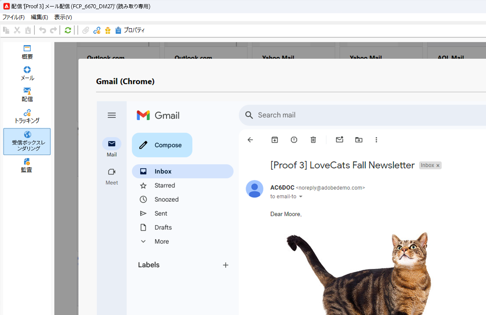

# 受信ボックスレンダリング{#inbox-rendering}

## 受信ボックスレンダリングについて {#about-inbox-rendering}

「**送信**」ボタンを押す前に、様々な Web クライアント、Web メールおよびデバイスで受信者へのメッセージの表示が最適化されていることを確認してください。

これを可能にするために、Adobe Campaign では、[Litmus](https://litmus.com/email-testing) の Web ベースの E メールテストソリューションを活用して、レンダリングをキャプチャし、専用のレポートで使用できるようにします。これにより、異なるコンテキストで受信される可能性のある送信済みのメッセージをプレビューして、メジャーなデスクトップおよびアプリケーションの互換性を確認できます。

Litmus は、多機能 E メール検証およびプレビューアプリケーションです。E メールコンテンツ作成者は、Gmail 受信トレイや Apple Mail クライアントなど、70 を超える E メールレンダラーでメッセージコンテンツをプレビューできます。

Adobe Campaign の「**受信ボックスレンダリング**」で使用できるモバイル、メッセージングおよび Web メールクライアントは、[Litmus の Web サイト](https://litmus.com/email-testing)に記載されています（「**View all email clients**」をクリックしてください）。

>[!NOTE]
>
>受信ボックスレンダリングは、配信のパーソナライゼーションをテストするには必要ありません。パーソナライゼーションは、**[!UICONTROL プレビュー]**&#x200B;および[配達確認](../../delivery/using/steps-validating-the-delivery.md#sending-a-proof)などの Adobe Campaign ツールで確認できます。

## 受信ボックスレンダリングを有効にする {#activating-inbox-rendering}

ホストクライアントおよびハイブリッドクライアントの場合、受信ボックスレンダリングはアドビのテクニカルサポートおよびコンサルタントがインスタンスに設定します。詳しくは、アドビのアカウント担当者にお問い合わせください。

オンプレミスインストールの場合は、次の手順に従って受信ボックスレンダリングを設定します。

1. **[!UICONTROL 受信ボックスレンダリング（IR）]**&#x200B;パッケージをインストールするには、**[!UICONTROL ツール]**／**[!UICONTROL 詳細設定]**／**[!UICONTROL パッケージをインポート]**&#x200B;メニューを使用します。詳しくは、[Campaign Classic 標準パッケージのインストール](../../installation/using/installing-campaign-standard-packages.md)を参照してください。
1. HTTP タイプの外部アカウントは、**[!UICONTROL 管理]**／**[!UICONTROL プラットフォーム]**／**[!UICONTROL 外部アカウント]**&#x200B;ノードで設定します。詳しくは、[外部アカウントの作成](../../platform/using/external-accounts.md#creating-an-external-account)を参照してください 。
1. 外部アカウントのパラメーターを次のように設定します。
   * **[!UICONTROL ラベル]**：配信品質サーバー情報
   * **[!UICONTROL 内部名]**： deliverabilityInstance
   * **[!UICONTROL タイプ]**： HTTP
   * **[!UICONTROL サーバー]**： https://deliverability-app.neolane.net/deliverability
   * **[!UICONTROL 暗号化]**：なし
   * 「**[!UICONTROL 有効]**」オプションをオンにします。
   

1. **[!UICONTROL 管理]**／**[!UICONTROL プラットフォーム]**／**[!UICONTROL オプション]**&#x200B;ノードに移動します。「**[!UICONTROL DmRendering_cuid]**」オプションを検索します。サポートに連絡して、**[!UICONTROL 値 (テキスト)]** フィールドにコピーする必要のある、配信レポートの識別子を取得します。
1. **serverConf.xml** ファイルを編集して、Litmus サーバーへの呼び出しを許可します。次の行を `<urlPermission>` セクションに追加します。

   ```
   <url dnsSuffix="deliverability-app.neolane.net" urlRegEx="https://.*"/>
   ```

1. 次のコマンドを使用して、設定を再読み込みします。

   ```
   nlserver config -reload
   ```

>[!NOTE]
>
>受信ボックスレンダリングを使用するには、コンソールからログアウトし、再度ログインする必要がある場合があります。

## Litmus トークンについて {#about-litmus-tokens}

Litmus はサードパーティのサービスなので、使用量ごとのクレジットモデルで機能します。ユーザーが Litmus 機能を呼び出すたびに、クレジットが差し引かれます。

Adobe Campaign では、クレジットは、使用可能なレンダリングの数（トークンと呼ばれる）に対応しています。

>[!NOTE]
>
>使用可能な Litmus トークンの数は、購入した Campaign ライセンスによって異なります。ライセンス契約を確認してください。

配信で&#x200B;**[!UICONTROL 受信ボックスレンダリング]**&#x200B;機能を使用して各レンダリングを生成するたびに、使用可能なトークンが 1 つずつ減ります。

>[!IMPORTANT]
>
>トークンは、受信ボックスレンダリングレポート全体ではなく、個々のレンダリングから成ります。つまり、
>
>* 受信ボックスレンダリングレポートが生成されるたびに、メッセージングクライアントあたり 1 つのトークンが差し引かれます（Outlook 2000 レンダリングに 1 トークン、Outlook 2010 レンダリングに 1 トークン、Apple Mail 9 レンダリングに 1 トークン、というようになります）。
>* 同じ配信について、受信ボックスレンダリングを再生成する場合、使用可能なトークンの数は、生成したレンダリングの数だけ再度減ります。
>


残りの使用可能なトークンの数は、[受信ボックスレンダリングレポート](#inbox-rendering-report)の&#x200B;**[!UICONTROL 一般概要]**&#x200B;に表示されます。


通常、受信ボックスレンダリング機能は、新しくデザインされた E メールの HTML フレームワークをテストするために使用されます。各レンダリングには、最大で約 70 トークンが必要です（通常テストされる環境の数による）。ただし、場合によっては、配信を完全にテストするために、複数の受信ボックスレンダリングレポートが必要なことがあります。そのため、複数の確認を完了するために、さらにトークンが必要になる可能性があります。

>[!NOTE]
>
>Litmus クライアントの場合は、自分の Litmus アカウントを使用して Adobe Campaign で受信ボックスレンダリングをプロビジョニングおよび使用することができます。詳しくは、アドビのアカウント担当者にお問い合わせください。
>
>Litmus 資格情報を変更すると、Adobe Campaign 内の認証で問題が生じる可能性があります。

## 受信ボックスレンダリングレポートへのアクセス {#accessing-the-inbox-rendering-report}

E メール配信を作成し、そのコンテンツとターゲット母集団を定義したら、以下の手順に従います。

配信の作成、デザインおよびターゲティングについて詳しくは、[この節](../../delivery/using/about-email-channel.md)を参照してください。

1. 配信の上部のバーで、「**[!UICONTROL 受信ボックスレンダリング]**」ボタンをクリックします。
1. 「**[!UICONTROL 分析]**」を選択してキャプチャプロセスを開始します。

   

   配達確認が送信されます。E メール送信後数分で、その配達確認からレンダリングサムネイルにアクセスできます。配達確認の送信について詳しくは、[この節](../../delivery/using/steps-validating-the-delivery.md#sending-a-proof)を参照してください。

1. 送信後、配達確認は配信リストに表示されます。ダブルクリックします。

   

1. 配達確認の「**受信ボックスレンダリング**」タブに移動します。

   

   受信ボックスレンダリングレポートが表示されます。

## 受信ボックスレンダリングレポート {#inbox-rendering-report}

このレポートには、受信者に表示される受信ボックスレンダリングが表示されます。レンダリングは、ブラウザー、モバイルデバイス、E メールアプリケーションなど、受信者がどの方法で E メール配信を開くかによって異なります。

「**[!UICONTROL General summary]**」には、受信済みメッセージ、不要なメッセージ（スパム）、受信されていないメッセージまたは受信が保留されているメッセージの数がリストとしてグラフィカルに色分けされて表示されます。



グラフに上にマウスポインターを置くと、各色の詳細が表示されます。

レポートの本文は、**[!UICONTROL モバイル]**、**[!UICONTROL メッセージクライアント]**、**[!UICONTROL Web メール]**&#x200B;の 3 つの部分に分けられています。レポートを下へスクロールすると、これらの 3 つのカテゴリにグループ化されたすべてのレンダリングが表示されます。



各レポートの詳細を表示するには、対応するカードをクリックします。選択した受信方法のレンダリングが表示されます。


