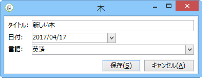
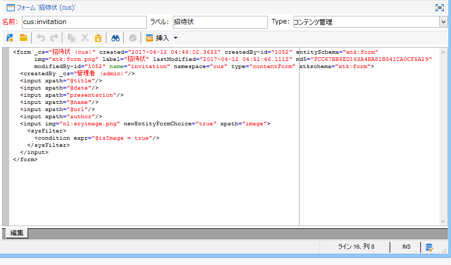
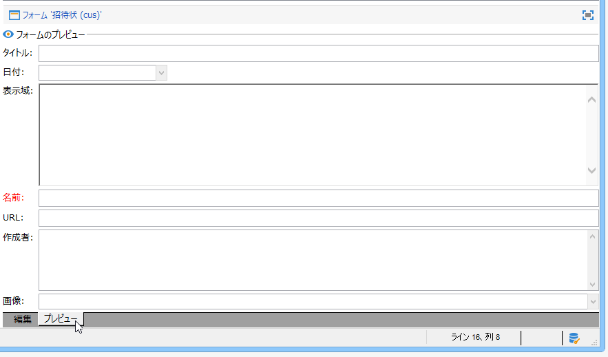

# 入力フォーム{#input-forms}

Adobe Campaign の入力フォーム使用に関する一般的な原理を一部紹介します。

フォームについては、[この節](../../configuration/using/identifying-a-form.md)で詳しく説明しています。

## フォームの構造 {#form-structure}

入力フォームの XML ドキュメントには、**name** 属性と **namespace** 属性が設定された **`<form>`** ルート要素が必要です。これにより、フォームの名前と名前空間がそれぞれ指定されます。

```
<form name="form_name" namespace="name_space">
...
</form>
```

デフォルトでは、フォームは同じ名前と名前空間を持つデータスキーマに関連付けられます。フォームを異なる名前に関連付けるには、**`<form>`** 要素の **entity-schema** 属性にスキーマキーを入力します。

入力フォームの構造を説明するために、サンプルのスキーマ「cus:book」をベースとするインターフェイスについて説明します。



対応する入力フォームは次のようになります。

```
<form name="book" namespace="cus" type="contentForm">
  <input xpath="@name"/>
  <input xpath="@date"/>
  <input xpath="@language"/>
</form>
```

編集要素の記述は、**`<form>`** ルート要素で始まります。

編集コントロールが、スキーマ内のフィールドのパスを格納した **xpath** 属性を持つ **`<input>`** 要素に入力されます。

**XPath 構文に関する注意：**

Adobe Campaign では、XPath 言語を使用して、データスキーマに属する要素または属性を参照します。

XPath は、XML ドキュメントのツリー内にノードを配置するための構文です。

要素は名前で指定し、属性は名前の前に「@」文字を付けて指定します。

例：

* **@date**：「date」という名前の属性を選択
* **chapter/@title**：`<chapter>` 要素の下の「title」属性を選択
* **../@date**：現在の要素の親要素から date を選択

編集コントロールは、対応するデータタイプに自動的に適応し、スキーマで定義されているラベルを使用します。

デフォルトでは、各フィールドが 1 行に表示され、データのタイプに応じて、すべての空きスペースを占有します。

>[!CAUTION]
>
>入力フォームは、入力するコンテンツに必要なフレームを自動的に追加するために、**`<form>`** 要素の **type=&quot;contentForm&quot;** 属性を参照する必要があります。

## 書式設定 {#formatting}

コントロールを互いに相対的に配置する作業は、HTML テーブルで使用される配置に似ています。1 つのコントロールを複数の列に分割したり、複数の要素を組み合わせたり、空きスペースの占有を指定したりできます。ただし、書式設定で許可されているのは割合の記述のみです。オブジェクトの固定寸法は指定できません。

詳しくは、[この節](../../configuration/using/form-structure.md#formatting)を参照してください。

## リストタイプのコントロール {#list-type-controls}

コレクション要素を編集するには、リストタイプのコントロールを使用する必要があります。

### 列リスト {#column-list}

このコントロールは、「追加」ボタンと「削除」ボタンを含むツールバー付きの編集可能な列リストを表示しています。


```
<input xpath="chapter" type="list">
  <input xpath="@name"/>
  <input xpath="@number"/>
</input>
```

リストコントロールは、**type=&quot;list&quot;** 属性を使用して設定する必要があります。リストのパスは、コレクション要素を参照する必要があります。

列は、リストの子の **`<input>`** 要素で宣言します。

>[!NOTE]
>
>上と下の並べ替え矢印は、データスキーマ内のコレクション要素に **ordered=&quot;true&quot;** 属性を設定すると、自動的に追加されます。

デフォルトでは、ツールバーのボタンは垂直方向に整列されます。水平方向に整列させることもできます。


```
<input nolabel="true" toolbarCaption="List of chapters" type="list" xpath="chapter">
  <input xpath="@name"/>
  <input xpath="@number"/>
</input>
```

**toolbarCaption** 属性は、ツールバーを水平方向に整列させ、リストの上のタイトルを設定します。

>[!NOTE]
>
>コントロールの左側にコレクション要素のラベルを表示しないようにするには、**nolabel=&quot;true&quot;** 属性を追加します。

#### リストの詳細表示 {#zoom-in-a-list}

リストデータの挿入と編集は、別々の編集フォームで実行できます。

リスト内の編集フォームは、次のような場合に使用します。

* 情報入力を簡単にする
* 複数行コントロールが存在する
* リスト内の列にメインフィールドのみ含め、フォームでコレクション要素のすべてのフィールドを表示する


```
<input nolabel="true" toolbarCaption="List of chapters" type="list" xpath="chapter" zoom="true" zoomOnAdd="true">
  <input xpath="@name"/>
  <input xpath="@number"/>

  <form colcount="2" label="Editing a chapter">
    <input xpath="@name"/>
    <input xpath="@number"/>
    <input colspan="2" xpath="page"/>
  </form>
</input>
```

編集フォームの定義は、リスト要素の下の **`<form>`** 要素で指定します。編集フォームの構造は、入力フォームの構造と同じです。

リスト定義に **zoom=&quot;true&quot;** 属性を入力すると、「**[!UICONTROL 詳細]**」ボタンが自動的に追加されます。このボタンを使用して、選択した行の編集フォームを開くことができます。

>[!NOTE]
>
>**zoomOnAdd=&quot;true&quot;** 属性を追加すると、リストの要素の挿入時に編集フォームが呼び出されます。

### タブリスト {#tab-list}

タブリストは、コレクション要素をタブ形式で編集できるようにします。


```
<container toolbarCaption="List of chapters" type="notebooklist" xpath="chapter" xpath-label="@name">
  <container colcount="2">
    <input xpath="@name"/>
    <input xpath="@number"/>
    <input colspan="2" xpath="page"/>
  </container>
</container>
```

このリストコントロールは、**type=&quot;notebooklist&quot;** 属性を使用して設定する必要があります。リストのパスは、コレクション要素を参照する必要があります。

タブのタイトルには、**xpath-label** 属性で入力したデータの値が設定されます。

編集コントロールは、リストコントロールの子の **`<container>`** 要素の下で宣言する必要があります。

リスト要素を追加または削除するには、ツールバーのボタンを使用します。

>[!NOTE]
>
>左と右の並べ替え矢印は、データスキーマ内のコレクション要素に対して **ordered=&quot;true&quot;** 属性を設定すると、自動的に追加されます。

## コンテナ {#containers}

コンテナを使用すると、一連のコントロールをグループ化できます。コンテナは、**`<container>`** 要素を使用して作成します。コンテナは、複数の列でのコントロールの書式設定や、タブリストのコントロール用に、既に使用されています。

コンテナおよび入力フォームでのコンテナの使用方法について詳しくは、[この節](../../configuration/using/form-structure.md#containers)を参照してください。

## フォームの編集 {#editing-forms}

編集領域を使用して、入力フォームの XML コンテンツを入力できます。



「**[!UICONTROL プレビュー]**」タブで、入力フォームを確認できます。


