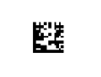

# E メールへのバーコードの挿入{#inserting-a-barcode-in-an-email}

バーコード生成モジュールを使用して、2D バーコードなど、一般的基準に適合する、複数のタイプのバーコードを作成できます。

顧客側の基準を基に定義された値を使用して、バーコードをビットマップとして動的に生成できます。パーソナライズしたバーコードを E メールキャンペーンに含めることができます。受信者は、メッセージを印刷したり、（チェックアウト時などに）発行会社に提示してスキャンしたりできます。

バーコードを E メールに挿入するには、表示したいコンテンツ内にカーソルを置いて、パーソナライゼーションボタンをクリックします。選択 **[!UICONTROL Include > Barcode...]**.

ニーズに合わせて次の要素を設定します。

1. バーコードのタイプを選択します。

   * 1D形式の場合、Adobe Campaignでは次のタイプを使用できます。Codabar、Code 128、GS1-128（旧EAN-128）、UPC-A、UPC-E、ISBN、EAN-8、Code39、Interleaved 2 of 5、POSTNET、Royal Mail(RM4SCC)。

      1D バーコードの例：

      

   * DataMatrix タイプと PDF417 タイプは 2D フォーマットを扱います。

      2D バーコードの例：

      

   * QR コードを挿入するには、このタイプを選択し、適用する誤り訂正レベルを入力します。このレベルで、データ量とコードの劣化の許容範囲を定義します。

      

      QR コードの例：

      

1. E メールに挿入したいバーコードのサイズを入力します。縮尺を設定することによって、バーコードのサイズを 1 倍から 10 倍まで拡大または縮小できます。
1. The **[!UICONTROL Value]** field enables you to define the value of the barcode. 値は、特別オファーに対応させたり、ある基準の関数にすることができます。顧客にリンクされているデータベースフィールドの値にすることも可能です。

   次の例は、受信者のアカウント番号が追加された EAN-8 タイプのバーコードを示しています。To add this account number, click the personalization button to the right of the **[!UICONTROL Value]** field and select **[!UICONTROL Recipient > Account number]**.

   

1. The **[!UICONTROL Height]** field lets you configure the height of the barcode without changing its width, by altering the amount of space between each bar.

   バーコードのタイプによる入力コントロールの制限はありません。バーコードの値が正しくない場合、バーコードは&#x200B;**プレビュー**&#x200B;モードで赤色の x 印で消された状態で表示されます。

   >[!NOTE]
   >
   >バーコードに割り当てる値は、バーコードのタイプによって異なります。例えば、EAN-8 タイプは 8 桁でなければなりません。
   >
   >The personalization button to the right of the **[!UICONTROL Value]** field lets you add data in addition to the value itself. バーコードの基準に則っていれば、これによりバーコードを充実させることができます。
   >
   >For example, if you are using a GS1-128 type barcode and want to enter the account number of a recipient in addition to the value, click the personalization button and select **[!UICONTROL Recipient > Account number]**. 選択した受信者のアカウント番号が正しく入力された場合、バーコードはこのアカウント番号を処理します。

これらの要素を設定したら、E メールを仕上げて送信できます。To avoid errors, always make sure your content is displayed correctly before performing a delivery by clicking the **[!UICONTROL Preview]** tab.

>[!NOTE]
>
>バーコードの値が正しくない場合、バーコードのビットマップは赤色の×印で消された状態で表示されます。

