# LINE チャネル{#line-channel}

LINE は、無料でインスタントメッセージング、音声通話、ビデオ通話ができるアプリケーションで、すべてのスマートフォン（iPhone、Android、Windows Phone、Blackberry、Nokia）と PC で利用可能です。Adobe Campaign では、LINE メッセージを送信できます。

LINE は、オンプレミスインストールまたは管理されたサービスインストールでのみ使用できます。

また LINE は、コンシューマー向けモバイルデバイスにインストールされた LINE アプリでリアルタイムメッセージを送信するために、トランザクションメッセージモジュールと組み合わせることができます。詳しくは、この[ページ](../../message-center/using/transactional-messaging-architecture.md#transactional-messaging-and-line)を参照してください。

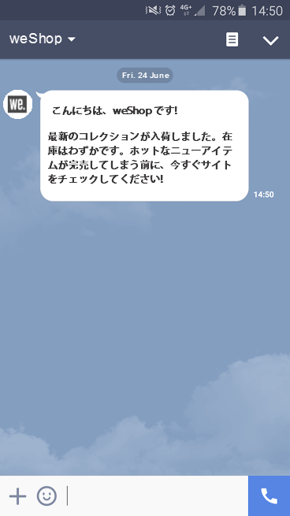

以下の節では、LINE チャネルに固有の情報を提供します。 配信の作成方法に関する全般的な情報については、[この節](../../delivery/using/steps-about-delivery-creation-steps.md)を参照してください。

LINE チャネルを使用する手順は次のとおりです。

1. 配信の作成
1. メッセージコンテンツの設定
1. ターゲット母集団の選択
1. メッセージの送信
1. 配信の監視（トラッキング、強制隔離、レポートなど）

## LINE チャネルの設定 {#setting-up-line-channel}

### LINE アカウントと外部アカウントの作成 {#creating-a-line-account-and-an-external-account-}

>[!NOTE]
>
>LINE アカウントと外部アカウントを作成する前に、まず LINE パッケージをインスタンスにインストールする必要があります。詳しくは、インストールガイドの [LINE](../../installation/using/installing-campaign-standard-packages.md#line-package) の節を参照してください。

まず、Adobe Campaign にリンクできるように、LINE アカウントを作成する必要があります。LINE アカウントをモバイルアプリケーションで追加したユーザーに LINE メッセージを送信できます。外部アカウントと LINE アカウントは、プラットフォームの機能管理者のみが管理できます。

LINE アカウントを作成して設定するには、[https://developers.line.me/](https://developers.line.me/) を参照してください。

LINE サービスを作成して設定するには、[購読の管理](../../delivery/using/managing-subscriptions.md)を参照してください。

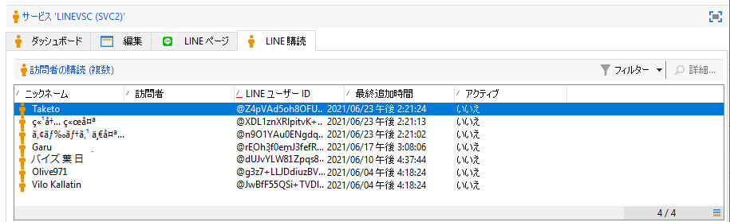

Adobe Campaign で外部アカウントを作成する手順は次のとおりです。

1. **管理**／**プラットフォーム**&#x200B;ツリー構造で、「**外部アカウント**」タブをクリックします。
1. 次に「**新規**」アイコンをクリックします。

   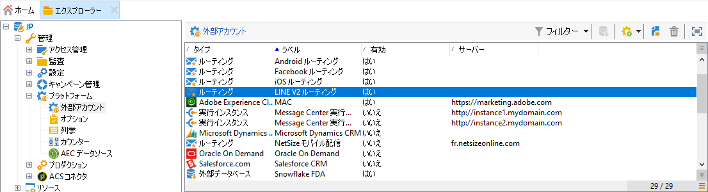

1. 「**ラベル**」フィールドと「**内部名**」フィールドに入力します。
1. 「**[!UICONTROL タイプ]**」フィールドで「ルーティング」を選択し、「**チャネル**」フィールドで「LINE」を選択します。
1. 「**[!UICONTROL 保存]**」をクリックして LINE 外部アカウントを作成します。
1. 「**一般**」アイコンの下に **LINE** のパーソナライゼーションフィールドが表示されます。次のフィールドに入力します。

   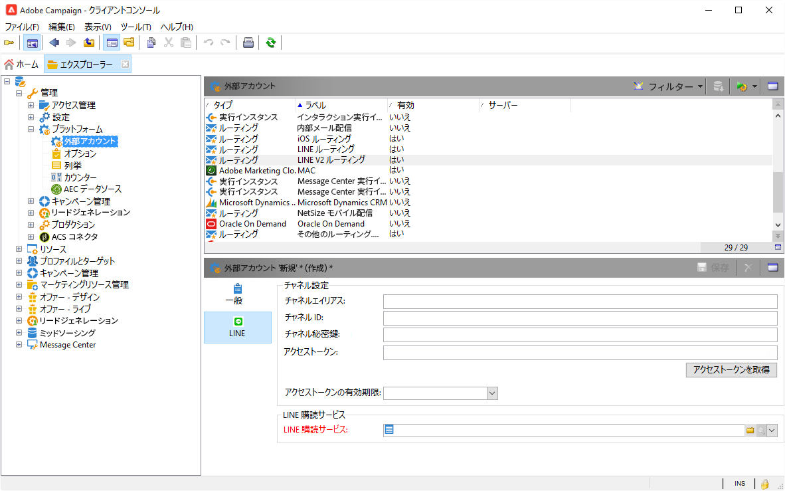

   * **Channel のエイリアス**：**[!UICONTROL チャネル]**／「**[!UICONTROL 技術的設定]**」タブの LINE アカウント経由で提供されます。
   * **Channel ID**：**チャネル**／**基本情報パネル**&#x200B;タブの LINE アカウント経由で提供されます。
   * **Channel 秘密鍵**：**チャネル**／「**基本情報パネル」**&#x200B;タブの LINE アカウント経由で提供されます。
   * **アクセストークン**：開発者ポータルの LINE アカウント経由で提供されるか、または「**[!UICONTROL アクセストークンを取得]**」ボタンをクリックすることで提供されます。
   * **アクセストークンの有効期限**：アクセストークンの有効期限日を指定できます。
   * **LINE 購読サービス**：ユーザーがどのサービスを購読するかを指定できます。

>[!NOTE]
>
>**[!UICONTROL LINE アクセストークンの更新（updateLineAccessToken）]**&#x200B;と&#x200B;**[!UICONTROL ブロックした LINE ユーザーを削除（deleteBlockedLineUsers）]**&#x200B;のワークフローが開始されたことを確認する必要があります。エクスプローラーから、**[!UICONTROL 管理／プロダクション／テクニカルワークフロー／LINE ワークフロー]**&#x200B;をクリックして、ワークフローのステータスを確認します。

## 配信の作成 {#creating-the-delivery}

**LINE** 配信を作成するには、次の手順に従う必要があります。

>[!NOTE]
>
>配信の作成に関するグローバルな概念については、[この節](../../delivery/using/steps-about-delivery-creation-steps.md)で説明しています。

1. 「**[!UICONTROL キャンペーン]**」タブで、「**[!UICONTROL 配信]**」を選択し、「**[!UICONTROL 作成]**」ボタンをクリックします。
1. 表示されるウィンドウで、「**[!UICONTROL LINE V2 配信]**」配信テンプレートを選択します。

   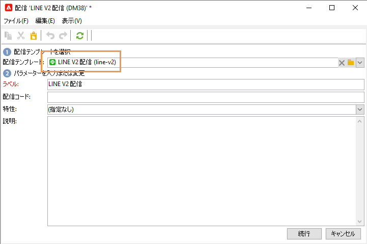

1. ラベル、コードおよび説明を設定して配信を識別します。詳しくは、[この節](../../delivery/using/steps-create-and-identify-the-delivery.md#identifying-the-delivery)を参照してください。
1. 「**[!UICONTROL 続行]**」をクリックして配信を作成します。

## コンテンツの定義 {#defining-the-content}

LINE 配信のコンテンツを定義するには、最初にメッセージタイプを配信に追加する必要があります。それぞれの LINE 配信には最大で 5 件のメッセージを含めることができます。

次の 2 つのメッセージタイプから選択できます。

* テキストメッセージ
* 画像とリンク

### テキストメッセージの配信の設定 {#configuring-a-text-message-delivery}

**テキストメッセージ**&#x200B;の LINE 配信は、テキスト形式で受信者に送信されるメッセージです。

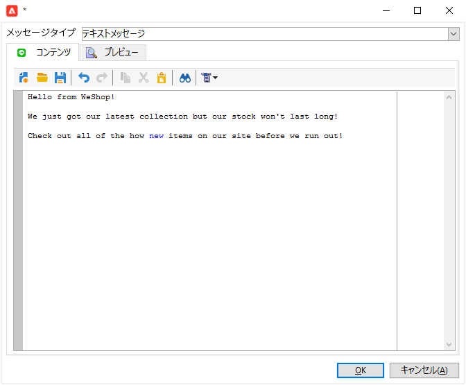

このタイプのメッセージの設定は、E メールの&#x200B;**テキスト**&#x200B;の設定と類似しています。詳しくは、この[ページ](../../delivery/using/defining-the-email-content.md#message-content)を参照してください。

### 画像とリンクの配信の設定 {#configuring-an-image-and-link-delivery}

**画像とリンク**&#x200B;の LINE 配信は、1 つまたは複数の URL を含む可能性のある画像の形式で受信者に送信されるメッセージです。

以下を使用できます。

* **パーソナライズされた画像**

   >[!NOTE]
   >
   >**%SIZE%** 変数：この変数は、受信者のモバイルデバイスの画面サイズに応じて画像の表示を最適化できます。

   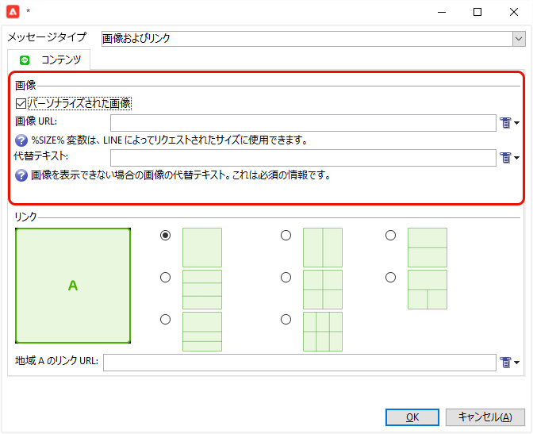

* **画像 URL**

   

   画像 URL は、様々な画像解像度を使用して、モバイルデバイスでの配信の表示を最適化できます。同じ高さと幅の画像のみがサポートされます。

   画像は、画面サイズに従って定義できます。

   * 1040 px
   * 700 px
   * 460 px
   * 300 px
   * 240 px
   >[!NOTE]
   >
   >1040 x 1040 px サイズは、リンクを含むすべての LINE 画像に必須です。

   次に、受信者のモバイルデバイスにポップアップ表示される代替テキストを追加する必要があります。

* **[!UICONTROL リンク]**

   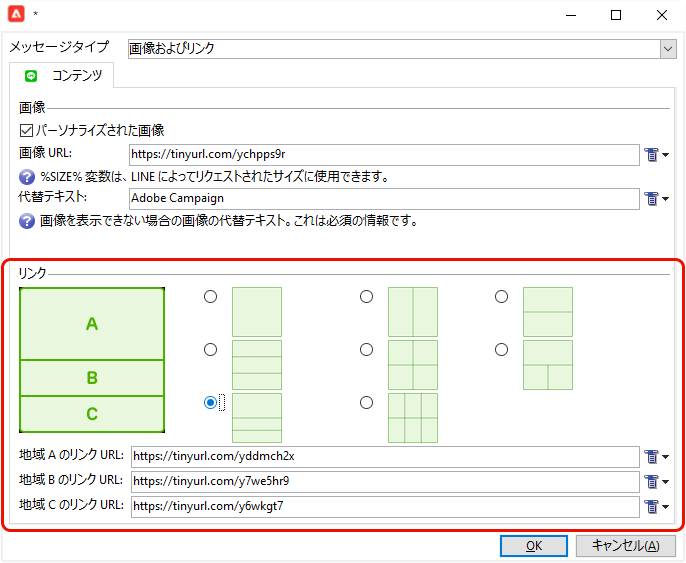

   「**[!UICONTROL リンク]**」セクションでは、画像を複数のクリック可能な領域に分割する様々なレイアウトから選択できます。次に、そのそれぞれに専用のリンクを割り当てることができます。

>[!NOTE]
>
>&lt;%@ include option=&#39;NmsServer_URL&#39; %>/webApp/APP3?id=&lt;%=escapeUrl(cryptString(visitor.id))%> の構文によって、LINE メッセージに Web アプリへのリンクを含めることができます。

### 推奨事項 {#recommendations}

* 新しい受信者に LINE 配信を初めて送信する場合は、利用条件と配信への同意に関する公式 LINE メッセージを追加する必要があります。公式メッセージは、[https://terms.line.me/OA_privacy/](https://terms.line.me/OA_privacy/sp?lang=fr) から入手できます。

## ターゲット母集団の選択 {#selecting-the-target-population}

LINE 配信の受信者の選択は、E メール配信の受信者の定義に類似しています。詳しくは、[ターゲット母集団の識別](../../delivery/using/steps-defining-the-target-population.md)を参照してください。

ターゲティングは、**訪問者**&#x200B;に対して実行されます。

## メッセージの送信 {#sending-messages}

配信を正しく作成して設定すると、事前に定義したターゲットに送信することができます。

LINE 配信の送信は、E メール配信の送信に類似しています。配信の送信について詳しくは、[メッセージの送信](../../delivery/using/sending-messages.md)を参照してください。

## レポートへのアクセス {#accessing-reports}

エクスプローラーで&#x200B;**[!UICONTROL プロファイルとターゲット／サービスと購読／LINE]** をクリックすると、LINE サービスでレポートを表示できます。次に LINE サービスで「**[!UICONTROL レポート]**」アイコンをクリックします。

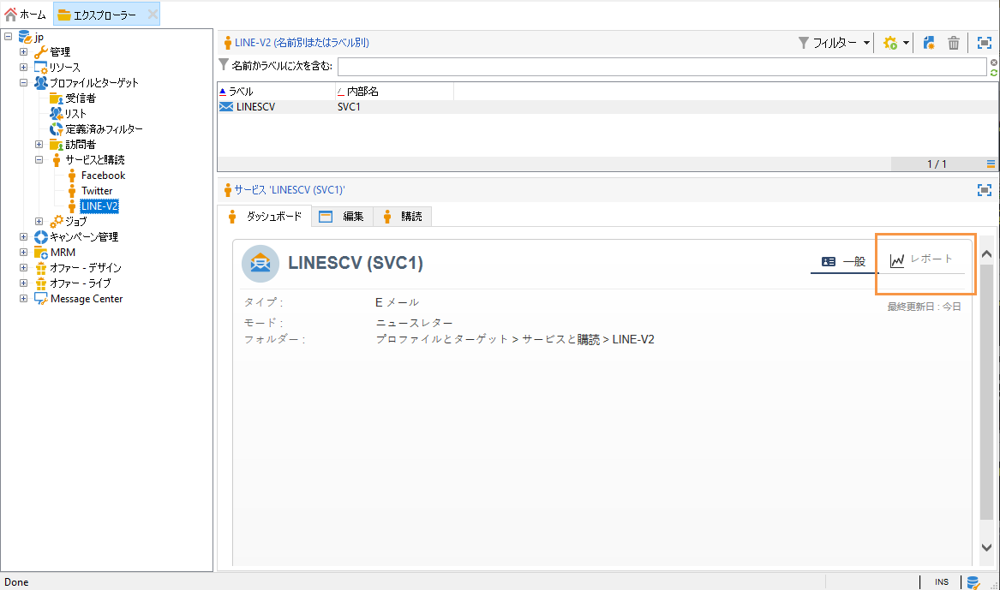

LINE 配信でレポートを表示するには、**[!UICONTROL キャンペーン管理／配信]**&#x200B;をクリックしてから、目的の配信を選択します。トラッキングレポートはクリックスルー率を示しています。LINE では開封率は考慮されません。

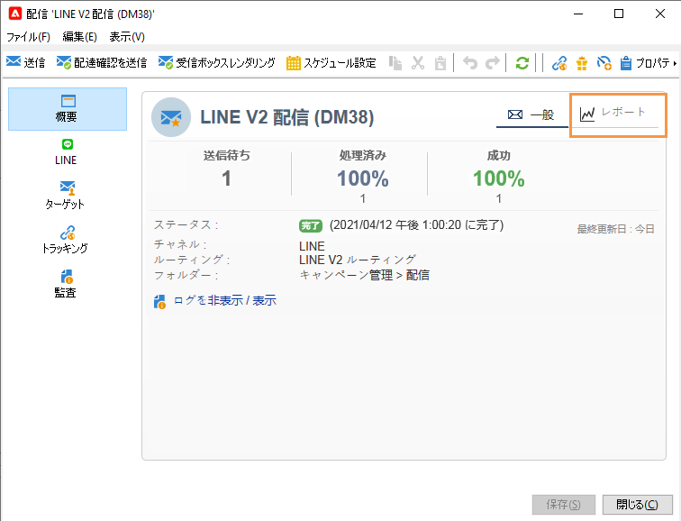

## 例：パーソナライズした LINE メッセージの作成と送信 {#example--create-and-send-a-personalized-line-message}

この例では、受信者に応じてパーソナライズされるデータを含むテキストメッセージと画像を作成して設定します。

1. 「**[!UICONTROL キャンペーン]**」タブから「**[!UICONTROL 配信]**」メニューをクリックします。「作成」ボタンをクリックして LINE 配信を作成します。

   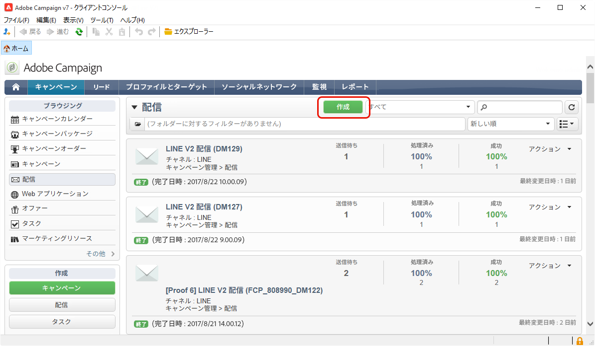

1. 「**[!UICONTROL LINE V2 配信]**」配信テンプレートを選択して、配信に名前を付けます。

   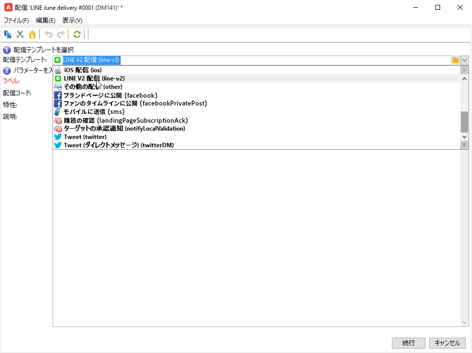

1. 配信の設定ウィンドウで、ターゲット母集団を選択します。

   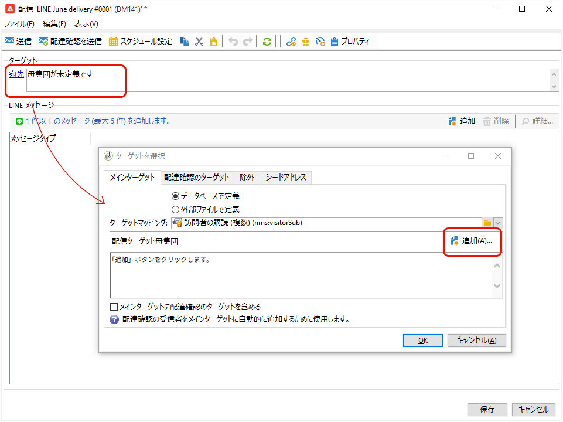

1. 「**[!UICONTROL 追加]**」をクリックしてメッセージを作成し、**[!UICONTROL メッセージタイプ]**&#x200B;を選択します。

   ここでは、最初にテキストメッセージを作成します。

   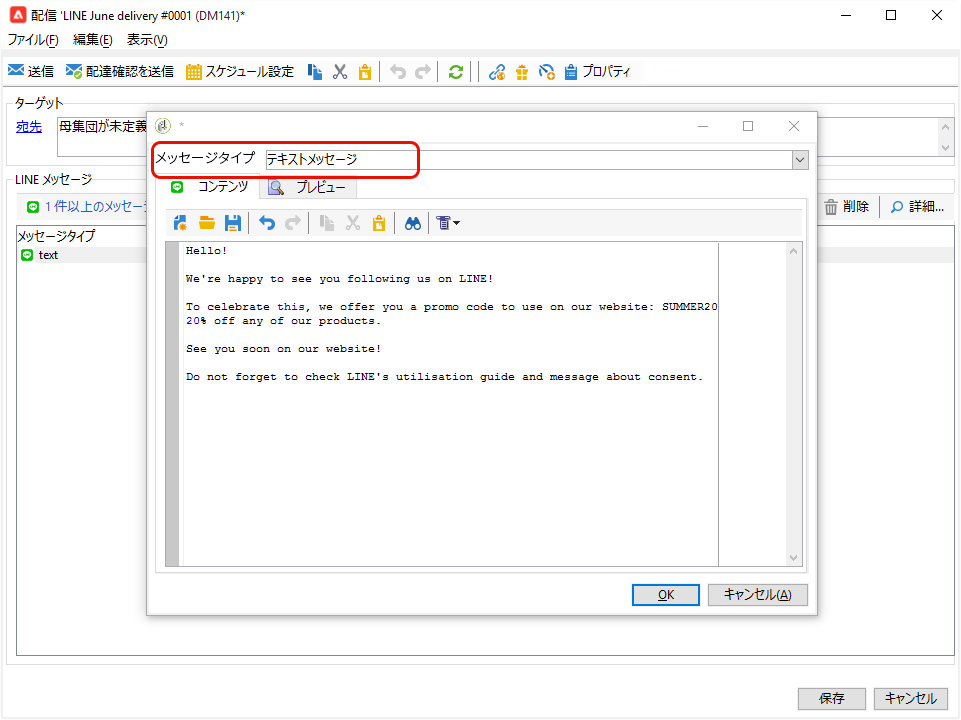

1. パーソナライズされたテキストを挿入する位置にカーソルを置き、ドロップダウンアイコンをクリックして&#x200B;**[!UICONTROL 訪問者／名]**&#x200B;を選択します。

   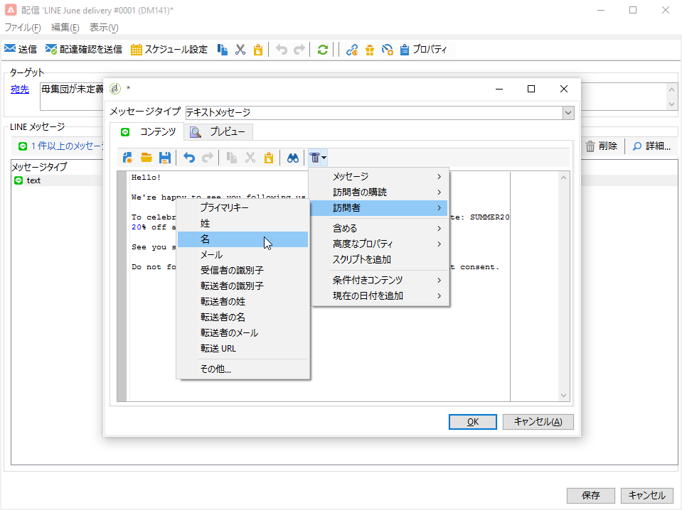

1. 画像を追加するために同じ手順を繰り返し、「**[!UICONTROL メッセージタイプ]**」ドロップダウンで「**[!UICONTROL 画像とリンク]**」を選択します。

   画像の URL を追加します。

   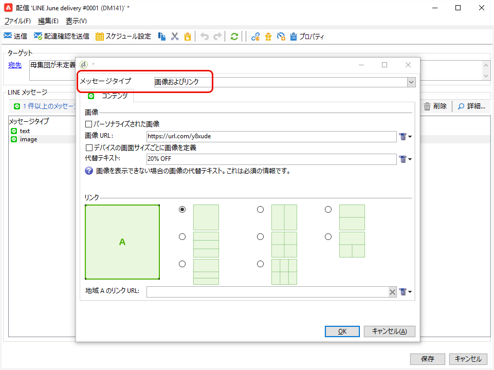

1. 「**[!UICONTROL リンク]**」セクションで、画像を複数のクリック可能な領域に分割するレイアウトを選択します。
1. 画像の各領域に URL を割り当てます。

   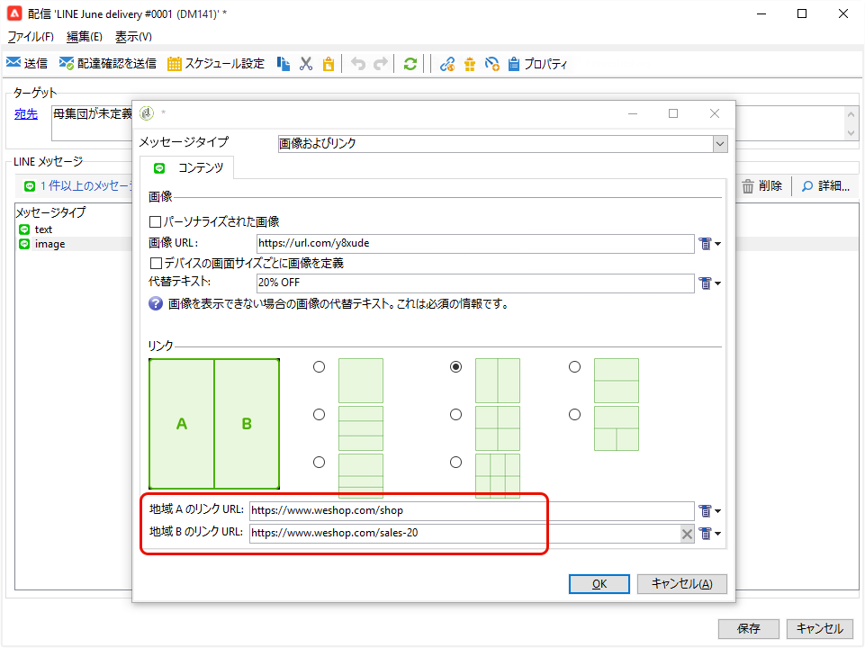

1. 配信を保存してから「**[!UICONTROL 送信]**」をクリックし、分析を実行してターゲットに送信します。

   配信がターゲットに送信されます。

   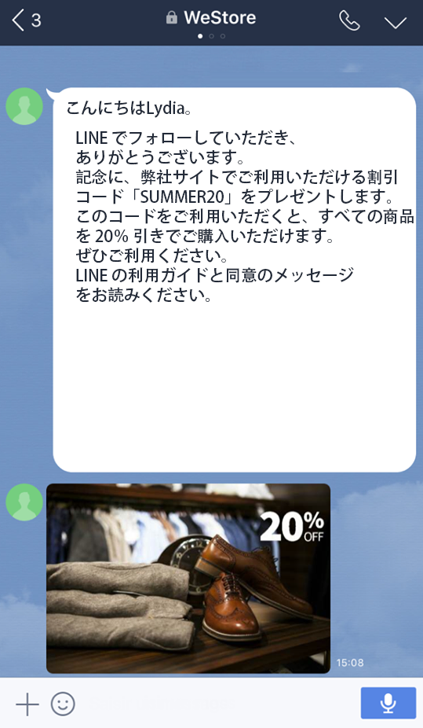
