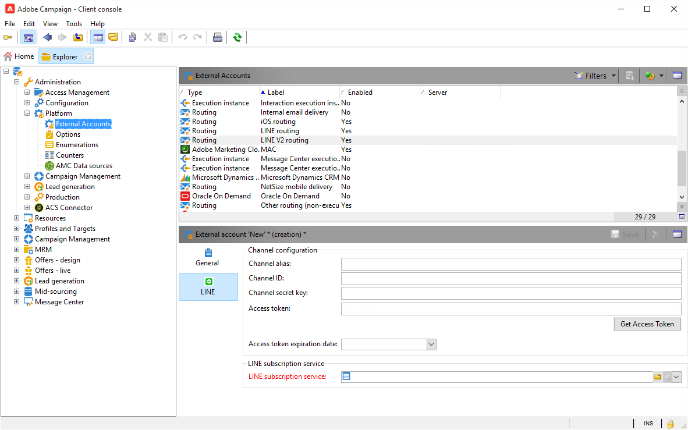

# LINE チャネル{#line-channel}

LINE は、無料でインスタントメッセージング、音声通話、ビデオ通話ができるアプリケーションで、すべてのスマートフォン（iPhone、Android、Windows Phone、Blackberry、Nokia）と PC で利用可能です。Adobe Campaign では、LINE メッセージを送信できます。

LINE は、オンプレミスインストールまたは管理されたサービスインストールでのみ使用できます。

また LINE は、コンシューマー向けモバイルデバイスにインストールされた LINE アプリでリアルタイムメッセージを送信するために、トランザクションメッセージモジュールと組み合わせることができます。詳しくは、この[ページ](../../message-center/using/transactional-messaging-architecture.md#transactional-messaging-and-line)を参照してください。

以下のセクションでは、LINEチャネルに固有の情報を提供します。 For global information on how to create a delivery, refer to [this section](../../delivery/using/steps-about-delivery-creation-steps.md).

LINE チャネルを使用する手順は次のとおりです。

1. 配信の作成
1. メッセージコンテンツの設定
1. ターゲット母集団の選択
1. メッセージの送信
1. 配信の監視（トラッキング、強制隔離、レポートなど）

## LINE チャネルの設定 {#setting-up-line-channel}

### LINE アカウントと外部アカウントの作成 {#creating-a-line-account-and-an-external-account-}

>[!NOTE]
>
>LINE アカウントと外部アカウントを作成する前に、まず LINE パッケージをインスタンスにインストールする必要があります。詳しくは、インストールガイドの [LINE](../../installation/using/installing-campaign-standard-packages.md#line-package) の節を参照してください。

まず、Adobe Campaign にリンクできるように、LINE アカウントを作成する必要があります。LINE アカウントをモバイルアプリケーションで追加したユーザーに LINE メッセージを送信できます。外部アカウントと LINE アカウントは、プラットフォームの機能管理者のみが管理できます。

LINE アカウントを作成して設定するには、[https://developers.line.me/](https://developers.line.me/) を参照してください。

To create and configure a LINE service, see [Managing subscriptions](../../delivery/using/managing-subscriptions.md).

Adobe Campaign で外部アカウントを作成する手順は次のとおりです。

1. **管理**／**プラットフォーム**&#x200B;ツリー構造で、「**外部アカウント**」タブをクリックします。
1. 次に「**新規**」アイコンをクリックします。

   

1. 「**ラベル**」フィールドと「**内部名**」フィールドに入力します。
1. In the **[!UICONTROL Type]** field, select Routing and in the **Channel** field, select LINE.
1. Click **[!UICONTROL Save]** to create your LINE external account.
1. 「**一般**」アイコンの下に **LINE** のパーソナライゼーションフィールドが表示されます。次のフィールドに入力します。

   

   * **チャネルエイリアス**:は、「>」タブのLINEアカウントを通じて提供 **[!UICONTROL Channels]** され **[!UICONTROL Technical configuration]** ます。
   * **Channel ID**：**チャネル**／**基本情報パネル**&#x200B;タブの LINE アカウント経由で提供されます。
   * **Channel 秘密鍵**：**チャネル**／「**基本情報パネル」**&#x200B;タブの LINE アカウント経由で提供されます。
   * **アクセストークン**:は、開発者ポータルのLINEアカウントまたはボタンをクリックして提供さ **[!UICONTROL Get access token]** れます。
   * **アクセストークンの有効期限**：アクセストークンの有効期限日を指定できます。
   * **LINE 購読サービス**：ユーザーがどのサービスを購読するかを指定できます。

>[!NOTE]
>
>およびワークフローが開始され **[!UICONTROL LINE access token update (updateLineAccessToken)]** たこと **[!UICONTROL Delete blocked LINE users (deleteBlockedLineUsers)]** を確認する必要があります。 エクスプローラで、をクリックし **[!UICONTROL Administration > Production > Technical workflows > LINE workflows]** てワークフローのステータスを確認します。

## 配信の作成 {#creating-the-delivery}

**LINE** 配信を作成するには、次の手順に従う必要があります。

>[!NOTE]
>
>配信の作成に関するグローバルな概念については、[この節](../../delivery/using/steps-about-delivery-creation-steps.md)で説明しています。

1. タブからを選 **[!UICONTROL Campaigns]** 択し、ボタン **[!UICONTROL Deliveries]** をクリックし **[!UICONTROL Create]** ます。
1. In the window that appears, select **[!UICONTROL LINE V2 delivery]** delivery template.

   

1. ラベル、コードおよび説明を設定して配信を識別します。詳しくは、[この節](../../delivery/using/steps-create-and-identify-the-delivery.md#identifying-the-delivery)を参照してください。
1. Click **[!UICONTROL Continue]** to create your delivery.

## コンテンツの定義 {#defining-the-content}

LINE 配信のコンテンツを定義するには、最初にメッセージタイプを配信に追加する必要があります。それぞれの LINE 配信には最大で 5 件のメッセージを含めることができます。

次の 2 つのメッセージタイプから選択できます。

* テキストメッセージ
* 画像とリンク

### テキストメッセージの配信の設定 {#configuring-a-text-message-delivery}

**テキストメッセージ**&#x200B;の LINE 配信は、テキスト形式で受信者に送信されるメッセージです。

このタイプのメッセージの設定は、E メールの&#x200B;**テキスト**&#x200B;の設定と類似しています。詳しくは、この[ページ](../../delivery/using/defining-the-email-content.md#message-content)を参照してください。

### 画像とリンクの配信の設定 {#configuring-an-image-and-link-delivery}

**画像とリンク**&#x200B;の LINE 配信は、1 つまたは複数の URL を含む可能性のある画像の形式で受信者に送信されるメッセージです。

以下を使用できます。

* **パーソナライズされた画像**

   >[!NOTE]
   >
   >**%SIZE%** 変数：この変数は、受信者のモバイルデバイスの画面サイズに応じて画像の表示を最適化できます。

   

* **画像 URL**

   

   画像 URL は、様々な画像解像度を使用して、モバイルデバイスでの配信の表示を最適化できます。同じ高さと幅の画像のみがサポートされます。

   画像は、画面サイズに従って定義できます。

   * 1040 px
   * 700 px
   * 460 px
   * 300 px
   * 240 px
   >[!NOTE]
   >
   >1040 x 1040 px サイズは、リンクを含むすべての LINE 画像に必須です。

   次に、受信者のモバイルデバイスにポップアップ表示される代替テキストを追加する必要があります。

* および **[!UICONTROL Links]**.

   

   The **[!UICONTROL Links]** section allows you to choose between different layouts that will divide your image in multiple clickable regions. 次に、そのそれぞれに専用のリンクを割り当てることができます。

>[!NOTE]
>
>&lt;%@ include option=&#39;NmsServer_URL&#39; %>/webApp/APP3?id=&lt;%=escapeUrl(cryptString(visitor.id))%> の構文によって、LINE メッセージに Web アプリへのリンクを含めることができます。

### 推奨事項 {#recommendations}

* 新しい受信者に LINE 配信を初めて送信する場合は、利用条件と配信への同意に関する公式 LINE メッセージを追加する必要があります。公式メッセージは、次のリンクから入手できます。https://terms.line.me/OA_privacy/ .

## ターゲット母集団の選択 {#selecting-the-target-population}

LINE 配信の受信者の選択は、E メール配信の受信者の定義に類似しています。詳しくは、「ターゲット訪問者の識 [別」を参照してください](../../delivery/using/steps-defining-the-target-population.md)。

ターゲティングは、**訪問者**&#x200B;に対して実行されます。

## メッセージの送信 {#sending-messages}

配信を正しく作成して設定すると、事前に定義したターゲットに送信することができます。

LINE 配信の送信は、E メール配信の送信に類似しています。For more information on sending a delivery, refer to [Sending messages](../../delivery/using/sending-messages.md).

## レポートへのアクセス {#accessing-reports}

エクスプローラ内をクリックすると、LINEサービスのレポート **[!UICONTROL Profiles and Targets > Services and Subscriptions > LINE]** を表示できます。 Then click the **[!UICONTROL Reports]** icon in the LINE service.

To view reports on LINE deliveries, click **[!UICONTROL Campaign Management > Deliveries]** then select the delivery you want. トラッキングレポートはクリックスルー率を示しています。LINE では開封率は考慮されません。

## 例：パーソナライズした LINE メッセージの作成と送信 {#example--create-and-send-a-personalized-line-message}

この例では、受信者に応じてパーソナライズされるデータを含むテキストメッセージと画像を作成して設定します。

1. Create your LINE delivery by clicking the **[!UICONTROL Create]** button from the **[!UICONTROL Campaign]** tab.

   

1. Select the **[!UICONTROL LINE V2 delivery]** delivery template and name your delivery.

   

1. 配信の設定ウィンドウで、ターゲット母集団を選択します。

   

1. をクリック **[!UICONTROL Add]** してメッセージを作成し、を選択しま **[!UICONTROL Message type]**&#x200B;す。

   ここでは、最初にテキストメッセージを作成します。

   

1. Place your cursor in the place where you want to insert the personalized text and click the drop-down icon then select **[!UICONTROL Visitor > First name]**.

   

1. 同じ手順で、ドロップダウンからを選択して画像 **[!UICONTROL Image and links]** を追加す **[!UICONTROL Message type]** ることもできます。

   画像の URL を追加します。

   

1. In the **[!UICONTROL Links]** section, select the layout that will divide your image in multiple clickable regions.
1. 画像の各領域に URL を割り当てます。

   

1. Save your delivery then click **[!UICONTROL Send]** to analyze and send it to the target.

   配信がターゲットに送信されます。

   
