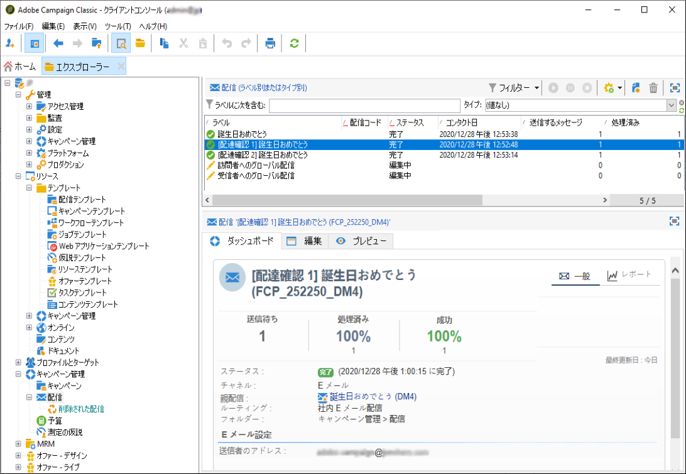

# 配信リストへのアクセス {#list-of-deliveries}

配信には、配信リストからアクセスします。配信リストには、ツリーの&#x200B;**[!UICONTROL キャンペーン管理／配信]**&#x200B;ノードからアクセスします。

デフォルトでは、配信のリストには、選択したノードで作成された配信の名前とステータスが含まれます。送信するメッセージ数、処理されたメッセージ数および送信が成功したメッセージ数も表示されます。

* **[!UICONTROL 送信するメッセージ]**&#x200B;の数は、分析後かつ配信前にターゲットとされている受信者数に一致します。
* 「**[!UICONTROL 成功]**」列のメッセージの数は、サーバーが送信し、受信者が受け取ったメッセージの数に一致します。
* **[!UICONTROL 処理済み]**&#x200B;メッセージ数は、受信されたメッセージの数にエラーになったメッセージ数を加えたものです。

>[!NOTE]
>
>大量配信時にこれらの値を更新したい場合は、該当する配信を選択して右クリックします。**[!UICONTROL アクション／配信とトラッキング指標を再計算]**&#x200B;を選択し、ウィザードを使用してこの情報を更新します。

**関連トピック：**

* [配信ダッシュボード](delivery-dashboard.md)
* [配信ステータス](delivery-statuses.md)
