# 購読の管理{#managing-subscriptions}

## 情報サービスについて {#about-information-services}

情報サービスは、次のもので構成されます。

* 登録および購読（オプトイン）
* 登録解除、自発的購読解除（オプトアウト）または自動購読解除（試用オファーなどの期間限定サービス）
* 購読および購読解除の確認の仕組み（確認を使用する単純な仕組みやダブルオプトインなど）
* 購読者履歴のトラッキング

標準機能として、これらのサービスには、購読者トラッキング、ロイヤリティレベル、購読解除のトレンドなど、固有の統計レポートが含まれます。

E メールの場合、必須の購読解除リンクが自動的に生成されて、オプトイン／オプトアウトプロセス全体が完全に自動化され、履歴をトラッキングすることで、実施基準に対する完全遵守を保証できます。

次の 3 つのサービス購読／購読解除モードがあります。

1. 手動
1. インポート（購読のみ）
1. Web フォーム

>[!NOTE]
>
>二重のオプトインを備えた購読フォームを作成する例については、[この節](../../web/using/use-cases--web-forms.md#create-a-subscription--form-with-double-opt-in)を参照してください。

## 情報サービスの作成 {#creating-an-information-service}

関連付けられた確認メッセージまたは購読者への自動配信を使用して、情報サービスを作成し、購読を管理できます。

情報サービスマップにアクセスするには、Universeに移動し、 **[!UICONTROL Profiles and Targets]** リンクをクリック **[!UICONTROL Services and Subscriptions]** します。

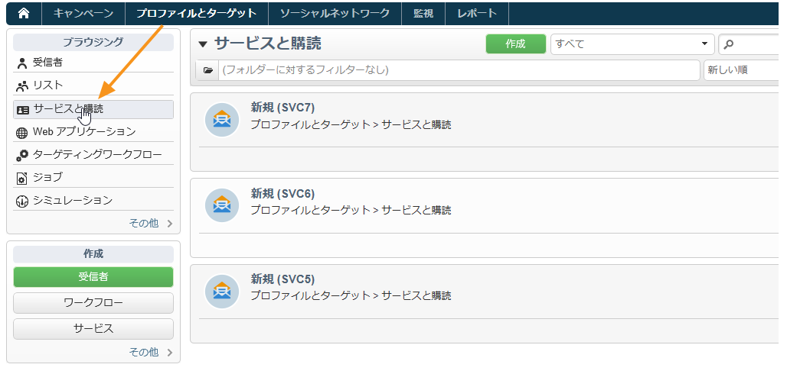

既存のサービスを編集するには、サービス名をクリックします。To create a service, click the **[!UICONTROL Create]** button located above the list.

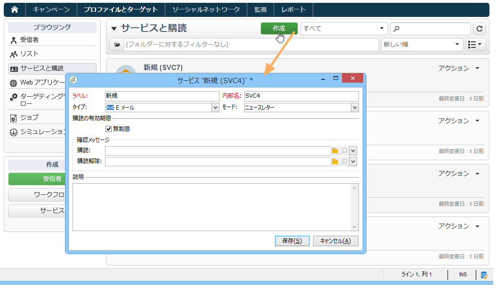

* Enter the name of the service in the **[!UICONTROL Label]** field and select the delivery channel: email, mobile, Facebook, Twitter, or mobile applications.

   >[!NOTE]
   >
   >Facebook と Twitter の購読については、[この節](../../social/using/about-social-marketing.md)で説明しています。モバイルアプリの購読については、モバイルアプリ [チャネルについてを参照してくださ](../../delivery/using/about-mobile-app-channel.md)い。

* E メールタイプのサービスの場合は、「**配信モード**」を選択します。The possible modes are: **[!UICONTROL Newsletter]** or **[!UICONTROL Viral]**.
* 購読または購読解除の&#x200B;**確認メッセージ**&#x200B;を送信できます。To do this, select the delivery templates to be used to create the corresponding deliveries from the **[!UICONTROL Subscription]** and **[!UICONTROL Unsubscription]** fields. These templates must be configured with a **[!UICONTROL Subscription]** type target mapping, without a defined target. 「電子メールチャ [ネルについて」を参照してくださ](../../delivery/using/about-email-channel.md)い。
* デフォルトでは、購読は無制限です。You can deselect the **[!UICONTROL Unlimited]** option to define a validity duration for the service. The duration can be specified in days (**[!UICONTROL d]** ) or months (**[!UICONTROL m]** ).

保存したサービスは、「サービスと購読」リストに追加されます。名前をクリックして編集します。 複数のタブが表示されます。The **[!UICONTROL Subscriptions]** tab lets you look at the list of subscribers to the information service (**[!UICONTROL Active subscriptions]** tab) or the subscription/unsubscription history (**[!UICONTROL History]** tab). また、このタブから購読者を追加および削除できます。See [Adding and deleting subscribers](#adding-and-deleting-subscribers).

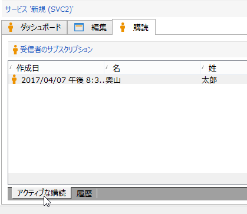

The **[!UICONTROL Detail...]** button lets you look at the subscription properties for the selected recipient.

受信者の購読プロパティは変更できます。

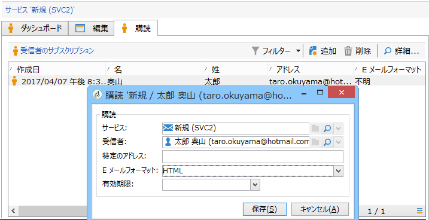

ダッシュボードで、タブをクリックし **[!UICONTROL Reports]** て購読を追跡します。募集レベルの変更、加入者の総数等 このタブからレポートをアーカイブし、履歴を確認できます。

## 購読者の追加と削除 {#adding-and-deleting-subscribers}

From the **[!UICONTROL Subscriptions]** tab of an information service click **[!UICONTROL Add]** to add subscribers. You can also right-click the list of subscribers and select **[!UICONTROL Add]**. 購読するプロファイルを保存するフォルダーを選択し、購読するプロファイルを選択し、「**[!UICONTROL OK]**」をクリックして確定します。

To delete subscribers, select them and click **[!UICONTROL Delete]**. You can also right-click the subscriber list and select **[!UICONTROL Delete]**.

In both cases, you can send a confirmation message to the users concerned if a delivery template for unsubscriptions has been attached to the service (see [Creating an information service](#creating-an-information-service)). 確認メッセージで、この配信を確定することも、しないこともできます。

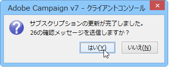

See [Subscription and unsubscription mechanisms](#subscription-and-unsubscription-mechanisms).

## サービスの購読者への配信 {#delivering-to-the-subscribers-of-a-service}

情報サービスの購読者に配信するために、次の例のように、関連する情報サービスの購読者をターゲットにできます。

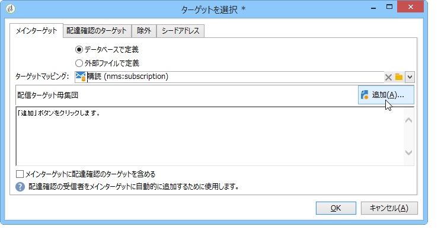

>[!CAUTION]
>
>The target mapping must be **[!UICONTROL Subscriptions]**.

を選択し、 **[!UICONTROL Subscribers of an information service]** をクリックしま **[!UICONTROL Next]**&#x200B;す。

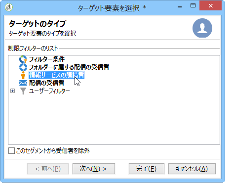

Select the targeted information service and click **[!UICONTROL Finish]**.

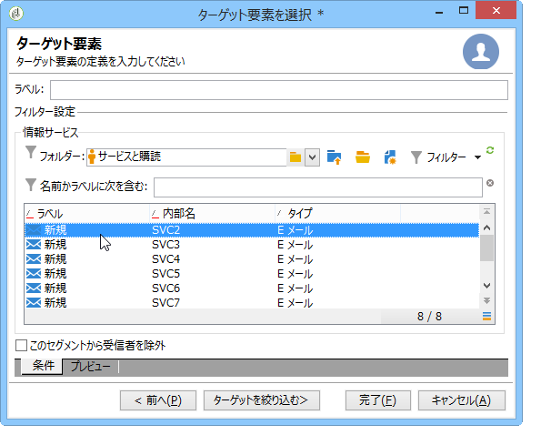

The **[!UICONTROL Preview]** tab lets you view the list of subscribers to the selected information service.

## 購読と購読解除の仕組み {#subscription-and-unsubscription-mechanisms}

購読および購読解除の仕組みを設定して、プロセスと購読者管理を自動化できます。

>[!NOTE]
>
>新しい購読者に確認メッセージを送信できます。\
>The content of this message is defined in the information service configuration via the **[!UICONTROL Subscription]** or **[!UICONTROL Unsubscription]** fields.
>
>確認メッセージは、このフィールドで指定した配信テンプレートから作成されます。These target mappings must be **[!UICONTROL Subscriptions]**.

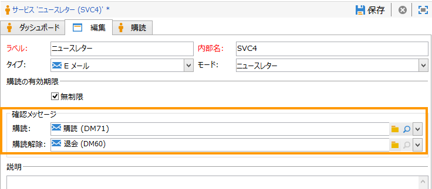

### 受信者のサービスへの購読登録 {#subscribing-a-recipient-to-a-service}

次の方法で、受信者を情報サービスに登録できます。

* Manually add the service: to do this, from the **[!UICONTROL Subscriptions]** tab of their profile, click **[!UICONTROL Add]** and select the information service concerned.

   詳しくは、[この節](../../platform/using/editing-a-profile.md)のプロファイル編集に関する部分を参照してください。

* 一連の受信者をこのサービスに自動的に購読登録します。受信者のリストは、フィルタリング操作、グループ、フォルダー、インポートまたはマウスを使用した直接選択から取得できます。この受信者を購読登録するには、プロファイルを選択して右クリックします。を選択 **[!UICONTROL Actions > Subscribe selection to a service...]**&#x200B;し、関連するサービスを選択して、操作を開始します。
* 受信者をインポートして、情報サービスに自動的に購読登録します。そのためには、インポートウィザードの最後の手順で該当するサービスを選択します。

   詳しくは、[この節](../../platform/using/importing-data.md#import-wizard)を参照してください。

* 受信者をサービスに購読登録できる Web フォームを使用します。

   詳しくは、[この節](../../web/using/about-web-applications.md)を参照してください。

* Creating a targeting workflow and using a **[!UICONTROL Subscription service]** box.

   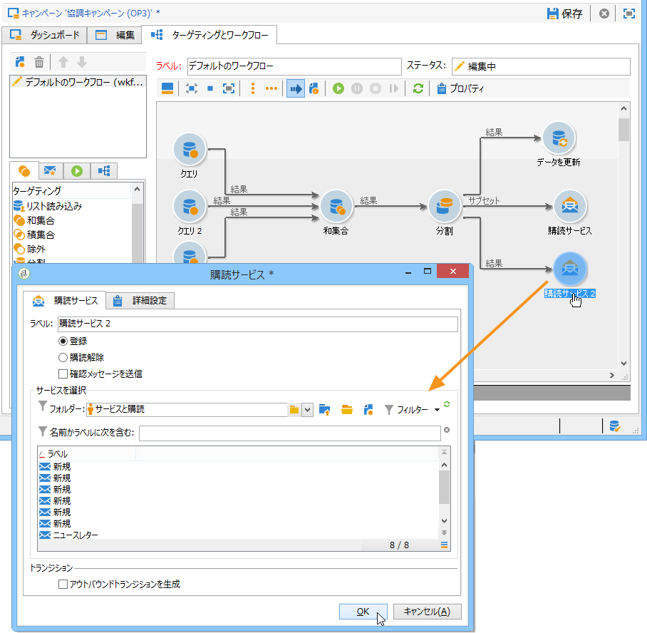

   ワークフローとその使用方法については、[この節](../../workflow/using/about-workflows.md)で説明しています。

### 受信者のサービスからの購読解除 {#unsubscribing-a-recipient-from-a-service}

#### 手動購読解除 {#manual-unsubscribing}

法令により、E メール配信には購読解除リンクを含める必要があります。受信者は、このリンクをクリックして自分のプロファイルを更新し、今後の配信のターゲットから除外させることができます。

The default unsubscription link is inserted via the last button in the toolbar of the content editor provided in the delivery wizard (see [About personalization](../../delivery/using/about-personalization.md)). 受信者がこのリンクをクリックすると、プロファイルがブラックリストに登録されます（オプトアウト）。つまり、この受信者は、あらゆる配信アクションのターゲットにされなくなります。

ただし、受信者は、すべてのサービスを購読解除することなく、1 つのサービスの購読解除を選択できます。To allow this, you can use a web form (refer to [this section](../../web/using/adding-fields-to-a-web-form.md#subscription-checkboxes)) or insert a personalized unsubscription link (see [Personalization blocks](../../delivery/using/personalization-blocks.md)).

受信者プロファイルから手動で受信者を購読解除することもできます。To do this, click the **[!UICONTROL Subscriptions]** tab of the recipient concerned, select the information service(s) concerned, and click **[!UICONTROL Delete]**.

また、該当する情報サービスから、1 人以上の受信者を購読解除できます。To do this, click the **[!UICONTROL Subscriptions]** tab of the service, select the recipients concerned and click **[!UICONTROL Delete]**.

#### 自動購読解除 {#automatic-unsubscription}

情報サービスの期間を限定することができます。有効期間が期限切れになると、受信者は自動的に購読解除されます。This period is specified in the **[!UICONTROL Edit]** tab of the service properties. 期間は日数で表します。

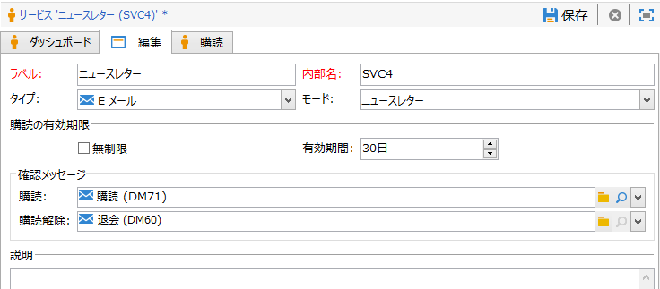

母集団の購読解除ワークフローを設定することもできます。To do this, follow the same procedure as for a subscription workflow, but select the **[!UICONTROL Unsubscription]** option. See [Subscribing a recipient to a service](#subscribing-a-recipient-to-a-service).

### 購読者トラッキング {#subscriber-tracking}

You can track the changes in subscriptions to the information services using the **[!UICONTROL Reports]** link on the dashboard.

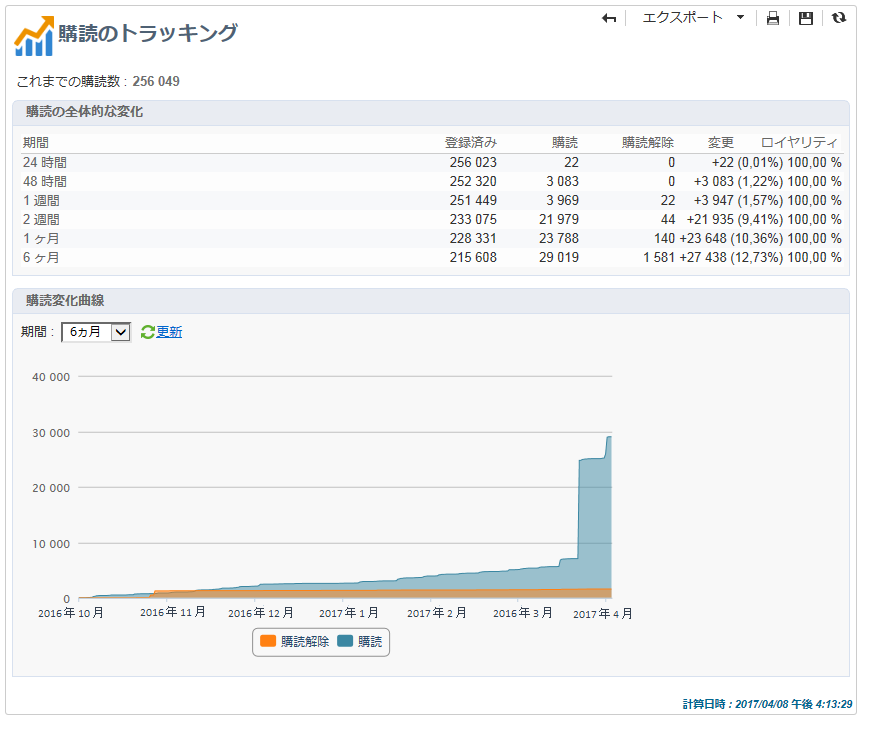
