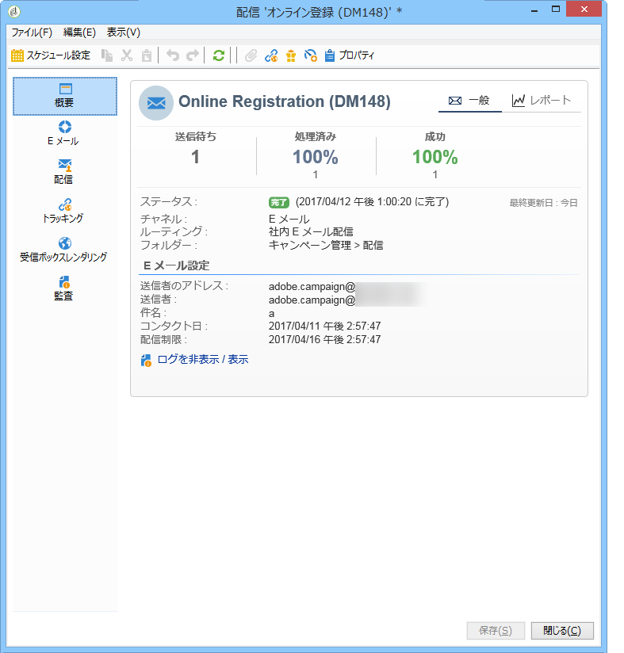
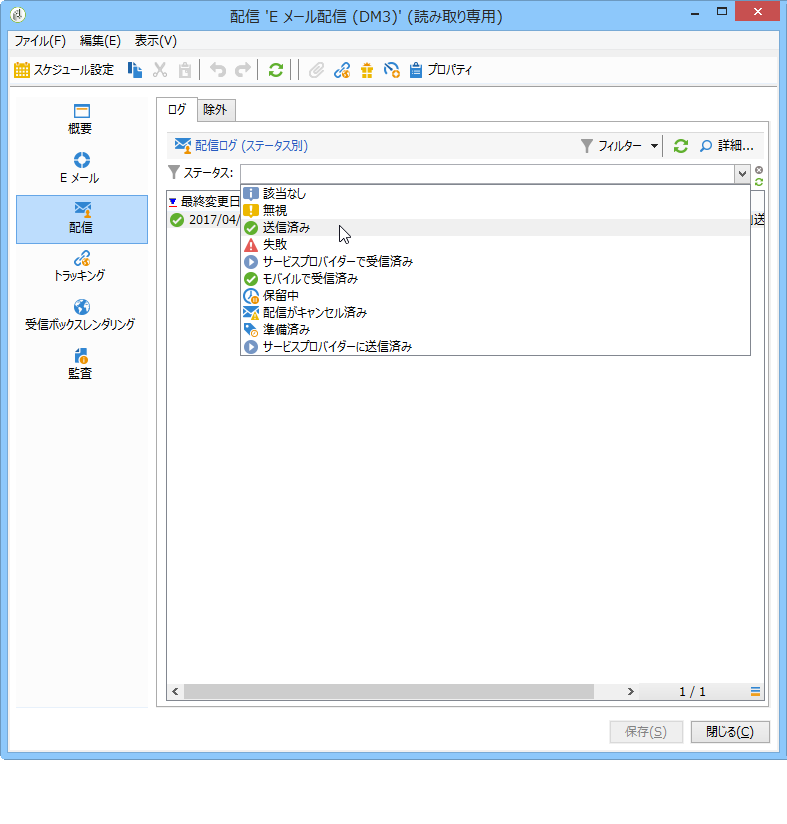
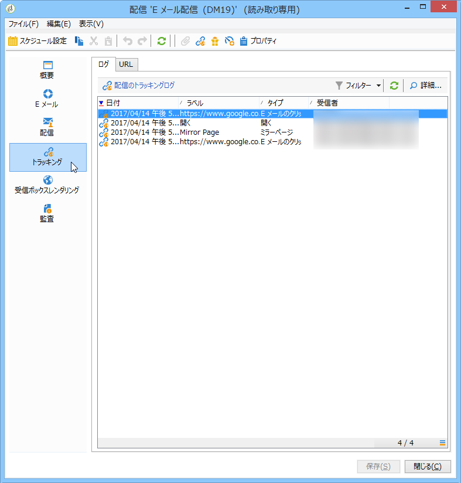

# 配信の監視{#monitoring-a-delivery}

**配信ダッシュボード**&#x200B;は、配信と、メッセージの送信時に結果として起こる問題を監視するための重要な要素です。

**関連トピック**

* [配信エラーの理解](../../delivery/using/understanding-delivery-failures.md)
* [強制隔離管理の理解](../../delivery/using/understanding-quarantine-management.md)
* [配信のベストプラクティス](https://docs.campaign.adobe.com/doc/AC/getting_started/EN/deliveryBestPractices.html)
* [はじめに：配信品質の管理](https://docs.campaign.adobe.com/doc/AC/getting_started/EN/deliverability.html)

## 配信ダッシュボード {#delivery-dashboard}

配信に関する情報を確認するには、配信を編集し、ダッシュボードを表示して、使用可能なタブをクリックします。

配信を送信すると、タブのコンテンツが変わらなくなることがあります。



### 配信の概要 {#delivery-summary}

The **[!UICONTROL Summary]** tab contains the characteristics of the delivery: delivery status, channel used, information about the sender, subject, information concerning execution. 詳しくは、「送信されたメッセ [ージの数](#number-of-messages-sent)」を参照。

このリ **[!UICONTROL reports]** ンクを使用すると、配信アクションに関する一連のレポートを確認できます。一般配信レポート、詳細レポート、配信レポート、失敗したメッセージの配信、開始率、クリック数、トランザクション数など このタブの内容は、要件に従って設定できます。 詳しくは、[この節](../../reporting/using/delivery-reports.md)を参照してください。

### 配信ログと履歴 {#delivery-logs-and-history}

The **[!UICONTROL Delivery]** tab gives a history of the occurrences in this delivery. このタブには、配信ログ、つまり、送信されたメッセージのリストとそのステータスおよび関連メッセージが含まれます。

1 つの配信について、（例えば）配信が失敗した受信者や、アドレスが強制隔離中の受信者のみを表示できます。これを行うには、ボタンをクリッ **[!UICONTROL Filters]** クしてを選択しま **[!UICONTROL By state]**&#x200B;す。 ドロップダウンリストでステータスを選択します。



各種ステータスについて詳しくは、[このページ](#delivery-statuses)を参照してください。

>[!NOTE]
>
>The **[!UICONTROL Display the mirror page for this message...]** link lets you view the mirror page for the contents of the delivery selected from the list in a new window. ミラーページは、HTML コンテンツが定義済みの配信に対してのみ表示可能です。For more on this, refer to [Generating the mirror page](../../delivery/using/sending-messages.md#generating-the-mirror-page).

### トラッキングログ {#tracking-logs}

The **[!UICONTROL Tracking]** tab lists the tracking history for this delivery. このタブには、送信されたメッセージのトラッキングデータ、つまり、Adobe Campaign によってトラッキングされたすべての URL が表示されます。トラッキングデータは 1 時間ごとに更新されます。

>[!NOTE]
>
>配信に対してトラッキングが有効ではない場合、このタブは表示されません。

トラッキング設定は、配信ウィザードの適切なステージで実行されます。See [How to configure tracked links](../../delivery/using/how-to-configure-tracked-links.md).

**[!UICONTROL Tracking]** データは配信レポートで解釈されます。 [この節](../../reporting/using/delivery-reports.md)を参照してください。



### 配信監査 {#delivery-audit-}

The **[!UICONTROL Audit]** tab contains the delivery log and all the messages concerning the proofs. The **[!UICONTROL Refresh]** button lets you update the data. Use the **[!UICONTROL Filters]** button to define a filter on the data.

特別なアイコンによって、エラーまたは警告を識別できます。「配信 [の分析」を参照](../../delivery/using/steps-validating-the-delivery.md#analyzing-the-delivery)。

The **[!UICONTROL Proofs]** sub-tab lets you view the list of proofs that have been sent.


You can modify the information displayed in this window (and that of the **[!UICONTROL Delivery]** and **[!UICONTROL Tracking]** tabs) by selecting the columns to be displayed. To do this, click the **[!UICONTROL Configure list]** icon located in the lower right-hand corner. リストの表示について詳しくは、[この節](../../platform/using/adobe-campaign-workspace.md#configuring-lists)を参照してください。

### 配信ダッシュボードの同期 {#delivery-dashboard-synchronization}

配信が正常に送信されたことを確認するために、配信ダッシュボードから、処理されたメッセージおよび配信ログを確認できます。

一部の指標またはステータスが間違っていたり、最新ではないことがあります。これは、次の解決策で解消できる場合があります。

* 配信ステータスが間違っている場合は、この配信に対して必要なすべての承認がおこなわれていることと、**[!UICONTROL operationMgt]** および **[!UICONTROL deliveryMgt]** ワークフローがエラーなしで実行されていることを確認します。これは、送信インスタンスで設定されていないアフィニティを配信で使用していることが原因である可能性もあります。
* If your delivery indicators are still at zero and if you are on a mid-sourcing configuration, check the **[!UICONTROL Mid-sourcing (delivery counters)]** technical workflow. Start it if its status is not **[!UICONTROL Started]**. You can then try to recompute the indicators by right-clicking the relevant delivery in the Adobe Campaign explorer and selecting **[!UICONTROL Actions]** > **[!UICONTROL Recompute delivery and tracking indicators]**. トラッキング指標について詳しくは、この[節](../../reporting/using/reports-on-deliveries.md#tracking-indicators)を参照してください。
* If your delivery counter does not match your delivery, try to recompute the indicators by right-clicking the relevant delivery in the Adobe Campaign explorer and selecting **[!UICONTROL Actions]** > **[!UICONTROL Recompute delivery and tracking indicators]** to resynchronize. トラッキング指標について詳しくは、この[節](../../reporting/using/reports-on-deliveries.md#tracking-indicators)を参照してください。
* If your delivery counter is not up-to-date for mid-sourcing deployments, check that the **[!UICONTROL Mid-Sourcing (Delivery counters)]** technical workflow is running. 詳しくは、この[ページ](../../installation/using/mid-sourcing-deployment.md)を参照してください。

配信ダッシュボードで各種レポートの配信をトラッキングすることもできます。詳しくは、[この節](../../reporting/using/reports-on-deliveries.md#accessing-existing-reports)を参照してください。

## パフォーマンスの問題 {#performance-issues}

### チェックリスト {#checklist-}

配信のパフォーマンスが悪い場合は、次の項目を確認できます。

* **配信サイズ**:配信が大きいと、完了までに時間がかかる場合があります。 MTA の子はデフォルトのバッチサイズを処理するように設定されます。この設定はほとんどのインスタンスで機能しますが、配信が頻繁に遅くなる場合はチェックする必要があります。
* **配信のターゲット**:配信パフォーマンスの禁止は、ソフトバウンスエラーの影響を受け、再試行設定に従って処理されます。 エラーの数が多いと、より多くの再試行が必要になります。
* **プラットフォーム全体の負荷**:複数の大きな配信が送信されると、プラットフォーム全体が影響を受ける可能性があります。 IP レピュテーションと配信品質の問題もチェックできます。詳しくは、Adobe Campaign の[配信のベストプラクティスガイド](https://docs.campaign.adobe.com/doc/AC/getting_started/EN/deliverability.html)と[このページ](../../delivery/using/about-deliverability.md)を参照してください。

プラットフォームとデータベースのメンテナンスも、配信の送信パフォーマンスに影響することがあります。詳しくは、[このページ](../../production/using/database-performances.md)を参照してください。

### 配信が遅い {#slow-deliveries}

After clicking the **[!UICONTROL Send]** button, your delivery seems to take longer than usual. これは様々な要素が原因として考えられます。

* 一部の E メールプロバイダーが IP アドレスをブラックリストに登録している可能性があります。この場合は、broadlog を確認して[はじめに](https://docs.campaign.adobe.com/doc/AC/getting_started/EN/deliverability.html)を参照してください。
* 迅速に処理するには配信が大きすぎる可能性があります。これは、JavaScript の高度なパーソナライゼーションで、または配信が 60KB を超えている場合に発生することがあります。コンテンツのガイドラインについて詳しくは、Adobe Campaign の[配信のベストプラクティス](https://docs.campaign.adobe.com/doc/AC/getting_started/EN/deliveryBestPractices.html)を参照してください。
* Adobe Campaign MTA 内でスロットルが発生している可能性があります。これは次の原因で発生します。

   * Messages pended (**[!UICONTROL quotas met]** message): quotas declared by the declarative MX rules defined in Campaign have been met. このメッセージについて詳しくは、[このページ](../../delivery/using/technical-recommendations.md#quota-met)を参照してください。MX ルールについて詳しくは、[このページ](../../delivery/using/technical-recommendations.md#mx-rules)を参照してください。
   * Messages pended (**[!UICONTROL dynamic flow control]** message): Campaign MTA has encountered errors when trying to deliver messages for a given ISP which causes a slowdown to avoid too big of an error density and thus facing potential blacklisting.

* システムの問題によってサーバー間のインタラクションが妨げられることがあります。これにより、送信処理全体が低速になります。サーバーにメモリまたはリソースの問題がないことを確認します。これは、例えば、Campaign によるパーソナライゼーションデータの取得処理に影響することがあります。

### パフォーマンスのベストプラクティス {#best-practices-performance}

* 配信を失敗した状態のままインスタンス上で放置すると、一時テーブルが維持され、パフォーマンスに影響が生じるため、配信を失敗した状態のまま放置しないでください。

* 不要になった配信を削除します。

* 過去12か月間に非アクティブな受信者が、アドレスの質を維持するためにデータベースから削除されます。

* 大規模な配信を同時にスケジュールしないようにしてください。負荷がシステム全体で均等に分散されるまでには、5 ～ 10 分かかります。最高のパフォーマンスを確保するために、チームの他のメンバーと配信のスケジュールを調整します。 マーケティングサーバーが様々なタスクをいくつも同時に処理していると、パフォーマンスが低下することがあります。

* 電子メールのサイズをできるだけ小さくします。 E メールの推奨最大サイズは約 35 KB です。送信サーバー上に生成されるボリュームは、E メール配信の規模によって決まります。

* 受信者数が 100 万人を超える大規模配信の場合は、送信キューにそれだけのスペースが必要です。これだけでサーバーに問題が生じるわけではありませんが、他の多数の大規模配信も同時におこなわれると、送信に遅れが生じる場合があります。

* E メールのパーソナライゼーションでは、データベースから各受信者のデータを取り出します。パーソナライゼーション要素が多数ある場合は、配信の準備に必要なデータの量もそれだけ多くなります。

* アドレスへのインデックスの追加. このアプリケーションで使用する SQL クエリのパフォーマンスを最適化するには、データスキーマのメイン要素からインデックスを宣言します。

>[!NOTE]
>
>ISPは、無操作状態が続くと、アドレスを非アクティブにします。 この新しい状態に関する通知を送信者に送信するために、バウンスメッセージが送信されます。

## 配信ステータス {#delivery-statuses}

配信の送信中に、配信ダッシュボードに次のステータスが表示されることがあります。

<table> 
 <thead> 
  <tr> 
   <th> ステータス<br /> </th> 
   <th> 定義と解決策<br /> </th> 
  </tr> 
 </thead> 
 <tbody> 
  <tr> 
   <td> 該当なし<br /> </td> 
   <td> メッセージはサーバー（MTA）に取り込まれましたが、まだ処理されていません。<br /> </td> 
  </tr> 
  <tr> 
   <td> 無視<br /> </td> 
   <td> 配信は、アドレスにエラーがあるので受信者に送信されませんでした。It was either blacklisted, quarantined, not provided or a duplicate. <br /> </td> 
  </tr> 
  <tr> 
   <td> 送信済み<br /> </td> 
   <td> 配信は、メッセージプロバイダーに正しく送信されました（ただし、受信者が受信しているとは限りません）。<br /> </td> 
  </tr> 
  <tr> 
   <td> 失敗<br /> </td> 
   <td> 無効なアドレスやインボックスが満杯であることが原因で、配信は受信者に到達できませんでした。パーソナライゼーションブロックの問題に関係していることもあり、その場合、スキーマが配信マッピングと一致しないとエラーが生成されます。「失敗ス <a href="#failed-status" target="_blank">テータス」を参照</a><br /> </td> 
  </tr> 
  <tr> 
   <td> サービスプロバイダーによる判断<br /> </td> 
   <td> SMS サービスプロバイダーが配信を受信しました。<br /> </td> 
  </tr> 
  <tr> 
   <td> モバイルで受信済み<br /> </td> 
   <td> 受信者がモバイルデバイスで SMS を受信しました。<br /> </td> 
  </tr> 
  <tr> 
   <td> 保留中<br /> </td> 
   <td> 配信の送信の準備が完了し、配信サーバー（MTA）によって処理されます。「保留中 <a href="#pending-status" target="_blank">の状態」を参照</a>。<br /> </td> 
  </tr> 
  <tr> 
   <td> 配信がキャンセル済み<br /> </td> 
   <td> 操作がオペレーターによってキャンセルされました。<br /> </td> 
  </tr> 
  <tr> 
   <td> 準備済み<br /> </td> 
   <td> 外部コネクタ（モバイルチャネルなど）でのみ使用される中間ステータス。「保留中」ステータスの次に遷移するステータスであり、後続のステータスは外部コネクタが決定します。<br /> </td> 
  </tr> 
  <tr> 
   <td> サービスプロバイダーに送信済み<br /> </td> 
   <td> 配信は SMS サービスプロバイダーに送信されましたが、まだ受信されていません。<br /> </td> 
  </tr> 
 </tbody> 
</table>

Adobe Campaign E メールの配信品質の最適化方法について詳しくは、[配信品質のベストプラクティスガイド](https://docs.campaign.adobe.com/doc/AC/getting_started/EN/deliverability.html)と[このページ](../../delivery/using/about-deliverability.md)を参照してください。

### 保留中ステータス {#pending-status}

After confirming your delivery, you can see that the status of your delivery is **[!UICONTROL Pending]**. このステータスは、一部のリソースが使用可能になるのを実行プロセスが待機していることを意味します。

The **[!UICONTROL Pending]** status can first mean that your delivery has been scheduled and is pending until the given date. 詳しくは、[配信のスケジュール](../../delivery/using/steps-sending-the-delivery.md#scheduling-the-delivery-sending)の節を参照してください。

If your delivery is not being sent and its status remains **[!UICONTROL Pending]**, it can be the result of:

* MTA（Message Transfert Agent）が開始されておらず、再起動する必要がある可能性があります。MTA は配信サーバーでモジュールとプロセスを実行し、配信サーバーは E メールの送信を管理します。これを確認してモジュールを開始する（必要な場合）には、次の手順を実行します。

   * Check that your `mta@<instance>` modules are launched on your MTA servers.

   ```
   nlserver pdump
   HH:MM:SS > Application server for Adobe Campaign Classic (X.Y.Z YY.R build nnnn@SHA1) of DD/MM/YYYY
   [...]
   mta@<INSTANCENAME> (9268) - 23.0 Mb
   [...]
   ```

   * MTA がリストされていない場合は、次のコマンドを使用して開始します。

   ```
   nlserver start mta@<INSTANCENAME>
   ```

   >[!NOTE]
   >
   >Replace `<INSTANCENAME>` with the name of your instance (production, development, etc.). The instance name is identified via the configuration files: `[path of application]nl6/conf/config-<INSTANCENAME>.xml`

* 配信で、送信サーバー上で設定されていない親和性を使用している可能性があります。 In this case, check the configuration of the traffic management (IP affinity) and use the **[!UICONTROL Managing affinities with IP addresses]** field to link deliveries to the MTA that manages the affinity. アフィニティについて詳しくは、[この節](../../installation/using/configuring-campaign-server.md#personalizing-delivery-parameters)を参照してください。
* 配信の準備が保留中の場合、多数のキャンペーンが実行されていて、配信ステータスの更新がブロックされている可能性があります。To solve this, go to **[!UICONTROL Options]** and increase the value of **[!UICONTROL NmsOperation_LimitConcurrency]** (default is 10). 実行するキャンペーンの数が、このオプションに割り当てられている値より多くならないようにしてください。

### 失敗ステータス {#failed-status}

If an email delivery&#39;s status is **[!UICONTROL Failed]**, it can be linked to an issue with personalization blocks. 配信のパーソナライゼーションブロックは、例えば、スキーマが配信マッピングと一致しない場合にエラーを生成することがあります。

配信ログは、配信が失敗した理由を知るうえで重要です。配信ログから検出できる可能性のあるエラーを次に示します。

* 受信者メッセージが失敗し、「到達不能」というエラーが表示される場合：スクリ **プト「content htmlContent」行Xのコンパイル中にエラーが発生しました：が定`[table]`義されていない。 JavaScript : スクリプト「content htmlContent」の評価中にエラーが発生しました**：この問題の原因はほとんど常に HTML 内のパーソナライゼーションです。アップストリームターゲティングまたは配信のターゲットマッピングに定義されていないか、マップされていないテーブルまたはフィールドを呼び出そうとします。

   これを修正するには、ワークフローと配信コンテンツを確認し、問題のテーブルを呼び出そうとするパーソナライゼーションを特定して、そのテーブルをマップできるかどうかを判別する必要があります。その後、このテーブルへの呼び出しを HTML で削除するか、配信へのマッピングを修正すると解決できます。

* 中間ソーシング配置モデルでは、配信ログに次のメッセージが表示されます。中間ソ **ーシングサーバーでメソッド&#39;AppendDeliveryPart&#39;の呼び出し中にエラーが発生しました：&#39;サーバーとの通信エラー：これが正しく設定されていることを確認してください。 HTTP コード 408 &#39;サービスは一時的に使用できなくなっています&#39;**。

   原因はパフォーマンスの問題に関連しています。これは、データをミッドソーシングサーバーに送信する前に、マーケティングインスタンスでデータの作成に時間がかかりすぎていることを意味します。

   これを解決するには、データベースをクリーンアップしてインデックスを再作成することをお勧めします。データベースのメンテナンスについて詳しくは、[この節](../../production/using/recommendations.md)を参照してください。

   スケジュールされているアクティビティのすべてのワークフロー、および失敗ステータスのすべてのワークフローも再開する必要があります。[この節](../../workflow/using/scheduler.md)を参照してください。

* 配信に失敗した場合、配信ログに次のエラーが表示される場合があります。 **DLV-XXXX準備されたメッセージの数(123)が、送信するメッセージの数(111)を超えています。 サポートにお問い合わせください。**

   通常、このエラーは受信者への E メール内に複数の値があるパーソナライゼーションフィールドまたはブロックがあることを意味します。パーソナライゼーションブロックが使用されていて、特定の受信者の複数のレコードを取得しています。

   これを解決するには、使用しているパーソナライゼーションデータを確認し、それらのフィールドに複数のエントリを持つ受信者のターゲットをチェックします。You can also use a **[!UICONTROL Deduplication]** activity in the targeting workflow prior to the delivery activity to check there is only one personalization field at a time. 重複排除について詳しくは、[このページ](../../workflow/using/deduplication.md)を参照してください。

* 一部の配信は、次の内容を示す「到達不能」エラーが発生して失敗する場合があります。&quot;受信メールのバウンス（ルール&#39;Auto_replies&#39;がこのバウンスと一致しました）。 これは、配信が成功したものの、「Auto_replies」インバウンド E メールに一致した受信者からの自動返信（「不在」返信など）を Adobe Campaign が受け取ったことを意味します。この自動返信 E メールは Adobe Campaign によって無視され、受信者のアドレスが強制隔離されることはありません。

**関連トピック：**

* [配信ログと履歴](#delivery-logs-and-history)
* [配信エラーの理解](../../delivery/using/understanding-delivery-failures.md)
* [配信エラーのタイプと理由](../../delivery/using/understanding-delivery-failures.md#delivery-failure-types-and-reasons)

## 送信されたメッセージ数 {#number-of-messages-sent}

You can access deliveries from the delivery list, via the **[!UICONTROL Campaign Management > Deliveries]** node of the tree.

デフォルトでは、配信のリストには、選択したノードで作成された配信の名前とステータスが含まれます。送信するメッセージ数、処理されたメッセージ数および送信が成功したメッセージ数も表示されます。

* The number of **[!UICONTROL Messages to send]** corresponds to the number of recipients targeted after analysis and prior to delivery.
* The number of messages in the **[!UICONTROL success]** column corresponds to the number of messages sent by the server and received by the recipients.
* The number of **[!UICONTROL processed]** messages corresponds to the number of messages received plus the number of messages with errors.

配信ダッシュボードで、送信されたメッセージ数をトラッキングできます。

>[!NOTE]
>
>大量配信時にこれらの値を更新したい場合は、該当する配信を選択して右クリックします。この情 **[!UICONTROL Action > Recompute delivery and tracking indicators...]** 報を更新するには、ウィザードを選択してください。

## スケジュールされた配信 {#scheduled-deliveries-}

配信がスケジュールされた日に実行されない場合は、サーバーのタイムゾーンの違いが関係していることがあります。ミッドソーシングインスタンスとプロダクションインスタンスが異なるタイムゾーンにあることがあります。

例えば、ミッドソーシングインスタンスがブリスベンのタイムゾーンにあり、プロダクションインスタンスがダーウィンのタイムゾーンにある場合、この 2 つのタイムゾーンには 30 分の時差があり、配信がプロダクションで 11 時 56 分にスケジュールされている場合、ミッドソーシングでスケジュールされる同じ配信は 12 時 26 分であり、30 分の時差があることを監査ログで確認できます。
