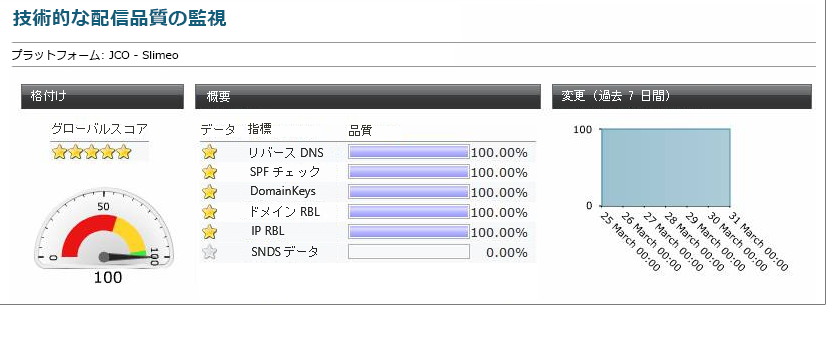

# 配信品質の監視{#monitoring-deliverability}

以下に、Adobe Campaignが提供する様々な監視ツールの詳細と、配信品質の監視に関するその他のガイドラインを示します。

## 監視ツール {#monitoring-tools}

Adobe Campaignが提供する機能を使用して、プラットフォームの配信品質を監視します。

配信品質パッケージを使用すると以下にアクセスすることができます。

* 日々の配信品質のパフォーマンスに関する技術的なトラッキングレポート（技術的な監視）。 このレポートはオンデマンドで利用でき、指定したアドレスで日次レポートを電子メールで受信できます。 詳しくは、アドビカスタマーケアチームにお問い合わせください。
* 「 [インボックスレンダリング」レポート](../../delivery/using/inbox-rendering.md) 。このレポートを使用すると、コンテンツや評判をスキャンするために、主要な電子メールクライアントにメッセージをプレビューできます。
* メッセージの質の概要（受信トレイ、スパム）。

次のツールも使用できます。

* The **[!UICONTROL Delivery throughput]** report gives you an overview of the entire platform&#39;s throughput for a given period. 詳しくは、[この節](../../reporting/using/global-reports.md#delivery-throughput)を参照してください。
* [ **[!UICONTROL 技術的な配信品質監視]** ]レポートには、お使いのプラットフォーム向けに多数の配信品質インジケータが含まれています。 詳しくは、[この節](#technical-deliverability-monitoring)を参照してください。
* 各配信は、異なるインターネットサービスプロバイダー(ISP)に関するブロードキャスト統計レポートを生成します。 配信品質に影響を与える可能性のあるデータ品質と評価の指標がいくつか表示されます。次の数値が含まれます。
   * **[!UICONTROL ハードバウンスは]** 、データの質を示します。 この数は2%未満にする必要があります。
   * **[!UICONTROL ソフトバウンスは]** 、評判を示します。 特定のISPに対して、この値を10 %以下にする必要があります。
   詳しくは、「 [配信統計](../../reporting/using/global-reports.md#delivery-statistics) 」を参照してください。
* より一般的に、 [配信ダッシュボード](../../delivery/using/monitoring-a-delivery.md#delivery-dashboard) では次の項目にアクセスできます。
   * 送信の詳細と、送信、処理および送信が成功して行われた [配信](../../delivery/using/monitoring-a-delivery.md#delivery-summary)[の](../../delivery/using/monitoring-a-delivery.md#number-of-messages-sent) 数を示すメッセージ概要。
   * 配信ログと [歴史](../../delivery/using/monitoring-a-delivery.md#delivery-logs-and-history)、つまり除外されたターゲットとその理由を示す。
   * 開いた回数やクリック数などの追跡情報を示す [トラッキングログ](../../delivery/using/monitoring-a-delivery.md#tracking-logs)。

## 監視のガイドライン {#monitoring-guidelines}

配信品質の監視に関する追加のガイドラインを示します。

* Regularly check the [delivery throughput](../../reporting/using/global-reports.md#delivery-throughput) for the whole platform to verify whether it is consistent with the original set-up.
* Check that [retries](../../delivery/using/understanding-delivery-failures.md#retries-after-a-delivery-temporary-failure) are set up correctly (30 minutes for retry period and more than 20 retries) in delivery templates.
* Regularly verify that the [bounce](../../delivery/using/understanding-delivery-failures.md#bounce-mail-management) mailbox is accessible and that the account is not about to expire.
* 各配信スループットをチェックして、配信コンテンツの有効期限と整合性が取れていることを確認します（例：「フラッシュセール」は数日ではなく、数分で配信される必要があります）。
* [ウェーブを使用する場合](../../delivery/using/steps-sending-the-delivery.md#sending-using-multiple-waves)、各波に、次の波がトリガされる前に、完了するまでの十分な時間があることを確認します。
* Check that the number of errors and new [quarantines](../../delivery/using/understanding-quarantine-management.md) are consistent with other deliveries.
* Carefully consult the [delivery logs](../../delivery/using/monitoring-a-delivery.md#delivery-logs-and-history) in detail to check the kind of errors that are highlighted (grey or black-listing, DNS issues, anti-spam rules, etc…).

## Signal Spam {#signal-spam}

Signal Spam は、フランスのサービスで、フランスの ISP（Orange、SFR）用の匿名化されたフィードバックループレポートを提供します。

* このサービスを使用すると、フランスの ISP のレピュテーションをフォローし、顧客のアクティビティの進化をトラッキングできます。

* また、Signal Spam は、専用インターフェンスを通じてエンドユーザーが記録した直接の苦情数を提供します。これらの苦情数は、E メールアドレスデータベースから強制隔離されます。

## 250ok {#deliverability-250ok}

[250ok](https://250ok.com/) は、IP、ドメインブラックリスト、および評判のインジケーターを提供するアドビの配信品質内部ツールの補完的な監視ソリューションです。

提供される情報はリアルタイムで、これにより先を見越した支援が可能です。

## 配信品質の技術的監視レポート {#technical-deliverability-monitoring}

配信品質の技術的監視レポートは毎日更新され、Adobe Campaign の「**[!UICONTROL ホーム]**」タブから&#x200B;**[!UICONTROL 監視]**／**[!UICONTROL 概要]**／**[!UICONTROL 技術的監視]**&#x200B;リンクをクリックすることで使用できます。このレポートには、プラットフォームに関する多数の配信品質指標が含まれます。

これらの指標は毎日午前 9 時に更新されます。

>[!NOTE]
>
>さらに、指定したアドレスで、毎日のレポートを E メールで受け取ることができます。電子メールまたはAdobe Campaignエクストラネット経由で、ご要望の電子メールアドレスをお知らせください。

次の指標がレポートで使用されます。

* **[!UICONTROL リバース DNS]**：Adobe Campaign は、IP アドレスにリバース DNS が指定されているかどうか、およびこれが IP を正しく指しているかどうかを確認します。

* **[!UICONTROL SPF]**（Sender Policy Framework）：E メール送信者が送信ドメインで承認されているかどうかを ISP およびメールボックスプロバイダーが確認できる認証メカニズムです。

* **[!UICONTROL DomainKeys]**：Yahoo が開発したサービスで、E メール送信者の ID を認証するためのものです。

* **[!UICONTROL IP および RBL ドメイン]**（リアルタイムブラックホールリスト）：ブロックリスト組織によって送信レピュテーションが低くフラグ付けされた IP アドレスおよびドメインのリスト。リストは、SpamHaus、SpamCop、SURBL/URIBL などの専門組織によって管理されます。現在、Adobe Campaign は、配信品質に大きな影響を与える RBL に対するチェックを処理します。これらの RBL は送信レピュテーションを反映し、E メールの受信が許可される前に ISP によって参照される可能性があります。

* **[!UICONTROL SNDS]**（Smart Network Data Services）：[Windows Live Hotmail のスパム対策サービス](https://sendersupport.olc.protection.outlook.com/snds/FAQ.aspx)。このタイプの情報を提供する ISP は Hotmail のみです。ベンチマークスコアは、緑色のフィルター結果、0.1％未満の苦情率、ゼロスパムトラップです。

<!--### Delivery Reports - Broadcast Statistics {#broadcast-statistics}

Each delivery will generate a broadcast statistics report when you open a delivery in the “Deliveries List”, which includes some reputation metrics that may impact your deliverability.-->
