# パーソナライゼーションブロック{#personalization-blocks}

パーソナライゼーションブロックは動的なもので、パーソナライズされています。そこには、配信に挿入できる特定のレンダリングが格納されています。例えば、ロゴ、挨拶メッセージまたはミラーページへのリンクを追加できます。[パーソナライゼーションブロックの挿入](#inserting-personalization-blocks)を参照してください。

>[!NOTE]
>
>パーソナライゼーションブロックは、**[!UICONTROL デジタルコンテンツエディター（DCE）]**&#x200B;から使用することもできます。詳しくは、[このページ](../../web/using/editing-content.md#inserting-a-personalization-block)を参照してください。

パーソナライゼーションブロックは、Adobe Campaign エクスプローラーの&#x200B;**[!UICONTROL リソース／キャンペーン管理／パーソナライゼーションブロック]**&#x200B;ノードからアクセスします。デフォルトでは、複数のブロックを使用できます（[標準パーソナライゼーションブロック](#out-of-the-box-personalization-blocks)を参照）。

新しいブロックを定義して、配信のパーソナライゼーションを最適化することもできます。詳しくは、[カスタムパーソナライゼーションブロックの定義](#defining-custom-personalization-blocks)を参照してください。

## パーソナライゼーションブロックの挿入 {#inserting-personalization-blocks}

パーソナライゼーションブロックをメッセージに挿入するには、以下の手順に従います。

1. 配信ウィザードのコンテンツエディターで、パーソナライゼーションフィールドアイコンをクリックし、「**[!UICONTROL 含める]**」メニューを選択します。
1. リストからパーソナライゼーションブロックを選択するか（このリストには最近使用された 10 件のブロックが表示されます）、「**[!UICONTROL その他...]**」メニューをクリックして完全なリストを表示します。

   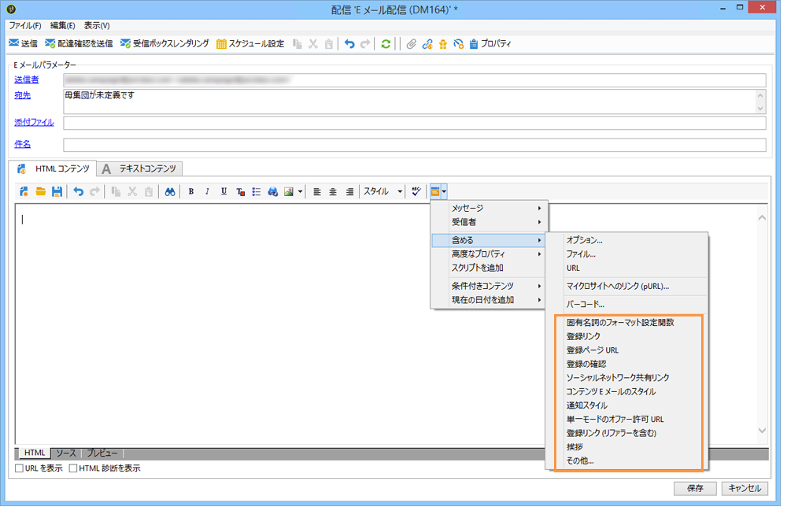

1. **[!UICONTROL その他...]**&#x200B;メニューを使用すると、すべての標準パーソナライゼーションブロックとカスタムパーソナライゼーションブロックにアクセスできます（[標準パーソナライゼーションブロック](#out-of-the-box-personalization-blocks)および[カスタムパーソナライゼーションブロックの定義 ](#defining-custom-personalization-blocks)を参照）。

   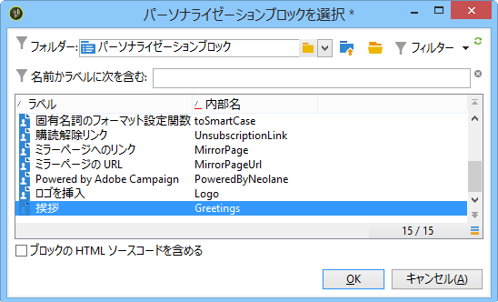

1. パーソナライゼーションブロックがスクリプトとして挿入されます。パーソナライゼーションが生成されると、受信者プロファイルに自動的に適応されます。

   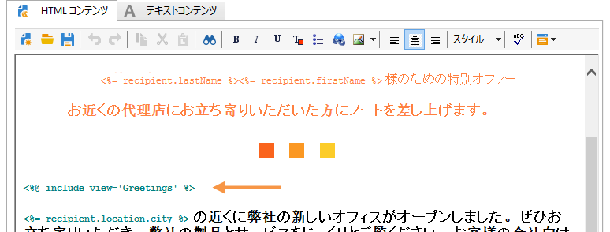

1. 「**[!UICONTROL プレビュー]**」タブをクリックし、いずれかの受信者を選択して、パーソナライゼーション結果を表示します。

   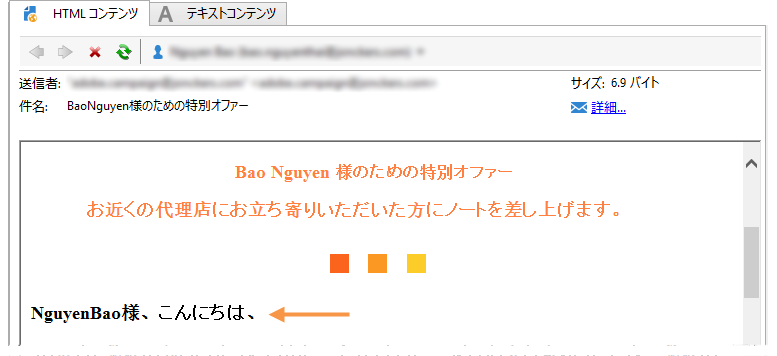

配信コンテンツには、パーソナライゼーションブロックのソースコードを含めることができます。そのためには、ブロックの選択時に「**[!UICONTROL ブロックの HTML ソースコードを含める]**」を選択します。

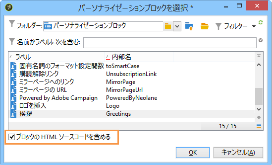

HTML ソースコードが配信コンテンツに挿入されます。一例として、下図には&#x200B;**[!UICONTROL 挨拶]**&#x200B;パーソナライゼーションブロックが表示されています。

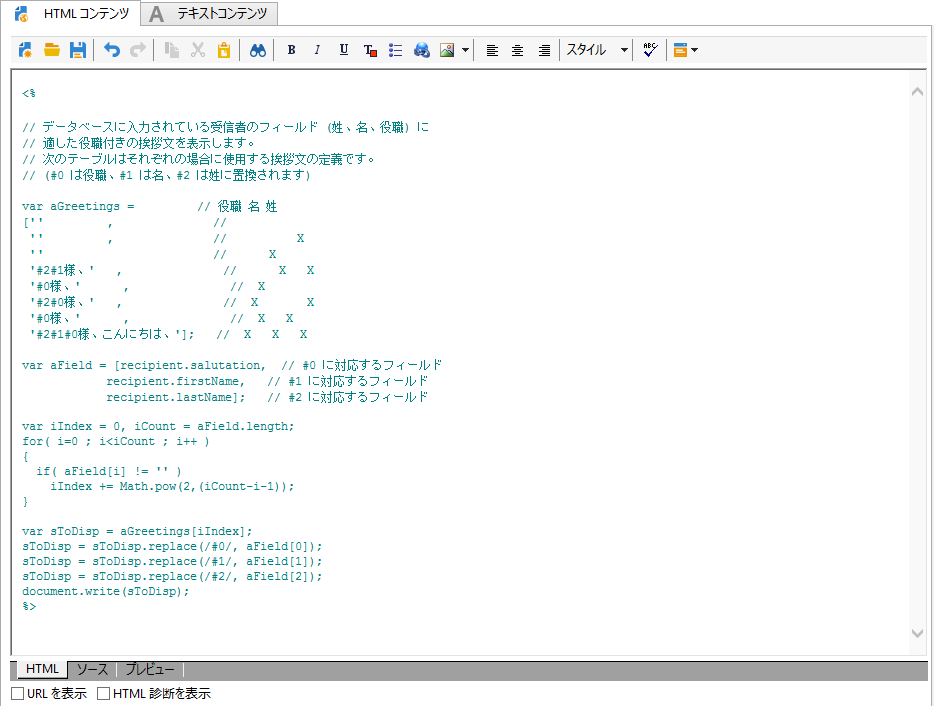

## パーソナライゼーションブロックの例 {#personalization-blocks-example}

この例では、パーソナライゼーションブロックを使用して、受信者によるミラーページの表示、ソーシャルネットワークでのニュースレターの共有、今後の配信の購読解除が可能な E メールを作成します。

そのためには、次のパーソナライゼーションブロックを挿入する必要があります。

* **[!UICONTROL ミラーページへのリンク]**
* **[!UICONTROL ソーシャルネットワーク共有リンク]**
* **[!UICONTROL 購読解除リンク]**

>[!NOTE]
>
>ミラーページの生成について詳しくは、[ミラーページの生成](../../delivery/using/sending-messages.md#generating-the-mirror-page)を参照してください。

1. 新しい配信を作成するか、E メールタイプの既存の配信を開きます。
1. 配信ウィザードで、「**[!UICONTROL 件名]**」をクリックし、メッセージの件名の編集や件名の入力をおこないます。
1. メッセージ本文にパーソナライゼーションブロックを挿入します。そのためには、メッセージコンテンツ、パーソナライゼーションフィールドアイコンの順にクリックし、「**[!UICONTROL 含める]**」メニューを選択します。
1. 挿入する最初のブロックを選択します。上記の手順を繰り返して他の 2 つのブロックも挿入します。

   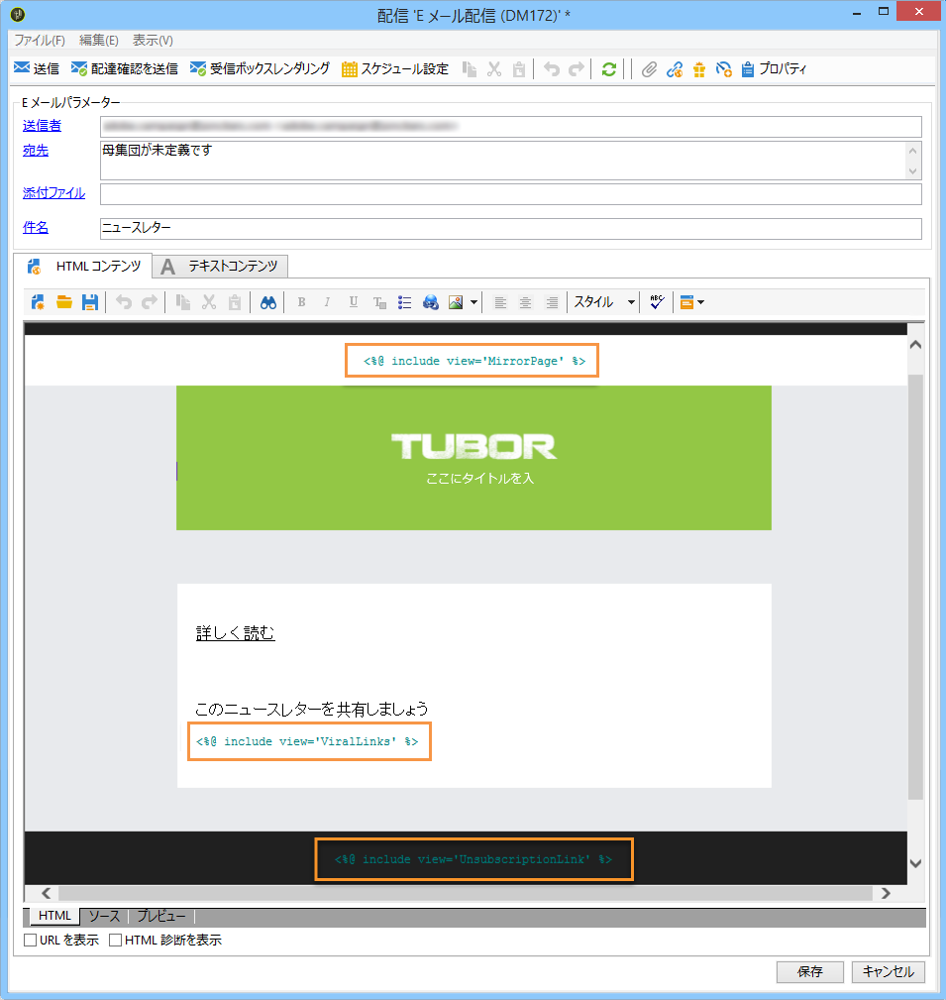

1. 「**[!UICONTROL プレビュー]**」タブをクリックすると、パーソナライゼーションの結果が表示されます。受信者に応じたメッセージを確認するには、受信者を選択する必要があります。

   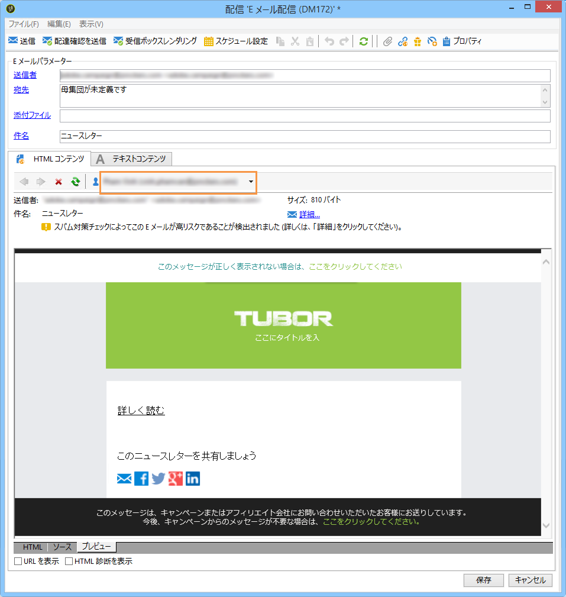

1. ブロックコンテンツが適切に表示されていることを確認します。

## 標準パーソナライゼーションブロック {#out-of-the-box-personalization-blocks}

デフォルトでは、メッセージコンテンツのパーソナライゼーションに役立つパーソナライゼーションブロックのリストが使用可能になっています。

>[!NOTE]
>
>パーソナライゼーションブロックのリストは、お使いのインスタンスにインストールされているモジュールやオプションによって異なります。

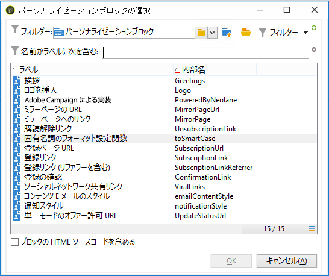

* **[!UICONTROL 挨拶]**：受信者の名前と共に挨拶文を挿入します。例：「こんにちは、John Doe。」
* **[!UICONTROL ロゴを挿入]**：インスタンスの設定時に定義された標準のロゴを挿入します。
* **[!UICONTROL Powered by Adobe Campaign]**：「Powered by Adobe Campaign」ロゴを挿入します。
* **[!UICONTROL ミラーページの URL]**：ミラーページの URL を挿入し、配信デザイナーがリンクを確認できるようにします。

   >[!NOTE]
   >
   >ミラーページの生成について詳しくは、[ミラーページの生成](../../delivery/using/sending-messages.md#generating-the-mirror-page)を参照してください。

* **[!UICONTROL ミラーページへのリンク]**：ミラーページへのリンク、「このメッセージが正しく表示されない場合は、ここをクリックしてください」を挿入します。
* **[!UICONTROL 購読解除リンク]**：すべての配信を購読解除（ブラックリスト登録）できるリンクを挿入します。
* **[!UICONTROL 固有名詞の書式設定関数]**：Javascript の **[!UICONTROL toSmartCase]** 関数を生成します。この関数は各単語の最初の文字を大文字に変更します。このブロックは配信のソースコードの **`<script>...</script>`** タグの間に挿入する必要があります。

   次の例では、関数を使用して、要素「My header」を「My new header」で置き換え、各単語の先頭を大文字に変換しています。

   ```
   <h1 id="sample">My header</h1>
   <script><%@ include view='toSmartCase'%>;
   document.getElementById("sample").innerHTML = toSmartCase("My new header");
   </script>
   ```

   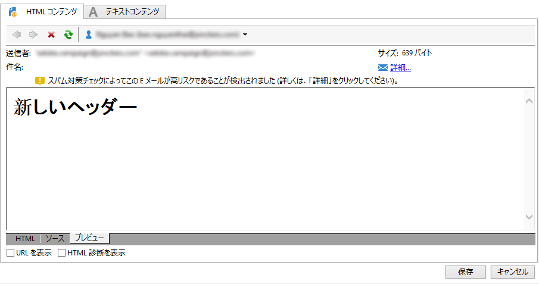

* **[!UICONTROL 登録ページ URL]**：購読 URL を挿入します（[サービスと購読について](../../delivery/using/about-services-and-subscriptions.md)を参照）。
* **[!UICONTROL 登録リンク]**：インスタンスの設定時に定義された購読リンクを挿入します。
* **[!UICONTROL 登録リンク（リファラーを含む）]**：購読リンクを挿入し、訪問者と配信を識別できるようにします。このリンクは、インスタンスの設定時に定義されたものです。

   >[!NOTE]
   >
   >このブロックは、訪問者をターゲットとする配信でのみ使用できます。

* **[!UICONTROL 登録の確認]**：購読を確認できるリンクを挿入します。
* **[!UICONTROL ソーシャルネットワーク共有リンク]**：E メールクライアント、Facebook、Twitter、Google + および LinkedIn によってミラーページコンテンツへのリンクを受信者が共有できるボタンを挿入します（[バイラルマーケティング：友人への転送](../../delivery/using/viral-and-social-marketing.md#viral-marketing--forward-to-a-friend)を参照）。
* **[!UICONTROL コンテンツ E メールのスタイル]**&#x200B;および&#x200B;**[!UICONTROL 通知スタイル]**：定義済みの HTML スタイルで E メールを書式設定するコードを生成します。これらのブロックは、配信のソースコードの **[!UICONTROL ...]** セクションにある **`<style>...</style>`** タグの間に挿入する必要があります。
* **[!UICONTROL 単一モードのオファー承認 URL]**：インタラクションオファーを&#x200B;**[!UICONTROL 許可済み]**&#x200B;に設定できる URL を挿入します（[この節](../../interaction/using/offer-analysis-report.md)を参照）。

## カスタムパーソナライゼーションブロックの定義 {#defining-custom-personalization-blocks}

**[!UICONTROL 含める]**&#x200B;メニューのパーソナライゼーションフィールドアイコンを使用すると、挿入する新しいパーソナライゼーションフィールドを定義できます。それらのフィールドは、パーソナライゼーションブロック内に定義されます。

パーソナライゼーションブロックを作成するには、エクスプローラーを開き、次の手順に従います。

1. **[!UICONTROL リソース／キャンペーン管理／パーソナライゼーションブロック]**&#x200B;ノードをクリックします。
1. ブロックのリストを右クリックし、「**[!UICONTROL 新規]**」を選択します。
1. 次のように、パーソナライゼーションブロックの設定に入力します。

   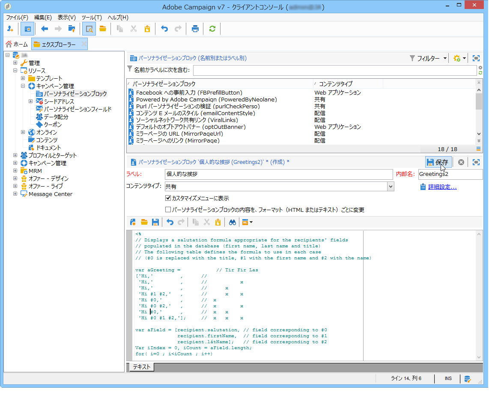

   * ブロックのラベルを入力します。このラベルは、パーソナライゼーションフィールドの挿入ウィンドウに表示されます。
   * このブロックに、パーソナライゼーションフィールドの挿入アイコンからアクセスできるよう、「**[!UICONTROL カスタマイズメニューに表示]**」を選択します。
   * 必要な場合は、「**[!UICONTROL パーソナライゼーションブロックの内容を、フォーマット（HTML またはテキスト）ごとに変更]**」を選択し、HTML 形式とテキスト形式の 2 つの個別のブロックを定義します。

      このエディターの下部のセクションに、HTML コンテンツとテキストコンテンツを定義するためのタブが合わせて 2 つ表示されます。

      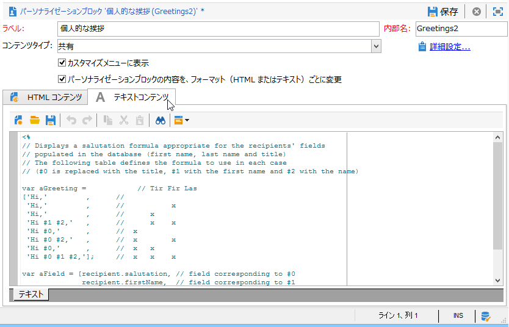

   * パーソナライゼーションブロックのコンテンツ（HTML、テキスト、JavaScript など）を入力し、「**[!UICONTROL 保存]**」をクリックします。
