<?xml version="1.0" encoding="UTF-8"?>
<xliff xmlns="urn:oasis:names:tc:xliff:document:1.2" xmlns:okp="okapi-framework:xliff-extensions" xmlns:its="http://www.w3.org/2005/11/its" xmlns:itsxlf="http://www.w3.org/ns/its-xliff/" version="1.2" its:version="2.0">
<file original="help/delivery/using/personalization-blocks.md.mdsc" source-language="en-US" target-language="en-XX" datatype="x-text/markdown">
<body>
<trans-unit id="tu69" xml:space="preserve">
<source xml:lang="en-US">https://experienceleague.adobe.com/en/docs/control-panel/using/instances-settings/url-permissions</source>
<target xml:lang="en-XX">https://experienceleague.adobe.com/ja/docs/control-panel/using/instances-settings/url-permissions</target>
</trans-unit>
<trans-unit id="tu86" xml:space="preserve">
<source xml:lang="en-US">https://experienceleague.adobe.com/docs/campaign-classic-learn/tutorials/overview.html</source>
<target xml:lang="en-XX">https://experienceleague.ad?lang=obe.com/docs/campaign-classic-learn/tutorials/overview.html?lang=ja</target>
</trans-unit>
<trans-unit id="tu1" restype="x-YAML_METADATA_HEADER_VALUE" xml:space="preserve">
<source xml:lang="en-US">Personalization blocks</source>
<target xml:lang="en-XX">パーソナライゼーションブロック</target>
</trans-unit>
<trans-unit id="tu2" restype="x-YAML_METADATA_HEADER_VALUE" xml:space="preserve">
<source xml:lang="en-US">Learn how to use personalization blocks</source>
<target xml:lang="en-XX">パーソナライゼーションブロックの使用方法を学ぶ</target>
</trans-unit>
<trans-unit id="tu3" xml:space="preserve">
<source xml:lang="en-US">Also applies to v8</source>
<target xml:lang="en-XX">v8 にも適用されます</target>
</trans-unit>
<trans-unit id="tu4" xml:space="preserve">
<source xml:lang="en-US">Also applies to Campaign v8</source>
<target xml:lang="en-XX">Campaign v8 にも適用されます</target>
</trans-unit>
<trans-unit id="tu5" xml:space="preserve">
<source xml:lang="en-US">Personalization blocks</source>
<target xml:lang="en-XX">パーソナライゼーションブロック</target>
</trans-unit>
<trans-unit id="tu6" xml:space="preserve">
<source xml:lang="en-US">Personalization blocks are dynamic, personalized and contain a specific rendering that you can insert into your deliveries. For example, you can add a logo, a greeting message, or a link to a mirror page. See <ph id="1" ctype="x-LINK">[</ph>Insert personalization blocks<ph id="2" ctype="x-LINK">](#inserting-personalization-blocks)</ph>.</source>
<target xml:lang="en-XX">パーソナライゼーションブロックは動的なもので、パーソナライズされています。そこには、配信に挿入できる特定のレンダリングが格納されています。 例えば、ロゴ、挨拶メッセージまたはミラーページへのリンクを追加できます。 <ph id="1" ctype="x-LINK">[</ph>パーソナライゼーションブロックの挿入<ph id="2" ctype="x-LINK">](#inserting-personalization-blocks)</ph>を参照してください。</target>
</trans-unit>
<trans-unit id="tu7" xml:space="preserve">
<source xml:lang="en-US"><ph id="1" ctype="x-IMAGE"></ph> Discover this feature <ph id="3" ctype="x-LINK">[</ph>in video<ph id="4" ctype="x-LINK">](#personalization-blocks-video)</ph></source>
<target xml:lang="en-XX"><ph id="1" ctype="x-IMAGE"></ph><ph id="3" ctype="x-LINK">[</ph> ビデオでこの機能を確認する<ph id="4" ctype="x-LINK">](#personalization-blocks-video)</ph></target>
</trans-unit>
<trans-unit id="tu8" xml:space="preserve">
<source xml:lang="en-US">Personalization blocks are accessed via the <ph id="1" ctype="x-STRONG_EMPHASIS">**[!UICONTROL </ph>Resources > Campaign Management > Personalization blocks<ph id="3" ctype="x-LINK_REF">]**</ph> node of the Adobe Campaign explorer. Several blocks are available by default (see <ph id="5" ctype="x-LINK">[</ph>Out-of-the-box personalization blocks<ph id="6" ctype="x-LINK">](#out-of-the-box-personalization-blocks)</ph>).</source>
<target xml:lang="en-XX">パーソナライゼーションブロックは、Adobe Campaign エクスプローラーの<ph id="1" ctype="x-STRONG_EMPHASIS">**[!UICONTROL </ph>リソース／キャンペーン管理／パーソナライゼーションブロック<ph id="3" ctype="x-LINK_REF">]**</ph>ノードからアクセスします。 デフォルトでは、複数のブロックを使用できます（<ph id="5" ctype="x-LINK">[</ph>標準パーソナライゼーションブロック<ph id="6" ctype="x-LINK">](#out-of-the-box-personalization-blocks)</ph>を参照）。</target>
</trans-unit>
<trans-unit id="tu9" xml:space="preserve">
<source xml:lang="en-US">You have the ability to define new blocks that will enable you to optimize your deliveries personalization. For more on this, refer to <ph id="1" ctype="x-LINK">[</ph>Define custom personalization blocks<ph id="2" ctype="x-LINK">](#defining-custom-personalization-blocks)</ph>.</source>
<target xml:lang="en-XX">新しいブロックを定義して、配信のパーソナライゼーションを最適化することもできます。 詳しくは、<ph id="1" ctype="x-LINK">[</ph>カスタムパーソナライゼーションブロックの定義<ph id="2" ctype="x-LINK">](#defining-custom-personalization-blocks)</ph>を参照してください。</target>
</trans-unit>
<trans-unit id="tu10" xml:space="preserve">
<source xml:lang="en-US"><ph id="1" ctype="x-regxph" equiv-text="[!NOTE">[!NOTE]</ph></source>
<target xml:lang="en-XX"><ph id="1" ctype="x-regxph" equiv-text="[!NOTE">[!NOTE]</ph></target>
</trans-unit>
<trans-unit id="tu11" xml:space="preserve">
<source xml:lang="en-US">Personalization blocks are also available from the <ph id="1" ctype="x-STRONG_EMPHASIS">**[!UICONTROL </ph>Digital Content Editor (DCE)<ph id="3" ctype="x-LINK_REF">]**</ph> . For more on this, refer to <ph id="5" ctype="x-LINK">[</ph>this page<ph id="6" ctype="x-LINK">](../../web/using/editing-content.md#inserting-a-personalization-block)</ph>.</source>
<target xml:lang="en-XX">パーソナライゼーションブロックは、<ph id="1" ctype="x-STRONG_EMPHASIS">**[!UICONTROL </ph>デジタルコンテンツエディター（DCE）<ph id="3" ctype="x-LINK_REF">]**</ph>から使用することもできます。 詳しくは、<ph id="5" ctype="x-LINK">[</ph>このページ<ph id="6" ctype="x-LINK">](../../web/using/editing-content.md#inserting-a-personalization-block)</ph>を参照してください。</target>
</trans-unit>
<trans-unit id="tu12" xml:space="preserve">
<source xml:lang="en-US">Insert personalization blocks</source>
<target xml:lang="en-XX">パーソナライゼーションブロックの挿入</target>
</trans-unit>
<trans-unit id="tu13" xml:space="preserve">
<source xml:lang="en-US">To insert a personalization block in a message, follow the steps below:</source>
<target xml:lang="en-XX">パーソナライゼーションブロックをメッセージに挿入するには、以下の手順に従います。</target>
</trans-unit>
<trans-unit id="tu14" xml:space="preserve">
<source xml:lang="en-US">In the content editor of the delivery assistant, click the personalized field icon and select the <ph id="1" ctype="x-STRONG_EMPHASIS">**[!UICONTROL </ph>Include<ph id="3" ctype="x-LINK_REF">]**</ph> menu.</source>
<target xml:lang="en-XX">配信アシスタントのコンテンツエディターで、「パーソナライズされたフィールド」アイコンをクリックし、<ph id="1" ctype="x-STRONG_EMPHASIS">**[!UICONTROL </ph>含める<ph id="3" ctype="x-LINK_REF">]**</ph>メニューを選択します。</target>
</trans-unit>
<trans-unit id="tu15" xml:space="preserve">
<source xml:lang="en-US">Select a personalization block from the list (the list displays the 10 last used blocks), or click the <ph id="1" ctype="x-STRONG_EMPHASIS">**[!UICONTROL </ph>Other...<ph id="3" ctype="x-LINK_REF">]**</ph> menu to access the full list.</source>
<target xml:lang="en-XX">リストからパーソナライゼーションブロックを選択するか（このリストには最近使用された 10 件のブロックが表示されます）、「<ph id="1" ctype="x-STRONG_EMPHASIS">**[!UICONTROL </ph>その他...<ph id="3" ctype="x-LINK_REF">]**</ph>」メニューをクリックして完全なリストを表示します。</target>
</trans-unit>
<trans-unit id="tu16" xml:space="preserve">
<source xml:lang="en-US"><ph id="1" ctype="x-IMAGE">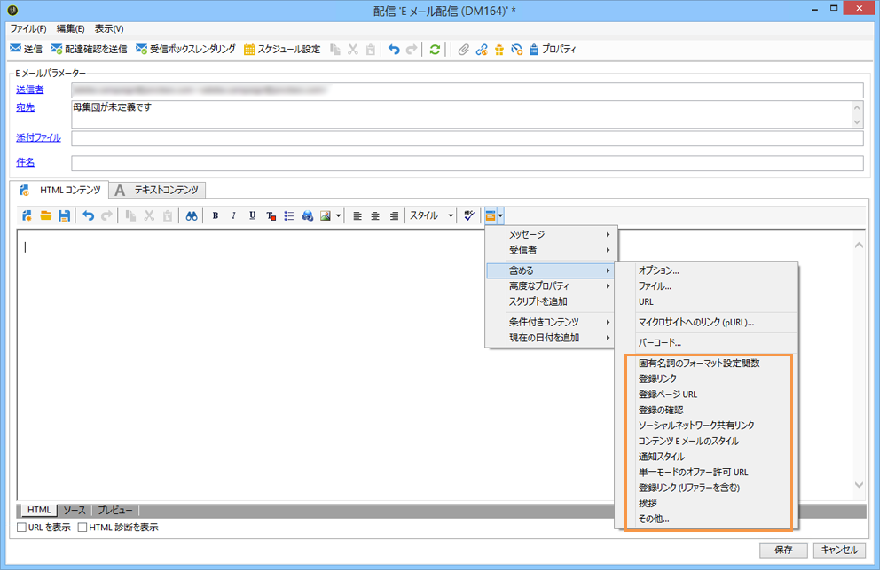</ph></source>
<target xml:lang="en-XX"><ph id="1" ctype="x-IMAGE"></ph></target>
</trans-unit>
<trans-unit id="tu17" xml:space="preserve">
<source xml:lang="en-US">The <ph id="1" ctype="x-STRONG_EMPHASIS">**[!UICONTROL </ph>Other...<ph id="3" ctype="x-LINK_REF">]**</ph> menu gives access to all the out-of-the-box and custom personalization blocks (see <ph id="5" ctype="x-LINK">[</ph>Out-of-the-box personalization blocks<ph id="6" ctype="x-LINK">](#out-of-the-box-personalization-blocks)</ph> and <ph id="7" ctype="x-LINK">[</ph>Define custom personalization blocks<ph id="8" ctype="x-LINK">](#defining-custom-personalization-blocks)</ph>).</source>
<target xml:lang="en-XX"><ph id="1" ctype="x-STRONG_EMPHASIS">**[!UICONTROL </ph>その他...<ph id="3" ctype="x-LINK_REF">]**</ph>メニューを使用すると、すべての標準およびカスタムパーソナライゼーションブロックにアクセスできます（<ph id="5" ctype="x-LINK">[</ph>標準パーソナライゼーションブロック<ph id="6" ctype="x-LINK">](#out-of-the-box-personalization-blocks)</ph>および<ph id="7" ctype="x-LINK">[</ph>カスタムパーソナライゼーションブロックの定義<ph id="8" ctype="x-LINK">](#defining-custom-personalization-blocks)</ph>を参照）。</target>
</trans-unit>
<trans-unit id="tu18" xml:space="preserve">
<source xml:lang="en-US"><ph id="1" ctype="x-IMAGE">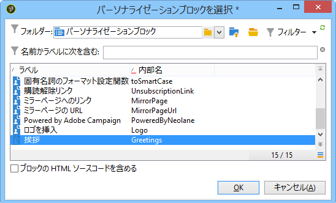</ph></source>
<target xml:lang="en-XX"><ph id="1" ctype="x-IMAGE"></ph></target>
</trans-unit>
<trans-unit id="tu19" xml:space="preserve">
<source xml:lang="en-US">The personalization block is then inserted as a script. It is automatically adapted to the recipient profile when personalization is generated.</source>
<target xml:lang="en-XX">パーソナライゼーションブロックがスクリプトとして挿入されます。 パーソナライゼーションが生成されると、受信者プロファイルに自動的に適応されます。</target>
</trans-unit>
<trans-unit id="tu20" xml:space="preserve">
<source xml:lang="en-US"><ph id="1" ctype="x-IMAGE">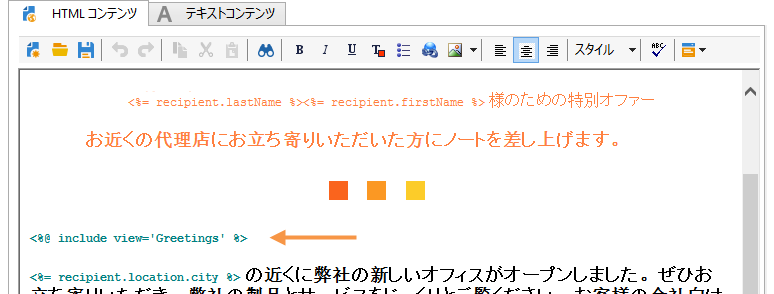</ph></source>
<target xml:lang="en-XX"><ph id="1" ctype="x-IMAGE"></ph></target>
</trans-unit>
<trans-unit id="tu21" xml:space="preserve">
<source xml:lang="en-US">Click the <ph id="1" ctype="x-STRONG_EMPHASIS">**[!UICONTROL </ph>Preview<ph id="3" ctype="x-LINK_REF">]**</ph> tab and select a recipient to view the personalization.</source>
<target xml:lang="en-XX">「<ph id="1" ctype="x-STRONG_EMPHASIS">**[!UICONTROL </ph>プレビュー<ph id="3" ctype="x-LINK_REF">]**</ph>」タブをクリックし、いずれかの受信者を選択して、パーソナライゼーション結果を表示します。</target>
</trans-unit>
<trans-unit id="tu22" xml:space="preserve">
<source xml:lang="en-US"><ph id="1" ctype="x-IMAGE">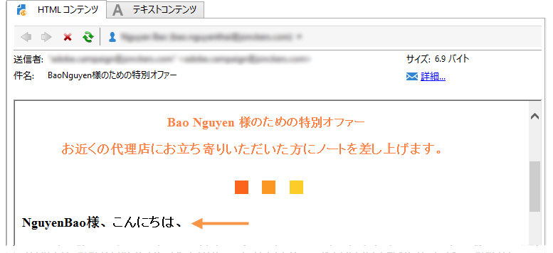</ph></source>
<target xml:lang="en-XX"><ph id="1" ctype="x-IMAGE"></ph></target>
</trans-unit>
<trans-unit id="tu23" xml:space="preserve">
<source xml:lang="en-US">You can include the source code of a personalization block in the delivery content. To do this, select <ph id="1" ctype="x-STRONG_EMPHASIS">**[!UICONTROL </ph>Include the HTML source code of the block<ph id="3" ctype="x-LINK_REF">]**</ph> when selecting it.</source>
<target xml:lang="en-XX">配信コンテンツには、パーソナライゼーションブロックのソースコードを含めることができます。 そのためには、ブロックの選択時に「<ph id="1" ctype="x-STRONG_EMPHASIS">**[!UICONTROL </ph>ブロックの HTML ソースコードを含める<ph id="3" ctype="x-LINK_REF">]**</ph>」を選択します。</target>
</trans-unit>
<trans-unit id="tu24" xml:space="preserve">
<source xml:lang="en-US"><ph id="1" ctype="x-IMAGE">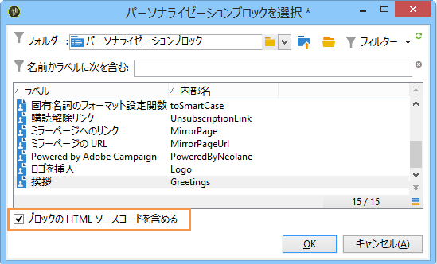</ph></source>
<target xml:lang="en-XX"><ph id="1" ctype="x-IMAGE"></ph></target>
</trans-unit>
<trans-unit id="tu25" xml:space="preserve">
<source xml:lang="en-US">The HTML source code is inserted in the delivery content. For example, the <ph id="1" ctype="x-STRONG_EMPHASIS">**[!UICONTROL </ph>Greetings<ph id="3" ctype="x-LINK_REF">]**</ph> personalization bloc displays as below:</source>
<target xml:lang="en-XX">HTML ソースコードが配信コンテンツに挿入されます。 一例として、下図には<ph id="1" ctype="x-STRONG_EMPHASIS">**[!UICONTROL </ph>挨拶<ph id="3" ctype="x-LINK_REF">]**</ph>パーソナライゼーションブロックが表示されています。</target>
</trans-unit>
<trans-unit id="tu26" xml:space="preserve">
<source xml:lang="en-US"><ph id="1" ctype="x-IMAGE">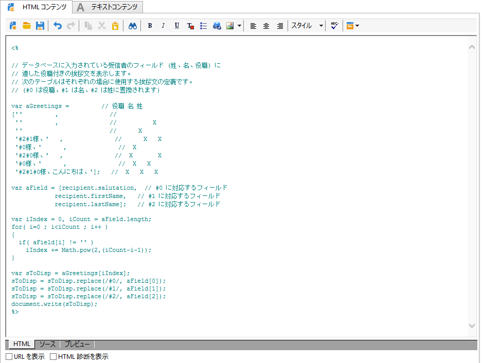</ph></source>
<target xml:lang="en-XX"><ph id="1" ctype="x-IMAGE"></ph></target>
</trans-unit>
<trans-unit id="tu27" xml:space="preserve">
<source xml:lang="en-US">Personalization blocks example</source>
<target xml:lang="en-XX">パーソナライゼーションブロックの例</target>
</trans-unit>
<trans-unit id="tu28" xml:space="preserve">
<source xml:lang="en-US">In this example, we create an email in which we use personalization blocks to enable the recipient to view the mirror page, share the newsletter on social networks, and unsubscribe from future deliveries.</source>
<target xml:lang="en-XX">この例では、パーソナライゼーションブロックを使用して、受信者によるミラーページの表示、ソーシャルネットワークでのニュースレターの共有、今後の配信の購読解除が可能なメールを作成します。</target>
</trans-unit>
<trans-unit id="tu29" xml:space="preserve">
<source xml:lang="en-US">To do this, we need to insert the following personalization blocks:</source>
<target xml:lang="en-XX">そのためには、次のパーソナライゼーションブロックを挿入する必要があります。</target>
</trans-unit>
<trans-unit id="tu30" xml:space="preserve">
<source xml:lang="en-US"><ph id="1" ctype="x-STRONG_EMPHASIS">**[!UICONTROL </ph>Link to mirror page<ph id="3" ctype="x-LINK_REF">]**</ph> .</source>
<target xml:lang="en-XX"><ph id="1" ctype="x-STRONG_EMPHASIS">**[!UICONTROL </ph>ミラーページへのリンク<ph id="3" ctype="x-LINK_REF">]**</ph></target>
</trans-unit>
<trans-unit id="tu31" xml:space="preserve">
<source xml:lang="en-US"><ph id="1" ctype="x-STRONG_EMPHASIS">**[!UICONTROL </ph>Social network sharing links<ph id="3" ctype="x-LINK_REF">]**</ph> .</source>
<target xml:lang="en-XX"><ph id="1" ctype="x-STRONG_EMPHASIS">**[!UICONTROL </ph>ソーシャルネットワーク共有リンク<ph id="3" ctype="x-LINK_REF">]**</ph></target>
</trans-unit>
<trans-unit id="tu32" xml:space="preserve">
<source xml:lang="en-US"><ph id="1" ctype="x-STRONG_EMPHASIS">**[!UICONTROL </ph>Unsubscription link<ph id="3" ctype="x-LINK_REF">]**</ph> .</source>
<target xml:lang="en-XX"><ph id="1" ctype="x-STRONG_EMPHASIS">**[!UICONTROL </ph>購読解除リンク<ph id="3" ctype="x-LINK_REF">]**</ph></target>
</trans-unit>
<trans-unit id="tu33" xml:space="preserve">
<source xml:lang="en-US"><ph id="1" ctype="x-regxph" equiv-text="[!NOTE">[!NOTE]</ph></source>
<target xml:lang="en-XX"><ph id="1" ctype="x-regxph" equiv-text="[!NOTE">[!NOTE]</ph></target>
</trans-unit>
<trans-unit id="tu34" xml:space="preserve">
<source xml:lang="en-US">For more on the mirror page generation, refer to <ph id="1" ctype="x-LINK">[</ph>Generate the mirror page<ph id="2" ctype="x-LINK">](sending-messages.md#generating-the-mirror-page)</ph>.</source>
<target xml:lang="en-XX">ミラーページの生成について詳しくは、<ph id="1" ctype="x-LINK">[</ph>ミラーページの生成<ph id="2" ctype="x-LINK">](sending-messages.md#generating-the-mirror-page)</ph>を参照してください。</target>
</trans-unit>
<trans-unit id="tu35" xml:space="preserve">
<source xml:lang="en-US">Create a new delivery or open an existing email type delivery.</source>
<target xml:lang="en-XX">新しい配信を作成するか、メールタイプの既存の配信を開きます。</target>
</trans-unit>
<trans-unit id="tu36" xml:space="preserve">
<source xml:lang="en-US">In the delivery assistant, click <ph id="1" ctype="x-STRONG_EMPHASIS">**[!UICONTROL </ph>Subject<ph id="3" ctype="x-LINK_REF">]**</ph> to edit the subject of the message and enter a subject.</source>
<target xml:lang="en-XX">配信アシスタントで、「<ph id="1" ctype="x-STRONG_EMPHASIS">**[!UICONTROL </ph>件名<ph id="3" ctype="x-LINK_REF">]**</ph>」をクリックし、メッセージの件名の編集や件名の入力を行います。</target>
</trans-unit>
<trans-unit id="tu37" xml:space="preserve">
<source xml:lang="en-US">Insert the personalization blocks in the message body. To do this, click in the message content, click the personalized field icon and select the <ph id="1" ctype="x-STRONG_EMPHASIS">**[!UICONTROL </ph>Include<ph id="3" ctype="x-LINK_REF">]**</ph> menu.</source>
<target xml:lang="en-XX">メッセージ本文にパーソナライゼーションブロックを挿入します。 そのためには、メッセージコンテンツ、パーソナライゼーションフィールドアイコンの順にクリックし、「<ph id="1" ctype="x-STRONG_EMPHASIS">**[!UICONTROL </ph>含める<ph id="3" ctype="x-LINK_REF">]**</ph>」メニューを選択します。</target>
</trans-unit>
<trans-unit id="tu38" xml:space="preserve">
<source xml:lang="en-US">Select the first block to insert. Renew the procedure to include the two other blocks.</source>
<target xml:lang="en-XX">挿入する最初のブロックを選択します。 上記の手順を繰り返して他の 2 つのブロックも挿入します。</target>
</trans-unit>
<trans-unit id="tu39" xml:space="preserve">
<source xml:lang="en-US"><ph id="1" ctype="x-IMAGE">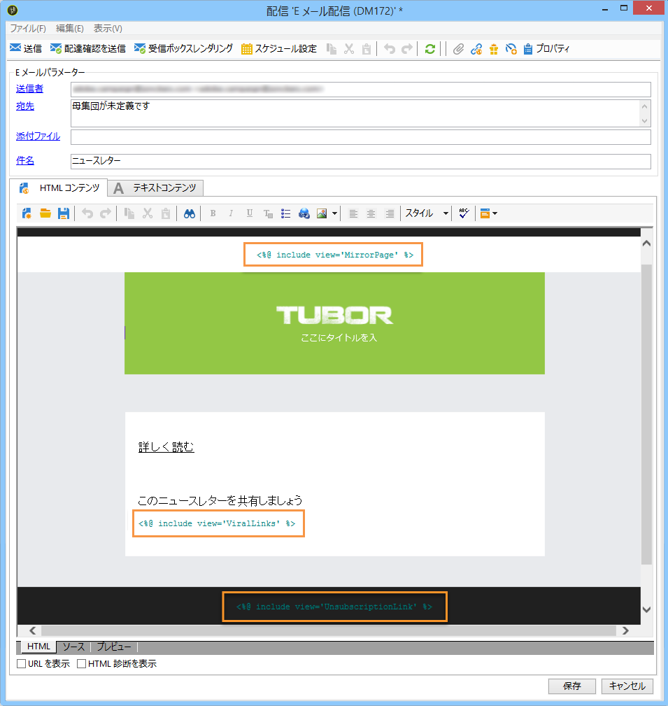</ph></source>
<target xml:lang="en-XX"><ph id="1" ctype="x-IMAGE"></ph></target>
</trans-unit>
<trans-unit id="tu40" xml:space="preserve">
<source xml:lang="en-US">Click the <ph id="1" ctype="x-STRONG_EMPHASIS">**[!UICONTROL </ph>Preview<ph id="3" ctype="x-LINK_REF">]**</ph> tab to view the personalization result. You must select a recipient to display that recipient's message.</source>
<target xml:lang="en-XX">「<ph id="1" ctype="x-STRONG_EMPHASIS">**[!UICONTROL </ph>プレビュー<ph id="3" ctype="x-LINK_REF">]**</ph>」タブをクリックすると、パーソナライゼーションの結果が表示されます。 受信者に応じたメッセージを表示するには、受信者を選択する必要があります。</target>
</trans-unit>
<trans-unit id="tu41" xml:space="preserve">
<source xml:lang="en-US"><ph id="1" ctype="x-IMAGE">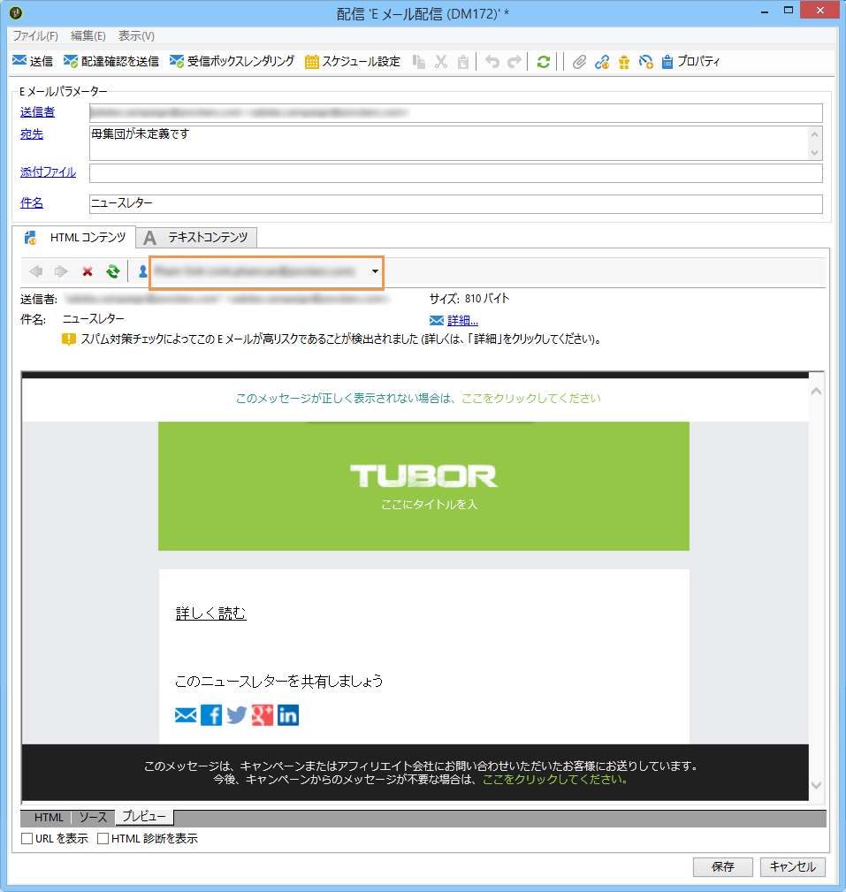</ph></source>
<target xml:lang="en-XX"><ph id="1" ctype="x-IMAGE"></ph></target>
</trans-unit>
<trans-unit id="tu42" xml:space="preserve">
<source xml:lang="en-US">Confirm that the block contents are displayed properly.</source>
<target xml:lang="en-XX">ブロックコンテンツが適切に表示されていることを確認します。</target>
</trans-unit>
<trans-unit id="tu43" xml:space="preserve">
<source xml:lang="en-US">Out-of-the-box personalization blocks</source>
<target xml:lang="en-XX">標準パーソナライゼーションブロック</target>
</trans-unit>
<trans-unit id="tu44" xml:space="preserve">
<source xml:lang="en-US">A list of personalization blocks is available by default to help you personalize the content of your message.</source>
<target xml:lang="en-XX">デフォルトでは、メッセージコンテンツのパーソナライゼーションに役立つパーソナライゼーションブロックのリストが使用可能になっています。</target>
</trans-unit>
<trans-unit id="tu45" xml:space="preserve">
<source xml:lang="en-US"><ph id="1" ctype="x-regxph" equiv-text="[!NOTE">[!NOTE]</ph></source>
<target xml:lang="en-XX"><ph id="1" ctype="x-regxph" equiv-text="[!NOTE">[!NOTE]</ph></target>
</trans-unit>
<trans-unit id="tu46" xml:space="preserve">
<source xml:lang="en-US">The list of personalization blocks depends on the modules and options which have been installed on your instance.</source>
<target xml:lang="en-XX">パーソナライゼーションブロックのリストは、お使いのインスタンスにインストールされているモジュールやオプションによって異なります。</target>
</trans-unit>
<trans-unit id="tu47" xml:space="preserve">
<source xml:lang="en-US"><ph id="1" ctype="x-IMAGE">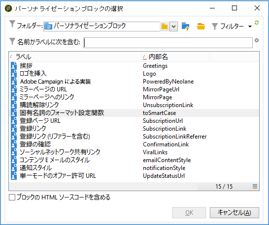</ph></source>
<target xml:lang="en-XX"><ph id="1" ctype="x-IMAGE"></ph></target>
</trans-unit>
<trans-unit id="tu48" xml:space="preserve">
<source xml:lang="en-US"><ph id="1" ctype="x-STRONG_EMPHASIS">**[!UICONTROL </ph>Greetings<ph id="3" ctype="x-LINK_REF">]**</ph> : inserts greetings with the recipient's name. Example: "Hello John Doe,".</source>
<target xml:lang="en-XX"><ph id="1" ctype="x-STRONG_EMPHASIS">**[!UICONTROL </ph>挨拶<ph id="3" ctype="x-LINK_REF">]**</ph>：受信者の名前と共に挨拶文を挿入します。 例：「こんにちは、John Doe。」</target>
</trans-unit>
<trans-unit id="tu49" xml:space="preserve">
<source xml:lang="en-US"><ph id="1" ctype="x-STRONG_EMPHASIS">**[!UICONTROL </ph>Insert logo<ph id="3" ctype="x-LINK_REF">]**</ph> : inserts an out-of-the-box logo that has been defined when configuring the instance.</source>
<target xml:lang="en-XX"><ph id="1" ctype="x-STRONG_EMPHASIS">**[!UICONTROL </ph>ロゴを挿入<ph id="3" ctype="x-LINK_REF">]**</ph>：インスタンスの設定時に定義された標準のロゴを挿入します。</target>
</trans-unit>
<trans-unit id="tu50" xml:space="preserve">
<source xml:lang="en-US"><ph id="1" ctype="x-STRONG_EMPHASIS">**[!UICONTROL </ph>Powered by Adobe Campaign<ph id="3" ctype="x-LINK_REF">]**</ph> : inserts the "Powered by Adobe Campaign" logo.</source>
<target xml:lang="en-XX"><ph id="1" ctype="x-STRONG_EMPHASIS">**[!UICONTROL </ph>Powered by Adobe Campaign<ph id="3" ctype="x-LINK_REF">]**</ph>：「Powered by Adobe Campaign」ロゴを挿入します。</target>
</trans-unit>
<trans-unit id="tu51" xml:space="preserve">
<source xml:lang="en-US"><ph id="1" ctype="x-STRONG_EMPHASIS">**[!UICONTROL </ph>Mirror page URL<ph id="3" ctype="x-LINK_REF">]**</ph> : inserts the mirror page URL, enabling Delivery Designers to check the link.</source>
<target xml:lang="en-XX"><ph id="1" ctype="x-STRONG_EMPHASIS">**[!UICONTROL </ph>ミラーページの URL<ph id="3" ctype="x-LINK_REF">]**</ph>：ミラーページの URL を挿入し、配信 designer がリンクを確認できるようにします。</target>
</trans-unit>
<trans-unit id="tu52" xml:space="preserve">
<source xml:lang="en-US"><ph id="1" ctype="x-regxph" equiv-text="[!NOTE">[!NOTE]</ph></source>
<target xml:lang="en-XX"><ph id="1" ctype="x-regxph" equiv-text="[!NOTE">[!NOTE]</ph></target>
</trans-unit>
<trans-unit id="tu53" xml:space="preserve">
<source xml:lang="en-US">For more on the mirror page generation, refer to <ph id="1" ctype="x-LINK">[</ph>Generate the mirror page<ph id="2" ctype="x-LINK">](sending-messages.md#generating-the-mirror-page)</ph>.</source>
<target xml:lang="en-XX">ミラーページの生成について詳しくは、<ph id="1" ctype="x-LINK">[</ph>ミラーページの生成<ph id="2" ctype="x-LINK">](sending-messages.md#generating-the-mirror-page)</ph>を参照してください。</target>
</trans-unit>
<trans-unit id="tu54" xml:space="preserve">
<source xml:lang="en-US"><ph id="1" ctype="x-STRONG_EMPHASIS">**[!UICONTROL </ph>Link to mirror page<ph id="3" ctype="x-LINK_REF">]**</ph> : inserts a link to the mirror page: "If you are unable to view this message correctly, click here".</source>
<target xml:lang="en-XX"><ph id="1" ctype="x-STRONG_EMPHASIS">**[!UICONTROL </ph>ミラーページへのリンク<ph id="3" ctype="x-LINK_REF">]**</ph>：ミラーページへのリンク「このメッセージが正しく表示されない場合は、ここをクリックしてください」を挿入します。</target>
</trans-unit>
<trans-unit id="tu55" xml:space="preserve">
<source xml:lang="en-US"><ph id="1" ctype="x-STRONG_EMPHASIS">**[!UICONTROL </ph>Unsubscription link<ph id="3" ctype="x-LINK_REF">]**</ph> : inserts a link enabling to unsubscribe from all deliveries (denylist).</source>
<target xml:lang="en-XX"><ph id="1" ctype="x-STRONG_EMPHASIS">**[!UICONTROL </ph>購読解除リンク<ph id="3" ctype="x-LINK_REF">]**</ph>：すべての配信を購読解除（ブロックリスト登録）できるリンクを挿入します。</target>
</trans-unit>
<trans-unit id="tu56" xml:space="preserve">
<source xml:lang="en-US"><ph id="1" ctype="x-STRONG_EMPHASIS">**[!UICONTROL </ph>Formatting function for proper nouns<ph id="3" ctype="x-LINK_REF">]**</ph> : generates the <ph id="5" ctype="x-STRONG_EMPHASIS">**[!UICONTROL </ph>toSmartCase<ph id="7" ctype="x-LINK_REF">]**</ph> Javascript function, which changes the first letter of each word to uppercase.</source>
<target xml:lang="en-XX"><ph id="1" ctype="x-STRONG_EMPHASIS">**[!UICONTROL </ph>固有名詞の書式設定関数<ph id="3" ctype="x-LINK_REF">]**</ph>：JavaScript の <ph id="5" ctype="x-STRONG_EMPHASIS">**[!UICONTROL </ph>toSmartCase<ph id="7" ctype="x-LINK_REF">]**</ph> 関数を生成します。この関数は各単語の最初の文字を大文字に変更します。</target>
</trans-unit>
<trans-unit id="tu57" xml:space="preserve">
<source xml:lang="en-US"><ph id="1" ctype="x-STRONG_EMPHASIS">**[!UICONTROL </ph>Registration page URL<ph id="3" ctype="x-LINK_REF">]**</ph> : inserts a subscription URL (see <ph id="5" ctype="x-LINK">[</ph>About services and subscriptions<ph id="6" ctype="x-LINK">](about-services-and-subscriptions.md)</ph>).</source>
<target xml:lang="en-XX"><ph id="1" ctype="x-STRONG_EMPHASIS">**[!UICONTROL </ph>登録ページ URL<ph id="3" ctype="x-LINK_REF">]**</ph>：購読 URL を挿入します（<ph id="5" ctype="x-LINK">[</ph>サービスと購読について<ph id="6" ctype="x-LINK">](about-services-and-subscriptions.md)</ph>を参照）。</target>
</trans-unit>
<trans-unit id="tu58" xml:space="preserve">
<source xml:lang="en-US"><ph id="1" ctype="x-STRONG_EMPHASIS">**[!UICONTROL </ph>Registration link<ph id="3" ctype="x-LINK_REF">]**</ph> : inserts a subscription link. that has been defined when configuring the instance.</source>
<target xml:lang="en-XX"><ph id="1" ctype="x-STRONG_EMPHASIS">**[!UICONTROL </ph>登録リンク<ph id="3" ctype="x-LINK_REF">]**</ph>：購読リンクを挿入します。 これは、インスタンスの設定時に定義されたものです。</target>
</trans-unit>
<trans-unit id="tu59" xml:space="preserve">
<source xml:lang="en-US"><ph id="1" ctype="x-STRONG_EMPHASIS">**[!UICONTROL </ph>Registration link (with referrer)<ph id="3" ctype="x-LINK_REF">]**</ph> : inserts a subscription link, enabling to identify the visitor and delivery. The link has been defined when configuring the instance.</source>
<target xml:lang="en-XX"><ph id="1" ctype="x-STRONG_EMPHASIS">**[!UICONTROL </ph>登録リンク（リファラーを含む）<ph id="3" ctype="x-LINK_REF">]**</ph>：購読リンクを挿入し、訪問者と配信を識別できるようにします。 このリンクは、インスタンスの設定時に定義されたものです。</target>
</trans-unit>
<trans-unit id="tu60" xml:space="preserve">
<source xml:lang="en-US"><ph id="1" ctype="x-regxph" equiv-text="[!NOTE">[!NOTE]</ph></source>
<target xml:lang="en-XX"><ph id="1" ctype="x-regxph" equiv-text="[!NOTE">[!NOTE]</ph></target>
</trans-unit>
<trans-unit id="tu61" xml:space="preserve">
<source xml:lang="en-US">This block can be used in deliveries targeting visitors only.</source>
<target xml:lang="en-XX">このブロックは、訪問者をターゲティングする配信でのみ使用できます。</target>
</trans-unit>
<trans-unit id="tu62" xml:space="preserve">
<source xml:lang="en-US"><ph id="1" ctype="x-STRONG_EMPHASIS">**[!UICONTROL </ph>Registration confirmation<ph id="3" ctype="x-LINK_REF">]**</ph> : inserts a link enabling to confirm subscription.</source>
<target xml:lang="en-XX"><ph id="1" ctype="x-STRONG_EMPHASIS">**[!UICONTROL </ph>登録の確認<ph id="3" ctype="x-LINK_REF">]**</ph>：購読を確認できるリンクを挿入します。</target>
</trans-unit>
<trans-unit id="tu63" xml:space="preserve">
<source xml:lang="en-US"><ph id="1" ctype="x-STRONG_EMPHASIS">**[!UICONTROL </ph>Social network sharing links<ph id="3" ctype="x-LINK_REF">]**</ph> : inserts buttons that enable the recipient to share a link to the mirror page content with the email client, Facebook, X (formerly known as Twitter), and LinkedIn (see <ph id="5" ctype="x-LINK">[</ph>Viral marketing: forward to a friend<ph id="6" ctype="x-LINK">](viral-and-social-marketing.md#viral-marketing--forward-to-a-friend)</ph>).</source>
<target xml:lang="en-XX"><ph id="1" ctype="x-STRONG_EMPHASIS">**[!UICONTROL </ph>ソーシャルネットワーク共有リンク<ph id="3" ctype="x-LINK_REF">]**</ph>：メールクライアント、Facebook、X（旧 Twitter）および LinkedIn によってミラーページコンテンツへのリンクを受信者が共有できるボタンを挿入します（<ph id="5" ctype="x-LINK">[</ph>バイラルマーケティング：友人への転送<ph id="6" ctype="x-LINK">](viral-and-social-marketing.md#viral-marketing--forward-to-a-friend)</ph>を参照）。</target>
</trans-unit>
<trans-unit id="tu64" xml:space="preserve">
<source xml:lang="en-US"><ph id="1" ctype="x-STRONG_EMPHASIS">**[!UICONTROL </ph>Style of content emails<ph id="3" ctype="x-LINK_REF">]**</ph> and <ph id="5" ctype="x-STRONG_EMPHASIS">**[!UICONTROL </ph>Notification style<ph id="7" ctype="x-LINK_REF">]**</ph> : generate code that format an email with predefined HTML styles. These blocks must be inserted in the source code of the delivery, in the <ph id="9" ctype="x-STRONG_EMPHASIS">**[!UICONTROL </ph>...<ph id="11" ctype="x-LINK_REF">]**</ph> section, into <ph id="13" ctype="x-STRONG_EMPHASIS">**`&lt;style>...&lt;/style>`**</ph> tags.</source>
<target xml:lang="en-XX"><ph id="1" ctype="x-STRONG_EMPHASIS">**[!UICONTROL </ph>コンテンツメールのスタイル<ph id="3" ctype="x-LINK_REF">]**</ph>および<ph id="5" ctype="x-STRONG_EMPHASIS">**[!UICONTROL </ph>通知スタイル<ph id="7" ctype="x-LINK_REF">]**</ph>：定義済みの HTML スタイルでメールを書式設定するコードを生成します。 これらのブロックは、配信のソースコードの <ph id="9" ctype="x-STRONG_EMPHASIS">**[!UICONTROL </ph>...<ph id="11" ctype="x-LINK_REF">]**</ph> セクションにある <ph id="13" ctype="x-STRONG_EMPHASIS">**`&lt;style>...&lt;/style>`**</ph> タグの間に挿入する必要があります。</target>
</trans-unit>
<trans-unit id="tu65" xml:space="preserve">
<source xml:lang="en-US"><ph id="1" ctype="x-STRONG_EMPHASIS">**[!UICONTROL </ph>Offer acceptance URL in unitary mode<ph id="3" ctype="x-LINK_REF">]**</ph> : inserts an URL enabling to set an Interaction offer to <ph id="5" ctype="x-STRONG_EMPHASIS">**[!UICONTROL </ph>Accepted<ph id="7" ctype="x-LINK_REF">]**</ph> (see <ph id="9" ctype="x-LINK">[</ph>this section<ph id="10" ctype="x-LINK">](../../interaction/using/offer-analysis-report.md)</ph>).</source>
<target xml:lang="en-XX"><ph id="1" ctype="x-STRONG_EMPHASIS">**[!UICONTROL </ph>単一モードのオファー承認 URL<ph id="3" ctype="x-LINK_REF">]**</ph>：インタラクションオファーを<ph id="5" ctype="x-STRONG_EMPHASIS">**[!UICONTROL </ph>許可済み<ph id="7" ctype="x-LINK_REF">]**</ph>に設定できる URL を挿入します（<ph id="9" ctype="x-LINK">[</ph>この節<ph id="10" ctype="x-LINK">](../../interaction/using/offer-analysis-report.md)</ph>を参照）。</target>
</trans-unit>
<trans-unit id="tu66" xml:space="preserve">
<source xml:lang="en-US">Define custom personalization blocks</source>
<target xml:lang="en-XX">カスタムパーソナライゼーションブロックの定義</target>
</trans-unit>
<trans-unit id="tu67" xml:space="preserve">
<source xml:lang="en-US"><ph id="1" ctype="x-regxph" equiv-text="[!IMPORTANT">[!IMPORTANT]</ph></source>
<target xml:lang="en-XX"><ph id="1" ctype="x-regxph" equiv-text="[!IMPORTANT">[!IMPORTANT]</ph></target>
</trans-unit>
<trans-unit id="tu68" xml:space="preserve">
<source xml:lang="en-US">Release 7.4.4 (build 9401) includes an update to the external URL allow list. If a custom personalization block references an external URL (for example, an externally-hosted image), make sure that domain is added to your instance's approved allow list so that the resource continues to load without interruption. As a Campaign Administrator, use the Control Panel to add and manage allow-listed URLs. See <ph id="1" ctype="x-LINK">[</ph>Add URL permissions<ph id="2" ctype="x-LINK">[#$tu69]{target="_blank"}</ph> for steps.</source>
<target xml:lang="en-XX">リリース 7.4.4（ビルド 9401）には、外部 URL 許可リストのアップデートが含まれています。リソースが中断することなく継続して読み込まれるよう、カスタムパーソナライゼーションブロックが外部 URL（例：外部ホスト画像）を参照する場合は、ドメインがインスタンスの承認済み許可リストに追加されていることを確認してください。Campaign 管理者として、コントロールパネルを使用して、許可リスト登録済み URL を追加および管理してください。手順について詳しくは、<ph id="1" ctype="x-LINK">[</ph>URL 権限の追加<ph id="2" ctype="x-LINK">[#$tu69]{target="_blank"}</ph>を参照してください。</target>
</trans-unit>
<trans-unit id="tu70" xml:space="preserve">
<source xml:lang="en-US">You can define new personalization fields to be inserted from the personalized field icon via the <ph id="1" ctype="x-STRONG_EMPHASIS">**[!UICONTROL </ph>Include...<ph id="3" ctype="x-LINK_REF">]**</ph> menu. These fields are defined in personalization blocks.</source>
<target xml:lang="en-XX"><ph id="1" ctype="x-STRONG_EMPHASIS">**[!UICONTROL </ph>含める<ph id="3" ctype="x-LINK_REF">]**</ph>メニューのパーソナライゼーションフィールドアイコンを使用すると、挿入する新しいパーソナライゼーションフィールドを定義できます。 それらのフィールドは、パーソナライゼーションブロック内に定義されます。</target>
</trans-unit>
<trans-unit id="tu71" xml:space="preserve">
<source xml:lang="en-US">To create a personalization block, go to the explorer and apply the following steps:</source>
<target xml:lang="en-XX">パーソナライゼーションブロックを作成するには、エクスプローラーを開き、次の手順に従います。</target>
</trans-unit>
<trans-unit id="tu72" xml:space="preserve">
<source xml:lang="en-US">Click the <ph id="1" ctype="x-STRONG_EMPHASIS">**[!UICONTROL </ph>Resources > Campaign Management > Personalization blocks<ph id="3" ctype="x-LINK_REF">]**</ph> node.</source>
<target xml:lang="en-XX"><ph id="1" ctype="x-STRONG_EMPHASIS">**[!UICONTROL </ph>リソース／キャンペーン管理／パーソナライゼーションブロック<ph id="3" ctype="x-LINK_REF">]**</ph>ノードをクリックします。</target>
</trans-unit>
<trans-unit id="tu73" xml:space="preserve">
<source xml:lang="en-US">Right-click the list of blocks and select <ph id="1" ctype="x-STRONG_EMPHASIS">**[!UICONTROL </ph>New<ph id="3" ctype="x-LINK_REF">]**</ph> .</source>
<target xml:lang="en-XX">ブロックのリストを右クリックし、「<ph id="1" ctype="x-STRONG_EMPHASIS">**[!UICONTROL </ph>新規<ph id="3" ctype="x-LINK_REF">]**</ph>」を選択します。</target>
</trans-unit>
<trans-unit id="tu74" xml:space="preserve">
<source xml:lang="en-US">Fill in the settings of the personalization block:</source>
<target xml:lang="en-XX">次のように、パーソナライゼーションブロックの設定に入力します。</target>
</trans-unit>
<trans-unit id="tu75" xml:space="preserve">
<source xml:lang="en-US"><ph id="1" ctype="x-IMAGE">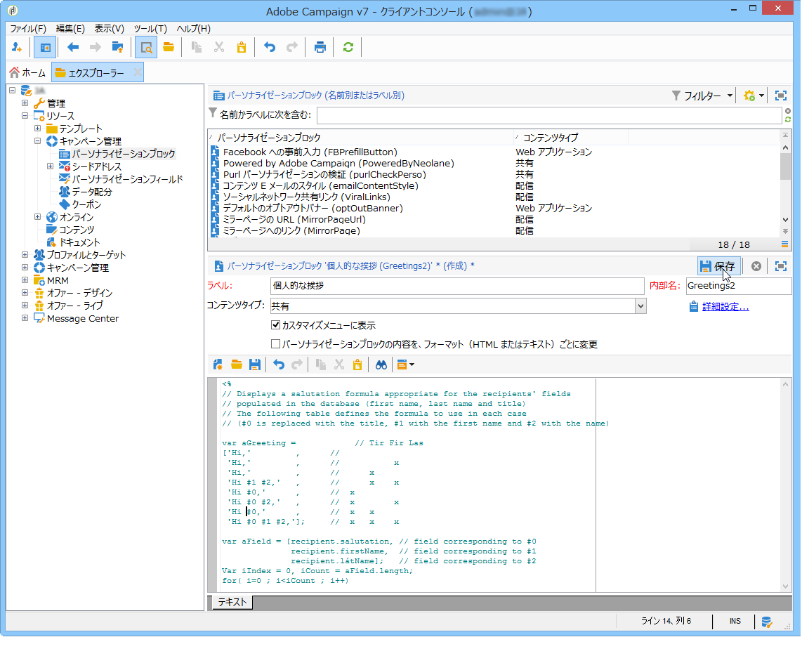</ph></source>
<target xml:lang="en-XX"><ph id="1" ctype="x-IMAGE"></ph></target>
</trans-unit>
<trans-unit id="tu76" xml:space="preserve">
<source xml:lang="en-US">Enter the label of the block. This label will be displayed in the personalization field insertion window.</source>
<target xml:lang="en-XX">ブロックのラベルを入力します。 このラベルは、パーソナライゼーションフィールドの挿入ウィンドウに表示されます。</target>
</trans-unit>
<trans-unit id="tu77" xml:space="preserve">
<source xml:lang="en-US">Select <ph id="1" ctype="x-STRONG_EMPHASIS">**[!UICONTROL </ph>Visible in the customization menus<ph id="3" ctype="x-LINK_REF">]**</ph> to make this block accessible from the personalization field insertion icon.</source>
<target xml:lang="en-XX">このブロックに、パーソナライゼーションフィールドの挿入アイコンからアクセスできるよう、「<ph id="1" ctype="x-STRONG_EMPHASIS">**[!UICONTROL </ph>カスタマイズメニューに表示<ph id="3" ctype="x-LINK_REF">]**</ph>」を選択します。</target>
</trans-unit>
<trans-unit id="tu78" xml:space="preserve">
<source xml:lang="en-US">If necessary, select <ph id="1" ctype="x-STRONG_EMPHASIS">**[!UICONTROL </ph>The content of the personalization block depends upon the format<ph id="3" ctype="x-LINK_REF">]**</ph> to define two separate blocks for emails in HTML format and those in text format.</source>
<target xml:lang="en-XX">必要な場合は、「<ph id="1" ctype="x-STRONG_EMPHASIS">**[!UICONTROL </ph>パーソナライゼーションブロックの内容を、フォーマット（HTML またはテキスト）ごとに変更<ph id="3" ctype="x-LINK_REF">]**</ph>」を選択し、HTML メールとテキストメールの 2 つの個別のブロックを定義します。</target>
</trans-unit>
<trans-unit id="tu79" xml:space="preserve">
<source xml:lang="en-US">Two tabs are then displayed in the lower section of this editor (HTML content and Text content) to define the corresponding contents.</source>
<target xml:lang="en-XX">このエディターの下部のセクションに、HTML コンテンツとテキストコンテンツを定義するためのタブが合わせて 2 つ表示されます。</target>
</trans-unit>
<trans-unit id="tu80" xml:space="preserve">
<source xml:lang="en-US"><ph id="1" ctype="x-IMAGE">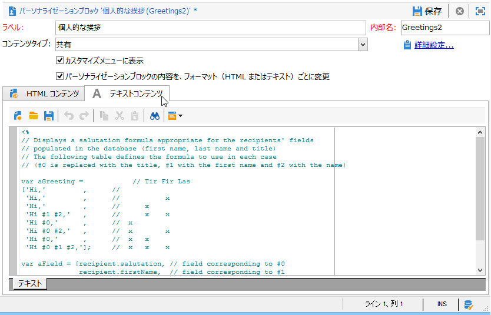</ph></source>
<target xml:lang="en-XX"><ph id="1" ctype="x-IMAGE"></ph></target>
</trans-unit>
<trans-unit id="tu81" xml:space="preserve">
<source xml:lang="en-US">Enter the content (in HTML, text, JavaScript, etc.) of the personalization block(s) and click <ph id="1" ctype="x-STRONG_EMPHASIS">**[!UICONTROL </ph>Save<ph id="3" ctype="x-LINK_REF">]**</ph>.</source>
<target xml:lang="en-XX">パーソナライゼーションブロックのコンテンツ（HTML、テキスト、JavaScript など）を入力し、 「<ph id="1" ctype="x-STRONG_EMPHASIS">**[!UICONTROL </ph>保存<ph id="3" ctype="x-LINK_REF">]**</ph>」をクリックします。</target>
</trans-unit>
<trans-unit id="tu82" xml:space="preserve">
<source xml:lang="en-US">Tutorial video</source>
<target xml:lang="en-XX">チュートリアルビデオ</target>
</trans-unit>
<trans-unit id="tu83" xml:space="preserve">
<source xml:lang="en-US">Learn how to create dynamic content blocks and how to use them to personalize the content of your email delivery.</source>
<target xml:lang="en-XX">動的コンテンツブロックを作成する方法、および動的コンテンツブロックを使用してメール配信のコンテンツをパーソナライズする方法について説明します。</target>
</trans-unit>
<trans-unit id="tu84" xml:space="preserve">
<source xml:lang="en-US"><ph id="1" ctype="x-regxph" equiv-text="[!VIDEO">[!VIDEO](https://video.tv.adobe.com/v/24924?quality=12)</ph></source>
<target xml:lang="en-XX"><ph id="1" ctype="x-regxph" equiv-text="[!VIDEO">[!VIDEO](https://video.tv.adobe.com/v/24924?quality=12)</ph></target>
</trans-unit>
<trans-unit id="tu85" xml:space="preserve">
<source xml:lang="en-US">Additional Campaign Classic how-to videos are available <ph id="1" ctype="x-LINK">[</ph>here<ph id="2" ctype="x-LINK">[#$tu86]</ph>.</source>
<target xml:lang="en-XX">Campaign Classic に関するその他のハウツービデオは<ph id="1" ctype="x-LINK">[</ph>こちら<ph id="2" ctype="x-LINK">[#$tu86]</ph>で参照できます。</target>
</trans-unit>
</body>
</file>
</xliff>