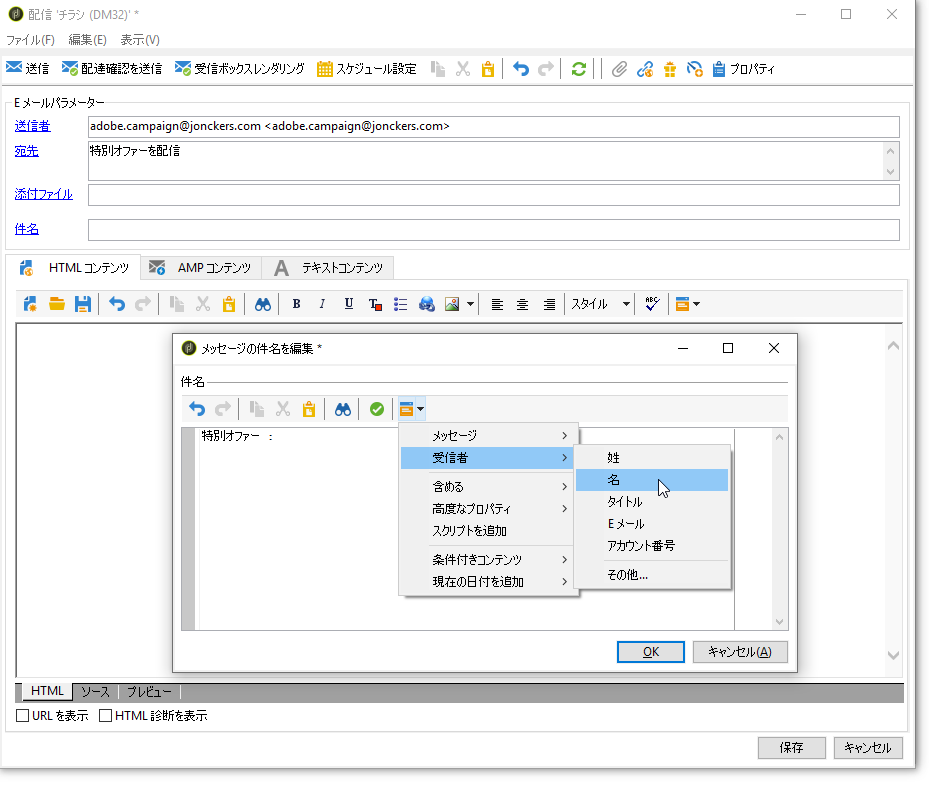
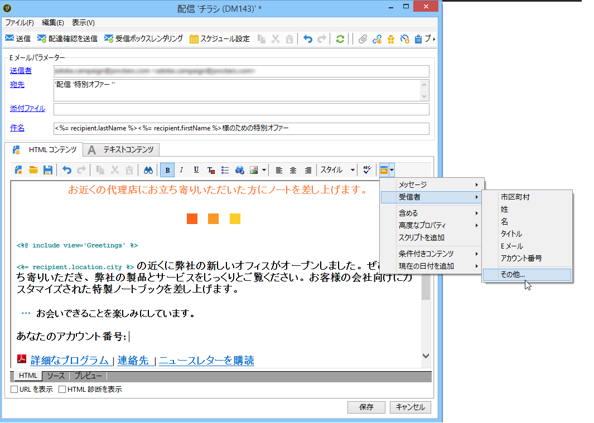
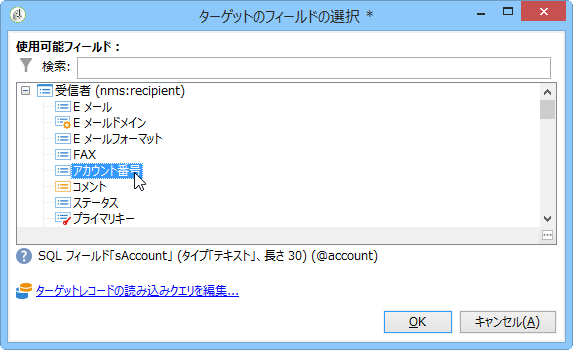
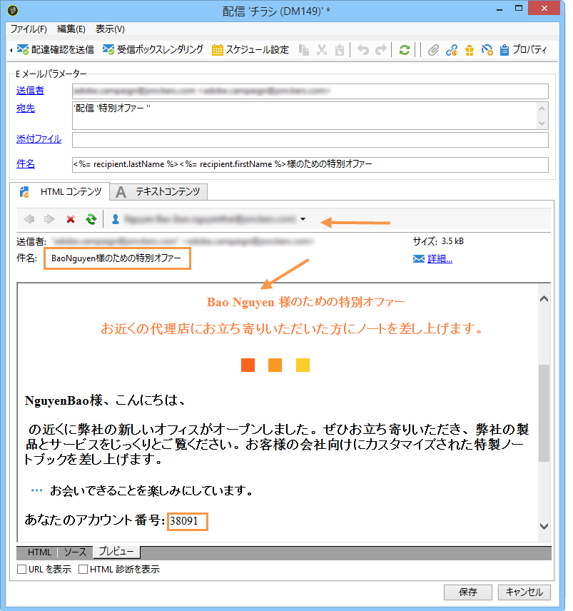
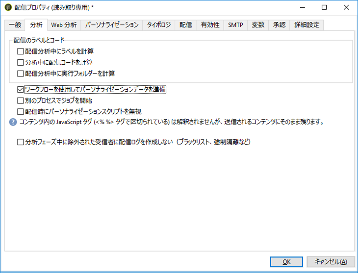
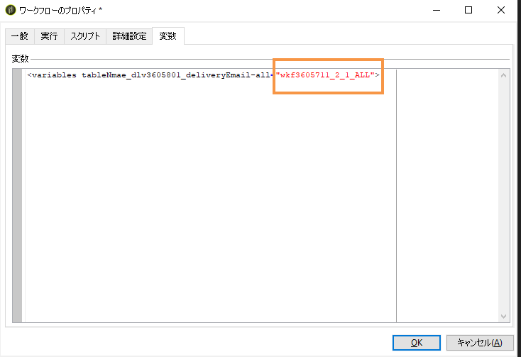
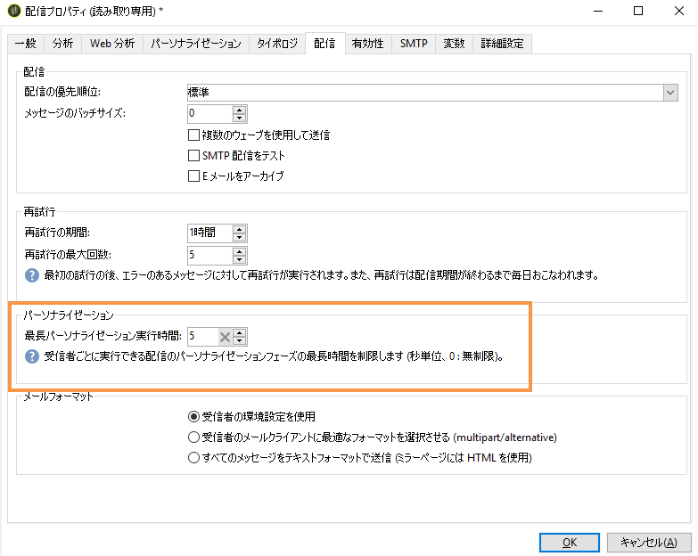

# パーソナライゼーションフィールド{#personalization-fields}

パーソナライゼーションフィールドは、配信されるメッセージのコンテンツをパーソナライズする第 1 レベルの手段として使用されます。メインコンテンツに挿入したフィールドが、選択したデータソースからのデータが配置される場所を示します。

例えば、**&lt;%= recipient.LastName %>** という構文のパーソナライゼーションフィールドは、データベース（受信者テーブル）に受信者の名前を挿入するための指示です。

>[!NOTE]
>
>パーソナライゼーションフィールドのコンテンツは1024文字を超えることはできません。

## データソース {#data-sources}

パーソナライゼーションフィールドに入る値のデータソースには次の 2 種類があり、どちらが使用されるかは選択した配信モードによります。

* Adobe Campaign データベース：多くの場合はこちらが該当します。例えば「受信者のパーソナライゼーションフィールド」は、受信者テーブルに定義されているすべてのフィールドです。標準フィールド（通常の場合、姓、名、住所、市区町村、生年月日など）やユーザー定義フィールドが含まれます。
* 外部ファイル：外部ファイルのデータを使用した配信の際に、入力データ用ファイルの列に定義されている全フィールドが該当します。

>[!NOTE]
>
>Adobe Campaign のパーソナライゼーションタグは、常に **&lt;%=table.field%>** の形を取ります。

## パーソナライゼーションフィールドの挿入 {#inserting-a-personalization-field}

パーソナライゼーションフィールドを挿入するには、目的に応じたヘッダー、件名、メッセージ本文の編集フィールドからアクセスできるドロップダウンアイコンをクリックします。

挿入は、データソース（受信者フィールドまたはファイルフィールド）を選択した後にコマンドを挿入する形でおこなわれます。それらのコマンドが Adobe Campaign によって解釈され、各受信者に関するフィールドの値に置換されます。The physical replacement can then be viewed in the **[!UICONTROL Preview]** tab.

## パーソナライゼーションフィールドの例 {#personalization-fields-example}

E メールを作成するとします。まず受信者の名前を挿入し、続いて、メッセージ本文にプロファイルの作成日を挿入することにします。手順は次のとおりです。

1. 新しい配信を作成するか、E メールタイプの既存の配信を開きます。
1. In the delivery wizard, click **[!UICONTROL Subject]** to edit the subject of the message and enter a subject.
1. 「**[!UICONTROL Special offer for]**」 」と入力し、ツールバーのボタンを使用してパーソナライゼーションフィールドを挿入します。選択 **[!UICONTROL Recipients>Title]**.

   

1. 受信者の名前を挿入する操作を繰り返します。各パーソナライゼーションフィールド間にはスペースを挿入します。
1. Click **[!UICONTROL OK]** to validate.
1. メッセージ本文にパーソナライゼーションを挿入します。そのためには、メッセージコンテンツをクリックし、フィールド挿入ボタンをクリックします。
1. 選択 **[!UICONTROL Recipient>Other...]**.

   

1. 表示する情報を含んだフィールドを選択し、「**[!UICONTROL OK]**」をクリックします。

   

1. Click the **[!UICONTROL Preview]** tab to view the personalization result. 受信者に応じたメッセージを確認するには、受信者を選択する必要があります。

   

   >[!NOTE]
   >
   >この配信がワークフローの構成要素である場合は、一時的なワークフローテーブルから取得したデータを使用できます。This data is grouped in the **[!UICONTROL Target extension]** menu. 詳しくは、[この節](../../workflow/using/executing-a-workflow.md#target-data)を参照してください。

## パーソナライゼーションの最適化 {#optimizing-personalization}

次の専用オプションを使用して、パーソナライゼーションを最適化できます。配信プ **[!UICONTROL Prepare the personalization data with a workflow]**&#x200B;ロパティのタ **[!UICONTROL Analysis]** ブで使用できます。

このオプションを選択すると、配信の分析時に、一時テーブル内のターゲットにリンクするすべてのデータ（FDA にリンクするテーブルのデータなど）を保存するワークフローが自動的に作成、実行されます。

このオプションをオンにすることで、パーソナライゼーションのパフォーマンスを大幅に向上できます。

例えば、コンテンツに多数のパーソナライゼーションフィールドやパーソナライゼーションブロックが使用されているメッセージを多数の受信者に配信するときにパフォーマンスの問題が発生した場合、このオプションを使用すると、パーソナライゼーションの処理が高速化され、その結果メッセージの配信が高速化されます。

このオプションを使用するには、以下の手順に従います。

1. キャンペーンを作成します。詳しくは、[この節](../../campaign/using/setting-up-marketing-campaigns.md#creating-a-campaign)を参照してください。
1. In the **[!UICONTROL Targeting and workflows]** tab of your campaign, add a **Query** activity to your workflow. このアクティビティの使用について詳しくは、[この節](../../workflow/using/query.md)を参照してください。
1. Add an **[!UICONTROL Email delivery]** activity to the workflow and open it. このアクティビティの使用について詳しくは、[この節](../../workflow/using/delivery.md)を参照してください。
1. のタブに移動 **[!UICONTROL Analysis]** し、オ **[!UICONTROL Delivery properties]** プションを選択し **[!UICONTROL Prepare the personalization data with a workflow]** ます。

   

1. 配信を設定し、ワークフローを開始して分析を開始します。

分析が完了すると、パーソナライゼーションデータは、分析中にオンザフライで作成された一時的なテクニカルワークフローを通じて一時テーブルに格納されます。

このワークフローは、Adobe Campaign インターフェイスには表示されません。これは、パーソナライゼーションデータを迅速に格納および処理するための単なる技術的な手段です。

Once the analysis is complete, go to the workflow **[!UICONTROL Properties]** and select the **[!UICONTROL Variables]** tab. 一時テーブルの名前が表示されます。この名前を使用して SQL 呼び出しをおこなって、一時テーブルに含まれている ID を表示することができます。

## タイムアウトパーソナライゼーション段階 {#timing-out-personalization}

配信保護を強化するには、パーソナライゼーション段階のタイムアウト期間を設定します。

のタブ **[!UICONTROL Delivery]** で、このオ **[!UICONTROL Delivery properties]**&#x200B;プションの最大値（秒）を選択し **[!UICONTROL Maximum personalization run time]** ます。

プレビュー中または送信中に、パーソナライゼーション段階がこのフィールドで設定した最大時間を超えると、プロセスはエラーメッセージで中止され、配信は失敗します。

デフォルト値は5秒です。

このオプションを0に設定した場合、パーソナライゼーション段階に時間制限はありません。