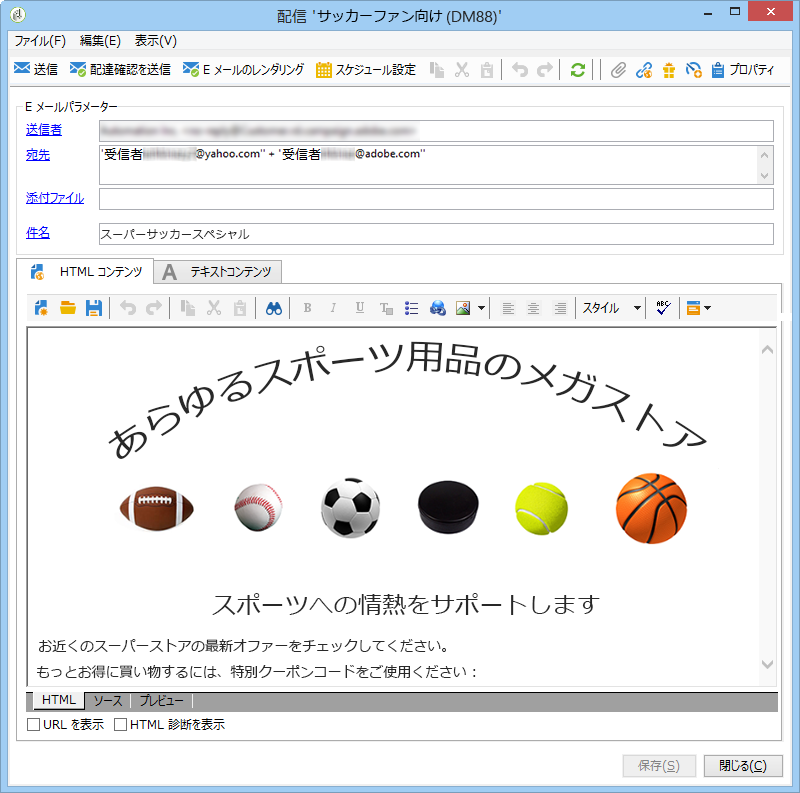

# パーソナライズされたクーポン{#personalized-coupons}

配信へのクーポンの追加は、受信者に対して、商品およびサービスの価値を高めます。Campaign クーポンモジュールを使用して、今後のマーケティングオファーに追加するためのクーポンのセットを作成できます。配信を作成する準備ができたら、適切なクーポンを割り当てます。クーポンは限定された期間のみ有効なので、割り当てたクーポンはその配信メッセージに一意にリンクされます。また、Campaign は、配信が送信される前に、メッセージ数に対して十分なクーポンがあることを確認します。

>[!NOTE]
>
>クーポン管理は、インストールが必要なパッケージです。クーポン管理を使用していることを確認するには、 **[!UICONTROL Administration > Configuration > Package management > Installed packages.]**
>
>クーポンデータは、CSV および XML フォーマットを使用してインポートおよびエクスポートできます。インポートとエクスポートについて詳しくは、[この節](../../platform/using/generic-imports-and-exports.md)を参照してください。

## クーポンの作成 {#creating-a-coupon}

クーポンモジュールには、次の 2 つのクーポン作成オプションがあります。

* **匿名**:選択した受信者または受信者のリストの汎用クーポンです。
* **個人**:選択した受信者向けにパーソナライズされたクーポン。

次の手順に従う前に、作成するクーポンのタイプについて確実に把握しておきます。

1. キャンペーンツリーで、に進みま **[!UICONTROL Resources > Campaign management > Coupons]**&#x200B;す。

   

1. ボタンをクリッ **[!UICONTROL New]** クします。
1. Enter the name of the coupon in **[!UICONTROL Label]** field. A unique code has been automatically entered in **[!UICONTROL Coupon code]**. コードをそのまま使用するか、新しいコードを入力することができます。

   

1. とを選 **[!UICONTROL Start date]** 択し **[!UICONTROL End date]** て、クーポンが有効な期間を設定します。
1. で、「 **[!UICONTROL Coupon type]**&#x200B;匿名」または「個人」を選択します。

   **[!UICONTROL Anonymous coupons]** :匿名クーポンは、すべての受信者に対して同じです。 **クーポンタイプ**&#x200B;メニューで「匿名」が選択されていることを確認し、「**保存**」をクリックして、クーポンを生成します。

   **[!UICONTROL Individual coupons]** :個々のクーポンは、追加のクーポンコードを使用してさらにパーソナライズできます。 例えば、スポーツ用品店でのセール用に個人クーポンを作成するとします。しかし、受信者のリストは長く、1 つの競技に対する情熱は人それぞれです。競技（例えば、サッカー、フットボール、野球など）に基づいて個人クーポンのコード名を追加して、各コードを適切な受信者に送信できます。

   1. 「個人」を選択すると、「クーポン」という新しいタブが左下に表示されます。タブに移動し、を **[!UICONTROL Coupons]** クリックしま **[!UICONTROL Add]**&#x200B;す。
   1. 入力を促すポップアップウィンドウが表示されたら、個人クーポンの一意のコードを入力します。
   1. Click **[!UICONTROL Save]** to generate the coupon.
   「クーポン」タブについて詳しくは、「個々のクーポンの設 [定」を参照してくださ](#configuring-individual-coupons)い。

   >[!NOTE]
   >
   >個人クーポンは、一括でインポートできます。インポートとエクスポートについて詳しくは、[この節](../../platform/using/generic-imports-and-exports.md)を参照してください。

### 個人クーポンの設定 {#configuring-individual-coupons}

「クーポン」タブは、個人クーポンでのみ使用できます。クーポンを配信に関連付けると、「クーポン」タブに次の詳細が表示されます。

* **[!UICONTROL Status]** :クーポンの利用可能性。
* **[!UICONTROL Redeemed on]** :クーポンが償還された日付です。
* **[!UICONTROL Channel]** :クーポンの送信に使用するチャネルです。
* **[!UICONTROL Address]** :受信者の電子メールアドレス。

、およ **[!UICONTROL status]**&#x200B;びの値 **[!UICONTROL channel]**&#x200B;は自動的 **[!UICONTROL address]** に完了します。 However, the values for **[!UICONTROL redeemed on]** are not recovered by Campaign. クーポン引き換えの詳細を含むファイルをインポートすることで、入力できます。

## クーポンの E メール配信への挿入 {#inserting-a-coupon-into-an-email-delivery}

次の例では、配信をホームページから作成します。配信の作成方法について詳しくは、[この節](../../delivery/using/about-email-channel.md)を参照してください。また、ワークフローの配信にクーポンを追加することもできます。

1. に移動し、を **[!UICONTROL Campaigns]** 選択しま **[!UICONTROL Deliveries]**&#x200B;す。
1. クリック **[!UICONTROL Create]**.

   

1. に名前を入力し、をク **[!UICONTROL Label]** リックしま **[!UICONTROL Continue]**&#x200B;す。
1. Click **[!UICONTROL To]** to add recipients.
1. Click **[!UICONTROL Add]** to choose recipients for the delivery. 受信者を選択したら、「**[!UICONTROL Ok]**」をクリックして配信に戻ります。

   

1. 件名を入力し、メッセージにコンテンツを追加します。

   

1. In the toolbar, click **[!UICONTROL Properties]** and choose the **[!UICONTROL Advanced]** tab.
1. のフォルダアイコンをクリックしま **[!UICONTROL Coupon management]**&#x200B;す。

   

1. クーポンを選択し、「**[!UICONTROL Ok]**」をクリックします。Click **[!UICONTROL Ok]** again.

   

1. メッセージをクリックして、クーポンを配置する場所を選択します。

   

1. パーソナライゼーションアイコンをクリックして、クーポンのタイプに基づいて次のどちらかを選択します。

   * Anonymous coupon: **[!UICONTROL Coupon > Coupon code]**

      

   * Individual coupon: **[!UICONTROL Coupon value > Coupon code]**

      

      クーポンは、割り当てた名前ではなくコードとしてメッセージに挿入されます。コードは、Campaign 標準データモデル内で使用されます。
   

1. テストを実行して、クーポンに割り当てた名前を確認します。タブに移動し、を **[!UICONTROL Preview]** クリックしま **[!UICONTROL Test personalization]**&#x200B;す。 テストする受信者を選択します。

   

   テストに続いて、コードではなく割り当てた名前でクーポンが表示されます。

   

1. In the toolbar, click **[!UICONTROL Send]** (upper left) and choose how you want to send the delivery.

   

1. クリック **[!UICONTROL Analyze]**. If the analysis log confirms that there are enough coupons for all recipients, click **[!UICONTROL Confirm delivery]** to send it.

   

>[!NOTE]
>
>For instructions on how to manage insufficient coupons for a delivery, see [Managing insufficient coupons](#managing-insufficient-coupons)

配信が成功したことを確認するには：

1. 移動 **[!UICONTROL Explorer > Resources > Campaign management > Coupons]**.
1. タブをクリック **[!UICONTROL Deliveries]** します。

   

   The status reads as **[!UICONTROL Finished]** for a successful delivery.

>[!NOTE]
>
>デフォルトでは、クーポン管理モジュールは、**nms:recipient** テーブルを使用します。他のテーブルの使用方法については、[スキーマの編集](../../configuration/using/data-schemas.md)を参照してください。

## 不十分なクーポンの管理 {#managing-insufficient-coupons}

メッセージよりもクーポンが少ない場合、配信分析が停止します。このような場合、より多くのクーポンをインポートするか、メッセージの数を制限することができます。メッセージの数を制限する場合は、次の手順に従います。

1. E メール配信ウィンドウに移動します。
1. クリック **[!UICONTROL To]**.
1. で、 **[!UICONTROL Select target]**&#x200B;タブに移動し **[!UICONTROL Exclusions]** ます。

   

1. In the exclusion settings section, click **[!UICONTROL Edit]**.
1. Enter the number of messages you want to send in **[!UICONTROL Limit delivery to...messages]** and click **[!UICONTROL Ok]**. 配信を送信できます。

   

>[!NOTE]
>
>限られた数のクーポンを管理する場合、配信ワークフローを使用すると、条件に基づいて配信を分割できます。これは、ターゲットを制限することなく、限定された母集団にクーポンを送信する場合に適したオプションです。
