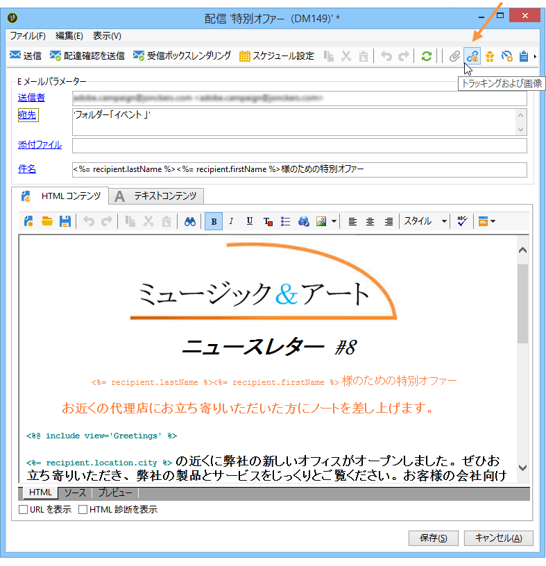
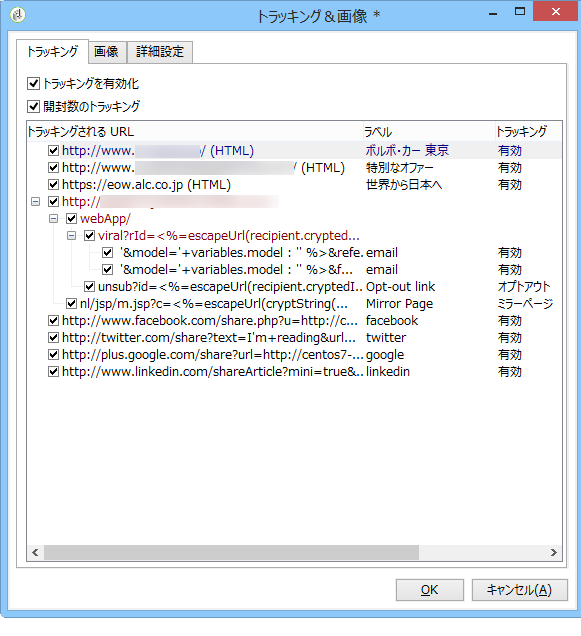
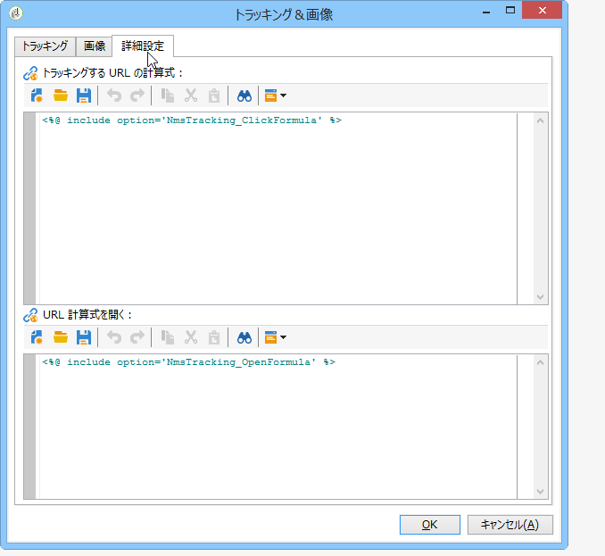

# パーソナライズされた URL のトラッキング{#personalizing-url-tracking}

Advanced message tracking settings are accessible via the **[!UICONTROL Tracking & Images]** icon in the toolbar of the delivery wizard.

>[!NOTE]
>
>E メール内の画像の管理もこのウィンドウで設定します。詳しくは、 [画像の追加を参照してくださ](../../delivery/using/defining-the-email-content.md#adding-images)い。

次のトラッキングオプションを設定できます。

* すべてのメッセージの URL トラッキングを有効化または無効化

   >[!CAUTION]
   >
   >配信で追跡が有効になっていない場合(つまり、オプションが選択さ **[!UICONTROL Activate tracking]** れていない場合)、追跡に関連するレポートおよびデータは使用できません。[開く]、[ホットクリックと追跡されたURL]の各レポートにはデータが表示されず、 **[!UICONTROL Tracking logs]** この配信に関するタブは表示されません。

* メッセージ開封のトラッキングを有効化または無効化

トラッキングする URL は、ツリー形式で中央のウィンドウに一覧表示されます。

メッセージの URL ごとに個別にトラッキングを有効化または無効化できます。詳しくは、[この節](../../delivery/using/how-to-configure-tracked-links.md)を参照してください。

The **[!UICONTROL Advanced]** tab lets you personalize the calculation formulas of the tracked URLs and the opening URL.

>[!CAUTION]
>
>このタブの設定を変更できるのは、上級ユーザーのみです。
