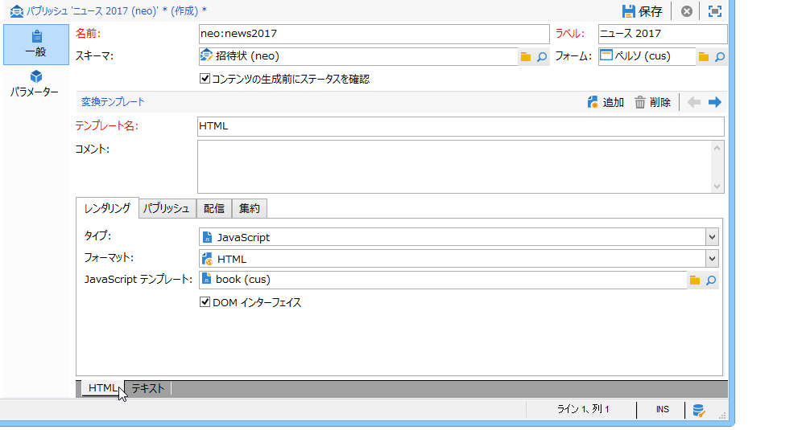
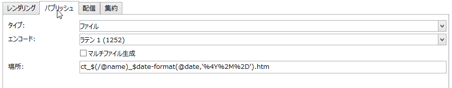
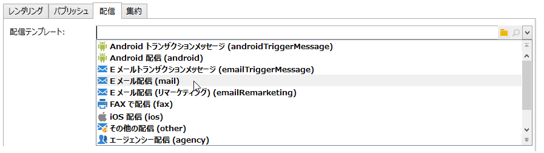
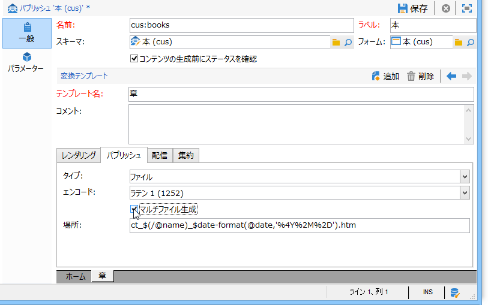

# パブリッシュテンプレート{#publication-templates}

## パブリッシュテンプレートについて {#about-publication-templates}

パブリッシュテンプレートは、パブリッシュするコンテンツの ID カードです。パブリッシュプロセスで使用する次のリソースを参照します。

* データスキーマ
* 入力フォーム
* 各出力ドキュメントの変換テンプレート

## パブリッシュテンプレートの識別 {#identification-of-a-publication-template}

パブリッシュテンプレートは、名前と名前空間で識別されます。

スタイルシートの識別キーは、コロンで分けられた名前空間と名前で構成される文字列です（例：**cus:newsletter**）。

>[!NOTE]
>
>実際には、スキーマ、フォーム、パブリッシュテンプレートに同じキーを使用することをお勧めします。

## パブリッシュテンプレートの作成と設定 {#creating-and-configuring-the-template}

パブリッシュテンプレートは、デフォルトでは&#x200B;**[!UICONTROL 管理／設定／パブリッシュテンプレート]**&#x200B;ノードに保存されます。新しいテンプレートを作成するには、テンプレートのリストの上の&#x200B;**[!UICONTROL 新規]**&#x200B;ボタンをクリックします。

パブリッシュテンプレートを設定するには、テンプレートの名前（名前と名前空間で構成される識別キー）、テンプレートのラベル、データスキーマ、テンプレートがリンクされる入力フォームを入力します。



>[!NOTE]
>
>ラベルは、このパブリッシュテンプレートをベースとしてコンテンツを作成する際には常に表示されます。

「**コンテンツの生成前にステータスを確認**」オプションを選択すると、ファイル生成の条件として、コンテンツインスタンスのステータスが「検証済み」になっているかを確認します。詳しくは、[パブリッシュ](#publication)を参照してください。

変換テンプレートは出力ドキュメントごとに追加する必要があります。変換テンプレートは必要な数だけ作成できます。

「**[!UICONTROL 名前]**」フィールドは、出力時のレンダリングのタイプを示す自由形式のラベルです。変換テンプレートごとに、タブのパブリッシュ設定を使用できます。

### レンダリング {#rendering}

「**[!UICONTROL レンダリング]**」タブで、次の設定をおこないます。

* 出力ドキュメントの予測に使用するレンダリングのタイプ：XSL スタイルシートまたは JavaScript テンプレート
* 出力ドキュメントのフォーマット：HTML、テキスト、XML または RTF
* 構成データ（使用するスタイルシートまたは JavaScript テンプレート）があるテンプレート

### パブリッシュ {#publication}

パブリッシュでは、選択したタイプが「**[!UICONTROL ファイル]**」の場合、ファイルの形式で出力ドキュメントを生成します。



次のパブリッシュオプションを使用できます。

* 出力ファイルのエンコーディング文字セットは、「**[!UICONTROL エンコード]**」フィールドで指定できます。デフォルトでは、ラテン 1 (1252) 文字セットが使用されます。
* 「**[!UICONTROL マルチファイル生成]**」オプションは、特別なドキュメントパブリッシュモードを有効化します。このオプションによって、出力ドキュメントの各ページの先頭にパーティションタグが入力されます。コンテンツを生成すると、入力されているパーティションタグごとにファイルが作成されます。このモードは、コンテンツブロックからミニサイトを生成するために使用します。詳しくは、[マルチファイル生成](#multi-file-generation)を参照してください。
* 「**[!UICONTROL 場所]**」フィールドには、出力ファイルの名前を入力します。ファイル名を自動生成するために、複数の変数で構成される名前にすることができます。

   変数は、**`$(<xpath>)` というフォーマットで入力します（`<xpath>` は、パブリッシュテンプレートデータスキーマのフィールドのパス）。

   ファイルの名前は、日付タイプのフィールドで構成することもできます。このフィールドを正しく書式設定するには、フィールドのパスと出力フォーマットをパラメーターとして、**$date-format** 関数を使用します。

   デフォルトでは、ファイル名の構成フォーマットに「@name」フィールドと「@date」フィールドの変数を使用します。

   ```
   ct_$(@name)_$date-format(@date,'%4Y%2M%2D').htm
   ```

   生成されたファイル名は、ct_news12_20110901.htm のようになります。

   >[!NOTE]
   >
   >コンテンツの生成について詳しくは、[コンテンツインスタンスの作成](../../delivery/using/using-a-content-template.md#creating-a-content-instance)を参照してください。

### 配信 {#delivery}

このタブでは、コンテンツ上で直接配信を開始するためのシナリオを選択できます。E メールのコンテンツは、出力フォーマット（HTML またはテキスト）に基づいて自動的に入力されます。



>[!NOTE]
>
>コンテンツに基づく配信作成の例については、[コンテンツインスタンスの配信](../../delivery/using/using-a-content-template.md#delivering-a-content-instance)を参照してください。

### 集約 {#aggregator}

スクリプトまたはクエリのリストからデータを集約し、コンテンツデータにより XML ドキュメントを高度なものにできます。その目的は、リンクが参照している特定の情報を補足したり、データベースから要素を追加したりすることです。

### マルチファイル生成 {#multi-file-generation}

マルチファイル生成を有効化するには、パブリッシュモデルで「**[!UICONTROL マルチファイル生成]**」オプションを選択します。このオプションによって、出力ドキュメントの各ページの先頭に対して、スタイルシート内にパーティションタグを指定できます。コンテンツを生成すると、パーティションタグが出現するたびにファイルが作成されます。

パーティションタグは、次のようにスタイルシート内に組み込まれます。

**`<xsl:comment> #nl:output_replace(<name_of_file>) </xsl:comment>`**（**`<name_of_file>`** は生成するページのファイル名）

**例：**「cus:book」スキーマを使用した複数ファイル生成。

原理は、複数の章をリストするメインページを生成し、外部ページに章の詳細を表示できるようにするということです。


対応するスタイルシート（「cus:book.xsl」）は次のようになります。

```
<?xml version="1.0" encoding="ISO-8859-1" ?>
<xsl:stylesheet xmlns:xsl="http://www.w3.org/1999/XSL/Transform" version="1.0">
  <xsl:output encoding="ISO-8859-1" method="html"/>

  <!-- Style sheet entry point -->
  <xsl:template match="/book">
    <html>
      <body>
        <h1><xsl:value-of select="@name"/></h1>
        <lu>
          <xsl:for-each select="chapter">
            <li><a target="_blank" href="chapter{@id}.htm"><xsl:value-of select="@name"/></a></li>  
          </xsl:for-each>
       </lu>
      </body>
    </html>
   </xsl:template>
</xsl:stylesheet>
```

章の詳細を生成するために、2 つ目のスタイルシート（「cus:chapter.xsl」）が必要です。

```
<?xml version="1.0" encoding="ISO-8859-1" ?>
<xsl:stylesheet xmlns:xsl="http://www.w3.org/1999/XSL/Transform" version="1.0">
  <xsl:output encoding="ISO-8859-1" method="html"/>

  <!-- Detail of a chapter -->
  <xsl:template match="chapter">
    <!-- Cut tag -->   
    <xsl:comment> #nl:output_replace($(path)/chapter<xsl:value-of select="@id"/>.htm)</xsl:comment>
    
    <html>
      <body>
        <h1><xsl:value-of select="@name"/></h1>
        <xsl:value-of select="page" disable-output-escaping="yes"/>
      </body>
    </html>
  </xsl:template>

  <!-- Style sheet entry point -->
  <xsl:template match="/book">
    <xsl:apply-templates/>
   </xsl:template>
</xsl:stylesheet>
```

生成するファイルに含めるページの先頭に、パーティションタグを入力します。

```
<xsl:comment> #nl:output_replace($(path)/<xsl:value-of select="@id"/>.htm)</xsl:comment>
```

ファイル名は、パブリッシュパスが格納された **$(path)** 変数と、入力ドキュメント内の章の識別子に対応する **`<xsl:value-of select="@id" />`** で構成されます。

パブリッシュモデルは、「cus:book.xsl」と「cus:chapter.xsl」の 2 つのスタイルシートを使用して設定する必要があります。

「**[!UICONTROL マルチファイル生成]**」オプションを変換テンプレートで有効化する必要があります。



複数ファイルの生成では「**[!UICONTROL 場所]**」フィールドは使用しませんが、パブリッシュ時にエラーが発生しないよう、このフィールドにも入力する必要があります。
